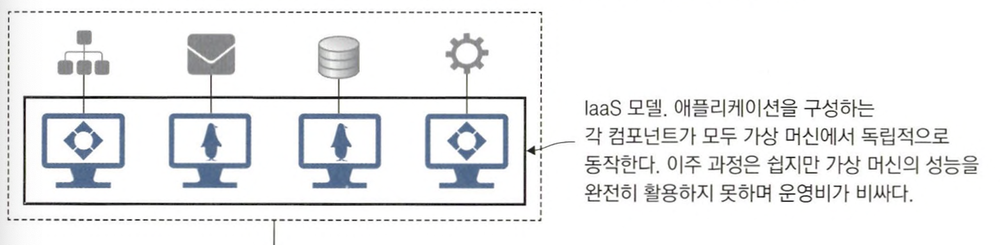
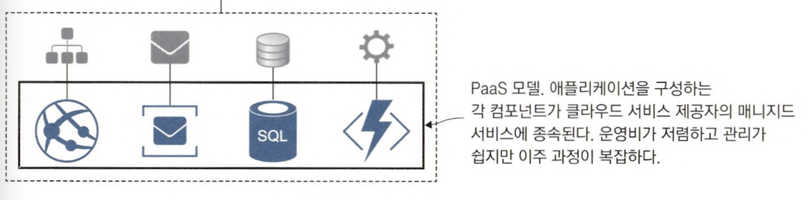
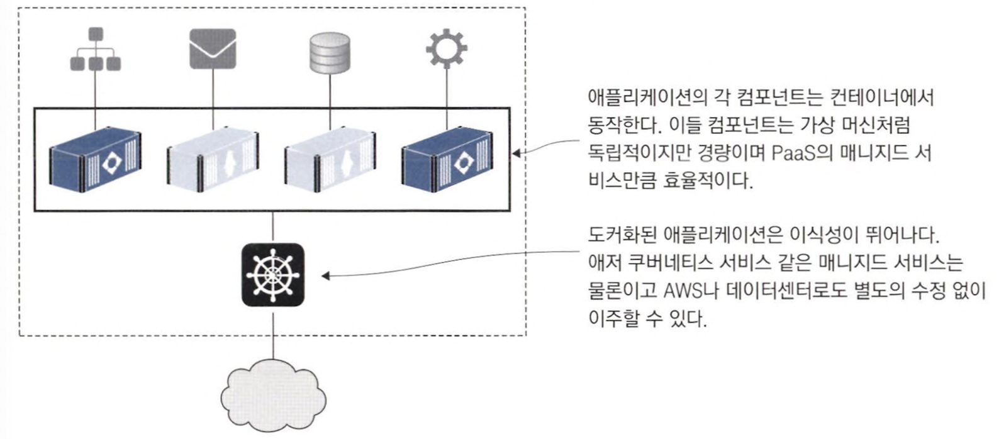
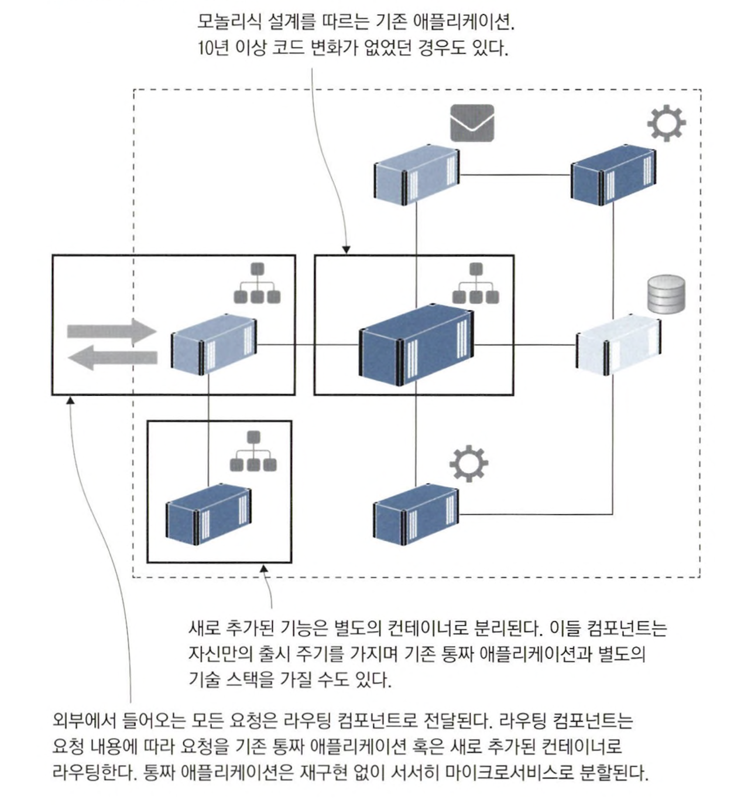
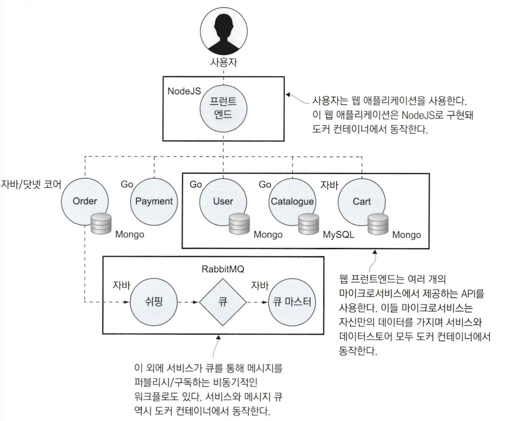

# 1장 시작하기 전에

## 1.1 컨테이너가 IT 세상을 점령한 이유

### 1.1.1 클라우드 환경으로 이주하기

> 클라우드 환경 이주 방안 = `IaaS(= 서비스로서의 인프라)` or `PaaS(= 서비스로서의 플랫폼)`

#### [IaaS vs PaaS vs SaaS](https://wnsgml972.github.io/network/2018/08/14/network_cloud-computing/)

| 서비스  | 예시                               |                구조                |
|:----:|:---------------------------------|:--------------------------------:|
| IaaS | AWS EC2<br>AWS S3                |  |
| Paas | AWS lambdda<br>Google App Engine |  |
| Saas | Google Cloud<br>MS office 365    |  |

### 1.1.2 레거시 애플리케이션 현대화하기

> monolithic에서 재구현 없이 분산 application으로 migration




### 1.1.3 클라우드 환경에 적합한 새로운 애플리케이션 개발하기



### 1.3.4 실습 환경 초기화 명령

> `이미지` = 컴파일된 실행 파일 묶는 형태<br>
> `컨테이너` = 이미지를 실행한 형태

<table>
<tr>
<td align="center">명령어</td><td align="center">설명</td>
</tr>
<tr>
<td>

```shell
docker container rm -f $(docker conatainer ls -aq)
```
</td>
<td>
사용하지 않는 컨테이너 삭제
</td>
</tr>
<tr>
<td>

```shell
docker image rm -f $(docker image ls -f reference='diamol/* -q')
```
</td>
<td>
내려 받은 이미지가 차지한 디스크 용량 모두 회수
</td>
</tr>
</table>

