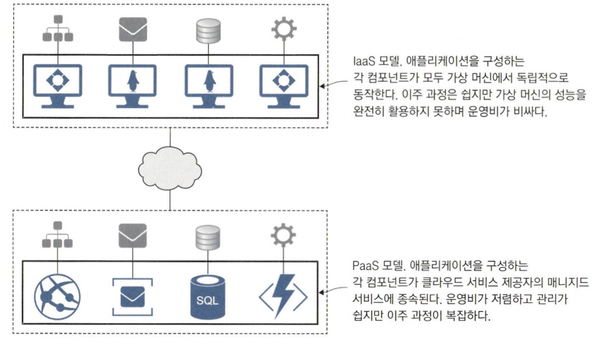
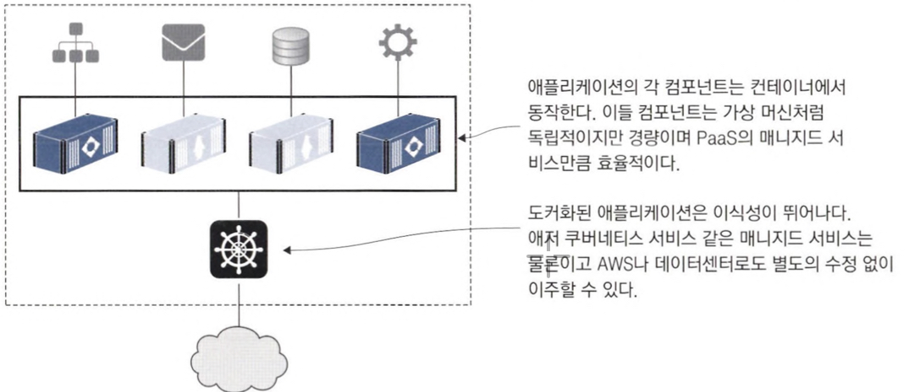
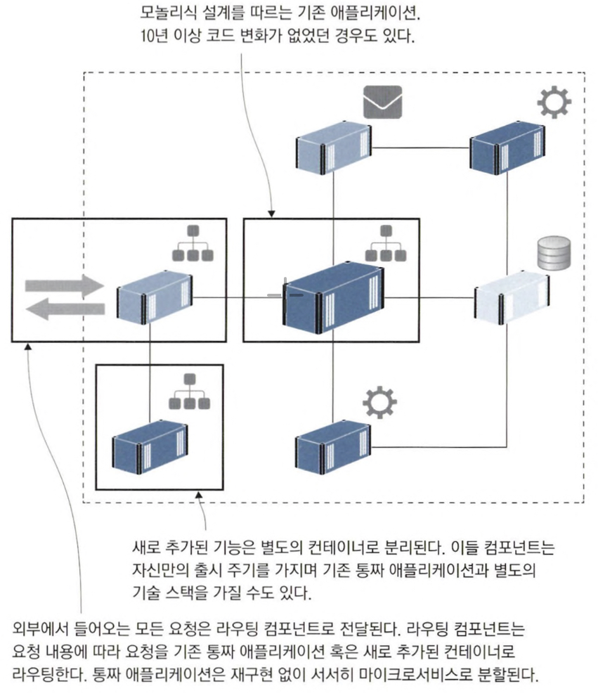
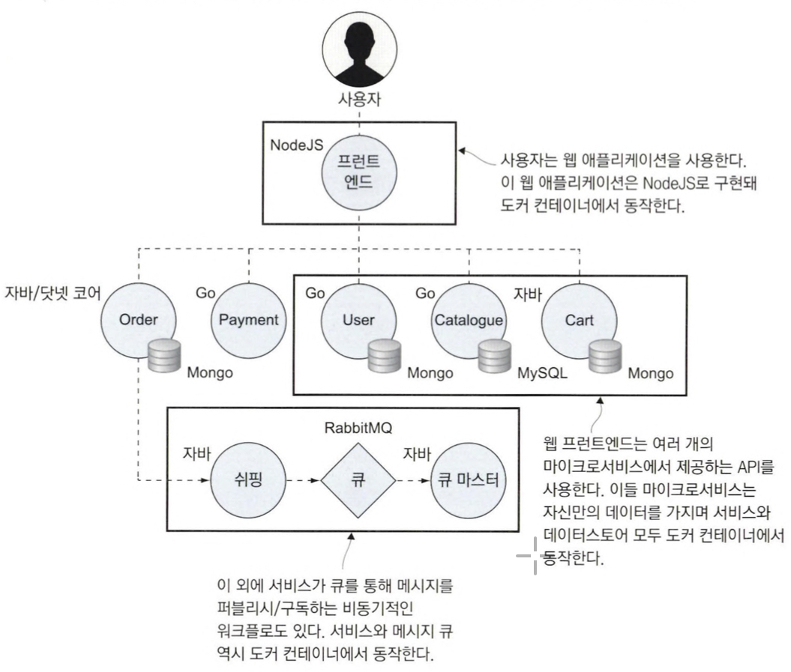

# 1장 시작하기 전에

## 컨테이너가 IT 세상을 점령한 이유

### 1. 클라우드 환경으로 이주하기

클라우드 환경으로 이주하려면 `서비스로서의 인프라(IaaS)`와 `서비스로서의 플랫폼(PaaS)` 이렇게 두 가지 선택지가 있었다. 

PaaS를 선택하면 우리 애플리케이션의 각 컴포넌트를 하나씩 클라우드 매니지드 서비스로 옮기는 까다로운 프로젝트를 진행해야 한다. 애플리케이션이 특정 클라우드에 종속되는 결과를 낳지만, 적어도 운영비를 절감할 수 있다. 

반대로 IaaS를 선택하면 애플리케이션의 각 컴포넌트를 가상 머신에서 동작시키게 된다. 특정 클라우드에 종속되는 신세는 면할 수 있지만 운영비가 상승한다.

도커를 사용하면 특정 클라우드에 종속되지 않으므로 원하는 클라우드 서비스나 데이터 센터, 심지어 로컬 환경에서도 운영 가능하며 낮은 운영비와 이식성도 확보할 수 있다.

### 2. 레거시 애플리케이션 현대화하기

컨테이너를 활용하면 거의 모든 애플리케이션을 클라우드에서 실행할 수 있다. 그러나 기존 애플리케이션의 구조를 낡은 모놀리식 설계로 방치한다면 도커 혹은 클라우드 플랫폼의 진가가 발휘되기 어렵다. 

컨테이너 환경에서는 30초면 새 기능을 단계적으로 자동 배포할 수 있지만, 이 새 기능이 모놀리식 설계를 가진 코드의 일부라면 회귀 테스트에만 적어도 2주가 걸릴 것이다.

도커로 이주하는 과정은 애플리케이션의 낡은 설계를 탈바꿈하는 첫걸음이다. 애플리케이션을 전면적으로 재구현하지 않고도 새로운 패턴을 도입할 수 있다.

컨테이너는 가상 네트워크를 통해 외부에 노출되지 않고 서로 통신할 수 있다. 즉, 통짜 애플리케이션을 분할해 기능별로 별도의 컨테이너에 배치할 수 있는 것이다. 결과적으로 통짜 애플리케이션은 여러 개의 컨테이너로 분할된 분산 애플리케이션으로 거듭나게 된다.

이렇게 새로운 설계로 거듭난 애플리케이션은 마이크로서비스 아키택처의 다양한 장점을 누릴 수 있다는데, 핵심 기능을 작고 독립된 단위로 만들어 따로따로 다루면서 변경 내용을 빠르게 테스트할 수 있다. 그리고 해당 기능의 확장성을 조절할 수 있고, 필요에 맞는 적절한 기술 기반을 선택할 수 있다.

### 3. 클라우드 환경에 적합한 새로운 애플리케이션 개발하기

마이크로서비스 아키택처

각 컴포넌트는 자신만의 데이터를 가지며 API를 통해 이 데이터를 외부에 제공한다. 프론트엔드는 이들 API 서비스를 이용하는 웹 애플리케이션 형태다. 애플리케이션은 여러 가지 프로그래밍 언어로 구현됐으며 서로 다른 데이터베이스 기술을 사용한다. 모든 컴포넌트는 공통적으로 Dockerfile을 통해 패키징되며 도커 컴포즈 파일 형태로 전체 애플리케이션이 정의된다.

도커는 서드파티 소프트웨어를 도입하는 데도 유용하다. 코드를 작성하지 않고도 애플리케이션에 새로운 기능을 추가할 수 있다. `도커 허브`는 다양한 사람이 자신이 작성한 컨테이너를 공유하는 서비스다. 도커 허브를 통해 자유롭게 사용할 수 있다.

### 4. 기술 혁신: 서버리스와 그 너머

현대 IT 기술을 주도하는 요소 중 하나는 일관성이다. 개발 팀은 모든 프로젝트에서 같은 도구, 같은 프로세스, 동일한 런타임을 사용하기를 원한다. 도커 클러스터를 구축하면 모든 제품의 빌드, 배포, 운영을 같은 도구와 같은 방법으로 수행할 수 있다.

컨테이너 도입 후 마주할 가장 흥미진진한 기술 혁신은 `서버리스 함수`다. 서버리스 기술은 곧 컨테이너 기술이다. 개발자에게 있어 서버리스 기술의 목표는 개발자가 함수 코드를 작성하고 서비스에 푸시하면 서비스가 코드를 빌드하고 패키징하도록 하는 것이다. 함수 사용 측에서 함수를 호출하면 서비스는 해당 함수의 인스턴스를 생성해 요청을 처리한다. 이 과정에서 빌드 서버도 파이프라인도, 관리가 필요한 운영환경도 필요없다. 모든 일은 플랫폼이 처리한다. 

특정 클라우드에 종속되는 일 없이 서버리스 기술을 활용하고 싶거나 데이터센터를 직접 운영하고 있다면, 유명 서버리스 프레임워크인 누클리오나 오픈파스 FN 프로젝트와 도커를 활용해 직접 플랫폼을 구축할 수 있다.

`클라우드 서버리스`의 수면 아래에서는 도커가 실제로 코드를 패키징하고 함수를 실행하는 역할을 담당한다. 그러나 클라우드 환경의 함수는 `이식성`이 없다. (AWS → Azure 불가)

### 5. 데브옵스 도입하기

대부분의 조직이 직면하는 가장 큰 문제는 운영이다. 기술 조직은 `개발팀`과 `운영팀`으로 나누어 프로젝트 생애주기의 서로 다른 부분을 각각 담당한다. 출시 시점의 문제점은 개발 팀과 운영 팀이 서로 책임을 미루게 되기 쉽다. 따라서 이후 발생할 수 있는 문제를 방지하기 위해 이 시점에 품질 게이트를 둔다. 그러다 보면 결국 점점 늘어나는 품질 게이트로 인해 불어나는 위험과 적업량을 감당하지 못해 한 해에 한두 번밖에 출시하지 못하게 된다.

`데브옵스(Devops)` 는 기민한 소프트웨어 유지 보수를 위해 애플리케이션의 전체 생애주기를 담당하는 전담 팀을 둔다. 데브옵스 전환은 주로 팀 문화의 변화를 통해 일어난다. 분기별 대규모 릴리스를 작은 규모의 일일 배포로 대체하게 하는 식이다.

컨테이너로의 전환을 통해 데브옵스 도입을 더욱 촉진할 수 있다. 팀원 모두가 Dockerfile과 도커 컴포즈 스크립트를 사용하면 같은 기술과 도구로 팀을 통일할 수 있다.

`CALMS`라는 데브옵스를 위한 프레임워크가 있다. CALMS는 `문화(Culture), 자동화(Automation), 린(Lean), 측정(Metric), 공유(Sharing)`의 머리글자를 딴 것이다. 자동화는 컨테이너 환경의 핵심이고 분산 애플리케이션은 린 원칙을 따라 만들어지며, 배포 프로세스와 운영 로그로부터 얻은 측정치를 쉽게 활용할 수 있고 도커 허브는 이미 있는 것을 다시 만드는 노력을 절약할 수 있는 공유의 장이다.
