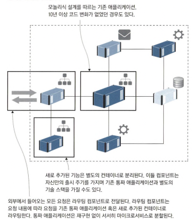

# 1.1 컨테이너가 IT 세상을 점령한 이유

## 1.1.1 클라우드 환경으로 이주하기

- IaaS
  가상 머신의 동작, 특정 클라우드의 종속되지 않음, 운영비 상승
- PaaS
  복잡한 마이그레이션 과정, 특정 클라우드에 애플리케이션이 종속, 낮은 운영비
- docker
  특정 클라우드의 종속되지 않음, 낮은 운영비

|        | 클라우드의 종속 여부 | 운영비 |
| ------ | -------------------- | ------ |
| IaaS   | X                    | 높음   |
| PaaS   | O                    | 낮음   |
| docker | X                    | 낮음   |

## 1.1.2 레거시 애플리케이션 현대화하기

    - 모놀리식 설계도 도커화 가능하지만 새 기능 배포 등 도커의 장점을 살리기 어려움

    * 모놀리식은 msa의 반대되는 뜻으로 어플리케이션이 하나의 거대한 아키텍쳐를 가지는 것

 

### 모놀리식 애플리케이션

- 라우팅 컴포넌트
- 모놀리식 애플리케이션 도커
- 신규 기능 애플리케이션 도커

  위 3가지를 통해서 모놀리식 설계된 애플리케이션을 도커화 할 수 있습니다.

## 1.1.3 클라우드 환경에 적합한 새로운 애플리케이션 개발하기

- 클라우드 네이티브 컴퓨팅 재단에서의 정의

  오픈 소스 소프트웨어 스택을 통해 마이크로서비스 형태로 배포되는 애플리케이션으로, 각 컴포넌트가 별도의 컨테이너로 패키징되며 이들 컨테이너를 동적으로 오케스트레이션해 리소스 활용의 최적화를 꾀하는 애플리케이션

- 도커는 서드파트 소프트웨어 도입에 유용
- 도커허브는 다양한 사람들이 자신이 작성한 컨테이너를 공유하는 서비스

## 1.1.4 기술 혁신: 서버리스와 그 너머

- 도커클러스터를 구축하면 모든 제품의 빌드, 배포, 운영을 같은 도구와 방법으로 수행할 수 있음

- 서버리스는 곧 컨테이너 기술입니다.

  개발자가 코드를 작성하고 서비스에 푸쉬하면 서비스가 빌드되고 패키징되며, 빌드서버, 파이프라인, 관리가 필요한 운영 환경도 필요가 없습니다. 모든것은 플랫폼이 처리합니다.
  그러나 특정 클라우드 환경의 도커 컨테이너 내에서 실행되는 함수는 다른 클라우드 환경에서 쉽게 전송되거나 작동하지 않을 수 있습니다.

## 1.1.5 데브옵스 도입하기

- 개발팀과 운영팀을 나누다보면 배포시점에 서로의 책임을 미루게 되고 이 시점에 품질게이트 두게 되며 점점 불어나는 작업량에 잦은 배포를 하지 못합니다.

    * 품질 게이트는 제품이나 서비스의 품질을 확인하기 위해 설정된 단계적인 점검절차

 

## 1.2 대상 독자

## 1.3 실습환경 구축하기

## 1.3.1 도커설치하기

    개발만 목적이라면 도커 커뮤니티 에디션설치
    책에서는 도커 데스크톱 추천함
    docker toolbox deprecated -> docker desktop 이용
    docker compose -> docker desktop 설치시 사용 가능
