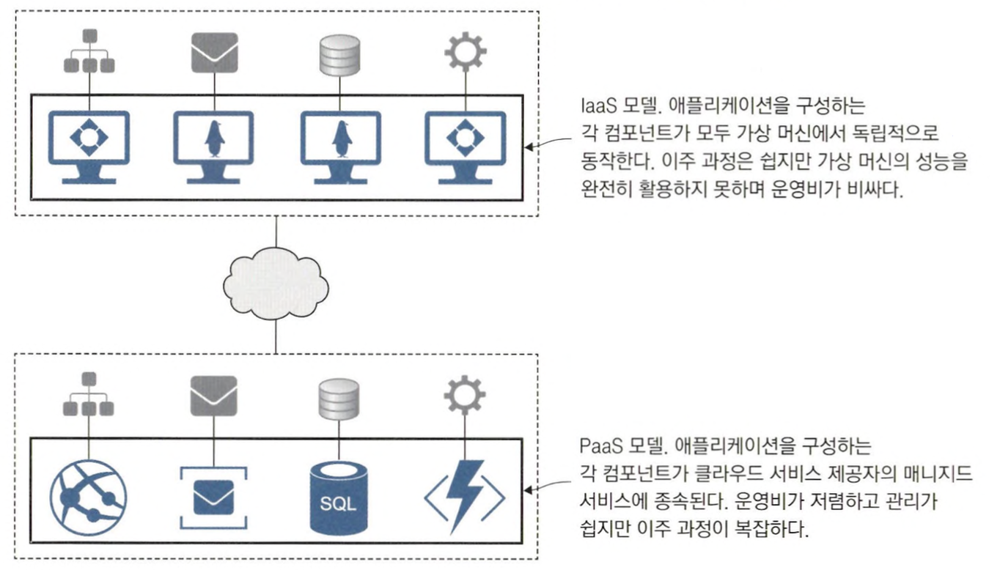
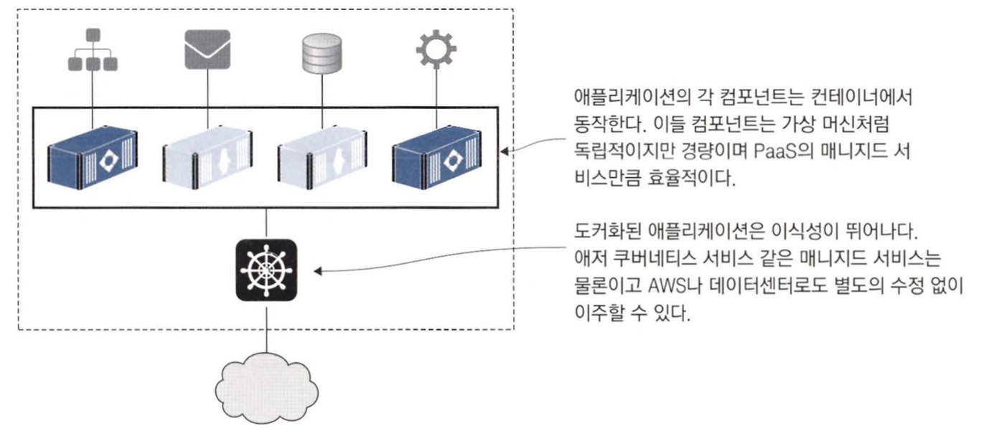

# 컨테이너가 IT 세상을 점령한 이유

## 클라우드 환경으로 이주하기

기존에는 클라우드 환경으로 이주하려면 IaaS와 PaaS 두 가지 선택지가 있었다.

**PaaS**라면 애플리케이션의 각 컴포넌트를 하나씩 클라우드의 managed service로 옮겨야 한다.  
애플리케이션이 특정 클라우드에 종속되지만 운영비를 절감할 수 있다.

**IaaS**라면 애플리케이션의 각 컴포넌트를 가상 머신에서 동작시키게 된다.  
특정 클라우드에 종속되지 않지만, 운영비가 상승한다.

 

도커를 이용하여 클라우드 이주를 한다면 특정 클라우드에 종속되지 않고, 낮은 운영비와 이식성을 확보할 수 있다.

 

## 레거시 애플리케이션 현대화하기

**도커로 이주하는 과정은 애플리케이션의 낡은 설계를 탈바꿈하는 첫걸음이다.** 

컨테이너는 가상 네트워크를 통해 외부에 노출되지 않고 서로 통신할 수 있다.  
애플리케이션을 분할해 기능별로 별도의 컨테이너에 배치할 수 있고, 결과적으로 통짜 애플리케이션이 여러 개의 컨테이너로 분할된 애플리케이션으로 존재한다.  
이러한 설계로 다양한 MSA의 장점을 누릴 수 있다.

 

