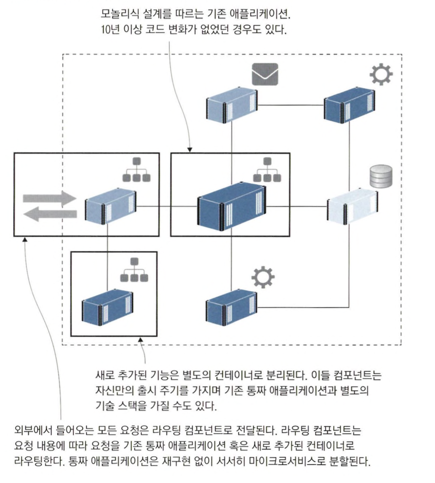
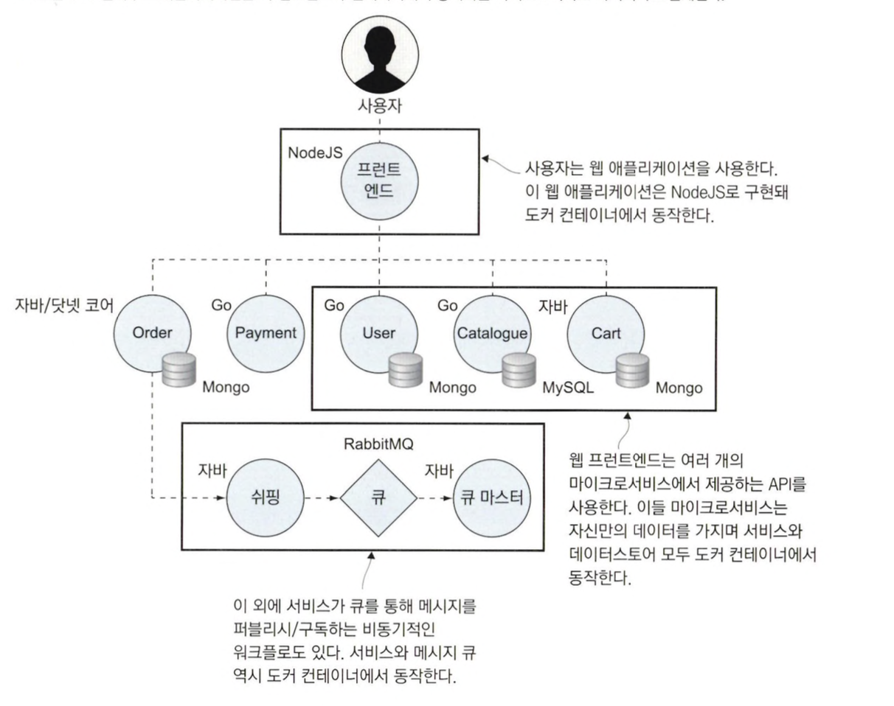
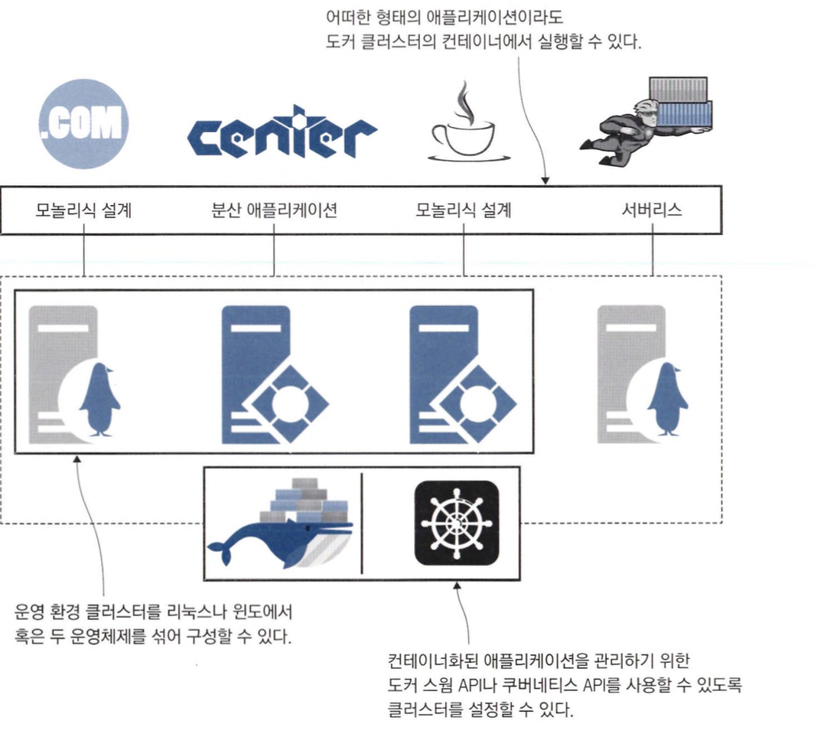

# 시작하기 전에

### 도커란?

도커는 컨테이너라는 경량 단위로 애플리케이션을 실행하는 기능을 제공하는 플랫폼입니다.

컨테이너는 클라우드의 서버리스 함수 부터 기업의 전략 수립까지 소프트웨어 분야의 거의 모든 곳에 자리 잡았습니다.

이로인해 소프트웨어 산업 전반에서 개발 업무와 운영 업무 모두에서 반드시 익혀야 할 핵심기술로 인식되고 있습니다.

### 컨테이너가 IT 세상을 점령한 이유

컨테이너 기술을 사용하여 애플리케이션을 관리하면 다음과 같은 장점을 얻을 수 있습니다.

- 소스 코드를 내려 받은 후 명령 한줄로 로컬 머신에서 빌드와 실행을 할 수 있다.
- 모든 도구가 중앙집중화 되어 모든 개발자들이 같은 명령으로 같은 환경을 사용할 수 있다.

위와 같은 장점들로 프로덕트의 출시 작업이 쉬워지고 운영 시 유연성이 높아진다는 점 덕분에 도커(컨테이너)를 사용하여 애플리케이션을 배포하는 것이 좋습니다.

다음은 도커가 활용되는 경우입니다.

### 클라우드 환경으로 이주하기

많은 조직에서 다음과 같은 이유로 클라우드로의 환경 이주를 고려하고 있습니다.

- 서버, 스토리지, 네트워크, 전원을 클라우드 벤더사(아마존, 마이크로소프트, 구글 등)에게 맡길 수 있습니다.
- 전 세계에 존재하는 가용 영역을 통해 무제한의 확장성과 고가용성을 확보할 수 있습니다.
- 사용한 자원만큼 비용을 지불하면 되기 때문에 비용을 유동적으로 관리할 수 있습니다.

위와 같은 장점을 얻기 위해 클라우드 환경으로 이주하려면 컨테이너 이전에는 다음과 같은 방식을 사용했습니다.

- IaaS (`Infrastructure as a Service`, 서비스로서의 인프라)
    - 사용자에게 가상화된 컴퓨팅 리소스를 제공하는 방식으로, 이를 통해 사용자는 서버, 네트워크, 운영체제 등의 인프라를 직접 클라우드에서 구축하고 관리할 수 있습니다.
    - IaaS를 사용하면 애플리케이션의 각 컴포넌트를 가상 머신에서 동작시키기 때문에 특정 클라우드에 종속되지는 않지만 운영비가 상승합니다.

- PaaS(`Platform as a Service`, 서비스로서의 플랫폼)
    - 사용자에게 하드웨어와 운영 체제, 데이터베이스, 웹 서버 등의 IT 인프라, 그리고 개발 및 배포 도구 등의 플랫폼을 제공합니다.
    - PaaS를 사용하면 애플리케이션이 특정 클라우드에 종속될 수 있지만 운영비를 절감할 수 있습니다.


컨테이너 방식은 앞서 두 방식의 단점이 없는 또 다른 선택지를 제공할 수 있습니다.

컨테이너 방식으로 구축하면 애플리케이션의 각 컴포넌트를 컨테이너로 이주한 다음 AKS, ECS와 같은 서비스를 사용하거나 직접 구축한 도커 클러스터에서 전체 애플리케이션을 실행할 수 있습니다.

도커를 도입하면 다음과 같은 장점을 얻을 수 있습니다.

- 특정 클라우드에 종속되지 않습니다.
- 로컬 환경에서 테스트할 수 있습니다.
- 낮은 운영비와 이식성을 확보할 수 있습니다.

물론 컨테이너 환경으로 애플리케이션을 이주하려면 비용이 필요합니다.

우선, 도커를 사용한다는 가정하에 Dockerfile이라는 스크립트로 환경을 작성해야하고 배포 관련 사항 역시 도커 컴포즈나 쿠버네티스에서 사용되는 애플리케이션 매니페스트로 재작성해야 합니다.

하지만 작성을 완료하면 컨테이너화한 애플리케이션을 로컬 환경에서 부터 클라우드 환경까지 어디에서든 기존과 동일한 환경으로 동작시킬 수 있다는 장점이 있습니다.

### 레거시 애플리케이션 현대화하기

컨테이너를 활용하면 거의 모든 애플리케이션을 클라우드에서 실행할 수 있습니다.

하지만 기존 애플리케이션의 구조를 낡은 모놀리식 설계로 방치한다면 도커 혹은 클라우드 플랫폼의 장점을 발휘하기 어렵습니다.

컨테이너 환경으로 구축된 애플리케이션은 빠르게 자동 배포를 진행할 수 있지만 한 기능에 200만 줄 이상이 작성된 코드의 일부라면 기존 기능이 망가지지 않았는지 확인하는 과정에만 오랜 시간이 걸릴 것 입니다.

도커로 이주하는 과정은 레거시 애플리케이션의 낡은 설계를 탈바꿈하는 첫걸음입니다.

가장 먼저 해야할 것은 Dockerfile 스크립트와 도커 컴포즈 문법에 따라 애플리케이션을 단일 컨테이너로 옮깁니다.

그 다음 추가되는 새로운 기능들은 별도의 컨테이너로 분할해 배치합니다.



결국 위와 같이 하나의 큰 애플리케이션을 여러 개의 컨테이너로 분할된 분산 애플리케이션으로 변경할 수 있게 됩니다.

이렇게 새롭게 설계한 애플리케이션은 마이크로서비스 아키텍처의 다양한 장점을 누릴 수 있습니다.

- 핵심 기능을 작고 독립된 단위로 만들어 변경 내용을 빠르게 테스트할 수 있습니다.
- 새로운 기능에 대해 확장성을 조절할 수 있고, 필요에 맞는 적절한 기술 기반을 선택할 수 있습니다.

위와 같이 도커를 통해 레거시 애플리케이션의 설계를 비교적 쉽게 점진적으로 현대화할 수 있습니다.

### 클라우드 환경에 적합한 새로운 애플리케이션 개발하기

도커는 분산 애플리케이션이든 모놀리식 설계든 기존 애플리케이션을 클라우드로 이주하는데 유용합니다.

하나의 큰 애플리케이션이라면 도커를 통해 컴포넌트를 분할하고 새로운 설계를 적용해 클라우드나 데이터센터 어디든 원하는 곳에서 애플리케이션을 운영할 수 있습니다.

클라우드 환경을 고려한 완전히 새로운 애플리케이션 개발이라면 도커를 통해 더 빠른 개발이 가능합니다.

CNCF(클라우드 네이티브 컴퓨팅 재단)에서는 이러한 설계의 특징을 다음과 같이 정의합니다.

```
💡 오픈 소스 소프트웨어 스택을 통해 마이크로서비스 형태로 배포되는 애플리케이션으로, 각 컴포넌트가 별도의 컨테이너로 패키징되며 이들 컨테이너를 동적으로 오케스트레이션해 리소스 활용의 최적화를 꾀하는 애플리케이션
```

다음은 전형적인 마이크로서비스 애플리케이션의 아키텍처를 그린 그림입니다.



그리고 도커는 서드파티 소프트웨어를 도입하는데도 유용합니다.

도커 허브와 같은 저장소를 이용하여 다른 사람이 작성한 컨테이너를 공유하고 모니터링이나 메시지 큐 등 필요한 도구들을 쉽게 가져와서 사용할 수 있습니다.

### 기술 혁신 : 서버리스와 그 너머

현재 IT 기술을 주도하는 요소 중 하나는 일관성입니다.

개발 팀은 모든 프로젝트에서 같은 도구, 같은 프로세스, 동일한 런타임을 사용하기를 원합니다.

도커를 사용하면 이러한 요구를 쉽게 만족할 수 있습니다.

도커 클러스터를 구축하면 다음과 같이 모놀리식 아키텍처를 가진 레거시 애플리케이션에서부터 서버리스 함수까지 다양한 애플리케이션을 쉽게 관리할 수 있습니다.


이중에서 컨테이너 기술을 통해 가장 발전된 기술은 서버리스 기술입니다.

서버리스 기술의 목표는 `개발자가 함수 코드를 작성하고 서비스에 푸시하면 서비스가 코드를 빌드하고 패키징하도록 하는 것`입니다.

함수 사용측에서 함수를 호출하면 서비스는 해당 함수의 인스턴스를 생성해 요청을 처리합니다.

이 과정에는 빌드 서버도, 파이프라인도, 관리가 필요한 운영 환경도 필요 없습니다.

하지만 현재는 클라우드 서버리스의 경우 표준이 없기 때문에 이식성이 없습니다.

만약, 특정 클라우드에 종속되는 일 없이 서버리스 기술을 활용하고 싶거나 데이터센터를 직접 운영하고 있다면 유명 서버리스 프레임워크인 누클리오나 오픈파스 등을 도커를 활용해 직접 구축할 수 있습니다.

### 데브옵스 도입하기

대부분의 기술조직은 개발 팀과 운영 팀으로 나뉘어서 프로젝트 라이프사이클의 다른 부분을 담당합니다.

이로인해 개발팀과 운영팀이 서로에게 책임을 미루면서 생산성이 낮아지게 됩니다.

이를 해결하기 위해 애플리케이션 전체 라이프사이클을 관리하는 데브옵스라는 전담 팀이 등장하게 되었습니다.

데브옵스 전환은 주로 팀 문화의 변화를 통해 일어납니다.

예를 들어, 분기별 대규모 릴리스를 작은 규모의 일일배포로 대체하게 하는 식으로 진행됩니다.

하지만 운영에서 사용하는 도구와 개발자가 사용하는 도구들은 서로 다르기 때문에 통합해서 라이프사이클을 관리하기 쉽지 않습니다.

이런 상황에서 도커를 도입하면 하나의 환경으로 통합할 수 있기 때문에 데브옵스 도입을 좀 더 촉진할 수 있습니다.

그리고 CALMS라는 데브옵스를 위한 프레임워크가 존재합니다.

CALMS는 다음 단어들의 약어입니다.

- 문화(Culture)
  - 데브옵스 문화는 개발, 운영, 품질 보증 및 기타 관련 팀들이 협력하고 서로를 존중하는 환경을 만드는 것에 중점을 둡니다.
  - 이를 통해 서로 간의 의사소통과 협업이 원활해지며, 개방성과 신뢰가 올라갑니다.
- 자동화 (Automation)
  - 코드 빌드, 테스트, 통합, 배포 및 모니터링과 같은 과정을 자동함으로써, 빠른 피드백 및 높은 품질의 소프트웨어 개발이 가능해집니다.
  - 이러한 과정에 지속적 통합(CI), 지속적 전달/배포(CD) 인프라 스트럭쳐 코드 관리(IaC), 테스트 자동화, 모니터링 및 로깅 등이 포함됩니다.
- 학습 (Lean)
  - 개선을 위해 지속적으로 프로세스를 검토하고 낭비를 줄이고, 가치를 극대화하는 것이 중요합니다.
  - 이는 실험과 혁신을 통해 빠르게 변화하는 시장에 적응할 수 있는 능력을 향상시킵니다.
- 측정 (Measurement)
  - 팀의 작업 효율성, 프로세스 개선 및 가치 창출을 평가하기 위해 품질, 퍼포먼스, 가용성 등 다양한 지표를 사용합니다.
  - 이를 통해 객관적인 의사결정이 가능하며, 소프트웨어의 지속적인 개선이 이루어집니다.
- 공유 (Sharing)
  - 공유를 통해 팀 간의 의사소통과 협업을 촉진하며 모범사례, 실폐 사례, 기술 및 경험을 공유함으로써 서로 배우고 성정할 수 있는 환경을 조성합니다.

도커는 위에 설명한 모든 개념과 밀접한 관련이 있으며 이러한 개념을 도입하는데 큰 도움이 됩니다.

### 도커 초기화 명령

실습 명령을 초기화하기 위해서 다음 명령을 쓸 수 있습니다.

```go
// 최신 스타일
docker container rm -f $(docker container ls -aq)

// 구 버전 스타일
docker rm $(docker ps -aq)
```

그리고 다음 명령을 사용하면 내려받은 이미지가 차지한 용량을 모두 회수할 수 있습니다.

```go
// 최신 스타일
docker image rm -f $(docker image ls -f reference='diamol/*' -q)

// 구 버전 스타일
docker rmi $(docker images -f reference='diamol/*' -q)
```