# 2장 도커의 기본적인 사용법

## 2.1 컨테이너로 Hello World 실행하기

```shell
docker container run diamol/ch02-hello-diamol
```

> `pull` = 도커에서 이미지를 내려 받음<br>
> `빌드, 공유, 실행` = 컨테이너를 통해 애플리케이션 실행 

<table>
<tr>
<td align="center">책</td><td align="center">실습</td>
</tr>
<tr>
<td>
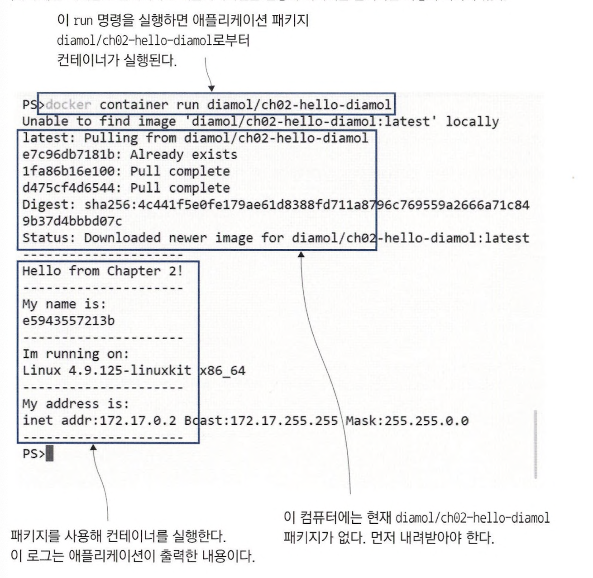
</td>
<td>
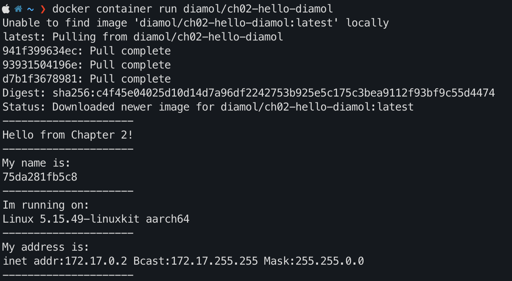
</td>
</tr>
<tr>
<td>

```shell
# 한번 더 같은 명령어 실행
docker container run diamol/cho2-hello-diamol
```

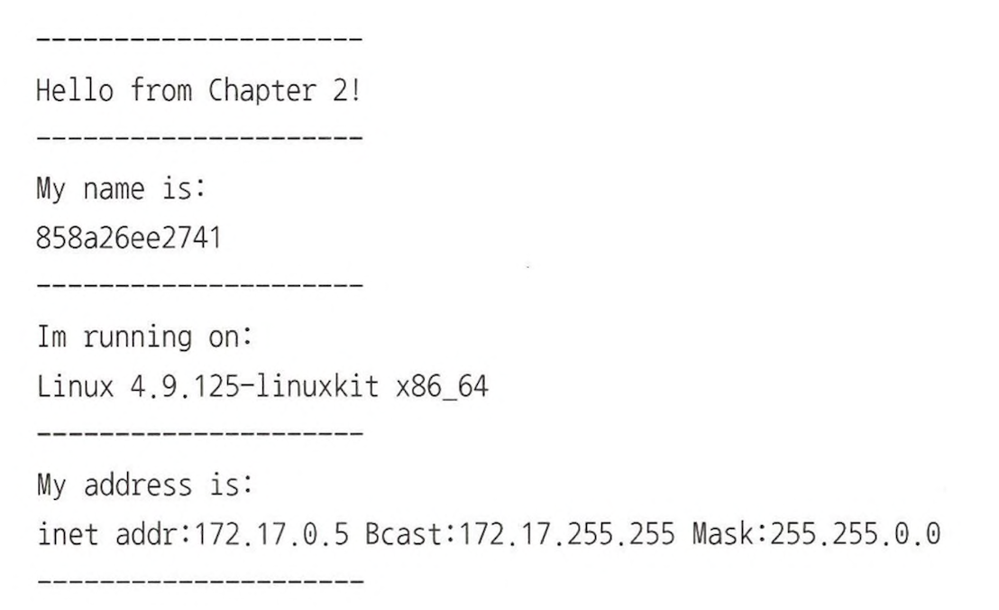
</td>
<td>
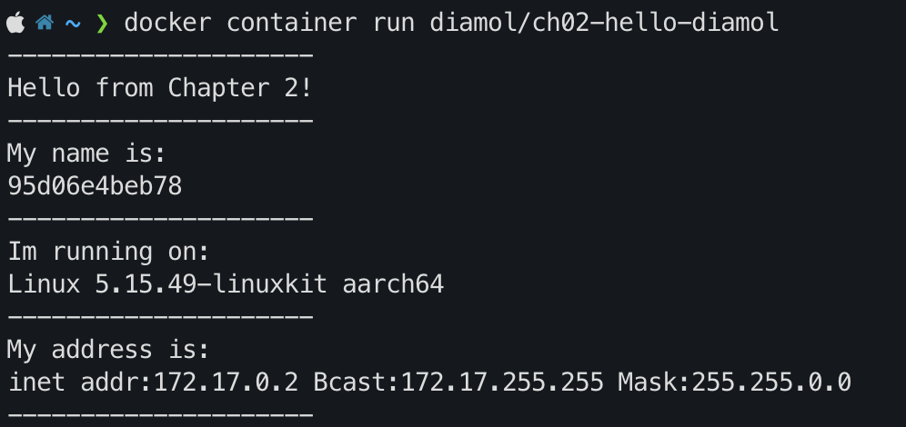
</td>
</tr>
</table>

- 컴퓨터 이름 : 75da281fb5c8 &rarr; 95d06e4beb78
- OS 종류 : Linux 5.15.49-linuxkit aarch64 &rarr; Linux 5.15.49-linuxkit aarch64 
- 네트워크 주소 : 172.17.0.2 &rarr; 172.17.0.2

&rArr; 컨테이너 실행할 때 마다 **컴퓨터 이름, IP 주소 변경** 가능

#### 도커는 컨테이너에 어떻게 IP를 할당할까?

1) [dhcp란](https://ja-gamma.tistory.com/entry/DHCP%EA%B0%9C%EB%85%90%EB%8F%99%EC%9E%91%EC%9B%90%EB%A6%AC)
2) [docker network 이해하기](https://seosh817.tistory.com/373)
3) [docker network](https://captcha.tistory.com/70)
3) [docke-compose ip 고정시키기](https://waytothem.com/blog/378/)

## 2.2 컨테이너란 무엇인가?

#### 컨테이너 내부 애플리케이션

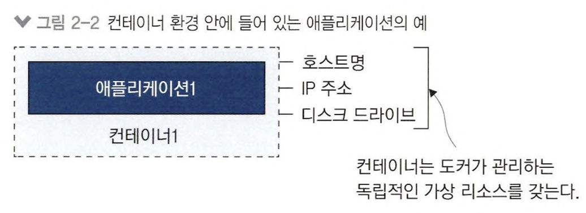

- hostname, ip address, file system docker가 생성
- container 내 application은 서로 독립적인 환경

#### host 내 여러 컨테이너

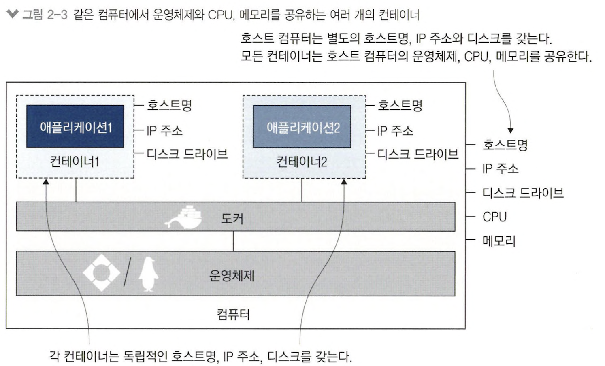

- container가 실행되는 컴퓨터의 cpu, memory, os 공유
- 특정 애플리케이션이 과도한 리소스를 사용하여 **다른 애플리케이션 리소스 부족** 가능 &rarr; **가상 머신을 활용**하여 해결

#### 가상 머신

> 가상 머신이란, 컴퓨터 안에 또 다른 컴퓨터를 동작시킴

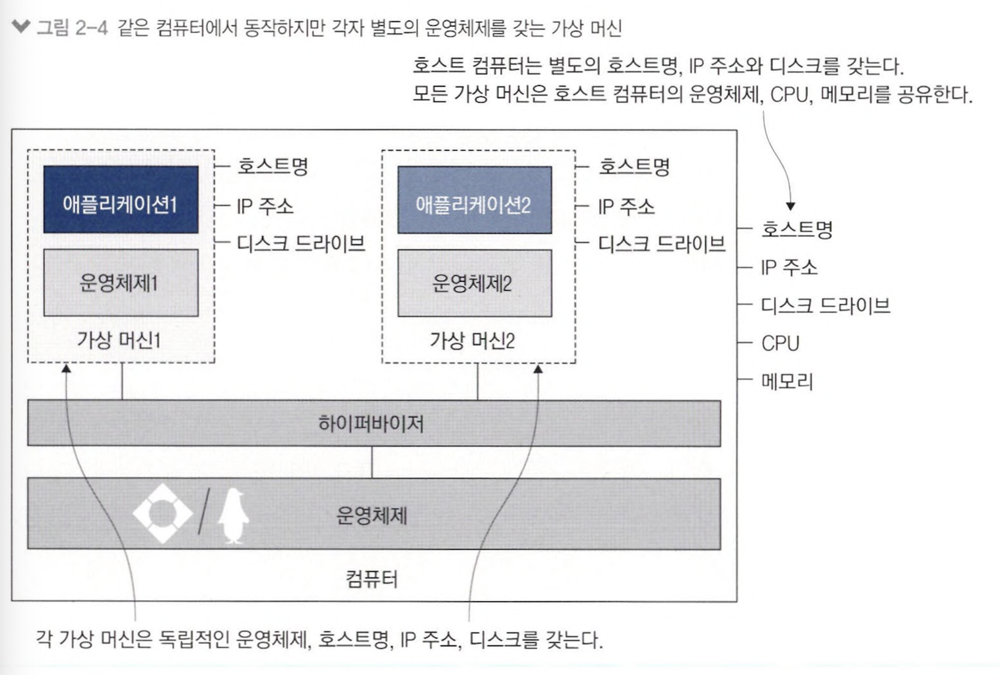

- host os를 공유하지 않고 별도의 os 필요로 함(&ne; container)
- but, application cpu, memory 사용량 &uarr;&uarr;&uarr;<br>
&rArr; 컨테이너를 통해 host os 공유 &rarr; 필요한 리소스 &darr; &rarr; 가상 머신에 비해 더 많은 애플리케이션 실행 가능

## 2.3 컨테이너를 원격 컴퓨터처럼 사용하기

<table>
<tr>
<td align="center">명령어</td><td align="center">결과</td>
</tr>
<tr>
<td>

```shell
docker container run --interactive --tty diamol/base
```
</td>
<td>
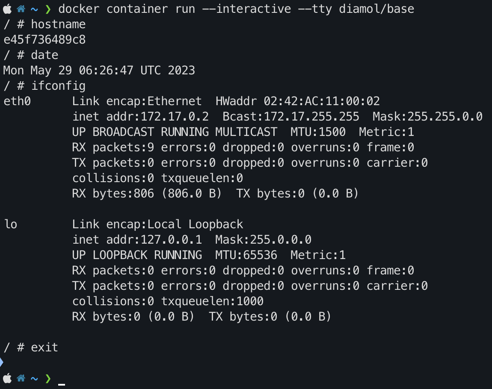
</td>
</tr>
</table>

- `--interactive`를 통해 컨테이너 접속
- `--tty` 터미널 세션을 통해 컨테이너 조작

#### 현재 실행중인 컨테이너 정보 확인

<table>
<tr>
<td align="center">명령어</td><td align="center">결과</td>
</tr>
<tr>
<td>

```shell
docker container ls
```
</td>
<td>
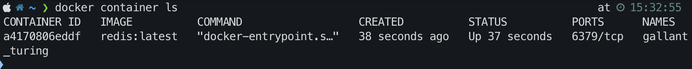
</td>
</tr>
</table>

#### 대상 컨테이너에서 실행 중인 프로세스 목록 정보 확인

> top 명령어를 통해 대상 컨테이너 지정

<table>
<tr>
<td align="center">명령어</td><td align="center">결과</td>
</tr>
<tr>
<td>

```shell
docker container top a4
```
</td>
<td>
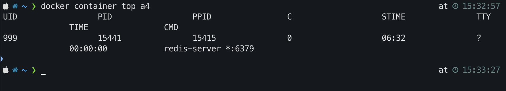
</td>
</tr>
</table>

#### 대상 컨테이너 상세 정보 조회

<table>
<tr>
<td align="center">명령어</td><td align="center">결과</td>
</tr>
<tr>
<td>

```shell
docker container inspect a4
```
</td>
<td>
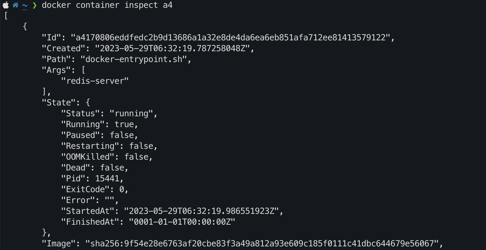
</td>
</tr>
</table>

## 2.4 컨테이너를 사용해 웹 사이트 호스팅하기

#### 상태와 관계 없이 모든 컨테이너 목록 확인

<table>
<tr>
<td align="center">명령어</td><td align="center">결과</td>
</tr>
<tr>
<td>

```shell
docker container ls -all
```
</td>
<td>
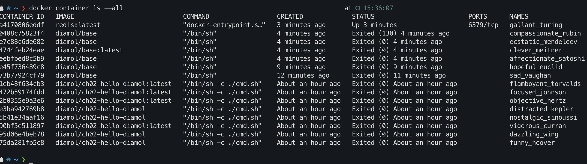
</td>
</tr>
</table>

- 컨테이너가 종료돼도 사라지지 않음
- 컨테이너의 파일 시스템에 새로운 파일 복사하거나 외부로 복사 가능
- 파일 시스템이 그대로 남아 있어 host disk 공간 계속 점유

### 백그라운드에서 컨테이너 계속 동작

```shell
docker container run --detach --publish 8088:80 diamol/ch02-hello-diamol-web
```

- `--detach` : 컨테이너를 백그라운드에서 실행, 컨테이너 ID 출력
- `--publish` : 컨테이너 포트를 host에 공개

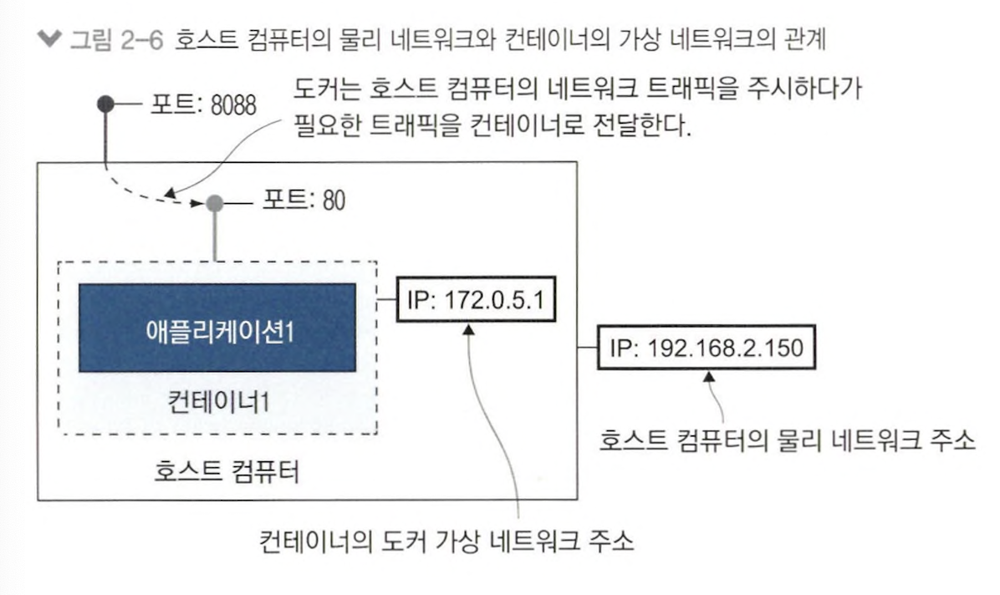

- host 8088 port로 들어온 트래픽이 컨테이너 80번 포트로 전달

## 2.5 도커가 컨테이너를 실행하는 원리

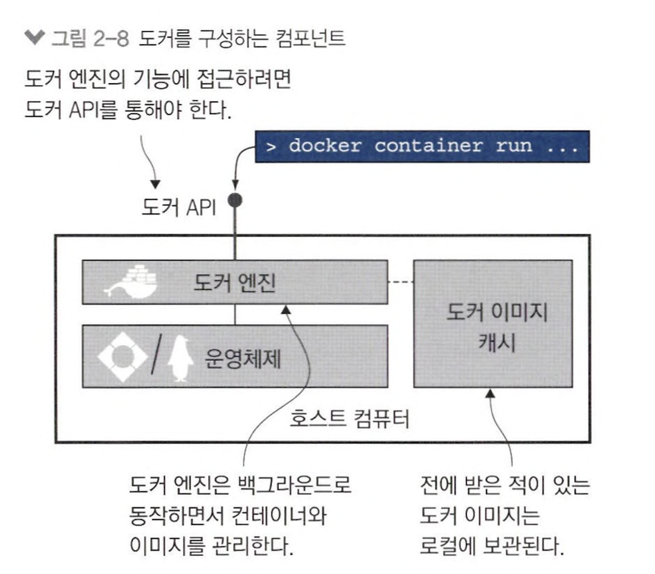

#### Docker Engine

> 도커 관리 기능

- 로컬 이미지 캐싱
- 새로운 이미지가 필요하면 pull, 이미 있다면 해당 이미지 사용
- host os와 함께 container, virtual network에 필요한 docker resource 생성
- 항시 동작하는 백그라운드 프로세스

#### Docker API

> 도커 엔진이 기능을 수행할 수 있도록 하는 HTTP Rest API

#### Docker CLI

> docker 명령어를 사용할 때 실제로 도커 API를 호출

## 2.6 연습문제: 컨테이너 파일 시스템 다루기

> 문제 : 앞서 실행한 웹 사이트 컨테이너를 실행하여 index.html 파일을 교체해 웹 페이지 내용 수정

```shell
# docker container 실행
docker container run --detach --publish 8088:80 diamol/ch02-hello-diamol-web

# container 이름으로 container ID 조회하여 container 접속
docker exec -it $(docker container ls | grep diamol-web | awk '{print $1}') /bin/sh
```

<table>
<tr>
<td align="center">명령어</td><td align="center">결과</td>
</tr>
<tr>
<td>
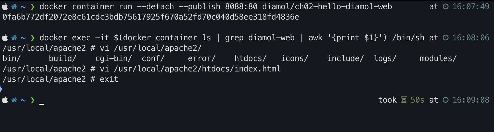
</td>
<td>
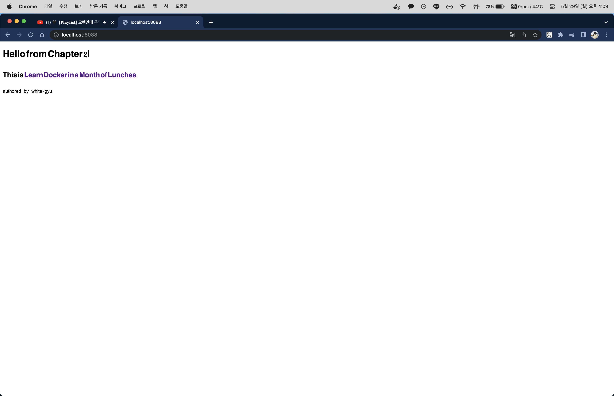
</td>
</tr>
</table>