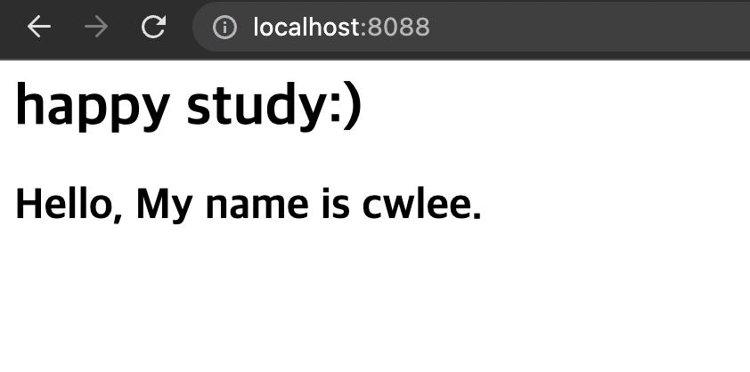

```
웹 사이트 컨테이너를 실행하고 index.html 파일을 교체해 웹 페이지의 내용을 수정한다.
```

```
1. 컨테이너를 실행한다.
$ docker container run --detach --publish 8808:80 diamol/ch02-hello-diamol-web

2. 컨테이너에 접속한다.
$ docker exec -it f74321ad8d59 /bin/sh
/usr/local/apache2 #
/usr/local/apache2 # cd htdocs/
/usr/local/apache2/htdocs # ls
index.html
/usr/local/apache2/htdocs # vi index.html
/usr/local/apache2/htdocs # exit
```

### 실습 결과



