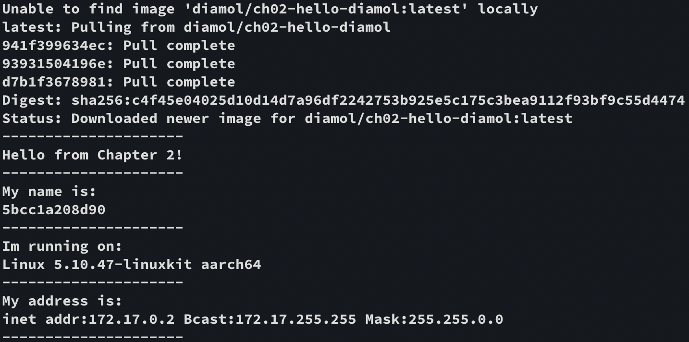
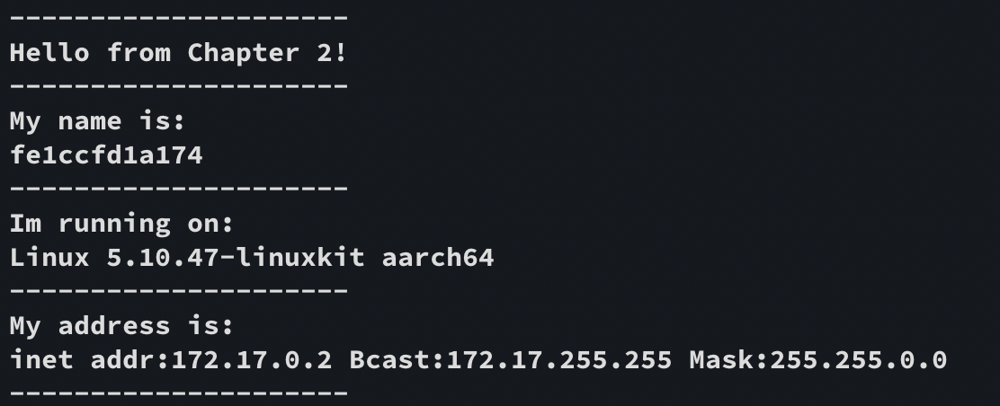
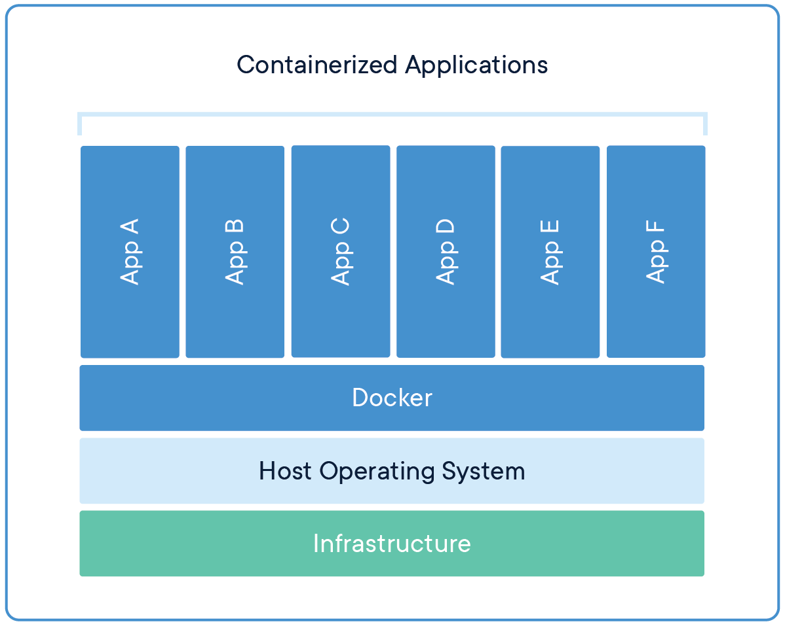
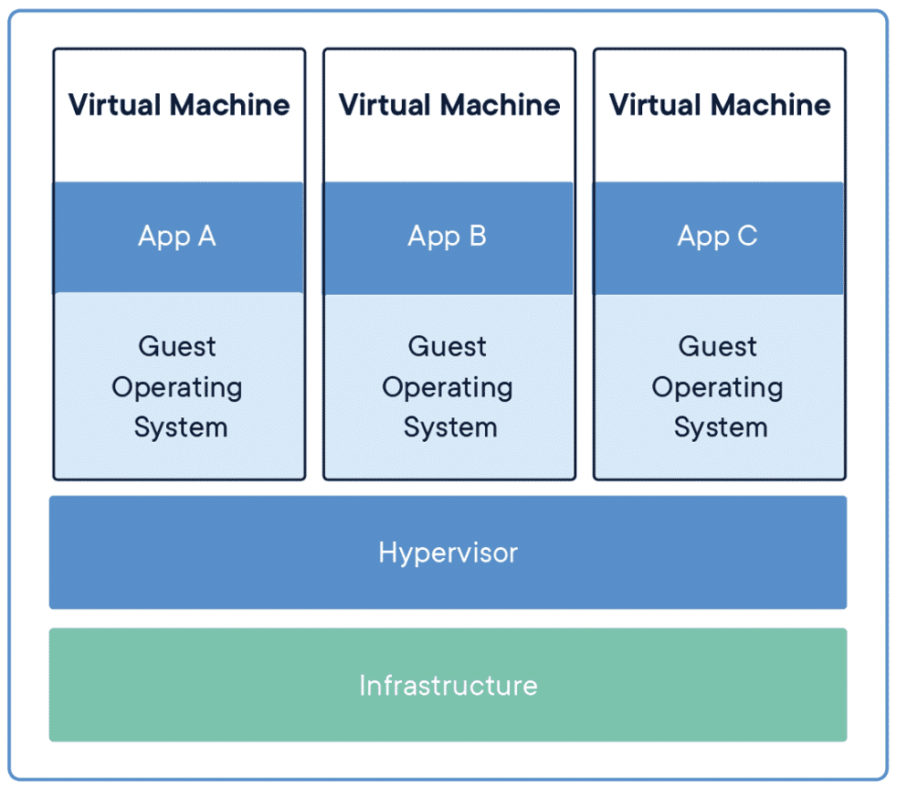
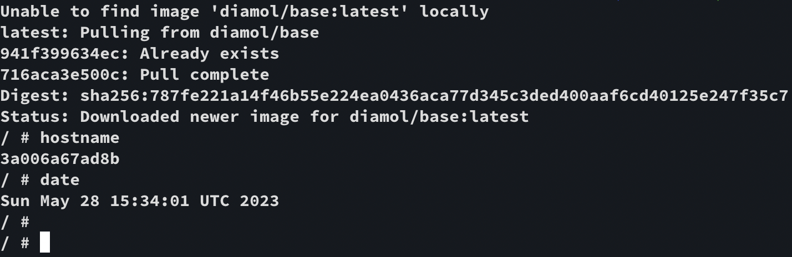
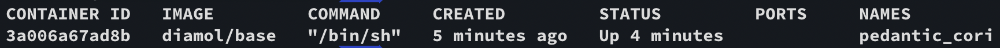
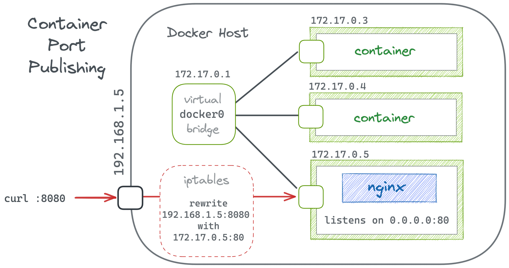
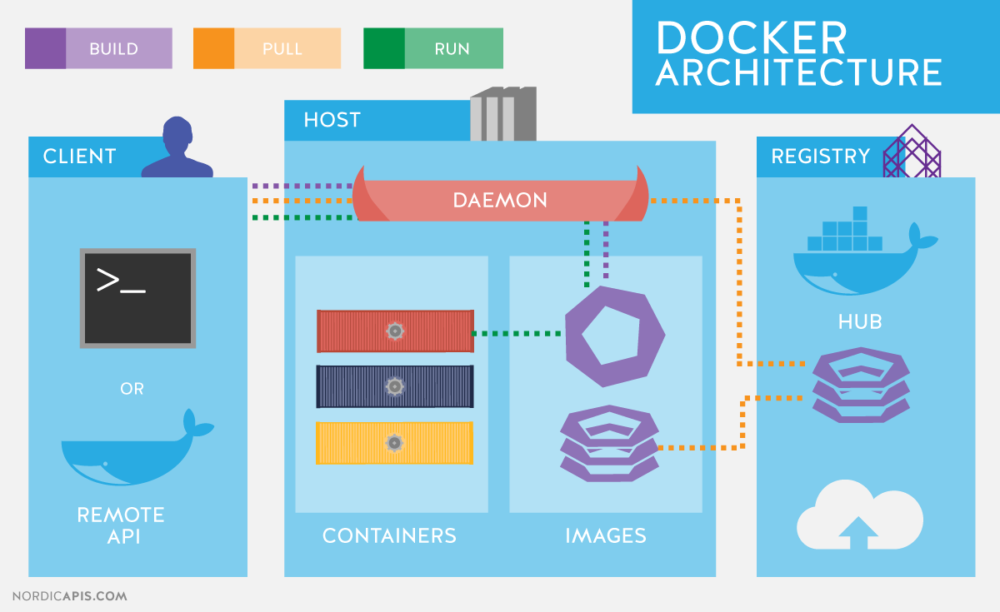

# 2장 도커의 기본적인 사용법

## 2.1 컨테이너로 Hello World 실행하기

Hello World 예제로 도커 학습 시작한다.

📌 docker container run 명령은 컨테이너로 애플리케이션을 실행하라는 도커 명령어이다.

```
$ docker container run diamol/ch2-hello-diamol
```

### 💻 실행 결과

이 애플리케이션은 미리 도커로 실행하도록 패키징돼 누구나 내려받을 수 있도록 공유된 것이다.

컴퓨터에는 현재 diamol/ch02-hello-diaml 패키지가 없어 내려받는 과정이 수행된다.

이미지를 내려받고 나면 내려받은 이미지를 사용해 컨테이너를 실행한다.



아주 간단한 애플리케이션이지만 이 과정에서 도커를 사요하는 **`워크플로의 핵심`**을 볼수 있다.

```
애플리케이션을 컨테이너에서 실행할 수 있도록 패키징하고, 
다른 사람이 패키지를 사용할 수 있도록 공유한 다음,
이 패키지를 내려받은 사람이 컨테이너를 통해 애플리케이션을 실행한다.
도커에서는 이 과정을 **빌드, 공유, 실행**이라고 부른다.
```

---

같은 명령어를 한 번 더 입력해보자.

```
$ docker container run diamol/ch02-hello-diamol
```

### 💻 실행 결과

도커가 이미 이미지를 내려받았기 때문에 이미지를 내려받는 부분이 사라지고 바로 컨테이너를 실행하는 메시지가 출력된다.

같은 컴퓨터를 사용하므로 컨테이너가 출력하는 내용 중 운영체제와 아키텍처에 대한 내용은 아까와 같으며 컴퓨터 이름과 네트워크 주소에 대한 내용은 달라진다.



---

## 2.2 컨테이너란 무엇인가?

애플리케이션이 들어 있는 어떤 상자를 상상해 보자. 이 상자안에는 애플리케이션과 애플리케이션을 실행할 컴퓨터가 함께 들어있다.


도커가 만들어 낸 가상 리소스(호스트명, IP주소, 파일 시스템)이 서로 엮여 애플리케이션이 동작할 수 있는 환경이 만들어 진다.

컴퓨터 한 대에서 여러 개의 컨테이너를 실행 시킬 수 있으며, 컨테이너는 서로 독립적인 환경을 갖지만, 실행되는 컴퓨터의 CPU와 메모리, 운영체제를 공유한다.



이러한 구도가 중요한 이유는 `격리(isolation)` 와 `밀집(density)` 이라는 모순돼 보이는 조건을 동시에 만족할 수 있기 때문이다.

밀집이란 컴퓨터에서 CPU와 메모리가 허용하는 한 되도록 많은 수의 애플리케이션을 실행하는 것을 의미한다. 그러나 서로 다른 여러 애플리케이션을 동시에 실행하는 데는 제약이 따른다. 

- 상이한 런타임 버전
- 호환되지 않는 버전의 라이브러리 사용
- 리소스 사용량의 차이

이런 면을 고려하면 애플리케이션은 서로 독립된 환경에서 실행돼야 한다. 하지만, 그럴 경우 한 컴퓨터에서 여러 애플리케이션을 실행할 수 없게 되어 밀집을 달성할 수 없다.

### 1. 가상 머신

모순된 조건을 동시 달성하기 위해서 가상 머신을 사용한다. 

가상 머신은 애플리케이션이 실행될 `독립적 환경`이 생긴다는 점에서 컨테이너와 큰 차이가 없다.

하지만, 가상 머신은 컨테이너와 달리 호스트 운영체제를 공유하지 않고 `별도의 운영체제`를 필요로 한다



각각의 가상 머신은 자신만의 운영체제를 별도로 갖는다. 

이 운영체제는 애플리케이션이 사용해야 할 CPU와 메모리 자원을 상당량 차지한다. 운영체제의 라이선스 비용과 운영체제 업데이트 설치 부담이 추가로 생긴다.

가상 머신은 `격리` 를 달성할 수 있지만, `밀집` 을 제공하지 못한다.

### 2. 컨테이너

컨테이너는 호스트 컴퓨터의 운영체제를 공유함으로써 가상 머신의 단점을 해결할 수 있다.

1. 필요한 리소스가 크게 경감된다.
2. 실행이 빠르다.
3. (가상 머신에 비해) 많은 수의 애플리케이션을 실행할 수 있다.
4. (가상 머신과 마찬가지로) 독립적인 환경을 제공한다.

컨테이너는 `밀집` 과 `격리` 를 동시에 달성한다.

---

## 2.3 컨테이너를 원격 컴퓨터처럼 사용하기

```
$ docker container run --interactive --tty diamol/base
$ docker container run -it diamol/base
```

- `--interactive` : 컨테이너 접속 상태
- `--tty` : 터미널 세션을 통해 컨테이너를 조작

### 💻 실행 결과



📌 다음 명령어를 입력해 현재 실행 중인 모든 컨테이너에 대한 정보를 확인할 수 있다.

```
$ docker container ls
```

### 💻 실행 결과

도커는 컨테이너를 실행할 때마다 무작위로 생성한 ID 값을 부여한다. 그리고 이 ID 값 중 일부분이 호스트명이 된다.



---

📌 다음 명령어는 대상 컨테이너에서 실행 중인 프로세스 목록을 보여준다.

```
$ docker container top 3a
UID                 PID                 PPID                C                   STIME               TTY                 TIME                CMD
root                25799               25770               0                   15:32               ?                   00:00:00            /bin/sh
```

📌 다음 명령어는 대상 컨테이너에서 수집된 모든 로그를 출력한다.

```
$ docker container logs 3a
/ # hostname
3a006a67ad8b
/ # date
Sun May 28 15:34:01 UTC 2023
/ #
```

📌 다음 명령어는 대상 컨테이너의 상세한 정보를 보여준다.

```
$ docker container inspect
```

컨테이너의 가상 파일 시스템의 경로, 컨테이너에서 실행 중인 명령, 해당 컨테이너가 접속된 가상 도커 네트워크 정보 등 애플리케이션에 발생한 문제를 추적하는 데 유용한 정보가 제공된다.

---

## 2.4 컨테이너를 사용해 웹 사이트 호스팅하기

📌 모든 컨테이너의 목록을 출력한다.

```
$ docker container ls --all
```

- 컨테이너 내부의 애플리케이션이 실행 중이어야 컨테이너의 상태도 실행 중이 된다.
    - 애플리케이션 프로세스가 종료되면 컨테이너의 상태도 Existed가 된다.
    - 종료된 컨테이너는 CPU 자원이나 메모리를 사용하지 않는다.
- 컨테이너가 종료돼도 컨테이너는 사라지지 않는다.
    - 나중에 컨테이너를 다시 실행하거나, 로그를 확인하거나, 컨테이너의 파일 시스템에 새로운 파일을 복사하거나 외부로 복사해 올 수 있다.
    - 종료된 컨테이너도 명시적으로 삭제하지 않는 한 그대로 남아 있는다.
    - 컨테이너의 파일 시스템이 그대로 남아 있으므로 호스트 컴퓨터의 디스크 공간을 계속 점유한다.

---

### 컨테이너에서 간단한 웹 사이트 호스팅하기

```
$ docker container run --detach --publish 8088:80 diamol/ch02-hello-diamol-web
```

- `--detach` : 컨테이너를 백그라운드에서 실행하며 컨테이너 ID를 출력한다.
- `--publish` : 컨테이너의 포트를 호스트 컴퓨터에 공개한다.

### 호스트 컴퓨터의 물리 네트워크와 컨테이너의 가상 네트워크의 관계

각 컨테이너는 고유의 IP 주소를 갖지만, 이 IP 주소는 도커가 관리하는 내부 가상 네트워크의 주소지 호스트 컴퓨터가 연결된 물리 네트워크에 연결된 것이 아니다. 

컨테이너의 포트를 공개한다는 것인 도커가 호스트 컴퓨터의 포트를 주시하다가 해당 포트로 들어온 트래픽을 컨테이너로 전달해 주는 것이다.



### 실습 결과


</br>

📌 실행 중인 컨테이너의 상태를 확인한다.

```
$ docker container stats 7183
```

📌 컨테이너 삭제한다.

```
$ docker container rm --force
```

📌 모든 컨테이너를 삭제한다.

```
$ docker container rm --force $(docker container ls --all --quiet)
```

---

## 2.5 도커가 컨테이너를 실행하는 원리

이번 장 첫 번째 실습에서 `빌드-공유-실행` 워크플로가 도커의 핵심이라고 설명했었다. 이 워크 플로를 적용하면 소프트웨어 배포가 매우 쉬워진다.

도커를 설치하고 컨테이너를 실행하는 일은 매우 간단하지만, 여러 컴포넌트가 관여한다.



```
**Docker API**
표준 HTTP기반 REST API다.
도커 엔진 설정을 수정하면 이 API를 네트워크를 경유해 외부 컴퓨터로부터 호출할 수 없도록 차단하거나 허용할 수 있다.
```

```
**Docker CLI**
Docker API의 클라이언트다.
Docker 명령을 사용할 때 실제로 도커 API를 호출하는 것이 바로 도커 CLI다.
```

```
**Docker Engine**
1. 로컬 이미지 캐시를 담당한다.
   새로운 이미지가 필요하면 이미지를 내려받으며, 기존 이미지가 있다면 전에 내려받은 이미지를 사용한다.
2. 호스트 운영체제와 함께 컨테이너 가상 네트워크 등 도커 리소스를 만드는 일을 담당한다.
3. 도커 엔진은 항시 동작하는 백그라운드 프로세스다.
```

도커 엔진은 containerd라는 컴포넌트를 통해 컨테이너를 실제로 관리하는데, containerd는 호스트 운영체제가 제공하는 기능을 통해 컨테이너, 즉 가상 환경을 만든다. 

---

## 2.6 연습 문제 : 컨테이너 파일 시스템 다루기

```
웹 사이트 컨테이너를 실행하고 index.html 파일을 교체해 웹 페이지의 내용을 수정한다.
```

```
1. 컨테이너를 실행한다.
$ docker container run --detach --publish 8808:80 diamol/ch02-hello-diamol-web

2. 컨테이너에 접속한다.
$ docker exec -it f74321ad8d59 /bin/sh
/usr/local/apache2 #
/usr/local/apache2 # cd htdocs/
/usr/local/apache2/htdocs # ls
index.html
/usr/local/apache2/htdocs # vi index.html
/usr/local/apache2/htdocs # exit
```

### 실습 결과


