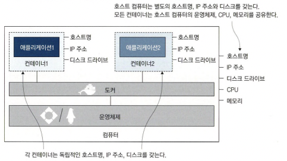
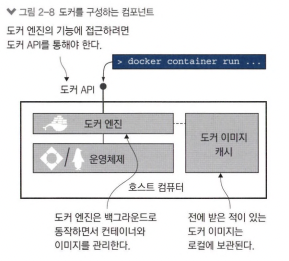

# 2.1 컨테이너로 Hello World 실행하기

```shell
docker run diamol/ch02-hello-diamol
```

- 실행할 떄마다 컴퓨터이름은 매번 바뀌며 IP 주소 또한 매번 바뀔 확률이 높습니다.
  이미지가 있다면 바로 실행되고 없다면 pulling후 실행됩니다.

## 2.2 컨테이너란 무엇인가?



- 각 컨테이너는 호스트명, IP 주소, 디스크를 가지며 컨테이터는 운영체제,CPU,메모리를 공유합니다.

<span style="color:gray">
    * 격리 - 각 어플리케이션은 독립적이어야함
</span>
<br/>
<span style="color:gray">
    * 밀집 - 컴퓨터에 CPU,메모리가 허용하는 한 되도록 많은 수의 어플리케이션을 실행해야 함
</span>

<br/>

- 가상머신
  어플리케이션이 실행될 독립적 환경을 제공하지만 운영체제를 공유하지 않고 별도로 운영체제를 필요로 함 따라서 운영체제가 CPU, 메모리의 상당부분을 차지하게 됩니다. 또한 운영체제의 라이선스 비용과 업데이트의 부담감이 추가됩니다.

## 2.3 컨테이너를 원격 컴퓨터처럼 사용하기

```shell
docker container --interactive --tty diamol/base
    or
docker run -it diamol/base
```

- interactive(i)를 사용하면 도커 컨테이터에 접속가능

- tty(t) 를 사용하면 터미널 세션을 통해 컨테이너 조작 가능

```shell
docker container ls
    or
docker ps
```

- 실햍중인 컨테이너를 확인할 수 있습니다

```shell
docker container top {CONTAINER ID}
    or
docker top {CONTAINER ID}
```

- 대상 컨테이너에서 실행중인 프로세스 목록을 보여줍니다.

```shell
docker container logs {CONTAINER ID}
    or
docker logs {CONTAINER ID}
```

- 대상 컨테이너의 로그를 보여줍니다.

```shell
docker container inspect {CONTAINER ID}
    or
docker inspect {CONTAINER ID}
```

- 대상 컨테이너의 상세 정보를 보여줍니다.

<span style="color:pink">
   * 도커화한 어떤 어플리케이션이라도 위 명령어를 적용할 수 있습니다. 
</span>

<br/>

## 2.4 컨테이너를 사용해 웹 사이트 호스팅하기

```shell
docker container ls --all
    or
docker ps -a
```

- 도커 상태와 상관없이 모든 컨테이너의 목록을 보여줍니다.
  어플리케이션이 프로세스가 종료되면 "Exited" 상태가 되고 종료된 컨테이너는 CPU, 메모리를 사용하지 않습니다. 다만 명시적으로 삭제하지 않는 한 그대로 남아있기에 디스크 공간을 계속 점유합니다.
  <span style="color:pink">
  삭제하지 않는 한 다시 실행하거나 log를 확인할 수 있습니다.
  </span>

```shell
docker container run --detach --publish 8088:80 diamol/ch02-hello-diamol-web
    or
docker run -dp 8088:80 diamol/ch02-hello-diamol-web
```

- detach(d) 컨테이너를 백그라운드에서 실행, 컨테이너 ID 출력

- publish(p) 컨테이너의 포트를 호스트 컴퓨터에 공개

- 컨테이너 포트를 호스트 컴퓨터에 공개하는 원리

  도커가 컴퓨터의 네트워크 트래픽을 모두 감시하고 그 중 필요한만을 컨테이너로 전달합니다.

```shell
docker container stats {CONTAINER ID}
    or
docker stats {CONTAINER ID}
```

- 대상 컨테이너의 실시간 CPU, 메모리, 네트워크, 디스크 사용량을 보여줍니다.

```shell
docker container rm {CONTAINER ID}
    or
docker rm {CONTAINER ID}
```

- 컨테이너를 삭제합니다. --force(f)를 사용하면 실행중인 컨테이너도 삭제할 수 있습니다.

```shell
docker container rm  --force $(docker container ls --all --quiet)
    or
docker rm -f $(docker ps -aq)
```

- "$()"를 사용하면 괄호안에 명령의 출력을 다른 명령으로 전달할 수 있습니다.

- quiet(q) 컨테이너 ID만 출력

## 2.5 도커가 컨테이너를 실행하는 원리



- 도커 엔진은 도커 API로 호출되며 도커의 관리 기능을 담당하는 컴포넌트 입니다. containerd라는 컴포넌트를 통해 컨테이너를 실제로 관리하고 containe는 호스트 운영체제가 관리하는 기능으로 가상 환경을 만듭니다.
- 컨테이너는 개방형 컨테이너 이니셔티브(OCI)라는 이름으로 공개된 개방형 표준입니다.

<span style="color:gray">
    * OCI는 컨테이너 형식 및 런타임 사양 등을 업계 표준으로 개발하는 조직
</span>
