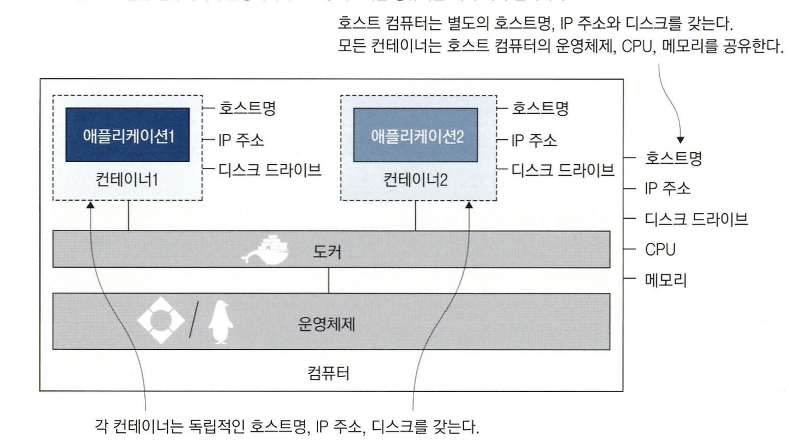
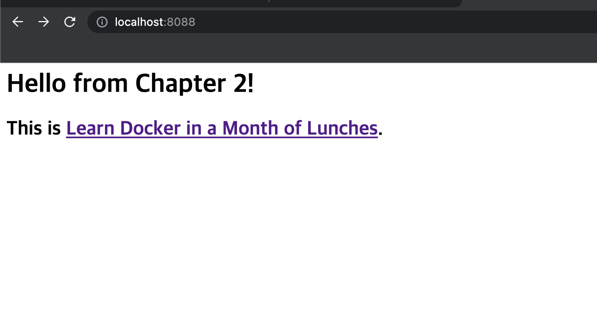
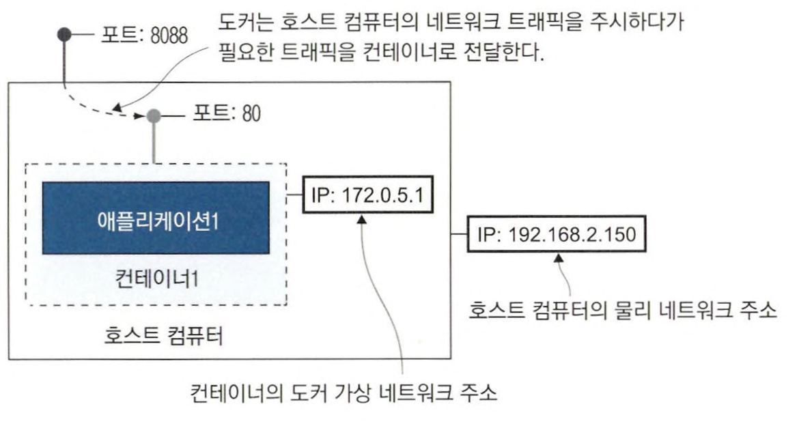
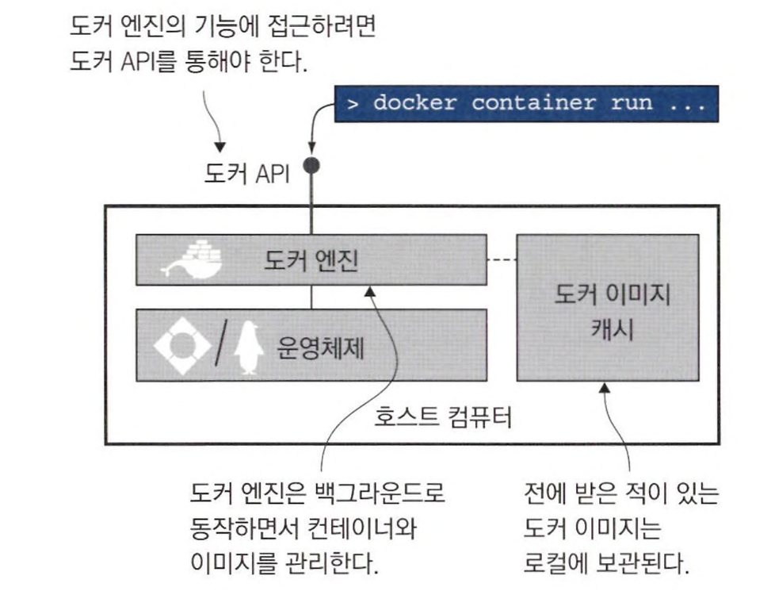

# 컨테이너로 Hello World 실행하기

```
docker container run diamol/ch02-hello-diamol


// 실행 결과
Unable to find image 'diamol/ch02-hello-diamol:latest' locally
latest: Pulling from diamol/ch02-hello-diamol
941f399634ec: Pull complete
93931504196e: Pull complete
d7b1f3678981: Pull complete
Digest: sha256:c4f45e04025d10d14d7a96df2242753b925e5c175c3bea9112f93bf9c55d4474
Status: Downloaded newer image for diamol/ch02-hello-diamol:latest
---------------------
Hello from Chapter 2!
---------------------
My name is:
e80456d30baf
---------------------
Im running on:
Linux 5.10.104-linuxkit aarch64
---------------------
My address is:
inet addr:172.17.0.2 Bcast:172.17.255.255 Mask:255.255.0.0
---------------------
```

docker container run 명령은 컨테이너로 애플리케이션을 실행하라는 명령어이다. <br>
이미지를 이용해 컨테이너를 실행하려면 먼저 이미지가 있어야 하는데, 이미지를 갖고 있지 않아서 pull 받은 후 실행을 했다.

이 과정에서 도커를 사용하는 work flow의 핵심을 볼 수 있다.

- 애플리케이션을 컨테이너에서 실행할 수 있도록 패키징하고
- 다른 사람이 패키지를 사용할 수 있도록 공유한 다음
- 패키지를 내려 받은 사람이 컨테이너를 통해 애플리케이션을 실행한다.

이 과정을 **빌드, 공유, 실행**이라고 하고, 이런 방법으로 도커의 이식성이 확보된다.

<br>
<hr>

# 컨테이너란 ?



컨테이너는 애플리케이션을 담는 상자와 같다. <br>
이 상자 안에는 애플리케이션과 애플리케이션을 실행할 컴퓨터(IP 주소, 컴퓨터 이름, 디스크 드라이브)가 함께 들어있다.

호스트명, IP 주소, 파일 시스템 모두 도커가 만들어낸 가상 리소스이다. <br>
이 상자 안에서는 상자 밖의 환경을 볼 수 없고, 각각 독립적인 환경을 갖지만 실행되는 컴퓨터의 CPU, 메모리, 운영체제를 공유한다.

<br>

만약 각각의 가상 머신이 자신만의 운영체제를 별도로 갖는다면, 이 운영체제는 애플리케이션이 사용해야 할 CPU와 메모리를 많이 차지한다. <br>
또한 운영체제의 라이센스 비용과 업데이트 설치 부담이 생긴다.

각각의 컨테이너는 호스트 컴퓨터의 운영체제를 공유하므로 필요한 리소스가 크게 줄어들고, 실행도 빨라지고 더 많은 애플리케이션을 실행할 수 있다.

<br>
<hr>

# 컨테이너를 원격 컴퓨터로 사용하기

한 스크립트 안에서 여러 도구를 사용해 필요한 일을 처리하는 경우, 특정한 도구가 필요하므로 스크립트 외에 도구를 함께 공유해야 한다. <br>
이런 경우 도커를 사용하면 도구와 스크립트를 하나의 이미지로 패키징해 컨테이너로 스크립트를 바로 실행하게 할 수 있다. <br>
혹은 컨테이너를 실행하고 컨테이너를 원격 컴퓨터에 접속하듯 사용할 수도 있다.

<br>

```
docker container run --interactive --tty diamol/base

// 실행 결과
Unable to find image 'diamol/base:latest' locally
latest: Pulling from diamol/base
941f399634ec: Already exists
716aca3e500c: Pull complete
Digest: sha256:787fe221a14f46b55e224ea0436aca77d345c3ded400aaf6cd40125e247f35c7
Status: Downloaded newer image for diamol/base:latest
```

--interactive 플래그를 사용하면 컨테이너에 접속한 상태가 된다. <br>
--tty 플래그는 터미널 세션을 통해 컨테이너를 조작하겠다는 의미이다. 

<br>
<hr>

# 컨테이너를 사용해 웹 사이트 호스팅하기

```
docker container ls --all

// 실행 결과
CONTAINER ID   IMAGE                      COMMAND                 CREATED          STATUS                       PORTS     NAMES
dea08064a8ca   diamol/base                "/bin/sh"               7 minutes ago    Exited (127) 3 minutes ago             quirky_hugle
4abd5e6c9115   diamol/ch02-hello-diamol   "/bin/sh -c ./cmd.sh"   19 minutes ago   Exited (0) 19 minutes ago              nice_lichterman
e80456d30baf   diamol/ch02-hello-diamol   "/bin/sh -c ./cmd.sh"   25 minutes ago   Exited (0) 25 minutes ago              hardcore_haslett
```

`docker container ls --all` 명령어로 모든 컨테이너의 목록을 확인할 수 있다.

모든 컨테이너가 Exited 상태인데, **컨테이너 내부의 애플리케이션이 실행 중이어야 컨테이너의 상태도 실행 중이 된다.** <br>
애플리케이션이 종료되면 컨테이너 상태도 Exited된다. 종료된 컨테이너는 CPU나 메모리를 사용하지 않는다.

**컨테이너는 종료되어도 컨테이너는 사라지지 않는다.** <br>
그래서 나중에 컨테이너를 다시 실행하거나, 로그를 확인하거나, 컨테이너 파일 시스템에 새로운 파일을 복사하거나 할 수 있다.

<br>

```
docker container run --detach --publish 8088:80 diamol/ch02-hello-diamol-web
```

이 명령어를 실행하면 컨테이너는 종료되지 않고 백그라운드에서 계속 동작한다. <br>
`diamol/ch02-hello-diamol-web`  이미지는 아파치 웹 서버와 html 페이지를 담고 있어 웹 서버를 통해 웹 페이지가 제공된다.

*이 HTTP 요청은 로컬 컴퓨터로 보낸 것인데, HTTP 응답은 컨테이너로부터 나온 것이다.*



<br>

컨테이너가 백그라운드에서 동작하면서 네트워크를 주시하게 하려면 docker container run 다음에 다음 두 개의 플래그를 적용해야 한다.

- --detach (컨테이너를 백그라운드에서 실행하며 컨테이너 ID를 출력)
- --publish (컨테이너의 포트를 호스트 컴퓨터에 공개)

<br>



컨테이너는 기본적으로 외부 환경에 노출되지 않는다. <br>
각 컨테이너는 고유의 IP를 갖지만, 이 IP 주소는 도커가 관리하는 내부 가상 네트워크의 주소이고 호스트 컴퓨터가 연결된 물리 네트워크에 연결된 것이 아니다.

컨테이너의 포트를 공유한다는 것은 도커가 호스트 컴퓨터의 포트를 주시하다가 해당 포트로 들어오는 트래픽을 컨테이너로 전달해주는 것이다.

<br>

```
docker container rm --force $(docker container ls --all --quiet)
```

모든 컨테이너를 삭제하려면 위 명령어를 사용한다. <br>
$() 문법은 괄호 안의 명령의 출력을 다른 명령으로 전달하는 역할을 한다.

<br>
<hr>

# 도커가 컨테이너를 실행하는 원리



- **도커 엔진**은 도커의 관리 기능을 맡는 컴포넌트이다.  로컬 이미지 캐시를 담당 하므로 새로운 이미지가 필요하면 이미지를 내려받으며. 기존 이미지가 있다면 전에 내려받 은 이미지를 사용한다. 호스트 운영체제와 함께 컨테이너와 가상 네트워크 등 도커 리소스 를 만드는 일도 담당한다. 도커 엔진은 항상 동작하는 백그라운드 프로세스다.
- **도커 API**는 HTTP 기반 REST API다. 도커 엔진의 설정을 수정하면 이 API를 네트워크를 경유해 외부 컴퓨터로부터 호출할 수 없도록 차단(기본 설정)하거나 허용할 수 있다
- **도커 CLI**는 도커 API의 클라이언트다. docker 명령을 사용할 때 실제로 도커 API를 호출하는 것이 바로 도커 CLI다.


<br>
<hr>

# 연습 문제

```
// 애플리케이션 실행
docker container run --detach --publish 8088:80 diamol/ch02-hello-diamol-web

// 컨테이너 접속
docker exec -it 4c7da sh

// index.html 파일이 있는 경로로 이동
cd /usr/local/apache2/htdocs

// index.html 수정
vi index.html
```


