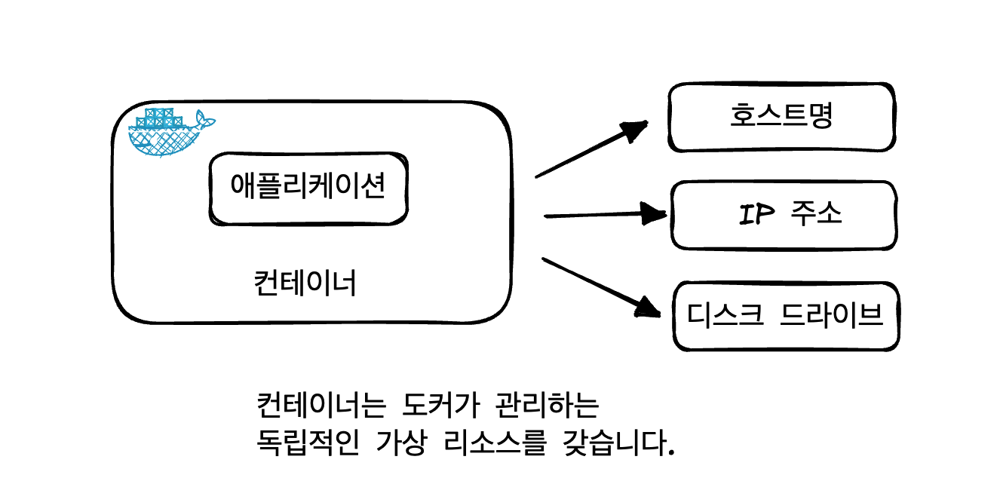
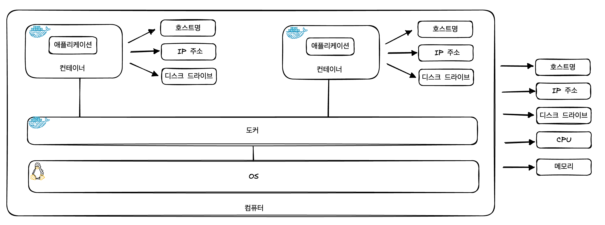
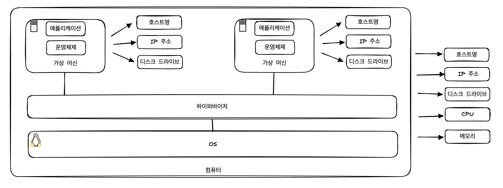
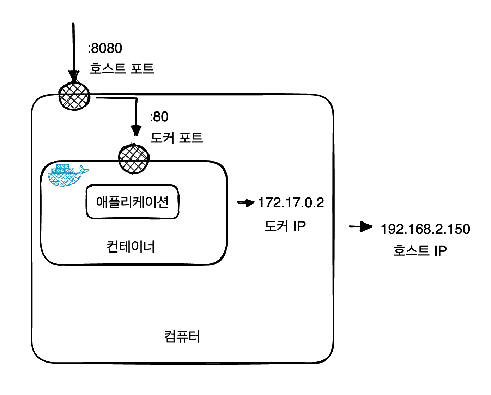
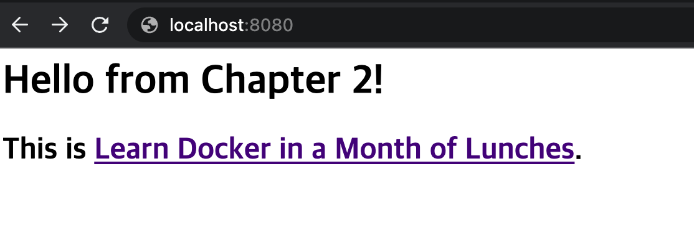
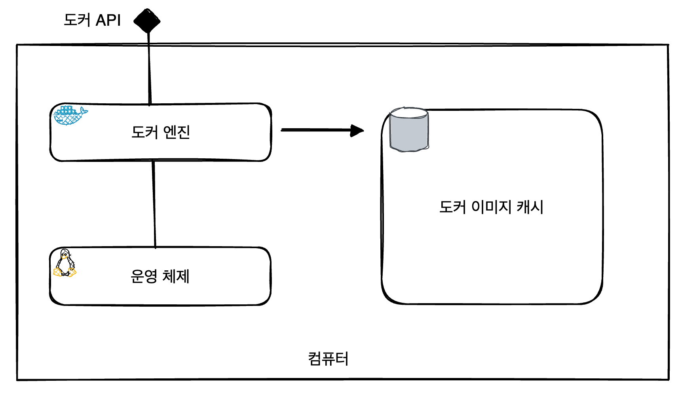

# 도커의 기본적인 사용법
### 해당 장에서 다루는 내용

- 컨테이너란 무엇인가?
- 컨테이너가 애플리케이션을 경량으로 실행할 수 있는 이유

### 컨테이너로 Hello World 실행하기

컨테이너를 실행시키기 위해 다음 명령어를 사용할 수 있습니다.

```bash
docker container run {컨테이너 이름}
```

`docker container run` 명령은 컨테이너로 애플리케이션을 실행하라는 도커 명령입니다.

명령 뒤에는 실행할 컨테이너의 이미지를 지정하게 됩니다.
```
💡 이미지를 이용해 컨테이너를 실행하려면 먼저 이미지가 존재하며, 이미지를 가지고 있지 않은 경우 지정된 저장소에서 이미지를 내려받게 됩니다.
```
다음 예시는 Hello, World 메시지를 출력하는 컨테이너를 실행시킬 수 있습니다.

```bash
docker container run diamol/ch02-hello-diamol
```

다음은 위의 명령을 실행시킨 결과입니다.

```bash
---------------------
Hello from Chapter 2!
---------------------
My name is:
61994b9fda19
---------------------
Im running on:
Linux 5.10.104-linuxkit aarch64
---------------------
My address is:
inet addr:172.17.0.2 Bcast:172.17.255.255 Mask:255.255.0.0
---------------------
```

각각의 필드는 다음과 같은 내용을 의미합니다.

- My name is : 컴퓨터의 이름을 의미하며, 예제에서는 61994b9fda19에 해당됩니다.
- Im running on : 운영체제 종류를 의미하며, 예제에서는 Linux 5.10.104-linuxkit aarch64를 의미합니다.
- My address is : 네트워크 주소를 의미하며, 예제에서는 172.17.0.2를 의미합니다.

명령을 실행하고나서 아까 실행했던 명령을 다시 한번 입력하면 다음과 같이 달라진 결과를 볼 수 있을 것입니다.

```bash
---------------------
Hello from Chapter 2!
---------------------
My name is:
65c7a533cab9
---------------------
Im running on:
Linux 5.10.104-linuxkit aarch64
---------------------
My address is:
inet addr:172.17.0.2 Bcast:172.17.255.255 Mask:255.255.0.0
---------------------
```

컴퓨터 이름이 계속해서 변경되는 것을 볼 수 있는데 계속 바뀌는 이유를 알아보기 위해 먼저 컨테이너에 대해 알아봅시다.

### 컨테이너란 무엇인가?

도커 컨테이너는 말 그대로 물건을 담는 컨테이너와 같습니다.

이 상자 안에는 애플리케이션과 애플리케이션을 실행할 컴퓨터가 들어가게 됩니다.

도커 컨테이너에서 실행되고 있는 컨테이너를 그림으로 표현하면 다음과 같습니다.



호스트명, IP 주소, 파일 시스템 등 모두 도커가 만들어낸 가상 리소스입니다.

이들이 서로 엮여서 애플리케이션이 동작할 수 있는 환경이 만들어집니다.

상자 안에서는 상자 밖이 어떤 환경인지 볼 수 없습니다.

그러나 상자는 어떤 컴퓨터에서 동작하며, 어떤 컴퓨터에서는 다른 상자를 여러개 실행할 수 있습니다.

즉, 이런 상자들은 `서로 독립적인 환경을 갖지만 상자가 실행되는 컴퓨터의 CPU와 메모리, 운영체제를 공유`합니다.



위의 그림에서 알 수 있듯 컨테이너는 각각의 독립적인 호스트명, IP주소, 디스크를 가지며, 이들을 실행하는 컴퓨터는 별도의 호스트명, IP 주소, 디스크, OS, CPU, 메모리 등을 가지고 있습니다.

### 격리와 밀집

위의 그림과 같은 구조가 중요한 이유는 격리와 밀집이라는 조건을 동시에 만족할 수 있기 때문입니다.

```
💡 밀집이란, 컴퓨터에 CPU와 메모리가 허용하는 한 되도록 많은 수의 애플리케이션을 실행하는 것을 의미합니다.

```

일반적으로, 서로 다른 여러 애플리케이션을 동시에 실행하는 데는 제약이 따릅니다.

예를 들어, 다음과 같은 문제들이 발생할 수 있습니다.

- 서로 호환되지 않는 버전의 라이브러리를 사용하는 경우
- 자바나 닷넷 등 필요로 하는 런타임의 버전이 다른 경우
- 특정 애플리케이션이 과다한 리소스를 사용하는 경우

위와 같은 문제를 고려하려면 애플리케이션은 서로 독립된 환경에 실행되어야 합니다.

하지만 그럴 경우 `한 컴퓨터에서 여러 애플리케이션을 실행할 수 없게되고 밀집을 달설할 수 없게 됩니다.`

### 밀집도를 높이기 위해 가상머신 사용하기

격리와 밀집을 동시에 달성하기 위한 첫번째 시도는 가상 머신 사용입니다.

가상 머신은 애플리케이션이 실행될 독립적 환경이 생긴다는 점에서 컨테이너와 큰 차이가 없습니다.

하지만, 가상 머신은 컨테이너와 달리 호스트 컴퓨터의 운영체제를 공유하지 않고 별도의 운영체제를 필요로 합니다.



컨테이너와 차이를 보면 가상 머신은 각각의 가상머신에 운영체제를 추가로 갖는다는 점이 다릅니다.

이로 인해 다음과 같은 문제가 발생합니다.

- 애플리케이션이 사용해야 할 CPU와 메모리 자원을 상당부분 차지합니다.
- 운영체제의 라이센스 비용과 운영체제 업데이트 설치 부담이 추가로 생깁니다.

이런 점에서 결국 가상머신은 격리는 달성할 수 있었지만 밀집은 제공하지 못했습니다.

### 컨테이너를 통한 문제 해결

- 각각의 컨테이너는 호스트 컴퓨터의 운영체제를 공유하므로 필요한 리소스가 크게 경감됩니다.
    - 이 덕분에 가상머신에 비해 실행도 빠르고 호스트 컴퓨터에서 더 많은 수의 애플리케이션을 실행할 수 있습니다.
- 가상머신과 마찬가지로 컨테이너 역시 외부와 독립된 환경을 제공하므로 밀집과 격리가 동시에 달성됩니다.

### 컨테이너를 원격 컴퓨터 처럼 사용하기

컨테이너를 실행한 후 다음 명령어를 사용하면 실행된 컨테이너에 접근할 수 있습니다.

```bash
docker container run -it {컨테이너 이미지}
```

`-i` (`--interactive`) :  컨테이너에 접속

`-t` (`--tty`) : 터미널 세션을 통해 컨테이너를 조작

이제 다음 명령을 통해 터미널에 접근해봅시다.

```bash
docker container run -it diamol/base
```

다음과 같이 이미지를 받은 후 sh로 접근이 가능한 것을 확인할 수 있습니다.

```bash
Unable to find image 'diamol/base:latest' locally
latest: Pulling from diamol/base
941f399634ec: Already exists
716aca3e500c: Pull complete
Digest: sha256:787fe221a14f46b55e224ea0436aca77d345c3ded400aaf6cd40125e247f35c7
Status: Downloaded newer image for diamol/base:latest
/ #
```

다음과 같이 터미널에서 명령어를 실행할 수도 있습니다.

```bash
/ # date
Sun May 21 08:35:28 UTC 2023
/ # hostanme
/bin/sh: hostanme: not found
/ # hostname
9f46fcbffb93
/ #
```

```
💡 도커 컨테이너가 호스트 컴퓨터의 운영체제를 공유하기 때문에 호스트 컴퓨터에 따라 리눅스 셸을 보여주거나 윈도우 명령 프롬프트를 보여줄 수 있습니다.

```

```
📌 도커 자체는 호스트 컴퓨터의 아키텍처나 운영체제와 상관없이 동일하게 동작하지만, 컨테이너에 들어 있는 애플리케이션은 운영체제나 아키텍처를 가릴 수 있습니다.

결국, 컨테이너의 내용물이 무엇이든 컨테이너를 다루는 방법은 환경과 상관없이 동일합니다.

```

### 모든 컨테이너 정보 확인하기

다음 명령을 사용하면 현재 실행 중인 모든 컨테이너에 대한 정보를 확인할 수 있습니다.

```bash
docker container ls
```

```bash
// 결과
CONTAINER ID   IMAGE         COMMAND     CREATED         STATUS         PORTS     NAMES
9f46fcbffb93   diamol/base   "/bin/sh"   5 minutes ago   Up 5 minutes             gifted_robinson
```

```
💡 컨테이너 내부에서 `hostname` 명령을 사용하는 것과 `docker container ls` 명령으로 확인한 CONTAINER ID와 동일합니다.

```

```
🔥 도커는 컨테이너를 실행할 때마다 무작위로 생성한 ID 값을 부여하며, 이 ID 값 중 일부분이 호스트명이 됩니다.
추가로, 컨테이너 ID의 처음 몇글자로 컨테이너를(2글자 이상 지정) 특정할 수 있습니다.

```

### 컨테이너 내부의 프로세스 확인하기

다음 명령을 사용하면 컨테이너에서 실행 중인 프로세스 목록을 볼 수 있습니다.

```bash
docker container top {컨테이너 ID}
```

```bash
UID   PID     PPID  C  STIME  TTY   TIME       CMD
root  2811    2786  0  08:32  ?     00:00:00   /bin/sh
```

### 컨테이너 로그 확인하기

다음 명령을 사용하면 컨테이너에서 수집된 모든 로그를 출력할 수 있습니다.

```bash
docker container logs {컨테이너 ID}
```

```bash
/ # date
Sun May 21 08:35:28 UTC 2023
/ # hostanme
/bin/sh: hostanme: not found
/ # hostname
9f46fcbffb93
```

### 컨테이너의 상세 정보 확인하기

다음 명령을 사용하면 컨테이너의 상세한 정보를 확인할 수 있습니다.

```bash
docker container inspect {컨테이너 ID}
```

```bash
[
    {
        "Id": "9f46fcbffb93e5afaf28f422172b125e59558a409efb6963956f1395ac3a3182",
        "Created": "2023-05-21T08:32:21.69192188Z",
        "Path": "/bin/sh",
        "Args": [],
...
...
```

`docker container inspect` 명령은 가상 파일 시스템상의 경로, 컨테이너에서 실행 중인 명령, 해당 컨테이너가 접속된 가상 도커 네트워크 정보 등 애플리케이션에 발생한 문제를 추적하는 데 유용한 정보가 제공됩니다.

제공되는 정보는 JSON 포맷으로 제공됩니다.

### 모든 컨테이너의 목록 조회

다음 명령어를 사용하면 현재 상태와 상관없이 모든 컨테이너를 조회하려면 다음 명령을 사용할 수 있습니다.

```bash
docker container ls -a
```

```bash
CONTAINER ID   IMAGE                      COMMAND                 CREATED         STATUS                     PORTS     NAMES
2496559d9270   diamol/ch02-hello-diamol   "/bin/sh -c ./cmd.sh"   3 seconds ago   Exited (0) 2 seconds ago             dazzling_agnesi
```

조회된 컨테이너를 보면 상태가 Existed임을 볼 수 있습니다.

여기서 두가지 사실을 알 수 있습니다.

1. 컨테이너 내부의 애플리케이션이 실행중이어야 컨테이너의 상태도 실행중이 됩니다.
2. 컨테이너가 종료돼도 컨테이너는 사라지지 않습니다.
    - 즉, 종료되더라도 다시 실행하거나 로그를 확인하거나, 컨테이너의 파일 시스템에서 데이터를 가져올 수 있습니다.

### 컨테이너를 사용해 웹 사이트 호스팅하기

도커를 사용하는 목적은 주로 웹사이트, 배치 프로세스, 데이터베이스 같은 서버 애플리케이션을 실행할 목적일 것 입니다.

이러한 목적을 달성하려면 애플리케이션을 백그라운드에서 계속 동작하게 만들어야할 것입니다.

다음 명령을 사용하면 웹서버로 사용할 컨테이너를 백그라운드에서 계속 실행할 수 있습니다.

```bash
docker container run --detach --publish 8080:80 diamol/ch02-hello-diamol-web
```

위의 명령에서 주어진 옵션은 다음과 같은 역할을 합니다.

- `--detach` (`-d`) : 컨테이너를 백그라운드에서 실행하며, 컨테이너 ID를 출력합니다.
- `--publish` (`-p`) : 컨테이너의 포트를 호스트 컴퓨터에 공개합니다.

### 컨테이너 포트를 외부로 노출하기

```
💡 도커를 설치하면 호스트 컴퓨터의 네트워크 계층에 도커가 끼어들게 되는데, 그러면 호스트 컴퓨터에서 들고나는 네트워크 트래픽을 모두 도커가 가로채서 그 중 필요한 것을 컨테이너에 전달할 수 있습니다.

```

컨테이너는 기본적으로 외부 환경에 노출되지 않습니다.

각 컨테이너는 고유의 IP 주소를 갖지만, 이는 도커가 관리하는 내부 가상 네트워크의 주소지 호스트 컴퓨터가 연결된 물리 네트워크에 연결된 것이 아닙니다.

컨테이너의 포트를 공개한다는 것은 도커가 호스트 컴퓨터의 포트를 주시하다가 해당 포트로 들어오는 트래픽을 컨테이너로 전달해 주는 것입니다.

다음은 8080 포트로 들어온 트래픽을 컨테이너의 80포트로 전달하는 과정입니다.



여기서 호스트는 도커를 실행하고 있는 컴퓨터를 의미하며, 도커는 호스트에서 실행하고 있는 웹 서버 애플리케이션을 실행하고 있는 컨테이너를 의미합니다.

### 웹서버 접근하기

컨테이너를 띄우고 브라우저를 킨 후 8080 포트로 접속하면 다음과 같이 접속이 되는 것을 볼 수 있습니다.



간단한 웹 페이지 이지만 도커의 이식성과 효율성을 그대로 누리는 것을 알 수 있습니다.

이 웹 페이지는 웹 서버와 함께 이미지로 패키징되며, 이보다 복잡한 웹 애플리케이션이라도 같은 방식으로 똑같이 동작시킬 수 있습니다.

### 실시간으로 컨테이너 상태 확인하기

다음 명령어로 실시간으로 컨테이너의 자원 사용 상태를 확인할 수 있습니다.

```bash
docker container stats {컨테이너 ID}
```

```bash
CONTAINER ID   NAME               CPU %     MEM USAGE / LIMIT     MEM %     NET I/O     BLOCK I/O   PIDS
3faf737debe4   strange_dijkstra   0.01%     4.258MiB / 3.841GiB   0.11%     876B / 0B   0B / 0B     82
```

### 도커가 컨테이너를 실행하는 원리

도커를 설치하고 실행하는 것은 매우 간단하지만 내부적으로는 다음과 같이 여러 컴포넌트들의 연계를 통해 동작하게 됩니다.



- 도커 엔진
    - 도커의 관리 기능을 맡는 컴포넌트입니다.
    - 로컬 이미지 캐시를 담당합니다.
    - 호스트 운영체제와 함께 컨테이너와 가상 네트워크 등 도커 리소스를 만듭니다.
    - 백그라운드 프로세스로 항시 동작하고 있습니다.
- 도커 이미지 캐시
    - 기존에 가져온 이미지를 보관하는 용도로 사용합니다.
    - 새로운 이미지가 필요하면 저장소에서 이미지를 가져오며, 기존 이미지가 있다면 기존 이미지를 사용합니다.
- 도커 API
    - 도커 엔진 기능에 접근하기 위해 사용되는 표준 HTTP 기반 REST API 입니다.
    - 도커 엔진의 설정을 수정하면 이 API를 네트워크를 경유해 외부 컴퓨터에서 호출할 수 없도록 차단하거나 허용할 수 있습니다.
- 도커 CLI
    - 도커 API 클라이언트로, docker 명령을 사용할때 도커 CLI 명령을 통해 도커 API를 호출하게 됩니다.

도커 엔진과 상호 작용할 수 있는 유일한 방법은 API를 통하는 방법 뿐입니다.

### 원격 컴퓨터에서 실행 중인 도커도 조작 가능하다

여태까지는 한 대의 물리 머신에서 컨테이너를 실행하고 관리하는 목적으로 CLI를 사용했는데, 원격 컴퓨터에서 실행 중인 도커를 조작할 수 있도록 CLI가 요청하는 곳을 변경할 수 있습니다.

빌드 환경, 운영 환경, 테스트 환경 등 서로 다른 환경에서 동작하는 컨테이너를 관리하려면 이런 방법을 사용해야 합니다.

### 도커 CLI가 아니더라도 도커 API를 활용하여 도커를 조작할 수 있다

도커 API는 명세가 공개되어 있기 때문에 도커 CLI 외의 다른 클라이언트를 사용할 수 있습니다.

GUI 환경으로 시각적으로 컨테이너를 관리할 수 있는 클라이언트가 존재하며 API가 공개되어 있기 때문에 모니터링을 위한 대시보드 등을 만들 수도 있습니다.

```
💡 대표적으로 도커 API 클라이언트로 UCP, Portainer가 있습니다.

```

### containerd

도커 엔진은 containerd라는 컴포넌트를 통해 컨테이너를 관리하며, containerd는 호스트 운영체제가 제공하는 기능을 통해 가상환경을 만듭니다.

containerd는 CNCF에서 관리하는 오픈소스 프로젝트이며 개방형 컨테이너 이니셔티브(OCI, Open Container Initiative) 라는 표준을 사용하고 있습니다.