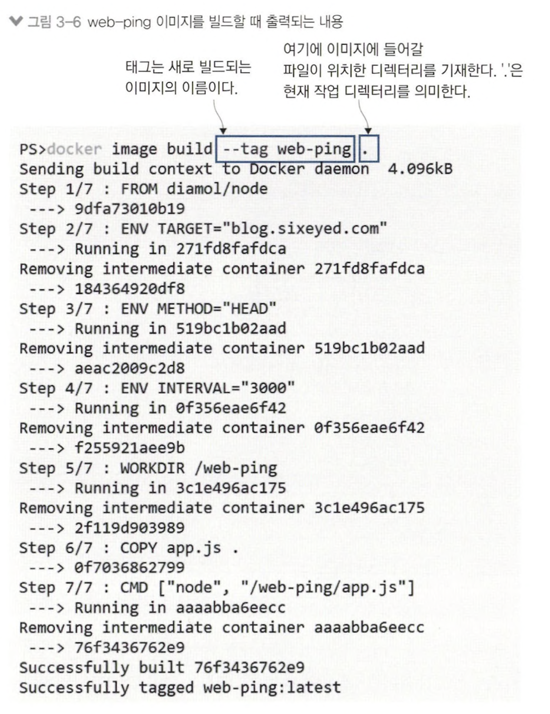
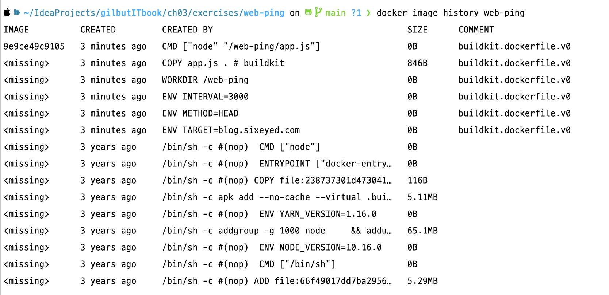

# 3장 도커 이미지 만들기

## 3.1 도커 허브에 공유된 이미지 사용하기

<table>
<tr>
<td align="center">동작</td><td align="center">명령어</td><td align="center">결과</td>
</tr>
<tr>
<td>
pull web-ping application image 
</td>
<td>

```shell
docker image pull diamol/ch03-web-ping
```
</td>
<td>

</td>
</tr>
<tr>
<td>
이미지로 컨테이너 실행 후 기능 확인
</td>
<td>

```shell
docker container run -d --name web-ping diamol/ch03-web-ping
```
</td>
<td>

</td>
</tr>
<tr>
<td>
도커를 통해 수집한 application log 확인
</td>
<td>

```shell
docker container logs web-ping
```
</td>
<td>

</td>
</tr>
<tr>
<td>
실행중인 컨테이너 삭제 후 환경변수 TARGET 값을 지정하여 새로운 컨테이너 실행
</td>
<td>

```shell
docker rm -f web-ping
docker container run --env TARGET=google.com diamol/ch03-web-ping
```
</td>
<td>

</td>
</tr>
</table>

## 3.2 Dockerfile 작성하기

> Dockerfile이란 애플리케이션을 패키징하기 위한 스크립트

```shell
FROM diamol/node

ENV TARGET="blog.sixeyed.com"
ENV METHOD="HEAD"
ENV INTERVAL="3000"

WORKDIR /web-ping
COPY app.js .

CMD ["node", "/web-ping/app.js"]
```

> web-ping application을 packaging 하는 전체 Dockerfile 스크립트

- `FROM` : diamol/node 이미지를 시작점으로 지정, 해당 이미지 내 web-ping application runtime Node.js 설치
- `ENV` : 환경 변수 설정
- `WORKDIR` : 컨테이너 이미지 파일 시스템에 디렉터리 생성 후 작업 디렉터리로 지정
- `CMD` : 도커가 이미지로부터 컨테이너를 실행했을 때 실행할 명령을 지정하는 명령어 &rarr; Node.js 런타임이 app.js 실행

## 3.3 컨테이너 이미지 빌드하기

<table>
<tr>
<td align="center">동작</td><td align="center">명령어</td><td align="center">결과</td>
</tr>
<tr>
<td>
Dockerfile 스크립트를 이미지로 빌드
</td>
<td>

```shell
# --tag = 이미지 이름
# . = 현재 작업 디렉토리
docker image build --tag web-ping .
```
</td>
<td>

</td>
</tr>
<tr>
<td>
'w'로 시작하는 태그명 가진 이미지 목록 조회
</td>
<td>

```shell
docker image ls 'w*'
```
</td>
<td>

</td>
</tr>
<tr>
<td>
컨테이너를 실행해 도커 웹 사이트에 5초마다 요청
</td>
<td>

```shell
docker container run -e TARGET=docker.com -e INTERVAL=5000 web-ping
```
</td>
<td>

</td>
</tr>
</table>

## 3.4 도커 이미지와 이미지 레이어 이해하기

> `instruction : image layer` = `1 : 1`


- docker image는 image layer가 모인 논리적 대상
- layer = docker engine 캐시 내 물리적으로 저장된 파일
- image layer &rarr; 여러 이미지와 컨테이너에서 공유
- Node.js 애플리케이션이 실행되는 컨테이너 여러개 실행하면 Node.js 들어있는 이미지 레이어 공유

<table>
<tr>
<td align="center">동작</td><td align="center">명령어</td><td align="center">결과</td>
</tr>
<tr>
<td>
web-ping 이미지 히스토리 확인
</td>
<td>

```shell
docker image history web-ping
```
</td>
<td>

</td>
</tr>
<tr>
<td>
이미지 정보 확인
</td>
<td>

```shell
docker image ls
```
</td>
<td>

</td>
</tr>
<tr>
<td>
이미지 저장에 실제 사용된 디스크 용량 확인
</td>
<td>

```shell
docker system df
```
</td>
<td>

</td>
</tr>
</table>

- image layer를 공유하여 실제 디스크 용량 절약

## 3.5 이미지 레이어 캐시를 이용한 Dockerfile 스크립트 최적화

<table>
<tr>
<td align="center">AS-IS</td><td align="center">TO-BE</td>
</tr>
<tr>
<td>

```shell
FROM diamol/node

ENV TARGET="blog.sixeyed.com"
ENV METHOD="HEAD"
ENV INTERVAL="3000"

WORKDIR /web-ping
COPY app.js .

CMD ["node", "/web-ping/app.js"]
```
</td>
<td>

```shell
FROM diamol/node

CMD ["node", "/web-ping/app.js"]

ENV TARGET="blog.sixeyed.com" \
    METHOD="HEAD" \
    INTERVAL="3000"

WORKDIR /web-ping
COPY app.js .
```
</td>
</tr>
</table>

<table>
<tr>
<td align="center">동작</td><td align="center">명령어</td><td align="center">결과</td>
</tr>
<tr>
<td>
새로운 버전의 도커 이미지 빌드
</td>
<td>

```shell
docker image build -t web-ping:v2 .
```
</td>
<td>

</td>
</tr>
<tr>
<td>
web-ping-optimized 디렉토리로 이동하여 새로운 스크립트로 이미지 다시 빌드
</td>
<td>

```shell
cd ../web-ping-optimized
docker image build -t web-ping:v3 .
```
</td>
<td>

</td>
</tr>
</table>

## 3.6 연습 문제

> `/diamol/ch03.txt` 파일에 이름 추가한 뒤 수정된 파일을 포함하는 새로운 이미지 빌드. 단, Dockerfile 스크립트 사용 x

