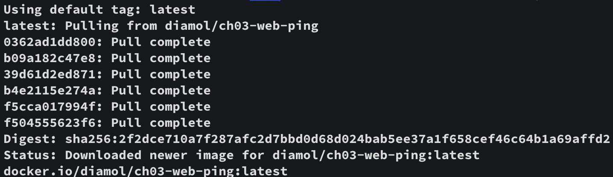
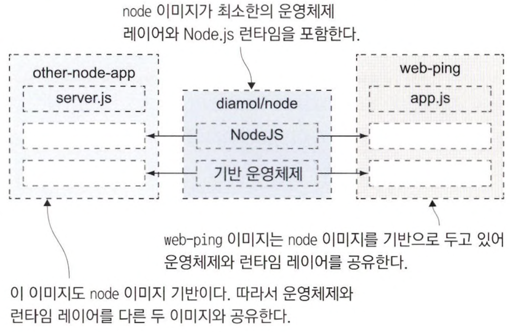

# 3장 도커 이미지 만들기

## 3.1 도커 허브에 공유된 이미지 사용하기

web-ping이라는 간단한 애플리케이션을 다룬다. 컨테이너에서 실행돼 지정된 URL에 HTTP 요청을 3초마다 보내는 동작을 컨테이너가 종료될 때까지 반복한다.

📌 web-ping 애플리케이션의 컨테이너 이미지 내려받는다.

```
$ docker image pull diamol/ch03-web-ping
```

이 이미지는 도커가 가장 먼저 이미지를 찾기 위해 접근하는 저장소인 `도커 허브`에 저장돼 있다.

도커 이미지는 논리적으로는 하나의 대상이다. 이미지를 내려받는 과정을 보면 여러 건의 파일을 동시에 내려받는다는 점에서 단일 파일을 내려받는 과정이 아니라는 것을 알 수 있다.

이들 각각의 파일을 `이미지 레이어`라고 부른다.

도커 이미지는 물리적으로는 `여러 개의 작은 파일`로 구성돼 있다. 모든 레이어를 내려받고 나면 전체 이미지를 사용할 수 있게 된다.



📌 web-ping 애플리케이션을 실행한다.

```
$ docker container run -d --name web-ping diamol/ch03-web-ping
```

📌 애플리케이션 로그를 살펴본다.

```
$ docker container logs web-ping
** web-ping ** Pinging: blog.sixeyed.com; method: HEAD; 3000ms intervals
Making request number: 1; at 1685293072227
Got response status: 200 at 1685293073417; duration: 1190ms
Making request number: 2; at 1685293075228
Got response status: 200 at 1685293076351; duration: 1123ms
Making request number: 3; at 1685293078231
Got response status: 200 at 1685293079138; duration: 907ms
Making request number: 4; at 1685293081232
Got response status: 200 at 1685293082257; duration: 1025ms
Making request number: 5; at 1685293084234
Got response status: 200 at 1685293085267; duration: 1033ms
```

---

### 환경 변수를 지정해 애플리케이션 요청 대상 변경하기

애플리케이션에서 대상 URL과 요청 간격, 요청 타입 등을 설정할 수 있다. 시스템의 환경 변수 값에서 설정 값을 읽어 온다.

`환경 변수` 는 운영체제에서 제공하는 키-값 쌍이다. 도커 컨테이너도 별도의 환경 변수를 지정할 수 있다.

web-ping 이미지에도 이 환경 변수의 기본값이 포함돼 있다. 컨테이너를 생성할 때 기본값과 다른 값을 환경 변수로 설정할 수 있다.

📌 컨테이너에 환경 변수 지정한다.

```
$ docker rm -f web-ping
$ docker container run --env TARGET=google.com diamol/ch03-web-ping
** web-ping ** Pinging: google.com; method: HEAD; 3000ms intervals
Making request number: 1; at 1685293450950
Got response status: 301 at 1685293451268; duration: 318ms
Making request number: 2; at 1685293453956
Got response status: 301 at 1685293454167; duration: 211ms
Making request number: 3; at 1685293456963
Got response status: 301 at 1685293457206; duration: 243ms
```

```
💡 도커 이미지는 설정값의 기본값을 포함해 패키징되지만, 컨테이너를 실행할 때 이 설정값을 바꿀 수 있어야 한다.
```

---

## 3.2 Dockerfile 작성하기

Dockerfile은 애플리케이션을 패키징하기 위한 간단한 스크립트다.

Dockerfile은 일련의 인스트럭션으로 구성돼 있는데, 인스트럭션을 실행한 결과로 도커 이미지가 만들어진다.

```
FROM diamol/node

ENV TARGET="blog.sixeyed.com"
ENV METHOD="HEAD"
ENV INTERVAL="3000"

WORKDIR /web-ping
COPY app.js .

CMD ["node", "/web-ping/app.js"]
```

- FROM
    - 기본 이미지를 지정하는 인스트럭션
- ENV
    - 환경 변수 값을 지정하기 위한 인스트럭션
    - [key] = “[value]”
- WORKDIR
    - 컨테이너 이미지 파일 시스템에 디렉터리를 만들고, 해당 디렉터리를 작업 디렉터리로 지정하는 인스트럭션
- COPY
    - 로컬 파일 시스템의 파일 혹은 디렉터리를 컨테이너 이미지로 복사하는 인스트럭션
    - [원본 경로] [복사 경로]
- CMD
    - 도커가 이미지로부터 컨테이너를 실행했을 때 실행할 명령을 지정하는 인스트럭션

---

## 3.3 컨테이너 이미지 빌드하기

📌 Dockerfile 스크립트로 이미지를 빌드한다.

```
$ docker image build --tag web-ping .
[+] Building 4.0s (9/9) FINISHED
 => [internal] load build definition from Dockerfile                                                                                                     0.0s
 => => transferring dockerfile: 196B                                                                                                                     0.0s
 => [internal] load .dockerignore                                                                                                                        0.0s
 => => transferring context: 2B                                                                                                                          0.0s
 => [internal] load metadata for docker.io/diamol/node:latest                                                                                            3.9s
 => [auth] diamol/node:pull token for registry-1.docker.io                                                                                               0.0s
 => [internal] load build context                                                                                                                        0.0s
 => => transferring context: 881B                                                                                                                        0.0s
 => [1/3] FROM docker.io/diamol/node@sha256:dfee522acebdfdd9964aa9c88ebebd03a20b6dd573908347be3ebf52ac4879c8                                             0.0s
 => => resolve docker.io/diamol/node@sha256:dfee522acebdfdd9964aa9c88ebebd03a20b6dd573908347be3ebf52ac4879c8                                             0.0s
 => => sha256:dfee522acebdfdd9964aa9c88ebebd03a20b6dd573908347be3ebf52ac4879c8 1.41kB / 1.41kB                                                           0.0s
 => => sha256:6467efe6481aace0c317f144079c1a321b91375a828dbdb59b363a2aef78b33b 1.16kB / 1.16kB                                                           0.0s
 => => sha256:8e0eeb0a11b3a91cc1d91b5ef637edd153a64a3792e08a3f8d0702ec4f01a9e7 5.66kB / 5.66kB                                                           0.0s
 => [2/3] WORKDIR /web-ping                                                                                                                              0.0s
 => [3/3] COPY app.js .                                                                                                                                  0.0s
 => exporting to image                                                                                                                                   0.0s
 => => exporting layers                                                                                                                                  0.0s
 => => writing image sha256:6e2f56b0d7ee704c6cdd2b7197d78aebe656c8fae4164472a4f7250833e523ad                                                             0.0s
 => => naming to docker.io/library/web-ping
```

📌 ’w’로 시작하는 태그명을 가진 이미지 목록을 확인한다.

```
docker image ls 'w*'
REPOSITORY   TAG       IMAGE ID       CREATED              SIZE
web-ping     latest    6e2f56b0d7ee   About a minute ago   75.5MB
```

📌 이미지로 부터 컨테이너를 실행한다.

```
$ docker container run -e TARGET=docker.com -e INTERVAL=5000 web-ping
** web-ping ** Pinging: docker.com; method: HEAD; 5000ms intervals
Making request number: 1; at 1685294348081
Got response status: 403 at 1685294348219; duration: 138ms
```

---

## 3.4 도커 이미지와 이미지 레이어 이해하기

도커 이미지에는 우리가 패키징에 포함한 모든 파일이 들어 있다. 이들 파일은 나중에 컨테이너의 파일 시스템을 형성한다. 이외에도 이미지에는 자신에 대한 여러 메타데이터 정보도 들어 있다.

이 정보를 이용하면 이미지를 구성하는 각 레이어는 무엇이고 이들 레이어가 어떤 명령으로 빌드됐는지 알 수 있다.

📌 web-ping 이미지의 히스토리를 확인한다.

```
$ docker image history web-ping
IMAGE          CREATED         CREATED BY                                      SIZE      COMMENT
6e2f56b0d7ee   7 minutes ago   CMD ["node" "/web-ping/app.js"]                 0B        buildkit.dockerfile.v0
<missing>      7 minutes ago   COPY app.js . # buildkit                        846B      buildkit.dockerfile.v0
<missing>      7 minutes ago   WORKDIR /web-ping                               0B        buildkit.dockerfile.v0
<missing>      7 minutes ago   ENV INTERVAL=3000                               0B        buildkit.dockerfile.v0
<missing>      7 minutes ago   ENV METHOD=HEAD                                 0B        buildkit.dockerfile.v0
<missing>      7 minutes ago   ENV TARGET=blog.sixeyed.com                     0B        buildkit.dockerfile.v0
<missing>      3 years ago     /bin/sh -c #(nop)  CMD ["node"]                 0B
<missing>      3 years ago     /bin/sh -c #(nop)  ENTRYPOINT ["docker-entry…   0B
<missing>      3 years ago     /bin/sh -c #(nop) COPY file:238737301d473041…   116B
<missing>      3 years ago     /bin/sh -c apk add --no-cache --virtual .bui…   5.11MB
<missing>      3 years ago     /bin/sh -c #(nop)  ENV YARN_VERSION=1.16.0      0B
<missing>      3 years ago     /bin/sh -c addgroup -g 1000 node     && addu…   65.1MB
<missing>      3 years ago     /bin/sh -c #(nop)  ENV NODE_VERSION=10.16.0     0B
<missing>      3 years ago     /bin/sh -c #(nop)  CMD ["/bin/sh"]              0B
<missing>      3 years ago     /bin/sh -c #(nop) ADD file:66f49017dd7ba2956…   5.29MB
```

`CREATED BY` 항목은 해당 레이어를 구성한 Dockerfile 스크립트의 인스트럭션이다.

Dockerfile 인스트럭션과 이미지 레이어는 1:1 관계를 가진다.

---

도커 이미지는 이미지 레이어가 모인 논리적 대상이다. 레이어는 도커 엔진의 캐시에 물리적으로 저장된 파일이다.

이미지 레이어는 여러 이미지와 컨테이너에서 공유된다.



📌 각 이미지의 용량을 확인한다.

```
$ docker image ls
```

📌 이미지 저장에 실제 사용된 디스크 용량을 확인 한다.

```
$ docker system df
```

실제 사용된 디스크 용량과 각 이미지의 용량의 차이는 `이미지간 레이어 공유`로 절약된 디스크 공간을 의미한다.

이렇게 절약되는 디스크 공간은 대개 런타임 등 같은 기반 레이어를 공유하는 애플리케이션의 숫자가 많을 수록 더욱 늘어난다.

```
💡 이미지 레이어를 여러 이미지가 공유한다면, 공유되는 레이어는 수정할 수 없어야한다.
```

만약 이미지의 레이어를 수정할 수 있다면, 그 수정이 레이어를 공유하는 다른 이미지에도 영향을 미치게 된다. 도커는 이미지 레이어를 읽기 전용으로 만들어 두어 이런 문제를 방지한다.

---

## 3.5 이미지 레이어 캐시를 이용한 Dockerfile 스크립트 최적화

앞서 빌드한 web-ping 이미지에는 애플리케이션이 구현된 자바스크립트 파일이 들어있다.

이 파일을 수정하고 이미지를 다시 빌드하면, 새로운 이미지 레이어가 생긴다.

도커의 이미지 레이어가 특정한 순서대로만 배치된다고 가정한다. 그래서 이 순서 중간에 있는 레이어가 변경되면 변경된 레이어보다 위에 오는 레이어를 재사용할 수가 없다.

```
$ docker image build -t web-ping:v2 .
[+] Building 2.8s (9/9) FINISHED
 => [internal] load build definition from Dockerfile                                                                                                     0.0s
 => => transferring dockerfile: 196B                                                                                                                     0.0s
 => [internal] load .dockerignore                                                                                                                        0.0s
 => => transferring context: 2B                                                                                                                          0.0s
 => [internal] load metadata for docker.io/diamol/node:latest                                                                                            2.7s
 => [auth] diamol/node:pull token for registry-1.docker.io                                                                                               0.0s
 => [1/3] FROM docker.io/diamol/node@sha256:dfee522acebdfdd9964aa9c88ebebd03a20b6dd573908347be3ebf52ac4879c8                                             0.0s
 => [internal] load build context                                                                                                                        0.0s
 => => transferring context: 883B                                                                                                                        0.0s
 => CACHED [2/3] WORKDIR /web-ping                                                                                                                       0.0s
 => [3/3] COPY app.js .                                                                                                                                  0.0s
 => exporting to image                                                                                                                                   0.0s
 => => exporting layers                                                                                                                                  0.0s
 => => writing image sha256:7168408f404b300f8e4598a2562f101e6077f44c2d4e2133693d5e046fe78f79                                                             0.0s
 => => naming to docker.io/library/web-ping:v2                                                                                                           0.0s
```

[2/3]까지는 기존 캐시를 사용하였지만, [3/3]은 새로운 레이어가 만들어졌다.

```
💡 Dockerfile 스크립트의 인스트럭션은 각각 하나의 이미지 레이어와 1:1로 연결된다. 
   그러나 인스트럭션의 결과가 이전 빌드와 같다면, 이전에 캐시된 레어이를 사용한다.
```

도커는 캐시에 일치하는 레이어가 있는지 확인하기 위해 `해시값`을 이용한다. 

해시값을 Dockerfile 스크립트의 인스트럭션과 인스트럭션에 의해 복사되는 파일의 내용으로 부터 계산되는데, 기존 이미지 레이어에 해시값이 일치하는 것이 없다면 `캐시 미스`가 발생하고 해당 인스트럭션이 실행된다. 

한 번 인스트럭션이 실행되면 그 다음에 오는 인스트럭션은 수정된 것이 없더라도 모두 실행된다.

이러한 이유로 다음을 주의해야 한다.

```
💡 Dockerfile 스크립트의 인스트럭션은 잘 수정하지 않는 인스트럭션이 앞으로 오고 자주 수정되는 인스트럭션이 뒤에 오도록 배치돼야 한다.
```

이렇게 해야 캐시에 저장된 이미지 레이어를 되도록 많이 재사용할 수 있다. 이미지를 공유하는 과정에서 시간, 디스크 용량, 네트워크 대역폭을 모두 절약할 수 있다.

📌 web-ping 이미지의 Dockerfile 스크립트를 최적화한 결과

```
FROM diamol/node

CMD ["node", "/web-ping/app.js"]

ENV TARGET="blog.sixeyed.com" \
    METHOD="HEAD" \
    INTERVAL="3000"

WORKDIR /web-ping
COPY app.js .
```

1. CMD 인스트럭션은 스크립트 마지막에 위치할 필요가 없다.
2. ENV 인스트럭션 하나로 여러 개의 환경 변수를 정의할 수 있다.

---

## 3.6 연습 문제

```
Dockerfile 스크립트 없이 도커 이미지를 만든다.
1. 도커 허브에 공유된 diamol/ch03-lab 이미지를 사용한다.
2. /diamol/ch03.txt 파일 뒤에 이름을 추가한다.
3. 수정된 파일을 포함하는 새로운 이미지를 빌드한다.
```

```
1. docker image pull diamol/ch03-lab

2. docker container run -it --name ch03-lab diamol/ch03-lab
/diamol # ls
ch03.txt
/diamol # echo "chaewon" >> ch03.txt
/diamol # cat ch03.txt
Lab solution, by: chaewon
/diamol # exit

3. docker container commit ch03-lab ch03-lab-cwlee

4. docker container run ch03-lab-cwlee cat /diamol/ch03.txt
Lab solution, by: chaewon
```
