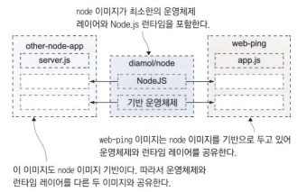

# 3.1 도커 허브에 공유된 이미지 사용하기

```shell
docker image pull diamol/ch03-web-ping
```

- 도커 이미지를 pull 받을 수 있습니다.

- 위 도커 이미지를 pull 받으면 도커 허브에 접근하여 내려받습니다. 내려받는 과정을 보면 여러 건의 파일을 동시에 내려받습니다. 각각이 레이어라고 부르며 이 레이어를 조립하여 컨테이너 내부 파일 시스템을 만듭니다.

```shell
docker container run --detach --name web-ping diamol/ch03-web-ping
    or
docker run -d --name web-ping diamol/ch03-web-ping
```

- 방금 받은 이미지를 실행하는 명령어입니다. name은 컨테이너의 원하는 이름을 지정합니다.

```shell
docker container run --env TARGET=google.com diamol/ch03-web-ping
    or
docker run -e TARGET=google.com diamol/ch03-web-ping
```

- 환경변수를 두어 다르게 동작하게 할 수 있습니다.

## 3.2 Dockerfile 작성하기

    Dockerfile은 애플리케이션을 패키징하기 위한 간단한 스크립트입니다.
    일련의 인스트럭션으로 구성되며, 표준 쉘 문법도 사용가능합니다.

## 3.3 컨테이너 이미지 빌드하기

```shell
docker image build --tag web-ping .
```

- 도커 이미지를 빌드합니다.

```shell
docker image ls 'w*'
```

- 도커 이미지가 빌드되었는지 확인합니다.

```shell
docker run -e TARGET=docker.com -e INTERVAL=5000  diamol/ch03-web-ping
```

- 빌드한 이미지를 docker.com 으로 5초 간격 핑을 날립니다.

## 3.4 도커 이미지와 이미지 레이어 이해하기

```shell
docker image history web-ping
```

- 이미지 히스토리를 확인할수 있습니다.

### 이미지 레이어



- Node.js 이미지를 레이어를 공유할 수 있습니다. 이는 Node.js 와 그에 필요한 리눅스기 운영체제를 공유하기에 디스크 측면에서 매우 활용적입니다. 따라서 공유하는 이미지를 함부로 수정하지 못하게 readonly 로 설정하여 방지하여야합니다.

```shell
docker image ls
```

- 이미지 리스트를 확인할 수 있습니다.

```shell
docker system df
```

- 도커 시스템의 물리적 용량을 확인할 수 있습니다.

## 3.5 이미지 레이러 캐시를 이용한 Dockerfile 스크립트 최적화

- 일부 내용을 수정하고 다른 이름으로 빌드하면 캐시된 레이어가 재실행되면서 인스트럭션을 다시 실행하는 낭비를 줄일 수 있습니다.

- 인스트럭션 6단계가 수정되어 다시 실행된다면 이후 7단계 부터는 수정이 없더라도 다시 실행되게 됩니다. 그렇기에 수정이 적은 인스트럭션을 앞에 배치해야 캐시를 잘 이용할 수 있습니다.
