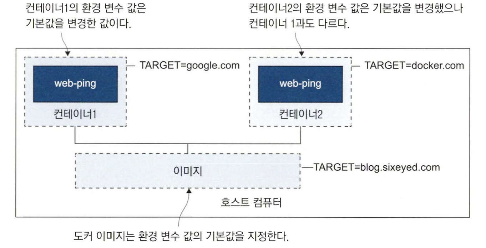
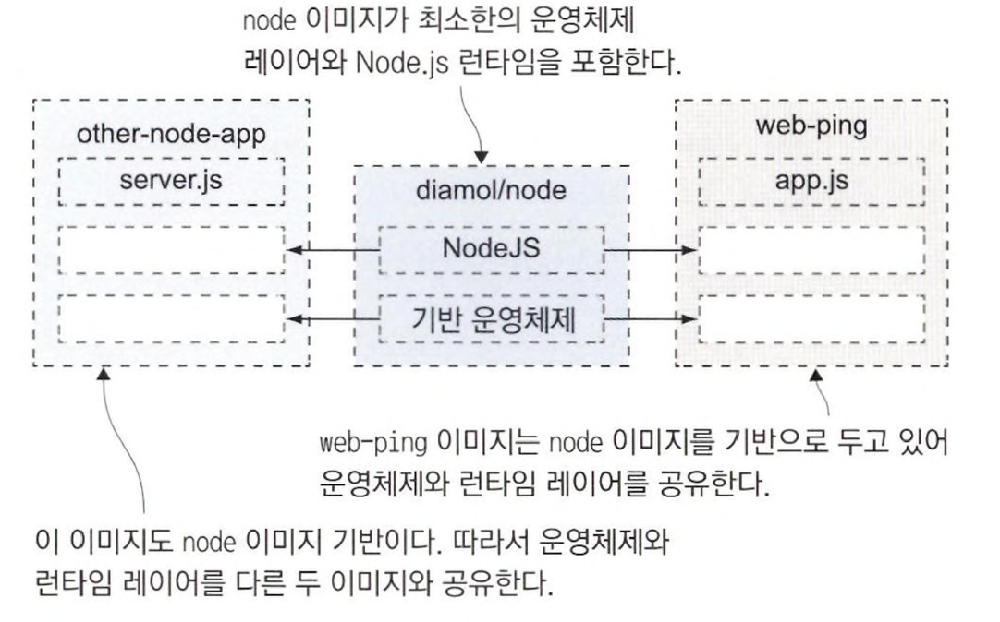
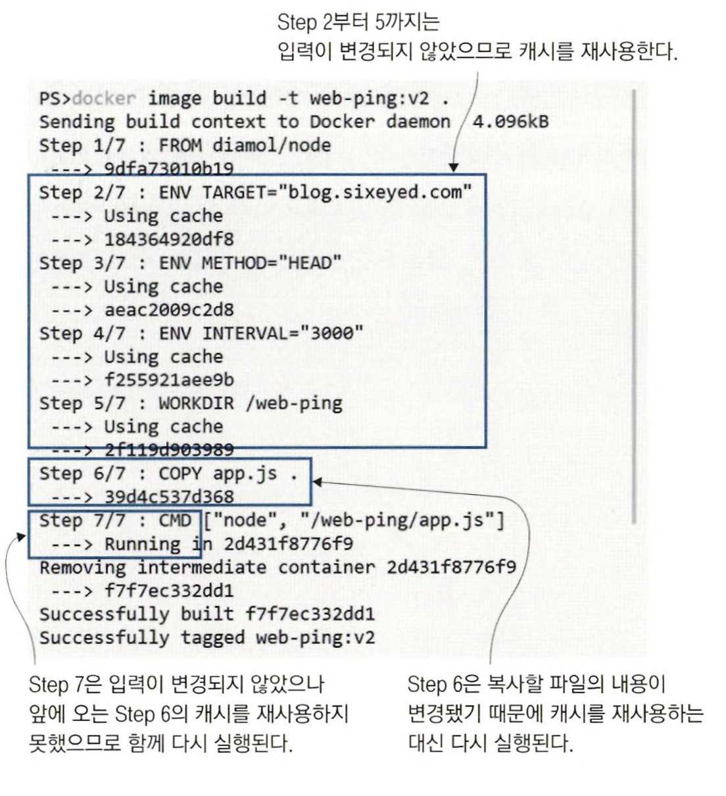

# 도커 허브에 공유된 이미지 사용하기

docker container run 명령어를 이용해 필요한 이미지 중 로컬 컴퓨터에 없는 이미지가 있으면 내려받을 수 있다. <br>
이는 소프트웨어 배포 기능이 도커 플랫폼에 완전히 내장되어 있기 때문에 가능하다.

이미지를 내려받는 과정을 도커에게 맡길 수도 있지만, 도커 CLI를 통해 명시적으로 이미지를 내려받을 수도 있다.

```
docker image pull diamol/ch03-web-ping

// 실행 결과
Using default tag: latest
latest: Pulling from diamol/ch03-web-ping
0362ad1dd800: Pull complete
b09a182c47e8: Pull complete
39d61d2ed871: Pull complete
b4e2115e274a: Pull complete
f5cca017994f: Pull complete
f504555623f6: Pull complete
Digest: sha256:2f2dce710a7f287afc2d7bbd0d68d024bab5ee37a1f658cef46c64b1a69affd2
Status: Downloaded newer image for diamol/ch03-web-ping:latest
docker.io/diamol/ch03-web-ping:latest
```

이 이미지는 도커가 가장 이미지를 찾기 위해 접근하는 도커 허브에 저장되어 있다. <br>
이미지를 제공하는 저장소를 **레지스트리**라고 하고, 도커 허브는 무료로 제공되는 공개 레지스트리이다.

docker image pull 명령어의 결과로 이미지가 저장된 방식을 짐작할 수 있다. <br>
도커 이미지는 논리적으로 하나의 대상(애플리케이션 스택 전체가 하나의 파일로 압축된 압축 파일) 이다. <br>
이미지를 내려받을 때 여러 건의 파일을 동시에 받는데, 이들 각각의 파일을 **이미지 레이어**라고 부른다. <br>
도커 이미지는 물리적으로는 여러 개의 작은 파일로 구성되어 있고, 도커가 이들 파일을 조립해 컨테이너의 내부 파일 시스템을 만든다.

<br>

```
// 내려받은 이미지 실행
docker container run -d --name web-ping diamol/ch03-web-ping
```

> -d 플래그는 --detach의 축약형이다.

> --name 플래그를 사용하면 컨테이너에 원하는 이름을 붙이고 이 이름으로 컨테이너를 지칭할 수 있다.

<br>

```
docker container logs web-ping

// 실행 결과
** web-ping ** Pinging: blog.sixeyed.com; method: HEAD; 3000ms intervals
Making request number: 1; at 1684668608191
Got response status: 200 at 1684668609462; duration: 1271ms
Making request number: 2; at 1684668611196
Got response status: 200 at 1684668612092; duration: 896ms
Making request number: 3; at 1684668614197
Got response status: 200 at 1684668615419; duration: 1222ms
Making request number: 4; at 1684668617204
Got response status: 200 at 1684668618264; duration: 1060ms
Making request number: 5; at 1684668620209
```

logs 명령어를 이용해 로그를 볼 수 있다. <br>
애플리케이션이 blog.sixeyed.com으로 HTTP 요청을 반복적으로 보내고 있다.

애플리케이션에서는 대상 URL, 요청 간격, 요청 타입을 시스템의 **환경 변수** 값에서 설정 값을 읽어 온다. <br>
**환경 변수**는 운영체제에서 제공하는 key-value 쌍이다. <br>
도커 컨테이너도 이 환경 변수를 가질 수 있고, 컨테이너의 호스트명이나 IP 주소처럼 도커가 부여해준다.

<br>

```
docker rm -f web-ping
docker container run --env TARGET=google.com diamol/ch03-web-ping

// 실행 결과
** web-ping ** Pinging: google.com; method: HEAD; 3000ms intervals
Making request number: 1; at 1684669054869
Got response status: 301 at 1684669055158; duration: 289ms
Making request number: 2; at 1684669057870
Got response status: 301 at 1684669058081; duration: 211ms
Making request number: 3; at 1684669060879
```

컨테이너를 내린 후 다른 방식으로 새로 실행했다.

--detach 플래그가 없으므로 애플리케이션 출력 내용이 콘솔에 나온다. <br>
그리고 HTTP 요청을 보내는 대상이 `blog.sixeyed.com` -> `google.com`으로 변경됐다. <br>

web-ping 애플리케이션의 코드는 TARGET이라는 이름의 환경 변수를 가지는데, 이미지에는 이 환경 변수 값이 `blog.sixeyed.com`였지만 <br>
--env 플래그로 다른 값을 지정할 수 있다.

> 호스트 컴퓨터에도 고유의 환경 변수가 있지만, 이는 컨테이너의 환경 변수와 별개다. <br>
> 컨테이너는 도커가 부여한 환경 변수만을 갖는다.



<br>
<hr>

# Dockerfile 작성하기

Dockerfile은 애플리케이션을 패키징하기 위한 스크립트이다. <br>
인스트럭션으로 구성되어 있고, 인스트럭션을 실행한 결과로 도커 이미지가 만들어진다. 

<br>

```
FROM diamol/node

ENV TARGET="blog.sixeyed.com" 
ENV METHOD="HEAD"
ENV INTERVAL="3000"

WORKDIR /web-ping
COPY app.js .
 
CMD ["node", "/web-ping/app.js"]
```

- **FROM**: 이 이미지는 diamol/node 이미지를 시작 이미지로 지정했다. (diamol/node 이미지에는 web-ping 애플리케이션을 실행하는데 필요한 Node.js가 설치되어 있다)
- **ENV**: 환경 변수 값을 지정하기 위한 인스트럭션. key-value 형식을 따른다.
- **WORKDIR**: 컨테이너 이미지 파일 시스템이 디렉토리를 만들고, 해당 디렉토리를 작업 디렉토리로 지정.
- **COPY**: 로컬 파일 시스템의 파일, 디렉토리를 컨테이너 이미지로 복사하는 인스트럭션. [원본경로][복사경로] 형식으로 지정한다.
- **CMD**: 도커가 이미지로부터 컨테이너를 실행했을 때 실행할 명령어를 지정.

<br>
<hr>

# 컨테이너 이미지 빌드하기

이미지를 빌드하려면 Dockerfile 외에 몇 가지 더 필요하다. <br>
이미지의 이름, 패키징에 필요한 파일의 경로를 추가로 지정해야 한다.

```
docker image build --tag web-ping .

// 실행 결과
[+] Building 2.9s (8/8) FINISHED
 => [internal] load build definition from Dockerfile                                                                                                       0.0s
 => => transferring dockerfile: 243B                                                                                                                       0.0s
 => [internal] load .dockerignore                                                                                                                          0.0s
 => => transferring context: 2B                                                                                                                            0.0s
 => [internal] load metadata for docker.io/diamol/node:latest                                                                                              2.7s
 => [1/3] FROM docker.io/diamol/node@sha256:dfee522acebdfdd9964aa9c88ebebd03a20b6dd573908347be3ebf52ac4879c8                                               0.1s
 => => resolve docker.io/diamol/node@sha256:dfee522acebdfdd9964aa9c88ebebd03a20b6dd573908347be3ebf52ac4879c8                                               0.0s
 => => sha256:6467efe6481aace0c317f144079c1a321b91375a828dbdb59b363a2aef78b33b 1.16kB / 1.16kB                                                             0.0s
 => => sha256:8e0eeb0a11b3a91cc1d91b5ef637edd153a64a3792e08a3f8d0702ec4f01a9e7 5.66kB / 5.66kB                                                             0.0s
 => => sha256:dfee522acebdfdd9964aa9c88ebebd03a20b6dd573908347be3ebf52ac4879c8 1.41kB / 1.41kB                                                             0.0s
 => [internal] load build context                                                                                                                          0.0s
 => => transferring context: 928B                                                                                                                          0.0s
 => [2/3] WORKDIR /web-ping                                                                                                                                0.0s
 => [3/3] COPY app.js .                                                                                                                                    0.0s
 => exporting to image                                                                                                                                     0.0s
 => => exporting layers                                                                                                                                    0.0s
 => => writing image sha256:4f0d1b684a7211b687695e1bf5632ea36b955e089f49770b8ab2d5cfc78c8bd8                                                               0.0s
 => => naming to docker.io/library/web-ping
```

Dockerfile과 app.js가 존재하는 디렉토리에서 위 명령어를 실행해서 이미지를 빌드했다.

<br>

```
docker image ls 'w*'

// 실행 결과
REPOSITORY   TAG       IMAGE ID       CREATED         SIZE
web-ping     latest    4f0d1b684a72   3 minutes ago   75.5MB
```

빌드된 이미지를 확인했다. <br>
이 이미지는 도커 허브에서 내려받은 이미지와 똑같이 사용할 수 있다.

<br>

```
// 컨테이너 실행
docker container run  web-ping

// 실행 결과
** web-ping ** Pinging: blog.sixeyed.com; method: HEAD; 3000ms intervals
Making request number: 1; at 1685154549834
Got response status: 200 at 1685154551159; duration: 1325ms
Making request number: 2; at 1685154552841
```

```
// 환경 변수를 지정해 실행
docker container run -e TARGET=docker.com -e INTERVAL=5000 web-ping

// 실행 결과
** web-ping ** Pinging: docker.com; method: HEAD; 5000ms intervals
Making request number: 1; at 1685154439393
Got response status: 403 at 1685154439506; duration: 113ms
Making request number: 2; at 1685154444400
Got response status: 403 at 1685154444489; duration: 89ms
Making request number: 3; at 1685154449407
Got response status: 403 at 1685154449474; duration: 67ms
```

<br>
<hr>

# 도커 이미지와 이미지 레이어

도커 이미지에는 우리가 패키징에 포함한 모든 파일이 들어 있다. <br> 
이 파일들은 컨테이너의 파일 시스템을 형성한다. 

이 외에도 이미지에는 자신에 대한 여러 메타데이터 정보도 들어있다. <br>
이 정보 중에는 이미지가 어떻게 빌드됐는지에 대한 이력도 들어있어, 이미지를 구성하는 레이어가 무엇이고 어떤 명령어로 레이어가 빌드됐는지 알 수 있다.

<br>

```
docker image history web-ping

// 실행 결과
IMAGE          CREATED          CREATED BY                                      SIZE      COMMENT
4f0d1b684a72   20 minutes ago   CMD ["node" "/web-ping/app.js"]                 0B        buildkit.dockerfile.v0
<missing>      20 minutes ago   COPY app.js . # buildkit                        846B      buildkit.dockerfile.v0
<missing>      20 minutes ago   WORKDIR /web-ping                               0B        buildkit.dockerfile.v0
<missing>      20 minutes ago   ENV INTERVAL=3000                               0B        buildkit.dockerfile.v0
<missing>      20 minutes ago   ENV METHOD=HEAD                                 0B        buildkit.dockerfile.v0
<missing>      20 minutes ago   ENV TARGET=blog.sixeyed.com                     0B        buildkit.dockerfile.v0
<missing>      3 years ago      /bin/sh -c #(nop)  CMD ["node"]                 0B
<missing>      3 years ago      /bin/sh -c #(nop)  ENTRYPOINT ["docker-entry…   0B
<missing>      3 years ago      /bin/sh -c #(nop) COPY file:238737301d473041…   116B
<missing>      3 years ago      /bin/sh -c apk add --no-cache --virtual .bui…   5.11MB
<missing>      3 years ago      /bin/sh -c #(nop)  ENV YARN_VERSION=1.16.0      0B
<missing>      3 years ago      /bin/sh -c addgroup -g 1000 node     && addu…   65.1MB
<missing>      3 years ago      /bin/sh -c #(nop)  ENV NODE_VERSION=10.16.0     0B
<missing>      3 years ago      /bin/sh -c #(nop)  CMD ["/bin/sh"]              0B
<missing>      3 years ago      /bin/sh -c #(nop) ADD file:66f49017dd7ba2956…   5.29MB
```

**CREATED BY**는 해당 레이어를 구성한 Dockerfile 스크립트의 인스트럭션이다. <br>
Dockerfile 인스트럭션과 이미지 레이어는 1:1이다.

**도커 이미지는 이미지 레이어가 모인 논리적 대상**이다. <br>
**레이어는 도커 엔진의 캐시에 물리적으로 저장된 파일**이다.

<br>



**이미지 레이어는 여러 이미지와 컨테이너에서 공유된다.**

이미지 레이어를 여러 이미지가 공유한다면, 공유되는 레이어는 수정될 수 없어야한다. <br>
도커는 이미지 레이어를 read-only로 만들고, 이미지를 빌드하면서 레이어가 만들어지면 레이어는 다른 이미지에서 재사용될 수 있다.

<br>
<hr>

# 이미지 레이어 캐시를 이용한 Dockerfile 최적화

파일을 수정하고 이미지를 다시 빌드하면, 새로운 이미지 레이어가 생긴다.

```
// app.js를 수정하고 새롭게 빌드
docker image build -t web-ping:v2 .
```



2 ~ 5 단계까지는 기존에 캐시된 레이어가 재사용됐고, 6 ~ 7 단계는 새로운 레이어가 만들어졌다. <br>
Dockerfile 스크립트의 인스트럭션은 각각 하나의 이미지 레이어와 1:1로 연결된다. <br>
그러나 인스트럭션의 결과가 이전 빌드와 같다면 이전에 캐시된 레이어를 재사용한다. 

> 도커는 캐시에 일치하는 레이어가 있는지 확인하기 위해 해시값을 이용한다.
> 해시값은 Dockerfile 스크립트의 인스트럭션과 인스트럭션에 의해 복사되는 파일의 내용으로부터 계산되는데, <br>
> 기존 이미지 레이어에 해시값이 일치하는 것이 없다면 캐시 미스가 발생하고 해당 인스트럭션이 실행된다. <br>
> 한번 인스트럭션이 실행 되면 그 다음에 오는 인스트럭션은 수정된 것이 없더라도 모두 실행된다.

app.js 파일이 수정되었으므로 6단계의 COPY 인스트럭션이 실제로 실행되고, 7단계인 CMD는 변경된 것이 없지만 함께 실행된다. <br>
Dockerfile 스크립트의 인스트럭션은 잘 수정하지 않는 인스트럭션이 앞으로 오고, 자주 수정되는 인스트럭션을 뒤에 배치해야 한다.

web-ping 이미지의 Dockerfile 인스트럭션 중 CMD 인스트럭션을 FROM 뒤로 옮긴다면, 개선이 가능하다. <br>
그리고 ENV 인스트럭션 하나로 여러 환경 변수를 정의할 수 있으므로, 3 개의 ENV 인스트럭션을 합칠 수 있다.

```
FROM diamol/node

CMD ["node", "/web-ping/app.js"]

ENV TARGET="blog.sixeyed,com" \ 
    METHOD="HEAD" \
    INTERVAL="3000"
    
WORKDIR /web-ping 
COPY app.js .
```

<br>
<hr>

# 연습 문제

```
docker container run -it --name exercise diamol/ch03-lab
cd /diamol/
vi ch03.txt
docker commit [container id] [image name]
```


