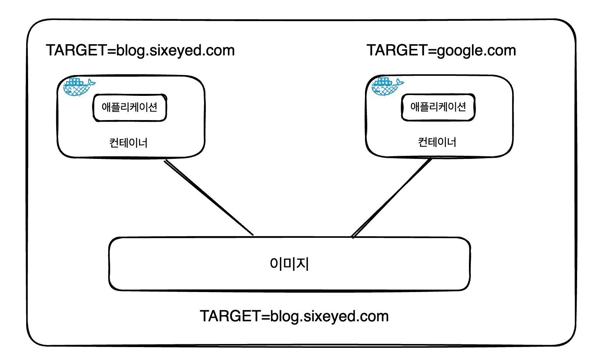
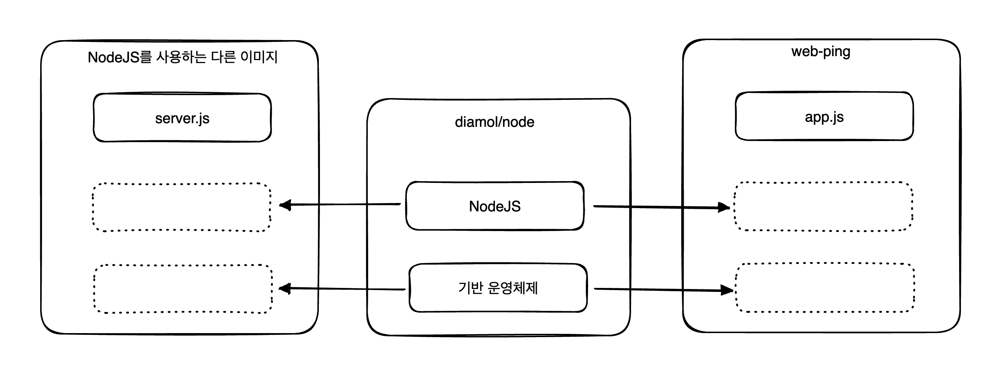

# 도커 이미지 만들기

### 도커 허브에 공유된 이미지 사용하기

다음 명령어를 이용하면 원하는 이미지를 내려받을 수 있습니다.

```bash
docker image pull {이미지 이름}
```

ch03-web-ping이라는 특정 주소로 ping 명령어로 통신이 되는지 확인하는 이미지를 받아봅시다.

다음과 같이 입력하면 ch03-web-ping이라는 이미지를 저장소에서 내려받을 수 있게 됩니다.

```bash
docker image pull diamol/ch03-web-ping
```

위의 명령어를 입력하면 다음과 같은 내용이 출력됩니다.

```bash
docker image pull diamol/ch03-web-ping

Using default tag: latest
latest: Pulling from diamol/ch03-web-ping
0362ad1dd800: Pull complete 
b09a182c47e8: Pull complete 
39d61d2ed871: Pull complete 
b4e2115e274a: Pull complete 
f5cca017994f: Pull complete 
f504555623f6: Pull complete 
Digest: sha256:2f2dce710a7f287afc2d7bbd0d68d024bab5ee37a1f658cef46c64b1a69affd2
Status: Downloaded newer image for diamol/ch03-web-ping:latest
docker.io/diamol/ch03-web-ping:latest
```

`docker image pull` 명령을 입력한 후 이미지가 존재하지 않을 경우 원격 레지스트리에서 이미지를 찾습니다.

기본 값으로는 도커 허브가 설정되어 있으며, 도커 허브는 무료로 제공되는 공개 레지스트리입니다.

### 도커 이미지는 단일 파일로 저장되지 않는다

도커 이미지는 논리적으로는 하나의 대상입니다.(애플리케이션 스택 전체가 하나의 파일로 압축된 압축 파일을 생각하면 이해하기 쉽습니다.)

하지만 `docker image pull` 명령을 실행해보면 하나의 파일이 아닌 여러 건을 동시에 내려받는 것을 볼 수 있습니다.

도커에서 이런 각각의 파일들을 `이미지 레이어` 라고 부릅니다.

도커 이미지는 물리적으로는 여러 개의 작은 파일로 구성되어 있으며 파일들을 조합해서 컨테이너의 내부 파일 시스템을 만듭니다.

모든 레이어를 내려받고 나면 전체 이미지를 사용할 수 있게 됩니다.

### 내려받은 이미지 실행하기

다음 명령을 통해 내려받은 애플리케이션을 실행해봅시다.

```bash
docker container run -d --name web-ping diamol/ch03-web-ping
```

- `--name` : 컨테이너에 이름을 붙일때 사용합니다. 붙인 이름으로 컨테이너를 지칭할 수 있게 됩니다.

애플리케이션이 정상적으로 실행되었는지 확인하기 위해 로그를 확인해봅시다.

```bash
docker container logs web-ping
```

실행해보면 정상적으로 실행되는 것을 볼 수 있습니다.

```bash
docker container logs web-ping
** web-ping ** Pinging: blog.sixeyed.com; method: HEAD; 3000ms intervals
Making request number: 1; at 1684671455077
...
...
```

### 도커 환경 변수를 지정하여 실행하기

```
💡 환경 변수는 운영체제에서 제공하는 키-값 쌍을 의미합니다.
윈도우나 리눅스나 같은 방식으로 동작하며, 아주 적은 양의 데이터를 저장하는데 유용합니다.

```

도커 컨테이너도 별도의 환경 변수를 가질 수 있습니다.

도커의 환경 변수는 호스트 운영체제의 것을 가져오는 것이 아니라 컨테이너의 호스트명이나 IP주소 처럼 도커가 부여해줍니다.

다음과 같이 `-e` 옵션을 사용하면 환경변수를 지정할 수 있습니다.

다음은 환경변수를 지정하여 ping 요청을 보내는 호스트를 변경하는 예시입니다.

```bash
docker container run -e TARGET=google.com --name web-ping -d diamol/ch03-web-ping 
```

로그를 확인해보면 google.com 으로 요청을 보내는 것을 볼 수 있습니다.

```bash
docker container logs web-ping

** web-ping ** Pinging: google.com; method: HEAD; 3000ms intervals
...
...
```

도커 이미지의 경우 변수 값의 기본 값을 포함해서 패키징되지만 컨테이너를 실행할 때 변수 값을 변경할 수 있어야 합니다.

이런 상황에서 환경 변수를 사용하면 간단하게 구현할 수 있습니다.

다음과 같이 환경변수를 이용하면 상황에 맞게 값을 변경하여 유연한 이미지를 만들 수 있습니다.



### Dockerfile

Dockerfile은 애플리케이션을 패키징하기 위한 간단한 스크립트이며 다음과 같은 특징을 가지고 있습니다.

- 일련의 인스트럭션으로 구성되어 있으며, 인스트럭션을 실행한 결과로 도커 이미지가 만들어집니다.
- 문법이 쉬운 편이며, 어떠한 애플리케이션이라도 패키징할 수 있습니다.
- 다른 스크립트 언어와 마찬가지로 문법이 매우 유연합니다.
- 자주 쓰이는 작업의 경우 별도의 명령이 존재하며, 표준 셸 문법도 사용 가능 합니다.

### Dockerfile 작성해보기

다음은 web-ping 애플리케이션을 패키징하기 위한 Dockerfile 스크립트입니다.

```docker
FROM diamol/node

ENV TARGET="blog.sixeyed.com"
ENV METHOD="HEAD"
ENV INTERVAL="3000"

WORKDIR /web-ping
COPY app.js .

CMD ["node", "/web-ping/app.js"]
```

위의 도커 파일에서 작성된 인스트럭션을 하나씩 살펴봅시다.

- FROM
    - 어떤 이미지를 사용할지 지정하는 인스트럭션입니다.
    - 지금은 `diamol/node`라는 이미지를 사용하고 있습니다.
- ENV
    - 환경 변수 값을 지정하기 위한 인스트럭션입니다.
    - key=value 형식으로 작성됩니다.
- WORKDIR
    - 컨테이너 이미지 파일 시스템에 디렉터리를 만들고, 해당 디렉터리를 작업 디렉터리로 지정하는 인스트럭션입니다.
    - 리눅스와 윈도우 모두 슬래시를 사용하여 구분합니다.
- COPY
    - 로컬 파일 시스템의 파일 혹은 디렉터리를 컨테이너 이미지로 복사하는 인스트럭션입니다.
    - {원본 경로}:{복사 경로} 형식으로 지정합니다.
    - 지금은 로컬 파일 시스템에 있는 app.js 파일을 이미지 작업 디렉터리로 복사했습니다.
- CMD
    - 도커가 이미지로부터 컨테이너를 실행했을 때 실행할 명령을 지정하는 인스트럭션입니다.
    - 지금은 Node.js 런타임이 애플리케이션을 시작하도록 app.js를 지정했습니다.

다음은 도커 컨테이너로 복사할 app.js 코드입니다.

```jsx
const https = require("https");

const options = {
    hostname: process.env.TARGET,
    method: process.env.METHOD
};

console.log(
    "** web-ping ** Pinging: %s; method: %s; %dms intervals",
    options.hostname,
    options.method,
    process.env.INTERVAL
);

process.on("SIGINT", function() {
    process.exit();
});

let i = 1;
let start = new Date().getTime();
setInterval(() => {
    start = new Date().getTime();
    console.log("Making request number: %d; at %d", i++, start);
    var req = https.request(options, res => {
        var end = new Date().getTime();
        var duration = end - start;
        console.log(
            "Got response status: %s at %d; duration: %dms",
            res.statusCode,
            end,
            duration
        );
    });
    req.on("error", e => {
        console.error(e);
    });
    req.end();
}, process.env.INTERVAL); 
```

### 컨테이너 이미지 빌드하기

스크립트를 전부 작성했으니 이미지를 빌드해봅시다.

이미지를 빌드하기 위해서는 스크립트 이외에도 다음과 같은 내용이 필요합니다.

- 이미지의 이름
- 패키징에 필요한 파일의 경로

이제 다음 명령을 통해 이미지를 빌드해봅시다.

```bash
docker image build --tag web-ping .
```

- `--tag`(`-t`) : 이미지의 이름 및 태그를 지정할때 사용하는 옵션입니다.
- `.` : Dockerfile 및 이미지에 포함 시킬 파일이 위치한 경로를 지정합니다. (현재는 현재 디렉터리를 지정)

명령을 실행해보면 다음과 같이 성공적으로 진행될 것입니다.

```bash
docker image build --tag web-ping .

[+] Building 3.1s (8/8) FINISHED                                                                                                                                                                                                                                                 
 => [internal] load build definition from Dockerfile                                                                                                                                                                                                                        0.0s
 => => transferring dockerfile: 196B                                                                                                                                                                                                                                        0.0s
 => [internal] load .dockerignore                                                                                                                                                                                                                                           0.0s
 => => transferring context: 2B                                                                                                                                                                                                                                             0.0s
 => [internal] load metadata for docker.io/diamol/node:latest                                                                                                                                                                                                               2.9s
 => [1/3] FROM docker.io/diamol/node@sha256:dfee522acebdfdd9964aa9c88ebebd03a20b6dd573908347be3ebf52ac4879c8                                                                                                                                                                0.1s
 => => resolve docker.io/diamol/node@sha256:dfee522acebdfdd9964aa9c88ebebd03a20b6dd573908347be3ebf52ac4879c8                                                                                                                                                                0.0s
 => => sha256:dfee522acebdfdd9964aa9c88ebebd03a20b6dd573908347be3ebf52ac4879c8 1.41kB / 1.41kB                                                                                                                                                                              0.0s
 => => sha256:6467efe6481aace0c317f144079c1a321b91375a828dbdb59b363a2aef78b33b 1.16kB / 1.16kB                                                                                                                                                                              0.0s
 => => sha256:8e0eeb0a11b3a91cc1d91b5ef637edd153a64a3792e08a3f8d0702ec4f01a9e7 5.66kB / 5.66kB                                                                                                                                                                              0.0s
 => [internal] load build context                                                                                                                                                                                                                                           0.0s
 => => transferring context: 915B                                                                                                                                                                                                                                           0.0s
 => [2/3] WORKDIR /web-ping                                                                                                                                                                                                                                                 0.0s
 => [3/3] COPY app.js .                                                                                                                                                                                                                                                     0.0s
 => exporting to image                                                                                                                                                                                                                                                      0.0s
 => => exporting layers                                                                                                                                                                                                                                                     0.0s
 => => writing image sha256:8458de3f6f42d2cd547e5df95b6afcbb09ae50cfbb94d6c052e6b6af51d05fa4                                                                                                                                                                                0.0s
 => => naming to docker.io/library/web-ping
```

### 이미지 목록 조회하기

다음 명령을 사용하면 이미지목록을 확인할 수 있습니다.

```bash
docker image ls
```

다음과 같이 인자를 넘기면 이미지 이름을 기준으로 필터링할 수 있습니다.

```bash
docker image ls 'w*'
```

### 빌드한 이미지 실행하기

빌드한 이미지는 도커 허브에서 내려받은 이미지와 똑같이 사용할 수 있습니다.

이미지에 포함된 애플리케이션도 같고 환경 변수를 이용한 설정도 같은 방법으로 할 수 있습니다.

```bash
docker container run -e TARGET=docker.com -e INTERVAL=5000 --name web-ping web-ping
```

위의 명령을 실행해보면 정상적으로 동작하는 것을 볼 수 있습니다.

```bash
docker container run -e TARGET=docker.com -e INTERVAL=5000 --name web-ping web-ping

** web-ping ** Pinging: docker.com; method: HEAD; 5000ms intervals
```

### 도커 이미지와 이미지 레이어 이해하기

앞서 만들어본 이미지를 예시로 이미지의 동작 원리, 컨테이너와 이미지의 관계에 대해 알아봅시다.

도커 이미지에는 패키징에 포함시킨 모든 파일들이 들어있으며 이 파일들이 컨테이너의 파일 시스템을 형성하게 됩니다.

이외에도 이미지에 대한 여러 메타데이터 정보도 들어있습니다.

메타 데이터 정보에는 이미지가 어떻게 빌드되었는지에 대한 간단한 이력 등이 포함되어 있습니다.

### 이미지 히스토리 확인하기

다음 명령어를 사용하면 이미지 히스토리를 확인할 수 있습니다.

```bash
docker image history {이미지 이름}
```

앞서 만든 이미지의 히스토리를 확인해봅시다.

```bash
docker image history web-ping
```

명령어를 실행해보면 다음과 같이 히스토리 정보를 볼 수 있습니다.

```bash
IMAGE          CREATED          CREATED BY                                      SIZE      COMMENT
8458de3f6f42   15 minutes ago   CMD ["node" "/web-ping/app.js"]                 0B        buildkit.dockerfile.v0
<missing>      15 minutes ago   COPY app.js . # buildkit                        880B      buildkit.dockerfile.v0
<missing>      15 minutes ago   WORKDIR /web-ping                               0B        buildkit.dockerfile.v0
...
...
```

CREATED BY 항목은 해당 레이어를 구성한 Dockerfile 스크립트의 인스트럭션 입니다.

`Dockerfile 인스트럭션과 이미지 레이어는 1:1 관계를 갖습니다.`

### 도커 이미지 레이어

도커 이미지는 이미지 레이어가 모인 논리적 대상입니다.

```
💡 레이어는 도커 엔진의 캐시에 물리적으로 저장된 파일입니다.

```

여기서 중요한 점은 이미지 레이어는 여러 이미지와 컨테이너에서 공유된다는 점입니다.

만약, Node.js 애플리케이션이 실행되는 컨테이너를 여러 개 실행한다면 이들 컨테이너는 모두 Node.js 런타임이 들어 있는 이미지 레이어를 공유합니다.



diamol/node 이미지는 최소한의 운영체제 레이어와 Node.js 런타임을 포함합니다.

해당 이미지는 75MB의 디스크 용량을 차지하고 있습니다.

우리가 만든 web-ping 이미지는 diamol/node 이미지를 기반 이미지로 하므로 기반 이미지의 모든 레이어를 포함합니다. (FROM 인스트럭션으로 지정했기 때문에)

web-ping의 app.js 파일은 몇 KB 밖에 되지 않습니다.

이미지 레이어를 공유한다면 web-ping 이미지의 용량은 몇 KB만 차지할 것 같습니다.

하지만 `docker image ls`로 확인해보면 diamol/node와 web-ping이 비슷한 용량을 차지하는 것 처럼 보입니다.

```bash
REPOSITORY                     TAG               IMAGE ID       CREATED          SIZE
web-ping                       latest            8458de3f6f42   32 minutes ago   75.5MB
diamol/node                    latest            8e0eeb0a11b3   3 years ago      75.5MB
```

하지만 이는 사실이 아닙니다.

이미지 목록의 SIZE 항목에 나오는 수치는 이미지의 논리적 용량이지 해당 이미지가 실제로 차지하는 용량이 아닙니다.

다른 이미지와 레이어를 공유하면 `docker image ls` 로 확인한 용량보다 훨씬 덜 차지합니다.

### 실제로 사용된 도커 이미지 용량 확인하기

다음 명령어를 사용하면 실제로 도커 이미지를 저장하는데 사용한 이미지 용량을 확인할 수 있습니다.

```bash
docker system df
```

75.5 MB SIZE의 이미지가 2개 존재하지만 실제로 차지하는 SIZE도 같은 것을 볼 수 있습니다.

```bash
TYPE            TOTAL     ACTIVE    SIZE      RECLAIMABLE
Images          2         1         75.49MB   75.49MB (99%)
```

이렇게 이미지 절약되는 디스크 공간은 같은 레이어를 공유하는 애플리케이션 숫자가 많을 수록 더욱 늘어납니다.

### 이미지 레이어를 여러 이미지가 공유하는 경우

같은 이미지 레이어를 여러 이미지가 공유한다면 공유되는 이미지 레이어가 수정될 경우 다른 이미지도 영향을 미치게 될 것 입니다.

도커는 이런 상황을 막기 위해 이미지 레이어를 읽기 전용으로 만들어 두어 이런 문제를 방지합니다.

이미지를 빌드하면서 레이어가 만들어지면 레이어는 다른 이미지에서 재사용될 수 있습니다.

그러나 `레이어를 수정할 수는 없는 점`을 알아둡시다.

### 이미지 레이어 캐시를 이용한 Dockerfile 스크립트 최적화

파일을 수정하고 이미지를 다시 빌드하면, 새로운 이미지 레이어가 생깁니다.

도커의 이미지 레이어가 특정한 순서대로만 배치된다고 가정합니다.

그래서 순서 중간에 있는 레이어가 변경되면 변경된 레이어보다 위에 오는 레이어를 재사용할 수 없습니다.

```bash
docker image build -t web-ping:v2 .
```

docker history 명령으로 빌드 과정을 살펴보면 다음과 같이 CMD 과정이 계속 다시 빌드되는 것을 볼 수 있습니다.

```bash
IMAGE          CREATED             CREATED BY                                      SIZE      COMMENT
74aa4fd85c95   4 seconds ago       CMD ["node" "/web-ping/app.js"]                 0B        buildkit.dockerfile.v0
<missing>      4 seconds ago       COPY app.js . # buildkit                        882B      buildkit.dockerfile.v0
<missing>      About an hour ago   WORKDIR /web-ping                               0B        buildkit.dockerfile.v0
<missing>      About an hour ago   ENV INTERVAL=3000                               0B        buildkit.dockerfile.v0
<missing>      About an hour ago   ENV METHOD=HEAD                                 0B        buildkit.dockerfile.v0
```

Dockerfile 스크립트의 인스트럭션은 각각 하나의 이미지 레이어와 1:1로 연결됩니다.

그러나 인스트럭션의 결과가 이전 빌드와 같다면, 이전에 캐시된 레이어를 재사용합니다.

이런 방법으로 똑같은 인스트럭션을 다시 실행하는 낭비를 줄일 수 있습니다.

### 도커에서 이미지 레이어가 변경되었는지 확인하는 방법

도커는 캐시에 일치하는 레이어가 있는지 확인하기 위해 해시값을 이용합니다.

<aside>
💡 해시는 입력값이 같은지 확인할 수 있는 일종의 디지털 지문입니다.

</aside>

해시값은 Dockerfile 스크립트의 인스트럭션과 인스트럭션에 의해 복사되는 파일의 내용으로부터 계산되는데, 기존 이미지 레이어에 해시값이 일치하는 것이 없다면 캐시 미스가 발생하고 해당 인스트럭션이 실행됩니다.

한번 인스트럭션이 실행되면 그 다음에 오는 인스트럭션은 수정된 것이 없더라도 모두 실행됩니다.

이러한 이유로 CMD 인스트럭션에 수정이 없더라도 실행된 것입니다.

### 자주 수정되는 인스트럭션이 뒤로 오도록 배치해야 한다.

인스트럭션이 변경되면 그 이후에 나오는 인스트럭션은 무조건 실행되므로 자주 수정될 가능성이 있는 인스트럭션은 뒤로 오도록 배치하는 것이 좋습니다.

이렇게 해야 캐시에 저장된 이미지 레이어를 되도록 많이 재사용할 수 있습니다.

이미지를 공유하는 과정에서 시간을 물론이고 디스크 용량, 네트워크 대역폭을 절약할 수 있는 방법입니다.

기존의 Dockerfile에서 CMD 인스트럭션은 스크립트 마지막에 위치할 필요가 없고 하나의 ENV 인스트럭션으로 환경 변수를 정의하기 위해 묶어서 처리합시다.

다음은 최적화한 Dockerfile 스크립트입니다.

```docker
FROM diamol/node

CMD ["node", "/web-ping/app.js"]

ENV TARGET="blog.sixeyed.com" \
    METHOD="HEAD" \
    INTERVAL="3000"

WORKDIR /web-ping

COPY app.js .
```

Dockerfile이 간단하기 때문에 빌드 과정에 큰 차이는 없겠지만 수정이 자주 일어나는 app.js를 제외한 모든 인스트럭션이 캐시를 이용하게 변경되었습니다.