# 4장 애플리케이션 소스 코드에서 도커 이미지까지

## 4.1 Dockerfile이 있는데 빌드 서버가 필요할까?

소프트웨어 프로젝트를 빌드하려면 개발 팀원 모두가 같은 도구를 사용해야 한다. 빌드 툴체인을 한 번에 패키징해서 공유할 수 있다면 편리할 것이다. 

도커를 이용하면 개발에 필요한 모든 도구를 배포하는 Dockerfile 스크립트를 작성한 다음 이를 이미지로 만든다. 그리고 애플리케이션 패키징을 위한 Dockerfile 스크립트에서 이 이미지를 사용해 소스 코드를 컴파일함으로써 애플리케이션을 패키징하는 것이다.

📌  멀티 스테이지 빌드를 적용한 Dockerfile 스크립트

```
FROM diamol/base AS build-stage
RUN echo 'Building...' > /build.txt

FROM diamol/base AS test-stage
COPY --from=build-stage /build.txt /build.txt
RUN echo 'Testing...' >> build.txt

FROM diamol/base
COPY --from=test-stage /build.txt /build.txt
CMD cat /build.txt
```

```
1. 각 빌드 단계는 FROM 인스트럭션으로 시작된다.
2. COPY 인스트럭션 --from 인자를 사용해 앞선 빌드 단계의 파일 시스템에 있는 파일은 복사한다.
3. RUN 인스트럭션을 이용해 명령을 실행한 다음 그 결과를 이미지 레이어에 저장한다.
```

각 빌드 단계는 서로 격리돼 있다. 빌드 단계별로 기반 이미지도 다를 수 있으므로 사용할 수 있는 도구도 달라진다.

마지막 빌드 단계의 산출물은 이전 빌드 단계에서 명시적으로 복사해 온 것만 포함할 수 있다.

```
$ docker image build -t multi-stage .
$ docker run multi-stage
Building...
Testing...
```

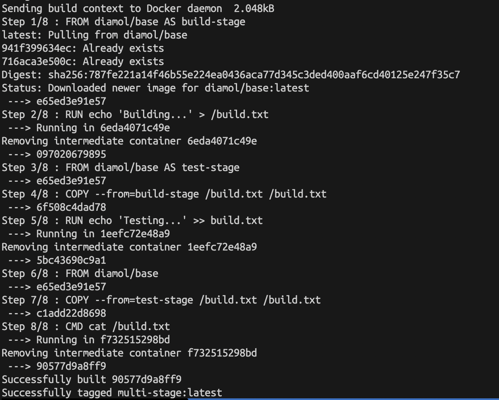

</br>

❓multi-stage build에서 각 stage에서 Container가 생성되었다 삭제된다.

```
위의 build과정을 보면, Removing intermediate container...라는 문구가 출력된다.

다중 단계 빌드(multi-stage build)에서는, 각 단계별로 독립적인 이미지가 생성되고 이후 단계에서 이용된다. 
각 단계가 완료되면 해당 단계에서 생성된 이미지 외에는 모두 제거된다. 
이렇게 하면 빌드 과정에서 생성된 임시 파일이나 불필요한 종속성 등을 최종 이미지에 포함시키지 않아도 되므로, 
최종 이미지의 크기를 줄일 수 있다.
```

❓multi-stage 빌드를 이용할 때는, 각 단계의 이미지가 독립적으로 생성된다.

```
❗️ stage에 대한 컨테이너는 삭제되는데 앞서 실행된 레이어의 파일시스템에 어떻게 접근하여 파일을 복사하는지 의문이 생겼다.

복사는 이전 단계의 이미지(즉, RUN 명령어가 실행된 후에 생성된 결과)에서 이루어지며, 
중간에 생성되었다가 제거된 컨테이너의 파일 시스템이 아닌, 해당 단계의 최종 이미지에서 이루어진다.
```

</br>

📌 Docker BuildKit

Docker build 수행 결과가 책과 다르게 출력되는데, 이는 Docker BuildKit을 사용하였기 때문이다.

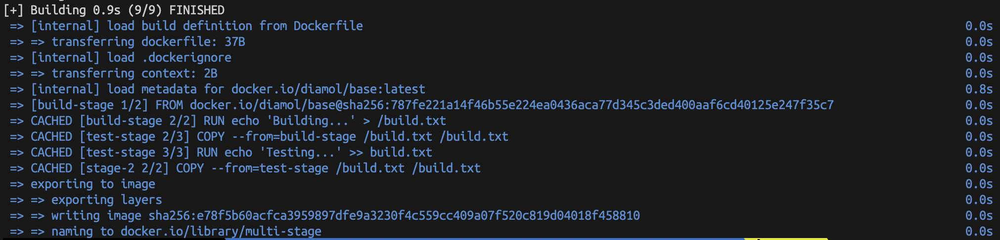

</br>

```
Docker BuildKit이란?
Docker 이미지 빌드 기능을 개선하기 위해 개발된 도구

Docker BuildKit의 주요 특징
병렬 처리: BuildKit는 이미지 빌드 단계 간의 의존성을 분석하고, 독립적인 단계는 병렬로 실행하여 빌드 시간을 줄일 수 있습니다.
빌드 캐시 이용 효율화: BuildKit는 빌드 캐시를 더 효율적으로 활용하여 재빌드 속도를 향상시킵니다.
프론트엔드 중립성: BuildKit는 도커 파일에만 국한되지 않고 다양한 프론트엔드 입력 형식을 지원합니다. 이로 인해 사용자는 자신의 요구에 맞게 빌드 과정을 더욱 세부적으로 커스터마이징할 수 있습니다.
보안 강화: BuildKit은 빌드 시간에 시크릿 정보를 안전하게 처리하며, 불필요한 권한 부여 없이 빌드를 수행할 수 있습니다.
```

</br>

```
BuildKit 비활성화
$ export DOCKER_BUILDKIT=0 

BuildKit 활성화
$ export DOCKER_BUILDKIT=1
```

</br>

📌 멀티 스테이지 빌드의 예

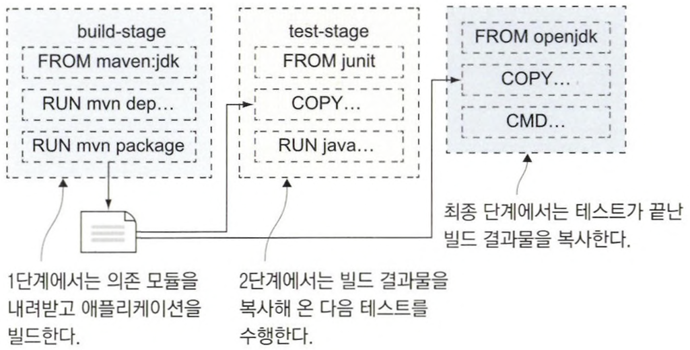

멀티 스테이지를 이용함으로써 애플리케이션의 진정한 이식성을 확보할 수 있다. 도커만 갖춰진다면 컨테이너를 통해 어떤 환경에서든 애플리케이션을 빌드하거나 실행할 수 있다. 빌드 서버에도 도커만 설치되어 있으면 된다.

---

## 4.2 애플리케이션 빌드 실전 예제: 자바 소스 코드

📌 메이븐을 사용해 자바 애플리케이션을 빌드하는 Dockerfile 스크립트

```
FROM diamol/maven AS builder

WORKDIR /usr/src/iotd
COPY pom.xml .
RUN mvn -B dependency:go-offline

COPY . .
RUN mvn package

# app
FROM diamol/openjdk

WORKDIR /app
COPY --from=builder /usr/src/iotd/target/iotd-service-0.1.0.jar .

EXPOSE 80
ENTRYPOINT ["java", "-jar", "/app/iotd-service-0.1.0.jar"]
```

📌 컨테이너 간 통신에 사용되는 도커 네트워크 생성한다.

```
$ docker network create nat
```

📌 앞서 빌드한 이미지로 부터 컨테이너를 실행하되, 80번 포트를 호스트 컴퓨터를 통해 공개하고 nat 네트워크에 컨테어너를 접속하라.

```
$ docker container run --name iotd -d -p 800:80 --network nat image-of-the-day
```

도커만 설치돼 있다면 이 애플리케이션을 어디서든 실행할 수 있다. 소스 코드와 Dockerfile 스크립트만 있으면 된다.

```
💡 최종적으로 생성되는 애플리케이션 이미지에는 빌드 도구는 포함되지 않는다.
```

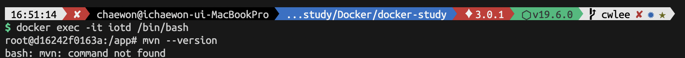

---


## 4.3 애플리케이션 빌드 실전 예제: Node.js 소스 코드

JAR 파일은 컴파일된 애플리케이션을 담은 파일로 이 파일이 다시 최종 애플리케이션 이미지에 복사되며 소스코드는 여기에 포함되지 않는다. 컴파일된 바이너리는 DLL(Dynamic link library)포맷이다. 

Node.js는 자바스크립트로 구현되는데, 자바스크립트는 인터프리터형 언어로 별도의 컴파일 절차가 필요 없다. 컨테이너화된 Node.js 애플리케이션을 실행하려면 Node.js 런타임과 소스 코드가 애플리케이션 이미지에 포함돼야 한다.


📌  npm을 사용해 Node.js 애플리케이션을 빌드하는 Dockerfile 스크립트

```
FROM diamol/node AS builder

WORKDIR /src
COPY src/package.json .

RUN npm install

# app
FROM diamon/node

EXPOSE 80
CMD ["node", "server.js"]

WORKDIR /app
COPY --from=builder /src/node_modules/ /app/node_modules/ # 의존 모듈 복사
COPY src/ .
```

1. 애플리케이션의 의존 모듈이 정의된 package.json 파일을 복사한 다음, npm install 명령을 실행해 의존 모듈을 내려받는다.
2. 작업 디렉터리를 생성하고, 호스트 컴퓨터로부터 애플리케이션 아티팩트를 모두 복사해 넣는다.

📌  이미지를 빌드한다.

```
$ docker image build -t access-log .
```

📌 컨테이너를 실행한다.

```
$ docker run -d -p 801:80 --name access-log --network nat access-log
```

🖥 실행 결과

HTTP POST 엔드포인트를 통해 남길 로그를 접수하며, GET 엔드포인트를 통해 현재까지 기록된 로그 건수를 알려준다.

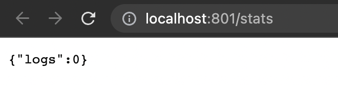

---


## 4.4 애플리케이션 빌드 실전 예제: Go 소스 코드

Go는 네이티브 바이너리로 컴파일되는 현대적인 크로스 플랫폼 언어다.

- 원하는 어떤 플랫폼(윈도, 리눅스, ARM 아키텍처)이든 해당 플랫폼에서 동작하는 바이너리를 컴파일할 수 있다.
- 자바나 Node.js 닷넷 코어 혹은 파이썬처럼 별도의 런타임이 필요하지 않다.
- 그만큼 도커 이미지의 크기도 매우 작아진다.

📌 Go 애플리케이션의 멀티 스테이지 빌드를 위한 Dockerfile 스크립트 예

```
FROM diamol/golang AS builder

COPY main.go .
RUN go build -o /server

# app
FROM diamol/base

ENV IMAGE_API_URL="http://iotd/image" \
    ACCESS_API_URL="http://accesslog/access-log"
CMD ["/web/server"]

WORKDIR web
COPY index.html .
COPY --from=builder /server .
RUN chmod +x server
```

1. 의존 모듈을 내려받는 단계 없이 곧장 빌드에 들어간다.
2. 환경 변수 설정하고 컴파일된 바이너리를 실행해 애플리케이션을 시작한다.
3. builder 단계에서 빌드한 웹 서버 바이너리와 HTML 파일을 복사한다.
4. 바이너리 파일이 chmod  명령을 통해 명시적으로 실행 권한을 부여받는다.

📌 이미지를 빌드한다.

```
$ docker image build -t image-gallery .
```

📌 빌드에 사용된 Go 빌드 도구 이미지와 빌드된 Go 애플리케이션 이미지의 크기를 비교한다.

```
$ docker image ls -f reference=diamol/golang -r reference=image-gallery
```

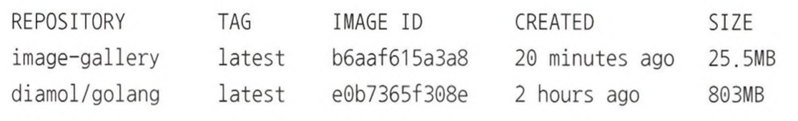

Go 애플리케이션은 실행시에 별도의 Go 빌드 도구가 필요 없다. 그러므로 애플리케이션 이미지의 크기를 최소한으로 유지하며 거의 750MB에 달하는 용량을 줄일 수 있다.

📌 Go 애플리케이션 이미지로 컨테이너를 실행하되, 컨테이너를 nat 네트워크로 접속하고 80번 포트를 호스트 컴퓨터의 포트를 통해 공개한다.

```
$ docker container run -d 802:80 --network nat image-gallery
```

Go로 구현된 웹 애플리케이션이 자바로 구현된 API를 호출해 이미지의 상세 정보를 얻은 다음 Node.js로 구현된 API에 접근 로그를 남긴다.

📌 docker에서 동일한 network내에서 실행되는 컨테이너는 컨테이너간 Name을 접근할 수 있다.

```
$ docker network inspect nat
[
    {
        "Name": "nat",
        "Id": "7bd5fbbcea3dd765a1d3c4d243a5da043a83385f413c5d982810ab632dd2c36e",
        "Created": "2023-06-04T07:25:36.454959542Z",
        "Scope": "local",
        "Driver": "bridge",
        "EnableIPv6": false,
        "IPAM": {
            "Driver": "default",
            "Options": {},
            "Config": [
                {
                    "Subnet": "172.18.0.0/16",
                    "Gateway": "172.18.0.1"
                }
            ]
        },
        "Internal": false,
        "Attachable": false,
        "Ingress": false,
        "ConfigFrom": {
            "Network": ""
        },
        "ConfigOnly": false,
        "Containers": {
            "0216971c50d4b6013954d91596ebb3d2be5613d948818a41a0046e569b602e10": {
                "Name": "amazing_khorana",
                "EndpointID": "c660faf6c09581bd95dd12def6e793859613aeabfb359859b01c30a28b8638fb",
                "MacAddress": "02:42:ac:12:00:04",
                "IPv4Address": "172.18.0.4/16",
                "IPv6Address": ""
            },
            "d16242f0163ae08c4deb202d5c767063ad1bd7e86c4a8e532e1fcab19b3a1158": {
                "Name": "iotd",
                "EndpointID": "dc74c4c5f9a608c4816d53b4311367cc435e41cab7b02050de0b6ac10243397c",
                "MacAddress": "02:42:ac:12:00:02",
                "IPv4Address": "172.18.0.2/16",
                "IPv6Address": ""
            },
            "d9c0395c0d93b8f2612bf1016bcb97f4624838f563e3de550fb4872000e16cd1": {
                "Name": "access-log",
                "EndpointID": "b87239de9fd84a12300ca54316395ce9211aafc58c25d992dfad85e757ae5bf1",
                "MacAddress": "02:42:ac:12:00:03",
                "IPv4Address": "172.18.0.3/16",
                "IPv6Address": ""
            }
        },
        "Options": {},
        "Labels": {}
    }
]
```

✅ image-gallery 컨테이너에 접속한 후, 각 컨테이너의 name으로 ping을 날리면 위의 inspect 명령어에서 확인한 각 컨테이너의 IP로 요청을 보내는 것을 확인할 수 있다.

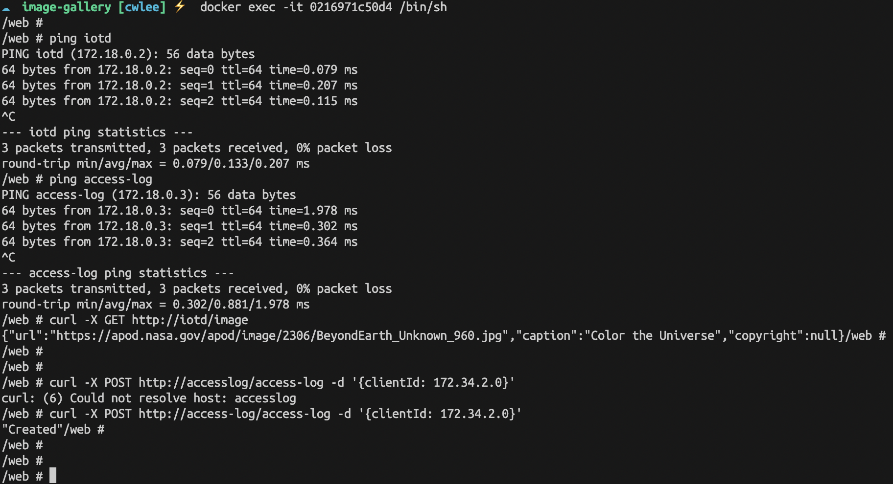

---


## 4.5 멀티 스테이지 Dockerfile 스크립트 이해하기

멀티 스테이지 Dockerfile 스크립트의 동작 원리와 컨테이너 안에서 애플리케이션을 빌드하는 것이 왜 유용한지를 설명한다.

```
1. 표준화.
로컬 컴퓨터에 어떤 도구를 설치했는지와 상관없이 모든 빌드 과정은 도커 컨테이너 내부에서 이루어진다.
실무에서 신규 개발자의 적응 기간이나 빌드 서버의 관리 부담, 혹은 개발자 간 도구 버전의 차이로 인한 빌드 실패를 크게 줄일 수 있다.

2. 성능 향상.
멀티 스테이지 빌드의 각 단계는 자신만의 캐시를 따로 갖는다.
다음 단계의 스테이지는 다시 캐시를 재사용하면서 시작할 수 있다.
캐시를 재사용을 통해 빌드 단계에서 시간을 절약할 수 있다.

3. 이미지 사이즈 최소화.
어떤 도구든지 해당 도구가 사용되는 단계만으로 도구의 포함 여부를 국한시킬 수 있다.
이미지 크기를 줄요서 애플리케이션의 시작 시간을 단축한다.
애플리케이션의 의존 모듈 자체를 줄요 취약점을 이용한 외부 공격의 가능성도 최대한 차단한다.
```

---

## 4.6 연습 문제

```
- Dockerfile 스크립트로 이미지를 빌드한다. 이어서 Dockerfile 스크립트를 최적화한 다음 새로운 이미지를 빌드한다.
- 최적화된 이미지의 크기가 리눅스 환경에서 약 15MB. 윈도 환경에서 약 260MB가 되도록 한다.
- Dockerfile 스크립트를 최적화해 HTML 파일을 수정하더라도 재수행하는 빌드 단계가 한 단계가 되도록 한다.
```

📌 경량화 이전 Dockefile을 빌드한다.
```
$ docker build -t lab-04 -f ./Dockerfile .
```

📌 경량화한 Dockerfile.optimized 파일
```
FROM diamol/golang AS builder

COPY main.go .
RUN go build -o /web/server

FROM diamol/base

ENV USER=sixeyed
EXPOSE 80
CMD ["/web/server"]

WORKDIR web
COPY --from=builder /web/server /web

RUN chmod +x /web/server
COPY index.html .
```
```
1. multi-stage build를 활용해 빌드 도구와 라이브러리 등의 빌드 시에만 필요한 파일들을 최종 이미지에서 제거한다.
2. 변경될 가능성이 더 적은 명령을 먼저 실행한다. WORKDIR, ENV, EXPOSE 같은 명령을 RUN, COPY 명령보다 먼저 위치시킨다.
3. index.html를 마지막에 두어 HTML 변경 시 재수행되는 빌드 단계가 한 단계가 되도록 한다.
```

📌 경량화한 Dockerfile.optimized을 빌드한다.
```
$ docker build -t lab-04-optimized -f ./Dockerfile.optimized .
```

📌 컨테이너를 실행한다.
```
$ docker container run -p 805:80 -d lab-04-optimized:latest
```

✅ 1차 빌드 결과

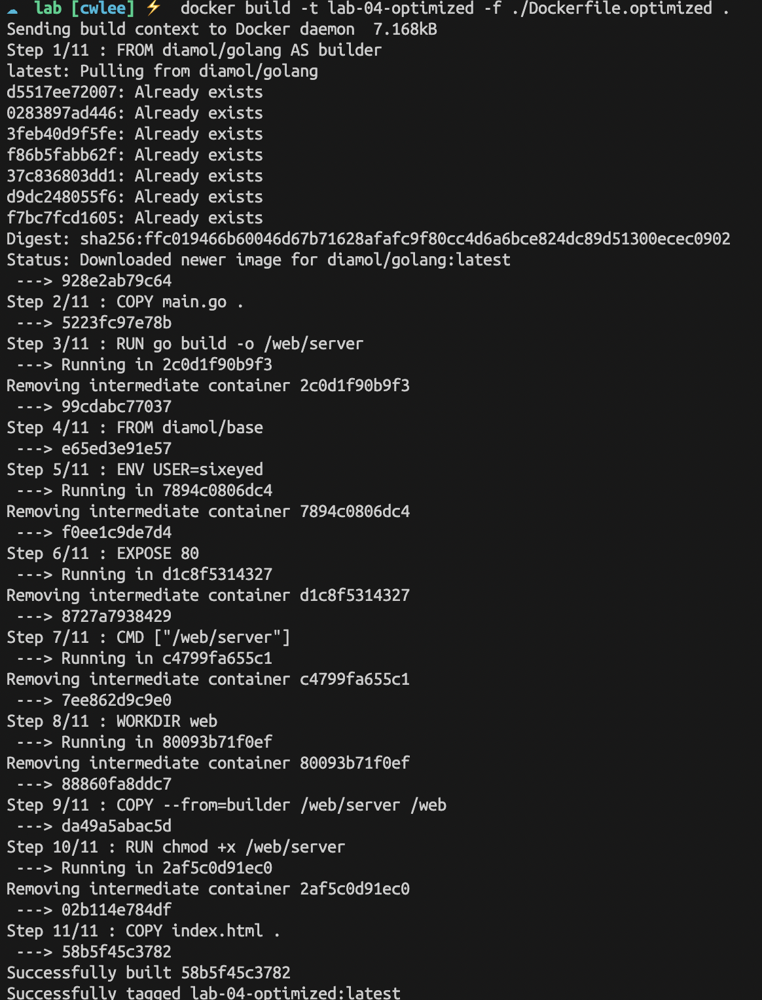

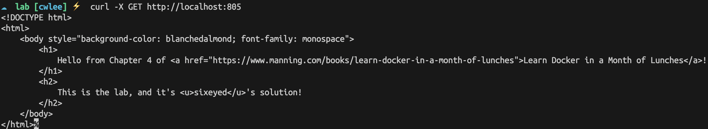

✅ 2차 빌드 결과 (→ index.html 파일 변경 후)

- 재수행하는 빌드 단계가 한 단계이다.
- 나머지는 캐시를 사용한다.

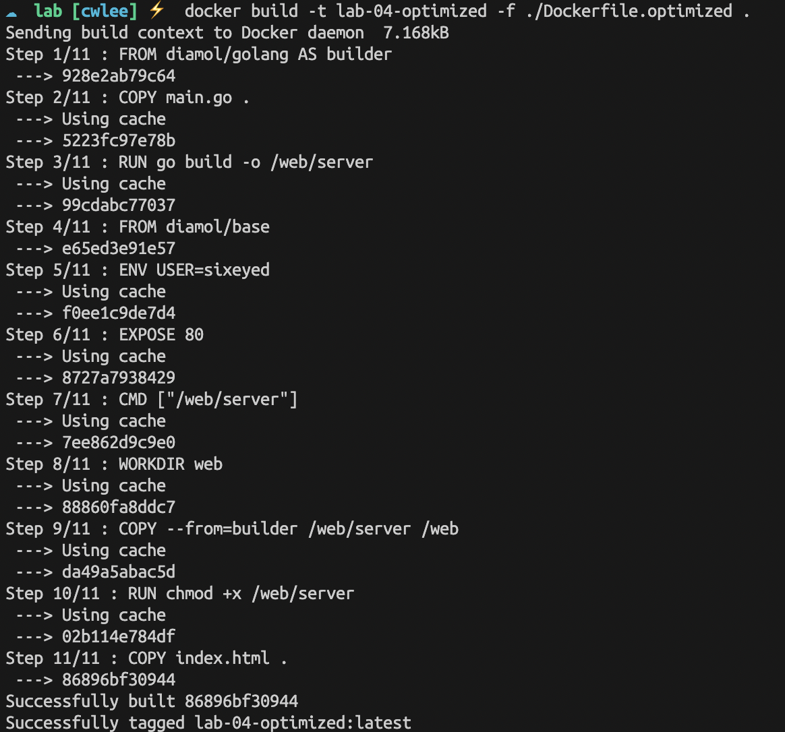

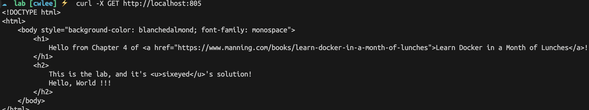

✅ 이미지 크기 비교

```
$ docker images ls -f reference=lab-04 -f reference=lab-04-optimized
```
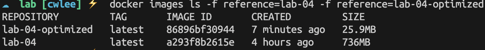

📌 개선할 부분

- chmod + x /web/server도 builder stage에서 실행시킴으로써 최종 이미지의 크기를 줄일 수 있다.

```docker
FROM diamol/golang AS builder

COPY main.go .
RUN go build -o /web/server
RUN chmod +x /web/server

FROM diamol/base

ENV USER=sixeyed
EXPOSE 80
CMD ["/web/server"]

WORKDIR web
COPY --from=builder /web/server /web
COPY index.html .
```

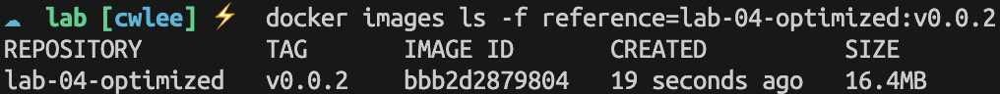