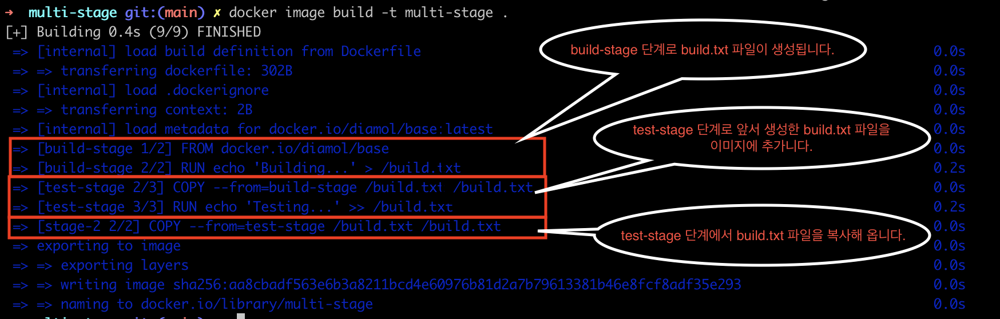
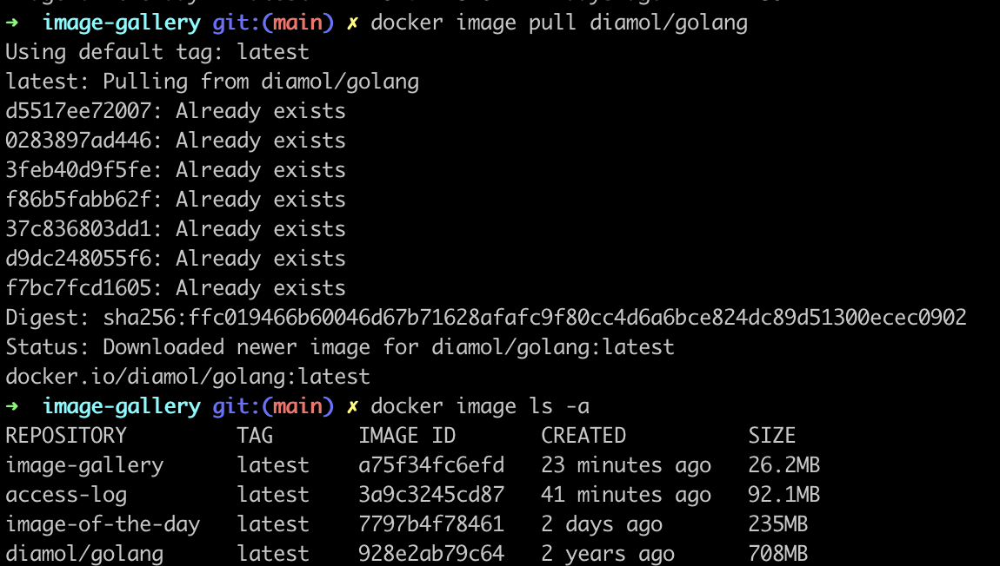

# 애플리케이션 소스코드에서 도커 이미지까지

## Dockerfile이 있는데 빌드 서버가 필요할까?

- 팀 작업의 경우 다른 팀원들과의 공유를 위해 형상관리도구를 사용해서 코드를 관리하고 빌드서버를 통해 빌드를 해야 문제점 인지가 빠릅니다.
- 개발도구들을 이미지로 만들어서 사용할 수도 있습니다.
- 멀티 스테이지 빌드
  - 멀티 스테이지로 구성해서 빌드도 가능합니다.
  - 각 빌드 단계는 격리되어있으며 어느 한단계라도 실패한다면 전체 빌드가 실패합니다.

```shell
cd ch04/exercises/multi-stage && docker image build -t multi-stage .
```



- 거의 모든 주요 애플리케이션 프레임워크는 이미 도커 허브를 통해 빌드 도구가 내장된 공식 이미 지를 제공되며 런타임만 제공되는 이미지를 별도로 제공하는 경우도 있습니다.

## 애플리케이션 빌드 실전 예제: 자바 소스 코드

```shell
cd ch04/exercises/image-of-the-day && docker image build -t image-of-the-day .
```

- 예제 소스 dockerfile로 image를 빌드합니다.

```shell
docker network create nat
```

- nat 이라는 이름으로 natwork를 생성합니다.

```shell
docker run --name iotd -dp 800:80 --network nat image-of-the-day
```

앞서 빌드한 이미지를 nat natwork를 통해 실행시킵니다.

## 애플리케이션 빌드 실전 예제: Node.js 소스 코드

```shell
cd ch04/exercises/access-log && docker image build -t access-log .
```

- 예제 소스 dockerfile로 image를 빌드합니다.

```shell
docker run --name accesslog -dp 801:80 --network nat access-log
```

- 앞서 빌드한 이미지를 nat natwork를 통해 실행시킵니다.

## 애플리케이션 빌드 실전 예제: Go 소스 코드

```shell
cd ch04/exercises/image-gallery && docker image build -t image-gallery .
```

- 예제 소스 dockerfile로 image를 빌드합니다.

```shell
docker image ls -f reference=diamol/golang -f reference=image-gallery
```

- 이미지 크기를 확인하는 명령어를 사용하면 두개의 크기 차이를 알 수 있습니다.
  어찌된 영문인지 이미지를 지우고 다시해봐도 diamol/golang은 확인되지 않아서 pull 을 받아서 확인했습니다.
  여기서 또 다른 의문점이 -a 를 써서 확인해도 나오지 않았던 이미지가 이미 존재한다는 내용을 보았고 다시 조회하니 확인되었습니다.
  

```shell
docker run -dp 802:80 --network nat image-gallery
```

- 802 포트로 실행합니다.

- 이것으로 go로 구현된 웹 애플리케이션이 java api를 호출하고 node.js가 기록하는 분산 애플리케이션이 실행되었습니다.

## 멀티 스테이지 Dockerfile 스크립트 이해하기

컨테이너 안에서 빌드의 장점

- 표준화

  어떤 도구를 사용하더라도 모든 빌드과정이 도커 컨테이너 내부에서 이뤄집니다.

- 성능향상

  멀티 스테이지 빌드의 각 단계는 자신만의 캐시를 가지고 빌드 중에 각 인스트럭션은 해당하는 레이어 캐시를 찾습니다. 캐시 재사용을 통해 90%이상의 빌드 단계에서 시간을 절약할 수 있습니다.

- 산출물 크기 최적화

  멀티 스테이지 Dockerfile 스크립트를 통해 빌드 과정을 세밀하게 조정하여 최종 산출물인 이미지를 가능한 작게 유지할 수 있다는 장점이 있습니다.
