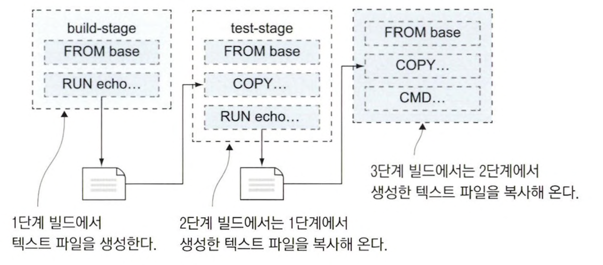
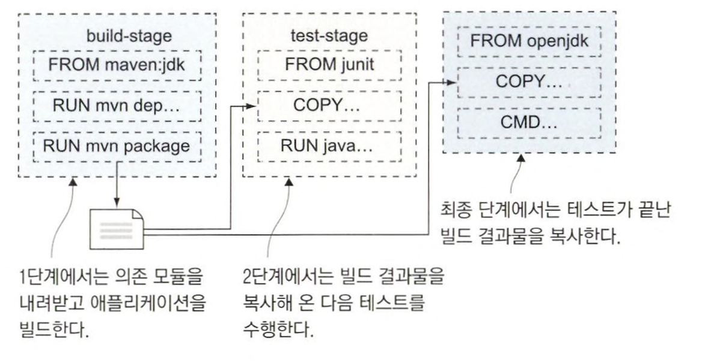
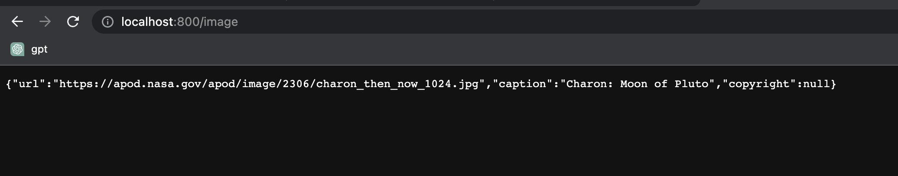
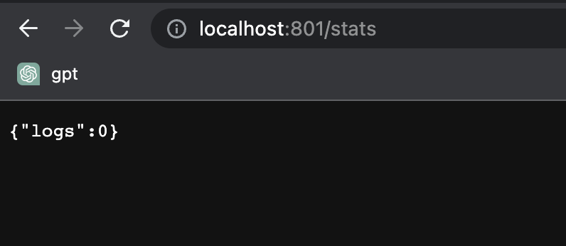
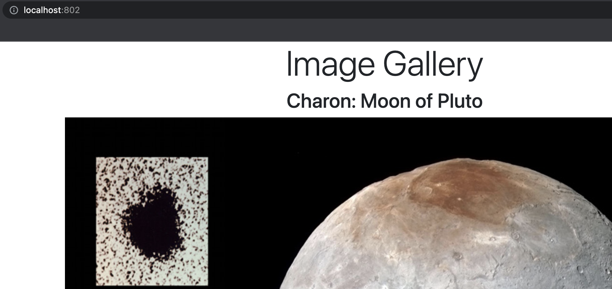

# Dockerfile이 있는데 빌드 서버가 필요한가 ?

대부분의 프로그래밍 언어는 프로젝트를 빌드하기 위해 다양한 도구가 필요하다. (ex. JDK, maven ...)

도커를 사용해 빌드 툴체인을 한 번에 패키징해서 공유할 수 있다. <br>
개발에 필요한 모든 도구를 배포하는 Dockerfile 스크립트를 작성해 이를 이미지로 만들고 <br>
애플리케이션 패키징을 위한 Dockerfile 스크립트에서 이 이미지를 사용해 소스 코드를 컴파일해 애플리케이션을 패키징하는 것.

<br>


```
FROM diamol/base AS build-stage
RUN echo 'Building...' > /build.txt

FROM diamol/base AS test-stage
COPY --from=build-stage /build.txt /build.txt
RUN echo 'Testing...' >> /build.txt

FROM diamol/base
COPY --from=test-stage /build.txt /build.txt
CMD cat /build.txt
```

이 스크립트는 빌드가 여러 단계로 나뉘는 **멀티 스테이지 빌드**를 적용했다. <br>
이는 build-stage, test-stage, 이름 없는 마지막 단계로 3단계로 나뉘어져 있다.

각 빌드 단계는 독립적으로 실행되지만, 앞선 단계에서 만들어진 디렉터리나 파일을 복사할 수는 있다. *(COPY 인스트럭션의 --from 인자로 앞선 빌드 단계의 파일 시스템의 파일을 이용)* <br>
build-stage에서 파일 하나를 생성하고, test-stage로 복사하고, test-stage에서 생성한 파일을 마지막 단계로 복사한다.

RUN 인스트럭션은 빌드 중에 컨테이너 안에서 명령을 실행한 다음 그 결과를 이미지 레이어에 저장하는 기능을 한다. <br>
RUN 인스트럭션은 FROM 인스트럭션으로 지정한 이미지에서 실행할 수 있어야 사용 가능하다.



<br>

```
cd ch04/exercises/multi-stage
docker image build -t multi-stage .

// 실행 결과
[+] Building 0.5s (9/9) FINISHED
 => [internal] load build definition from Dockerfile                                                                                                       0.0s
 => => transferring dockerfile: 354B                                                                                                                       0.0s
 => [internal] load .dockerignore                                                                                                                          0.0s
 => => transferring context: 2B                                                                                                                            0.0s
 => [internal] load metadata for docker.io/diamol/base:latest                                                                                              0.0s
 => [build-stage 1/2] FROM docker.io/diamol/base                                                                                                           0.0s
 => [build-stage 2/2] RUN echo 'Building...' > /build.txt                                                                                                  0.1s
 => [test-stage 2/3] COPY --from=build-stage /build.txt /build.txt                                                                                         0.0s
 => [test-stage 3/3] RUN echo 'Testing...' >> /build.txt                                                                                                   0.1s
 => [stage-2 2/2] COPY --from=test-stage /build.txt /build.txt                                                                                             0.0s
 => exporting to image                                                                                                                                     0.0s
 => => exporting layers                                                                                                                                    0.0s
 => => writing image sha256:0961fe3c2d93f3105008771d65d13c2ce3e70c23cfbe0a8dcde80197597f452e                                                               0.0s
 => => naming to docker.io/library/multi-stage                                                                                                             0.0s
```

<br>



이런 방법으로 애플리케이션의 진정한 이식성을 확보할 수 있다. <br>
거의 모든 주요 애플리케이션 프레임워크는 이미 도커 허브를 통해 빌드 도구가 내장된 공식 이미지를 제공한다. <br>
이 이미지들을 직접 활용하거나 이들을 포함하는 이미지를 새로 만들어 사용하면 된다.

<br>
<hr>

# 자바 애플리케이션 빌드 예

예제 애플리케이션은 자바 스프링 부트로 구현되어 있고, 빌드 도구인 maven과 OpenJDK를 사용한다.

```
FROM diamol/maven AS builder

WORKDIR /usr/src/iotd
COPY pom.xml .
RUN mvn -B dependency:go-offline

COPY . .
RUN mvn package

# app
FROM diamol/openjdk

WORKDIR /app
COPY --from=builder /usr/src/iotd/target/iotd-service-0.1.0.jar .

EXPOSE 80
ENTRYPOINT ["java", "-jar", "/app/iotd-service-0.1.0.jar"]
```

builder 단계에서는 아래의 일을 한다.

- 기반 이미지인 diamol/maven는 maven과 OpenJDK를 포함한다.
- 이미지에 작업 디렉터리를 만든 후, 이 디렉터리에 pom.xml을 복사한다.
- 첫 번째 RUN 인스트럭션에서 maven이 실행돼 필요한 의존 모듈을 받는다. (별도의 단계로 분리해 레이어 캐시를 활용할 수 있도록 한다)
- COPY . . 인스트럭션으로 나머지 소스 코드를 복사한다. (실행 중인 디렉터리에 포함된 모든 파일과 서브 디렉터리를 현재 이미지 내 작업 디렉터리로 복사)
- 마지막은 mvn package 명령을 실행한다. (애플리케이션을 빌드하고 실행)

<br>

builder 단계가 끝나면 컴파일된 애플리케이션이 해당 단계의 파일 시스템에 만들어진다. <br>
정상적으로 builder 단계가 끝나면 마지막 단계를 실행해 애플리케이션 이미지를 생성한다.

- 기반 이미지인 diamol/openjdk에는 java 11을 포함한다.
- 이미지에 작업 디렉터리를 만든 후, builder 단계에서 만든 jar 파일을 복사한다. (jar파일은 모든 의존 모듈과 컴파일된 애플리케이션을 포함)
- 애플리케이션은 80번 포트를 주시하는 웹 서버 애플리케이션이다. 그러므로 이 포트를 EXPOSE 인스트럭션으로 외부로 공개한다.
- ENTRYPOINT 인스트럭션은 CMD 인스트럭션과 같은 기능을 하는 인스트럭션이다. 해당 이미지로 컨테이너가 실행되면 도커가 이 인스트럭션에 정의된 명령을 실행한다.

<br>

```
cd ch04/exercises/image-of-the-day
docker image build -t image-of-the-day .

// 실행 결과
[+] Building 75.3s (15/15) FINISHED
 => [internal] load build definition from Dockerfile                                                                                                       0.0s
 => => transferring dockerfile: 393B                                                                                                                       0.0s
 => [internal] load .dockerignore                                                                                                                          0.0s
 => => transferring context: 2B                                                                                                                            0.0s
 => [internal] load metadata for docker.io/diamol/openjdk:latest                                                                                           3.4s
 => [internal] load metadata for docker.io/diamol/maven:latest                                                                                             3.2s
 => [builder 1/6] FROM docker.io/diamol/maven@sha256:bc24b7b3beaae18550590fd986b09d7833c4daedb2632c76daddab21351b934f                                     45.3s
 => => resolve docker.io/diamol/maven@sha256:bc24b7b3beaae18550590fd986b09d7833c4daedb2632c76daddab21351b934f                                              0.0s
 => => sha256:088997457a8974eaac75aeb011b9589606b22fba0c660ef63ee71ec3f4e6feee 2.42kB / 2.42kB                                                             0.0s
 => => sha256:bc24b7b3beaae18550590fd986b09d7833c4daedb2632c76daddab21351b934f 1.41kB / 1.41kB                                                             0.0s
 => => sha256:4c0955102f3f5a174781c0781a7ab326abd75b82fb5b73821afa349206630e7e 8.92kB / 8.92kB                                                             0.0s
 => => sha256:c78c297fb0d010ee085f95ae439636ecb167b050c1acb4273bd576998cf94a83 49.18MB / 49.18MB                                                          12.9s
 => => sha256:06af62193c25241eb123af8cf115c7a6298e834976fe148ac79ec11a7ca06ee5 7.69MB / 7.69MB                                                            12.3s
 => => sha256:8b846e1b73901174c506ae5e6219ac2f356ef71eaa5896dfbc238dc67ca4bf73 9.98MB / 9.98MB                                                            15.2s
 => => extracting sha256:c78c297fb0d010ee085f95ae439636ecb167b050c1acb4273bd576998cf94a83                                                                  1.3s
 => => sha256:fb44d26a138a8d064a4ab8f9b472c64e7136c2482ec5af19bab8811b6d2c15b7 52.17MB / 52.17MB                                                          23.8s
 => => extracting sha256:06af62193c25241eb123af8cf115c7a6298e834976fe148ac79ec11a7ca06ee5                                                                  0.2s
 => => extracting sha256:8b846e1b73901174c506ae5e6219ac2f356ef71eaa5896dfbc238dc67ca4bf73                                                                  0.2s
 => => sha256:0328821646cca37a6d16b29f865b06f587912b17e84f293bc7c08bbb3afeee93 5.28MB / 5.28MB                                                            16.4s
 => => sha256:39642fd375ee8d38fc5c53324d4a02c9cf405fcac34ce88cc4d5913274246cb6 210B / 210B                                                                16.5s
 => => sha256:529d17dd69ab43de9e243244bf7156c70339386a8571afdf313d05fec3e75dc9 9.58MB / 9.58MB                                                            19.7s
 => => sha256:582c31bf5e2daffdf5c6e05aecaefab313a0b8e776f9ff1575ad3a05973085f4 200.40MB / 200.40MB                                                        42.0s
 => => sha256:6b8169d349247080880be851b72f835bb8d922ed11366ec88ade11f879a2c6d7 853B / 853B                                                                20.3s
 => => sha256:7997087f808e3e962fa04c72a22f693930bff7640f2ef74a6be97fd09eb14797 360B / 360B                                                                20.9s
 => => extracting sha256:fb44d26a138a8d064a4ab8f9b472c64e7136c2482ec5af19bab8811b6d2c15b7                                                                  1.5s
 => => extracting sha256:0328821646cca37a6d16b29f865b06f587912b17e84f293bc7c08bbb3afeee93                                                                  0.1s
 => => extracting sha256:39642fd375ee8d38fc5c53324d4a02c9cf405fcac34ce88cc4d5913274246cb6                                                                  0.0s
 => => extracting sha256:582c31bf5e2daffdf5c6e05aecaefab313a0b8e776f9ff1575ad3a05973085f4                                                                  3.0s
 => => extracting sha256:529d17dd69ab43de9e243244bf7156c70339386a8571afdf313d05fec3e75dc9                                                                  0.1s
 => => extracting sha256:6b8169d349247080880be851b72f835bb8d922ed11366ec88ade11f879a2c6d7                                                                  0.0s
 => => extracting sha256:7997087f808e3e962fa04c72a22f693930bff7640f2ef74a6be97fd09eb14797                                                                  0.0s
 => [internal] load build context                                                                                                                          0.0s
 => => transferring context: 10.74kB                                                                                                                       0.0s
 => [stage-1 1/3] FROM docker.io/diamol/openjdk@sha256:bc11278602c48a60f71ea01031c54a73878d19db4803f7dd8705aa77bab89808                                   17.3s
 => => resolve docker.io/diamol/openjdk@sha256:bc11278602c48a60f71ea01031c54a73878d19db4803f7dd8705aa77bab89808                                            0.0s
 => => sha256:bc11278602c48a60f71ea01031c54a73878d19db4803f7dd8705aa77bab89808 1.41kB / 1.41kB                                                             0.0s
 => => sha256:0af0464095ea140f43a30b4cdee3b339a22635efcd930c680f17daee14afa7da 1.37kB / 1.37kB                                                             0.0s
 => => sha256:17e883a5a4c7fa8e70d958b062d11575df249107a3053563f1e4de61a77c0039 5.67kB / 5.67kB                                                             0.0s
 => => sha256:706ee5d0a6b53d9257cbea22d8409fb22c867ab3a001c65f6b8bfd37dace0e58 25.86MB / 25.86MB                                                           3.4s
 => => sha256:303a8d33f3a602102b6a15a1f7974fc79449cdcff2c2fa6709b56cd1ac792384 3.12MB / 3.12MB                                                             3.8s
 => => sha256:93b8b66a2613c2e81c20d5f33497aaa0c185225f7b1a0fc1478b628ad5bce829 211B / 211B                                                                 1.5s
 => => sha256:4b08a8fe7570eea8d3f52461e1667f5809826377f1ee2f99e5cc9690946de148 46.11MB / 46.11MB                                                          15.9s
 => => extracting sha256:706ee5d0a6b53d9257cbea22d8409fb22c867ab3a001c65f6b8bfd37dace0e58                                                                  0.8s
 => => sha256:5536d457e12456a73a534d7de853981653618af70af4b4d0bea264f332236f5e 1.99MB / 1.99MB                                                             6.5s
 => => extracting sha256:303a8d33f3a602102b6a15a1f7974fc79449cdcff2c2fa6709b56cd1ac792384                                                                  0.1s
 => => extracting sha256:93b8b66a2613c2e81c20d5f33497aaa0c185225f7b1a0fc1478b628ad5bce829                                                                  0.0s
 => => extracting sha256:4b08a8fe7570eea8d3f52461e1667f5809826377f1ee2f99e5cc9690946de148                                                                  1.1s
 => => extracting sha256:5536d457e12456a73a534d7de853981653618af70af4b4d0bea264f332236f5e                                                                  0.1s
 => [stage-1 2/3] WORKDIR /app                                                                                                                             0.3s
 => [builder 2/6] WORKDIR /usr/src/iotd                                                                                                                    0.4s
 => [builder 3/6] COPY pom.xml .                                                                                                                           0.0s
 => [builder 4/6] RUN mvn -B dependency:go-offline                                                                                                        23.9s
 => [builder 5/6] COPY . .                                                                                                                                 0.0s
 => [builder 6/6] RUN mvn package                                                                                                                          2.1s
 => [stage-1 3/3] COPY --from=builder /usr/src/iotd/target/iotd-service-0.1.0.jar .                                                                        0.1s
 => exporting to image                                                                                                                                     0.1s
 => => exporting layers                                                                                                                                    0.1s
 => => writing image sha256:ba8a6ffb785bae72b799bf41583bb084ad258f81df853296eef46780d48c4d3e                                                               0.0s
 => => naming to docker.io/library/image-of-the-day                                                                                                        0.0s
```

<br>

```
docker network create nat
```

컨테이너 간 통신에 사용되는 도커 네트워크를 생성했다. <br>
여러 개의 컨테이너를 실행해 서로 통신하게 하기 위함이다.

<br>

```
docker run --name iotd -d -p 800:80 --network nat image-of-the-day
```

빌드한 이미지로부터 컨테이너를 실행했다. *(80번 포트를 호스트 컴퓨터를 통해 공개하고 nat 네트워크에 컨테이너를 접속)*



<br>

> 최종적으로 생성되는 애플리케이션 이미지에 빌드 도구는 포함되지 않는다. <br>
> 애플리케이션 이미지에는 도커 파일에 정의된 빌드 단계 중 마지막 단계의 콘텐츠만이 포함된다. <br>
> 이전 단계의 콘텐츠 중 포함시키고 싶은 것이 있다면 최종 단계에서 명시적으로 해당 콘텐츠를 복사해 와야 한다.

<br>
<hr>

# Node.js 애플리케이션 빌드 예

Node.js 애플리케이션은 자바스크립트로 구현되고, 인터프리터 언어라서 컴파일 과정이 필요없다. <br>
컨테이너화된 Node.js 애플리케이션을 실행하려면 Node.js 런타임과 소스 코드가 애플리케이션 이미지에 포함되어야 한다.

<br>

```
FROM diamol/node AS builder

WORKDIR /src
COPY src/package.json .
RUN npm install

# app
FROM diamol/node

EXPOSE 80
CMD ["node", "server.js"]

WORKDIR /app
COPY --from=builder /src/node_modules/ /app/node_modules/
COPY src/ .
```

기반 이미지는 diamol/node이고, 이는 Node.js 런타임과 npm이 설치되어 있다. <br>
builder 단계에서 애플리케이션의 의존 모듈이 정의된 package.json 파일을 복사하고, npm install 명령을 실행해 의존 모듈을 내려받는다. <br>
최종 단계에서 공개할 HTTP 포트와 애플리케이션 시작 명령을 지정한다. <br>
최종 단계에서는 작업 디렉터리를 만들고 호스트 컴퓨터로부터 애플리케이션 아티팩트를 모두 복사해 넣는 것으로 끝난다.

<br>

```
docker image build -t access-log .

// 실행 결과
[+] Building 9.2s (12/12) FINISHED
 => [internal] load build definition from Dockerfile                                                                                                       0.0s
 => => transferring dockerfile: 317B                                                                                                                       0.0s
 => [internal] load .dockerignore                                                                                                                          0.0s
 => => transferring context: 2B                                                                                                                            0.0s
 => [internal] load metadata for docker.io/diamol/node:latest                                                                                              1.7s
 => CACHED [builder 1/4] FROM docker.io/diamol/node@sha256:dfee522acebdfdd9964aa9c88ebebd03a20b6dd573908347be3ebf52ac4879c8                                0.0s
 => [internal] load build context                                                                                                                          0.0s
 => => transferring context: 1.85kB                                                                                                                        0.0s
 => [builder 2/4] WORKDIR /src                                                                                                                             0.0s
 => [stage-1 2/4] WORKDIR /app                                                                                                                             0.0s
 => [builder 3/4] COPY src/package.json .                                                                                                                  0.0s
 => [builder 4/4] RUN npm install                                                                                                                          6.8s
 => [stage-1 3/4] COPY --from=builder /src/node_modules/ /app/node_modules/                                                                                0.2s
 => [stage-1 4/4] COPY src/ .                                                                                                                              0.0s
 => exporting to image                                                                                                                                     0.2s
 => => exporting layers                                                                                                                                    0.2s
 => => writing image sha256:b2d37e605e9ce4ba98072869e6829995c98258d02faa4f440db40cbad844478d                                                               0.0s
 => => naming to docker.io/library/access-log                                                                                                              0.0s
```

<br>

```
docker run --name accesslog -d -p 801:80 --network nat access-log
```

access-log 이미지로 컨테이너를 실행하고, 이 컨테이너를 nat 네트워크에 연결하고 80번 포트를 공개했다.



<br>

# Go 애플리케이션 빌드 예

```
FROM diamol/golang AS builder

COPY main.go .
RUN go build -o /server

# app
FROM diamol/base
ENV IMAGE_API_URL="http://iotd/image" \
    ACCESS_API_URL="http://accesslog/access-log"

CMD ["/web/server"]

WORKDIR /web
COPY index.html .
COPY --from=builder /server .
RUN chmod +x server
```

기반 이미지인 diamol/golang는 Go 언어의 도구가 설치되어 있다. <br>
Go 애플리케이션 빌드는 의존 모듈을 내려받는 단계 없이 바로 빌드되며, 그 다음 애플리케이션 단계는 최소한의 운영체제 레이어만을 포함하는 이미지를 사용한다. <br>
그 다음 몇 가지 설정 값을 환경 변수로 설정하고 컴파일된 바이너리를 실행해 애플리케이션을 시작한다. <br>
애플리케이션 단계는 빌드한 웹 서버 바이너리와 이 웹 서버 가 제공할 HTML 파일을 복사하는 과정으로 마무리된다.

<br>

```
docker image build -t image-gallery .

// 실행 결과
[+] Building 36.9s (14/14) FINISHED
 => [internal] load build definition from Dockerfile                                                                                                       0.0s
 => => transferring dockerfile: 391B                                                                                                                       0.0s
 => [internal] load .dockerignore                                                                                                                          0.0s
 => => transferring context: 2B                                                                                                                            0.0s
 => [internal] load metadata for docker.io/diamol/golang:latest                                                                                            2.9s
 => [internal] load metadata for docker.io/diamol/base:latest                                                                                              0.0s
 => [internal] load build context                                                                                                                          0.0s
 => => transferring context: 1.76kB                                                                                                                        0.0s
 => [builder 1/3] FROM docker.io/diamol/golang@sha256:ffc019466b60046d67b71628afafc9f80cc4d6a6bce824dc89d51300ecec0902                                    31.6s
 => => resolve docker.io/diamol/golang@sha256:ffc019466b60046d67b71628afafc9f80cc4d6a6bce824dc89d51300ecec0902                                             0.0s
 => => sha256:0283897ad4463628bd259e1cbb5eb788e7df554b42ae17fc6f5d02c4a56035c2 7.68MB / 7.68MB                                                             4.0s
 => => sha256:ffc019466b60046d67b71628afafc9f80cc4d6a6bce824dc89d51300ecec0902 1.41kB / 1.41kB                                                             0.0s
 => => sha256:1910bbf0b9a0f73613c202e13d9940c1050acf3f4522a553c60637992f5dd7a2 1.79kB / 1.79kB                                                             0.0s
 => => sha256:928e2ab79c640602110b5ef0ca5969e6856fc874ee8537c6ede1c60dd18bf1ea 6.35kB / 6.35kB                                                             0.0s
 => => sha256:d5517ee72007172d5b814636405254dea459120ce08f85777bb287d106a6a240 49.18MB / 49.18MB                                                          13.9s
 => => sha256:3feb40d9f5fecfa098b8f7ece6c287c6fd61b114043c8b4647359120a7d943a3 9.98MB / 9.98MB                                                             3.2s
 => => sha256:f86b5fabb62f79acd92186da3c02d23bd8c15d79603a700959b582bd9e62854c 52.16MB / 52.16MB                                                          15.7s
 => => sha256:37c836803dd1977ffe173b42414e8c2ae2e147cee2e1ee34a383f4251cf15a44 62.53MB / 62.53MB                                                          19.9s
 => => extracting sha256:d5517ee72007172d5b814636405254dea459120ce08f85777bb287d106a6a240                                                                  1.3s
 => => sha256:d9dc248055f60dc2aa62c9eb18d6b6f4ec0de19f410168704b3a59da5801d8fe 97.69MB / 97.69MB                                                          29.0s
 => => extracting sha256:0283897ad4463628bd259e1cbb5eb788e7df554b42ae17fc6f5d02c4a56035c2                                                                  0.2s
 => => extracting sha256:3feb40d9f5fecfa098b8f7ece6c287c6fd61b114043c8b4647359120a7d943a3                                                                  0.2s
 => => extracting sha256:f86b5fabb62f79acd92186da3c02d23bd8c15d79603a700959b582bd9e62854c                                                                  1.4s
 => => sha256:f7bc7fcd16054fc4f78b4420338b2694561bcb99063f896a8d4cf6e61a2596f5 156B / 156B                                                                16.4s
 => => extracting sha256:37c836803dd1977ffe173b42414e8c2ae2e147cee2e1ee34a383f4251cf15a44                                                                  1.5s
 => => extracting sha256:d9dc248055f60dc2aa62c9eb18d6b6f4ec0de19f410168704b3a59da5801d8fe                                                                  2.3s
 => => extracting sha256:f7bc7fcd16054fc4f78b4420338b2694561bcb99063f896a8d4cf6e61a2596f5                                                                  0.0s
 => CACHED [stage-1 1/5] FROM docker.io/diamol/base                                                                                                        0.0s
 => [stage-1 2/5] WORKDIR /web                                                                                                                             0.0s
 => [stage-1 3/5] COPY index.html .                                                                                                                        0.0s
 => [builder 2/3] COPY main.go .                                                                                                                           0.4s
 => [builder 3/3] RUN go build -o /server                                                                                                                  1.5s
 => [stage-1 4/5] COPY --from=builder /server .                                                                                                            0.0s
 => [stage-1 5/5] RUN chmod +x server                                                                                                                      0.1s
 => exporting to image                                                                                                                                     0.0s
 => => exporting layers                                                                                                                                    0.0s
 => => writing image sha256:4ea1e7a37cf4446426e63b6249f371b4cc75ff2de135b3b8479a93692e28b486                                                               0.0s
 => => naming to docker.io/library/image-gallery                                                                                                           0.0s
```

<br>

```
docker run -d -p 802:80 --network nat image-gallery
```

Go 애플리케이션 이미지를 실행했다. 

<br>



<br>

세 개의 컨테이너로 분산 애플리케이션이 실행됐다. <br>
Go로 구현된 애플리케이션이 자바로 구현된 API를 호출해 이미지의 상세 정보를 얻은 다음 Node.js로 구현된 API에 접근 로그를 남긴다. <br>

<br>
<hr>

# 멀티 스테이지 Dockerfile 스크립트

멀티 스테이지 Dockerfile 스크립트의 장점 첫 번째는 **표준화**이다. <br>
어떤 운영체제를 사용하든, 로컬 컴퓨터에 어떤 도구를 설치했는지와 상관없이 모든 빌드 과정은 도커 컨테이너 내부에서 이뤄진다.

장점 두 번째는 **성능 향상**이다. <br>
멀티 스테이지 빌드의 각 단계는 자신만의 캐시를 따로 갖는다. 그리고 도커는 빌드 중에 각 인스트럭션에 해당하는 레이어 캐시를 찾는다. <br>
해당되는 캐시를 찾지 못하면 남은 인스트럭션이 실행되지만 그 범위가 해당 단계 안으로 국한된다. <br>
이어지는 다음 단계는 다시 캐시를 재사용하면서 시작할 수 있다.

장점 세 번째는 **빌드 과정을 세밀하게 조정하여 이미지를 작게 유지**할 수 있다. <br>
최종 산출물인 이미지에 불필요한 도구는 빼버릴 수 있는 것이다.

<br>
<hr>

# 연습 문제

<table>
<thead>
<td>AS-IS</td><td>TO-BE</td>
</thead>
<tbody>
<td>

```
FROM diamol/golang 

WORKDIR web
COPY index.html .
COPY main.go .

RUN go build -o /web/server
RUN chmod +x /web/server

CMD ["/web/server"]
ENV USER=sixeyed
EXPOSE 80
```

</td>
<td>

```
FROM diamol/golang AS builder

COPY main.go .

RUN go build -o /server
RUN chmod +x /server

# app
FROM diamol/base

EXPOSE 80
CMD ["/web/server"]
ENV USER="sixeyed"

WORKDIR web
COPY --from=builder /server .
COPY index.html .
```

</td>
</tbody>
</table>


