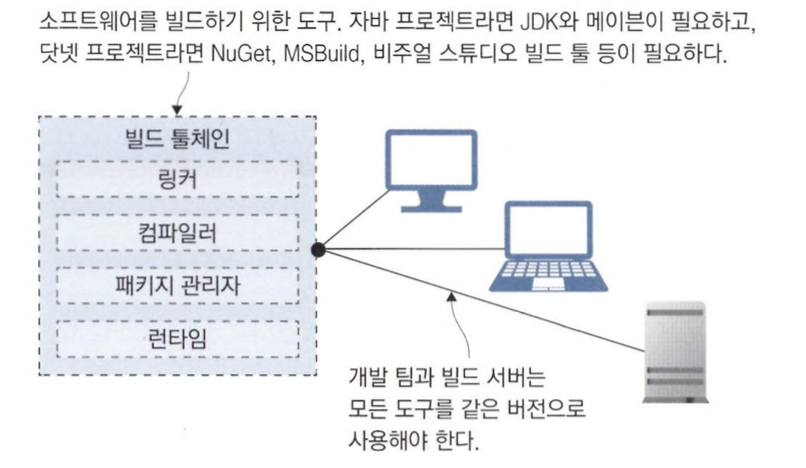
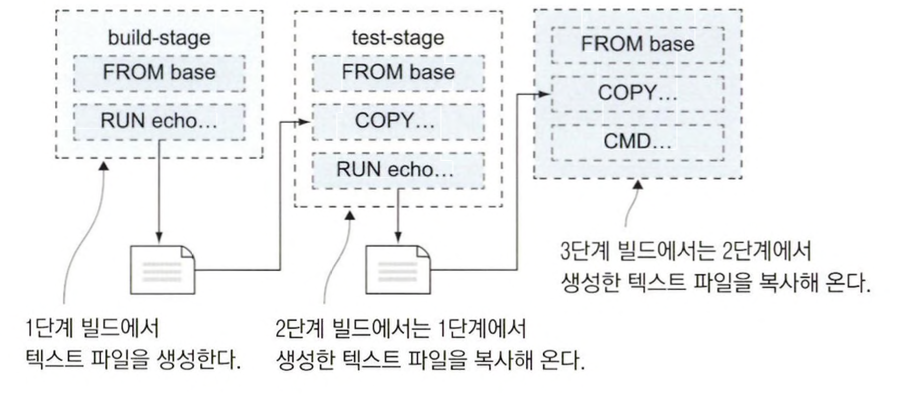
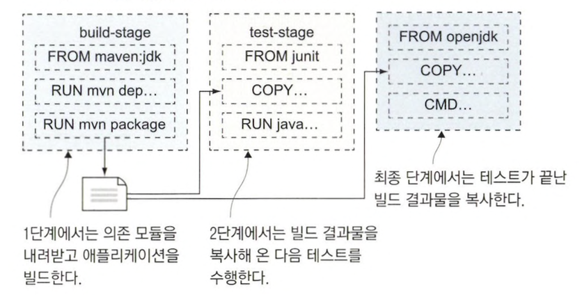

# 애플리케이션 소스 코드에서 도커 이미지까지

## Dockerfile이 있는데 빌드 서버가 필요할까?

개발자들이 사용하는 PC가 전부 환경이 다를 수 있으므로 별도의 빌드 서버를 두어 해당 서버에서 빌드를 진행하는 것이 안전합니다.

단, 이 경우 추가 비용이 발생할 수 있다는 단점이 존재합니다.

### 언어마다 다른 빌드 환경

대부분의 프로그래밍 언어들은 프로젝트를 빌드하기 위해 다양한 도구가 필요합니다.



위와 같은 환경은 다음과 같은 문제들로 유지보수 비용이 크게 발생할 수 있습니다.

- 신규 개발자는 환경을 설치하는데만 출근 첫날을 보낼 수 있습니다.
- 작업한 컴퓨터에서 빌드한 파일이 서버와 버전이 달라 빌드 실패 등의 문제가 발생할 수 있습니다.

### 도커를 이용하여 패키징된 애플리케이션 관리하기

이런 경우 빌드 툴을 한번에 패키징한 후 애플리케이션을 공유할 수 있으면 편리할 것입니다.

이런 상황에서 도커를 사용하면 쉽게 공유할 수 있습니다.

### 멀티 스테이지 빌드를 통해 이미지 관리하기

다음은 멀티 스테이지 빌드를 적용한 Dockerfile 스크립트입니다.

```docker
FROM diamol/base AS build-stage
RUN echo "Building..." > /build.txt

FROM diamlo/base AS test-stage
COPY --from=build-stage /build.txt /build.txt
RUN echo "Testing..." >> /build.txt

FROM diamol/base
COPY --from=test-stage /build.txt /build.txt
CMD cat /build.txt
```

위의 스크립트는 여러 단계로 나뉘는 멀티 스테이지 빌드를 적용한 스크립트입니다.

각 빌드 단계는 FROM 인스트럭션으로 시작됩니다.

```
💡 필요한경우 빌드 단계에 AS 파라미터를 추가하여 별명을 붙일 수 있습니다.

```

빌드 스크립트 단계는 build-stage와 test-stage로 별명을 붙였고, 마지막 단계는 이름이 없습니다.

빌드가 여러 단계로 나뉘어져 있다고는 하지만 최종 산출물은 `마지막 단계의 내용물을 담은 도커 이미지`입니다.

각 빌드 단계는 독립적으로 실행되지만, 앞선 단계에서 만들어진 디렉터리나 파일을 복사할 수는 있습니다.

위의 코드에서 다음과 같이 `--from` 인자를 사용해 해당 파일이 호스트 컴퓨터의 파일 시스템이 아니라 앞선 빌드 단계의 파일 시스템에 있는 파일 임을 알려줄 수 있습니다.

```docker
COPY --from=build-stage /build.txt /build.txt
```

RUN 인스트럭션은 빌드 중에 컨테이너 안에서 명령을 실행한 다음 그 결과를 이미지 레이어에 저장하는 기능을 합니다.

실행할 수 있는 명령에 특별한 제한은 없지만 `FROM 인스트럭션에서 지정한 이미지에서 실행할 수 있는 것이어야 합니다.`



maven을 사용하는 자바 애플리케이션 같은 경우 다음과 같이 실행됩니다.



### 각 빌드 단계는 격리되어 있다.

각 빌드 단계는 서로 격리돼 있기 때문에 다음과 같은 점들을 유의해야 합니다.

- 빌드 단계별로 기반 이미지가 다를수도 있기 때문에 사용하는 도구들도 달라질 수 있습니다.
- 마지막 빌드 단계의 산출물은 이전 빌드 단계에서 명시적으로 복사해 온 것만 포함할 수 있습니다.
- 각 단계 중에 어느 한 단계라도 실패할 경우 전체 빌드가 실패한다.

### 도커를 활용하여 이식성 확보하기

도커를 활용하면 애플리케이션을 어디서든 동일한 환경에서 실행할 수 있기 때문에 다음과 같은 장점을 얻을 수 있습니다.

- 빌드 서버 및 개발자 PC 에서 도커만 있으면 애플리케이션을 빌드하고 실행할 수 있다.
    - 도커 이미지를 중앙관리할 수 있게 되어 팀간에 다른 환경에서 실행하지 않을 수 있습니다.
- 다양한 빌드 이미지를 도커 허브와 같은 곳에서 가져올 수 있다.
    - 다양한 이미지를 쉽게 사용 및 업데이트 할 수 있다.

## 애플리케이션 빌드 : 자바

스프링 부트 애플리케이션을 도커 이미지로 만들어 봅시다.

다음은 Dockerfile 스크립트입니다.

```docker
FROM diamol/maven AS builder

WORKDIR /usr/src/iotd
COPY pom.xml .
RUN mvn -B dependency:go-offline

# app

FROM diamol/openjdk

WORKDIR /app
COPY --from=builder /usr/src/iotd/target/iotd-service-0.1.0.jar .

EXPOSE 80
ENTRYPOINT ["java", "-jar", "/app/iotd-service-0.1.0.jar"]
```

위의 파일이 하는 역할을 하나씩 살펴봅시다.

### builder

첫 번째 단계인 builder에서 하는 일은 다음과 같습니다.

1. 기반 이미지는 `diamol/maven` 을 사용합니다.
    - 해당 이미지는 메이븐과 OpenJDK를 포함합니다.
2. builder 단계에서 먼저 이미지에 작업 디렉터리를 만든 다음 이 디렉터리에 pom.xml 파일을 복사하면서 시작됩니다.
    - 이 파일에는 메이븐에서 수행할 빌드 절차가 정의되어 있습니다.
3. 첫 번째 RUN 인스트럭션에서 메이븐이 실행돼 필요한 의존 모듈을 내려 받습니다.
    - 이 과정에는 상당한 시간이 걸리기 때문에 별도의 단계로 분리해 레이어 캐시를 활용할 수 있도록 합니다.
    - 새로운 의존 모듈이 추가될 경우 XML 파일이 변경되기 때문에 이 단계가 다시 실행되며, 없다면 이미지 캐시를 사용합니다.
4. COPY . . 인스트럭션을 통해 나머지 소스 코드를 복사합니다.
    - 이 인스트럭션은 `도커 빌드가 실행중인 디렉터리에 모든 파일과 서브 디렉터리를 현재 이미지 내 작업 디렉터리로 복사해라` 라는 의미입니다.
5. mvn package 명령을 실행합니다.
    - 애플리케이션을 빌드하고 패키징 하며, JAR 포맷으로 패키징된 자바 애플리케이션이 생성됩니다.

builder 단계가 종료되면 컴파일 된 애플리케이션이 해당 단계의 파일 시스템에 만들어집니다.

메이븐을 이용한 빌드 과정에 문제가 있었다면 RUN 인스트럭션이 실패하면서 전체 빌드도 실패합니다.

### 애플리케이션 생성

애플리케이션 생성하는 단계에서는 다음과 같은 동작을 합니다.

1. 기반 이미지는 diamol/openjdk 입니다.
    - 이 이미지는 자바 11 런타임을 포함하지만, 메이븐은 포함하지 않습니다.
2. `/app` 이라는 작업 디렉터리를 만든 다음 builder 단계에서 만든 JAR 파일을 COPY 해옵니다.
3. 애플리케이션을 80번 포트를 주시하는 웹 서버 애플리케이션으로 EXPOSE 명령으로 도커 네트워크에 해당 포트를 공개합니다.
4. ENTRYPOINT 인스트럭션으로 java 명령으로 빌드된 JAR 파일을 실행합니다.

### 자바 애플리케이션 빌드하기

파일이 어떤 의미인지 확인해보았으니 다음 명령을 통해 빌드해봅시다.

```docker
docker image build -t image-of-the-day .
```

### 컨테이너 간 통신을 위한 도커 네트워크 생성

컨테이너는 컨테이너가 실행될 때 부여되는 가상 네트워크 내 가상 IP를 통해 서로 통신합니다.

다음 명령어를 사용하여 도커 네트워크를 생성할 수 있습니다.

```docker
docker network create nat
```

```
💡 명령을 실행했을 때 오류 메시지가 출력된다면 nat라는 이름의 도커 네트워크를 이미 생성했기 때문으로, 무시하면 됩니다.

```

생성한 도커 네트워크는 컨테이너를 실행할 때 `--network` 옵션을 사용하여 지정할 수 있습니다.

같은 네트워크에 속한 컨테이너는 서로 자유롭게 통신할 수 있습니다.

### 컨테이너 실행하기

빌드한 컨테이너를 생성한 도커 네트워크를 지정하여 실행해봅시다.

```docker
docker container run --name iotd -d -p 800:80 --network nat image-of-the-day
```

`http://localhost:800/image` 에 접근해보면 정상적으로 접근되는 것을 확인할 수 있습니다.

## 애플리케이션 빌드 : Node.js

자바 애플리케이션은 컴파일을 거쳐야 하기 때문에 빌드 단계에서 소스 코드를 복사한 다음 패키징 과정을 통해 JAR 파일을 생성했었습니다.

Node.js 애플리케이션은 이와 달리 자바스크립트로 구현되어 있습니다.

자바스크립트는 인터프리터 언어로 컴파일 절차가 필요 없습니다.

컨테이너화된 Node.js 애플리케이션을 실행하려면 Node.js 런타임과 소스 코드가 애플리케이션 이미지에 포함되어야 합니다.

그렇다고 멀티 스테이지 빌드가 필요하지 않은 것은 아닙니다.

`멀티 스테이지 빌드를 통해 의존 모듈 로딩을 최적화`할 수 있습니다.

다음은 Node.js 애플리케이션을 빌드하는 전체 Dockerfile 스크립트입니다.

```docker
FROM diamol/node AS builder

WORKDIR /src
COPY src/package.json .

RUN npm install

# app
FROM diamol/node

EXPOSE 80
CMD ["node", "server.js"]

WORKDIR /app
COPY --from=builder /src/node_modules/ /app/node_modules/
COPY src/ .
```

위의 애플리케이션은 자바 애플리케이션을 만드는 예시와 기술 스택, 패키징 패턴이 모두 다릅니다.

하지만 이러한 차이점에도 불구하고 Dockerfile 스크립트를 통해 똑같은 방식으로 애플리케이션을 빌드하고 실행할 수 있습니다.

### 애플리케이션 빌드

다음 명령어를 사용하여 애플리케이션을 빌드합니다.

```docker
docker image build -t access-log .
```

### 애플리케이션 실행

다음 명령어를 통해 애플리케이션을 실행해봅시다.

```docker
docker container run --name accesslog -d -p 801:80 --network nat access-log
```

`http://localhost:801/stats` 로 접근해보면 웹 페이지에 잘 접근되는 것을 볼 수 있습니다.

## 애플리케이션 빌드 : Go

Go는 네이티브 바이너리로 컴파일되는 현대적인 크로스 플랫폼 언어입니다.

다시 말하면, 원하는 어떤 플랫폼이든 해당 플랫폼에서 동작하는 바이너리를 컴파일할 수 있다는 의미입니다.

자바나 Node.js, .NET Core 혹은 파이썬 처럼 별도의 런타임이 필요하지 않습니다.

그만큼 도커 이미지의 크기가 매우 작아집니다.

러스트와 스위프트 등 네이티브 바이너리로 컴파일되는 언어는 Go 외에도 몇 가지가 더 있지만, 그 중에서도 Go가 가장 지원 플랫폼의 범위가 넓습니다.

다음은 Go 애플리케이션 빌드를 위한 Dockerfile 스크립트입니다.

```docker
FROM diamol/golang AS builder

COPY main.go .
RUN go build -o /server

# app
FROM diamol/base

ENV IMAGE_API_URL="http://iotd/image" \
    ACCESS_API_URL="http://accesslog/access-log"
CMD ["/web/server"]

WORKDIR web
COPY index.html .
COPY --from=builder /server .
RUN chmod +x server
```

Go는 네이티브 바이너리로 컴파일 됩니다.

그러므로 이 Dockerfile 스크립트의 각 빌드 단계는 서로 다른 기반 이미지를 사용합니다.

builder 단계에서는 diamol/golang 이미지를 사용합니다.

Go 애플리케이션 빌드는 일반적으로 의존 모듈을 내려받는 단계 없이 곧장 빌드에 들어갑니다.

애플리케이션 단계에서는 최소한의 운영체제 레이어만을 포함하는 이미지인 diamol/base 를 사용합니다.

그리고 builder 단계에서 빌드한 웹 서버 바이너리와 웹 서버가 제공할 HTML 파일을 복사하고 애플리케이션 실행 권한을 부여합니다.

### 애플리케이션 빌드

다음은 Go 애플리케이션을 빌드하는 명령입니다.

```docker
docker image build -t image-gallery .
```

### 빌드에 사용한 이미지와 실행에 사용한 이미지 비교

실행하기 전에 빌드에 사용된 이미지와 최종으로 빌드된 이미지의 크기를 비교해봅시다.

```docker
docker image ls -f reference=diamol/golang -f reference=image-gallery
```

위의 명령을 실행시킨 결과는 다음과 같습니다.

```docker
REPOSITORY      TAG       IMAGE ID       CREATED              SIZE
image-gallery   latest    9722185afe51   About a minute ago   26.2MB
diamol/golang   latest    928e2ab79c64   2 years ago          708MB
```

이미지 크기의 차이가 상당히 많이 나는 것을 볼 수 있습니다.

```
💡 이미지 크기는 논리적인 크기이므로 이미지 간의 많은 수의 레이어가 공유됩니다.
중요한 부분은 실제 이미지 크기가 아니라 `최종 애플리케이션 이미지에 모든 것이 들어가지 않는다는 점`입니다.

```

Go 애플리케이션은 실행시에 별도의 Go 빌드 도구가 필요 없으므로, `이미지의 크기를 최소한으로 유지`할 수 있고 `해당 컨테이너에 접근하더라도 공격이 가능한 부분 자체를 줄일 수 있습니다`.

## 멀티 스테이지 Dockerfile 스크립트 이해하기

앞서 멀티 스테이지 Dockerfile 스크립트의 동작 원리와 작성법에 대해 배웠습니다.

다음은 멀티 스테이지 Dockerfile을 작성했을 때 얻는 이점에 대해 정리한 내용입니다.

### 표준화

어떤 운영체제를 사용하든, 로컬 컴퓨터에 어떤 도구를 설치했는지와 상관 없이 모든 빌드 과정은 도커 컨테이너 내부에서 이루어집니다.

그리고 이들 컨테이너는 모든 도구를 정확한 버전으로 갖춥니다.

이런식으로 이미지를 표준화 시킨다면 신규 개발자의 적응 기간이나 빌드 서버의 관리 부담, 혹은 개발자 간 도구 버전 차이로 인한 빌드 실패를 크게 줄일 수 있을 것입니다.

### 성능 향상

멀티 스테이지 빌드의 각 단계는 자신만의 캐시를 따로 갖습니다.

그리고 도커는 빌드 중에 각 인스트럭션에 해당하는 레이어 캐시를 찾습니다.

해당하는 캐시를 찾지 못하면 남은 인스트럭션이 모두 실행되지만, 그 범위가 해당 단계 안으로 국한됩니다.

이어지는 다음 단계는 다시 캐시를 재사용하면서 시작할 수 있습니다.

처음에 Dockerfile 스크립트를 세심하고 최적화해서 작성한다면 이후로 캐시 재사용을 통해 90% 이상의 빌드 단계에서 시간을 절약할 수 있습니다.

### 이미지 경량화

최종 산출물인 이미지에 불필요한 도구는 빼버릴 수 있기 때문에 다음과 같은 장점을 얻을 수 있습니다.

- 이미지 크기를 줄여 애플리케이션 시작 시간을 단축
- 애플리케이션의 의존 모듈 자체를 줄여 취약점을 이용한 외부 공격의 가능성도 최대한 차단할 수 있음