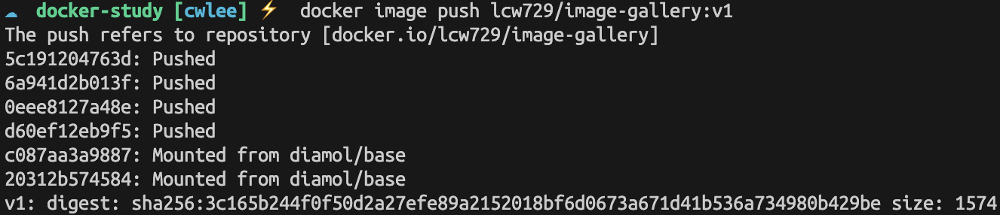
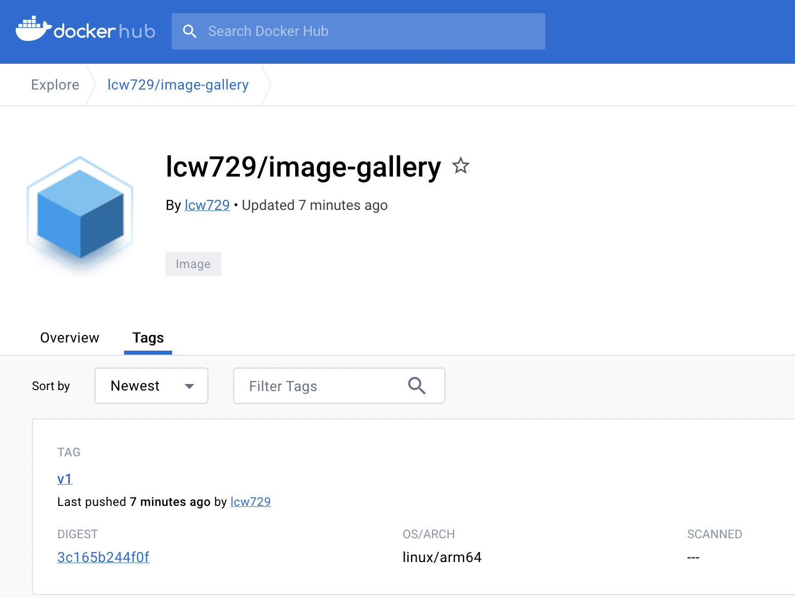
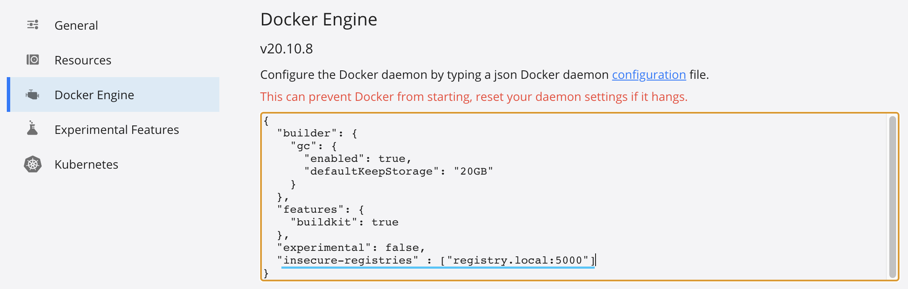
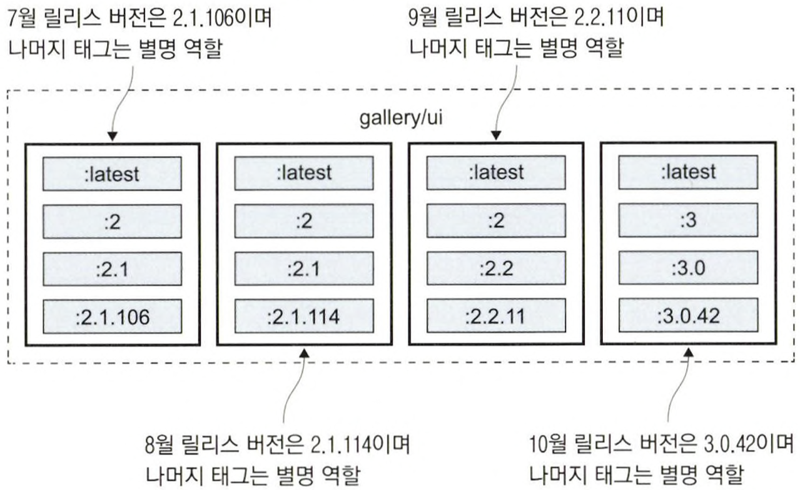
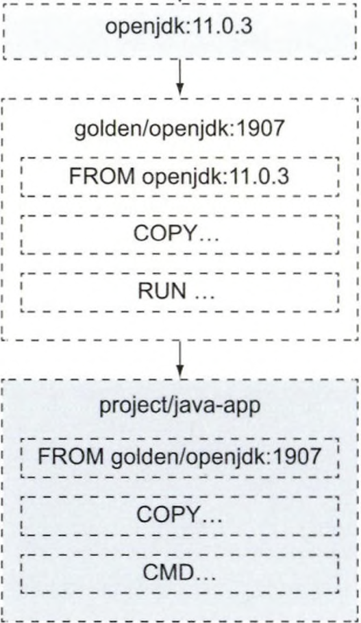

# 5장 도커 허브 등 레지스트리에 이미지 공유하기

## 5.1 레지스트리, 리포지터리, 이미지 태그 다루기

도커 허브는 도커 엔진에 기본으로 설정된 레지스트리이다. 로컬 컴퓨터에 잆는 이미지를 내려받으려 할 때 가장 먼저 찾아보는 곳이다.

```docker
docker.io/diamol/golang:latest

1. docker.io - 이미지가 저장된 레지스트리의 도메인. 기본값은 도커 허브다.
2. diamol - 이미지 작성자의 계정 이름.
3. golang - 이미지 레포지터리 이름.
4. latest - 이미지 태그.
```

직접 애플리케이션을 패키징하려면 항상 태그를 부여해야 한다. 

태그는 같은 애플리케이션의 서로 다른 버전을 구별하기 위해 쓰인다.

## 5.2 도커 허브에 직접 빌드한 이미지 푸시하기

📌 도커 허브 계정을 환경 변수로 정의한다.

```docker
export dockerId="도커허브계정이름"
```

1. 도커 명령행을 통해 레지스트리에 로그인한다.
    
    ```docker
    $ docker login --username $dockerid
    ```
    
2. 이미지에 푸시 권한을 가진 계정명을 포함하는 이미지 참조를 붙인다.
    
    ```docker
    $ docker image tag image-gallery $dockerId/image-gallery:v1
    ```
    

📌 image-gallery 이미지의 이미지 참조 목록을 확인한다.

- 여러 개의 이미지 참조가 같은 이미지를 가리키고 있다.

```docker
$ docker image ls --filter reference=image-gallery --filter reference='*/image-gallery'
REPOSITORY             TAG       IMAGE ID       CREATED       SIZE
lcw729/image-gallery   v1        61d9d5bf1201   6 hours ago   26.2MB
image-gallery          latest    61d9d5bf1201   6 hours ago   26.2MB
```

📌  $dockerId/image-gallery:v1 이미지를 레지스트리에 푸시한다.

- 이미지를 푸시할 때 실제로 업로드 대상이 되는 것은 이미지 레이어이다.
- **`docker push`**를 실행할 때, Docker는 레지스트리가 이미 가지고 있는 레이어는 다시 업로드하지 않는다.
- 이는 불필요한 데이터 전송을 줄여준다.

```docker
$ docker image push lcw729/image-gallery:v1
```





## 5.3 나만의 도커 레지스트리 운영하기

도커 코어 레지스트리 서브는 깃허브 저장소 `docker/distribution` 에서 개발이 진행되다.

코어 레지스트리 서버는 도커 허브와 동일한 레이어 캐시 시스템을 통해 이미지를 내려받고 푸시하는 기본적인 기능을 제공한다.

📌  도커 레지스트리를 실행한다.

```docker
# --restart 플래그를 부여하면 도커를 재시작했을 때 해당 컨테이너도 자동으로 재시작된다.
$ docker container run -d -p 5000:5000 --restart always diamol/registry
```

📌  도메인 네임을 별명으로 붙인다. (mac)

```docker
$ echo $'\n127.0.0.1 registry.local' | sudo tee -a /etc/hosts
```

📌  image-gallery 이미지에 새로 만든 레지스트리 도메인 네임을 추가해 이미지 참조를 부여한다.

```docker
$ docker image tag image-gallery registry.local:5000/gallery/ui:v1
```

소규모 팀에 상당히 유효하고, 자신만의 이미지 참조 명명 체계를 만들 수 있다는 장점이 있다.

- registry.local:5000/gallery/ui:v1 : Go 애플리케이션
- registry.local:5000/gallery/api:v2 : 자바로 구현된 API
- registry.local:5000/gallery/logs:v1 : Node.js로 구현된 API

### Docker 비보안 레지스트리 허용 하기

레지스트리 컨테이너는 이미지를 푸시하고 내려받기 위한 보안 프로토콜인 HTTPS 대신 비보안 프로토콜인 HTTP를 사용한다.

도커의 기본 설정에서는 비보안 프로토콜이 적용된 레지스트리를 사용할 수 없게 돼 있다.

1. `daemon.json` 파일 수정하기
- 레이어의 저장 경로, 도커 API가 주시하는 포트 번호, 허용된 비보안 레지스트리 목록 등 도커 엔진의 모든 설정을 관리하는 설정 파일이다.



1. docker info로 확인하기

```docker
$ docker info
```

📌 태그를 부여한 이미지 푸시한다.

```docker
$ docker image push registry.local:5000/gallery/ui:v1
```

실제 도메인 네임이나 IP 주소를 알려주면 로컬 네트워크상의 다른 사람에게 이미지를 공유할 수 있다.

## 5.4 이미지 태그를 효율적으로 사용하기

### 버전 표현법

```docker
[major].[minor].[patch]
```

- patch : 변경 내용이 비그 수정뿐이다.
- minor : 추가된 기능은 있으되 기존 기능은 모두 유지한다.
- major : 완전히 다른 기능을 가진다.

📌  일부 태그는 릴리스에 따라 옮겨다닌다.

- 패치 업데이트를 자동으로 전달받고 싶다 : 2.1 태그 사용
- 마이너 업데이트를 자동으로 전달받고 싶다 : 2 태그 사용



직접 작성한 Dockerfile 스크립트의 기반 이미지는 가능한 한 정확한 버전을 지정하는 것이 좋다. 개발 팀과 동일한 도구로 빌드하고 동일한 런타임을 사용해 실행할 수 있기 때문이다.

📌  로컬 레지스트리의 이미지 목록을 조회한다.

```docker
$ curl -X GET http://registry.local:5000/v2/_catalog
{"repositories":["gallery/ui"]}

$ curl -X GET http://localhost:5000/v2/'gallery/ui'/tags/list | jq '.tags[]'
"v1"
```

## 5.5 공식 이미지에서 골든 이미지로 전환하기

도커 허브는 검증된 퍼블리셔와 공식 이미지 제도를 통해 보안 피해를 방지한다.

1. 검증된 퍼블리셔

도커 허브를 통해 이미지를 배포하는 단체들 중에서 마이크로소프트, 오라클, IBM같은 신뢰할 수 있는 큰 기입을 ‘검증된 퍼블리셔’로 지정한다. 

이들이 배포하는 이미지는 취약점 탐지 등의 승인 절차를 거쳐 공개된다.

1. 공식 이미지

공식 이미지는 취약점 탐색을 거치고 주기적으로 업데이트되며, 잘 최적화된 Dockefile 스크립트로 구성된다.

공식 이미지의 모든 콘텐츠는 오픈 소스이며 깃허브 저장소에서 Dockerfile 스크립트를 직접 볼 수 있다.

1. 공식 이미지 → 골든 이미지

대부분의 경우 이 공식 이미지를 기반 이미지로 삼아 이미지를 빌드하기 시작하지만, 직접 빌드한 이미지를 사용하다 보면 좀 더 많은 것을 통제하고자 하는 시기가 온다.

이 시점에 자신이 선호하는 기반 이미지로 전환한다. 이 이미지를 `골든 이미지` 라고 한다.

골든 이미지는 공식 이미지를 기반 이미지로 삼아 인증서나 환경 설정값 등 자신이 필요한 설정을 추가한 것이다.



- openJDK의 특정 버전을 제공하는 공식 이미지는 도커 허브를 통해 제공된다.
- openJDK를 기반으로 하며 필요에 따라 수정된 우리가 기반 이미지로 쓰는 이미지이다.
- 우리가 개발한 자바 애플리케이션은 모두 골든 이미지를 기반 이미지로 삼는다.

📌 닷넷 코어 애플리케이션을 위한 골든 이미지를 빌드한다.

```docker
$ docker image build -t golden/dotnetcore-sdk:3.0
```

- dotnet-sdk Dockerfile
    
    LABEL 인스트럭션을 사용해 이미지의 메타데이트를 정의하고 일반적인 설정이 몇 가지 추가되어 있다.
    
    ```docker
    FROM mcr.microsoft.com/dotnet/core/aspnet:3.0
    
    LABEL framework="dotnet"
    LABEL version="3.0"
    LABEL description=".NET Core 3.0 Runtime"
    LABEL owner="golden-images@sixeyed.com"
    
    EXPOSE 80
    ```
    

📌 골든 이미지를 사용한 닷넷 코어 애플리케이션의 멀티 스테이지 빌드 스크립트

```docker
FROM golden/dotnetcore-sdk:3.0 AS builder
COPY . .
RUN dotnet publish -o /out/app app.csproj

FROM golden/aspnet-core:3.0
COPY --from=builder /out /app
CMD ["dotnet', "/app/app.dll"]
```

골든 이미지는 업데이트 주기를 마음대로 정할 수 있다. 또한 지속적 통합 파이프라인에서 Dockerfile 스트립트를 확인하는 방법으로 골든 이미지 사용을 강제하는 것도 좋은 방법이다.

## 5.6 연습 문제
[공식문서](https://docs.docker.com/registry/spec/api/)

### 이미지 업로드 하기
```
☁  ch05 [main] ⚡  docker image push registry.local:5000/gallery/ui
```

</br>

### 대상 리포지터리(gallery/ui)의 태그 목록 확인하기
```
☁  ch05 [main] ⚡  curl -X GET http://registry.local:5000/v2/gallery/ui/tags/list
{"name":"gallery/ui","tags":["v1"]}
```

</br>

### 이미지 매니페스트 확인하기
`Docker-Content-Digest` Header를 확인한다.
```
☁  ch05 [main] ⚡  curl --head \
  http://registry.local:5000/v2/gallery/ui/manifests/v1 \    
  -H 'Accept: application/vnd.docker.distribution.manifest.v2+json'
HTTP/1.1 200 OK
Content-Length: 1574
Content-Type: application/vnd.docker.distribution.manifest.v2+json
...
```

</br>

### 이미지 삭제하기
```
☁  ch05 [main] ⚡  curl -X DELETE http://registry.local:5000/v2/gallery/ui/manifests/sha256:...
```

</br>

### 대상 리포지터리(gallery/ui)의 태그 목록 확인하기
```
☁  ch05 [main] ⚡  curl -X GET http://registry.local:5000/v2/gallery/ui/tags/list
{"name":"gallery/ui","tags":null}
```