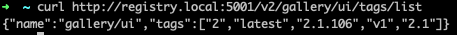
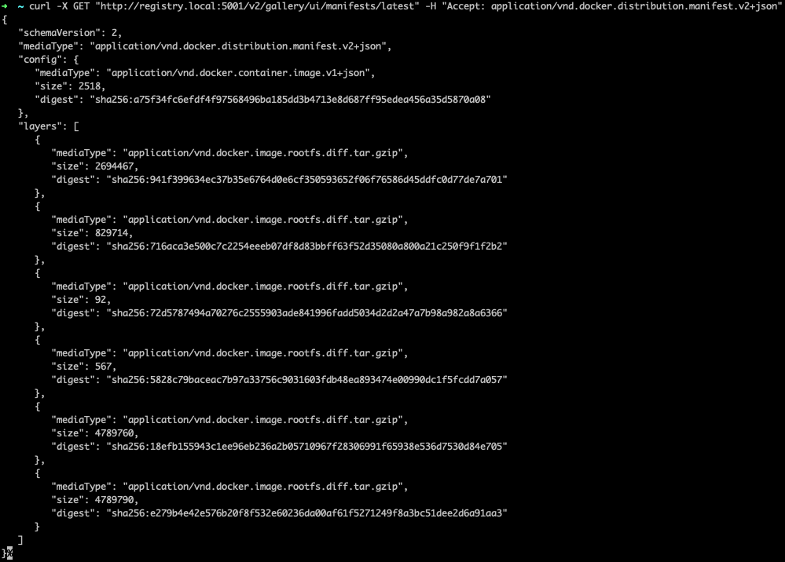

```shell
docker push -a registry.local:5001/gallery/ui
```

- a 옵션을 사용해서 모든 tag를 푸쉬합니다.

```shell
curl http://registry.local:5001/v2/gallery/ui/tags/list
```



```shell
curl --head "http://registry.local:5001/v2/gallery/ui/manifests/latest" -H "Accept: application/vnd.docker.distribution.manifest.v2+json"
```

- manifest 가져오기
  

```shell
curl -X DELETE \
  http://registry.local:5001/v2/gallery/ui/manifests/sha256:9f9cf301ddf92b1905b540f74b0dffc038b2456c349d8abc24340b1ca31ef6ec
```

```shell
docker push -a registry.local:5001/gallery/ui
```

- 삭제가 잘되었는지 확인합니다.
