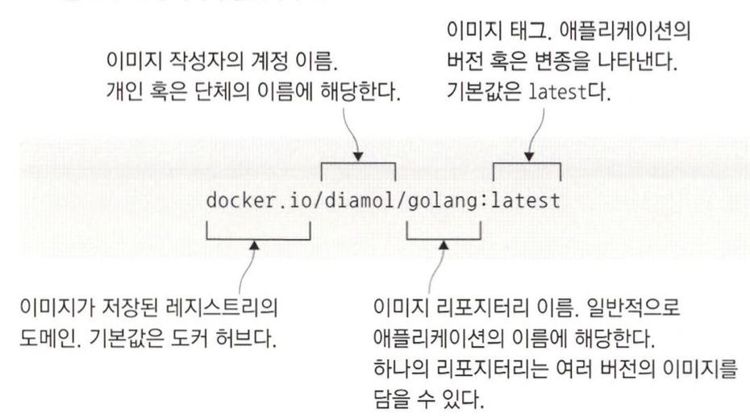
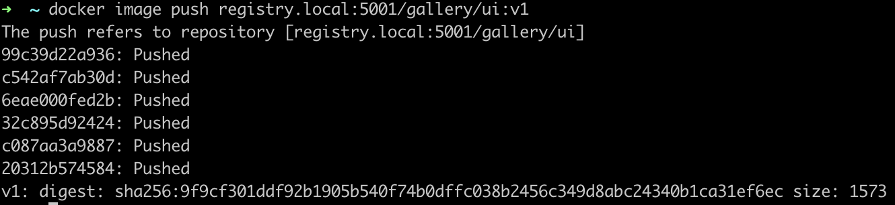
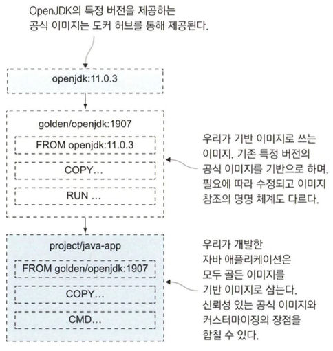

# 도커 허브등 레지스트리에 이미지 공유하기

## 레지스트리, 레포지터리, 이미지태그 다루기

- 내려받은 이미지는 도커 레지스트리라는 서버에 저장된다.
- 도커 이미지 참조 구성은 아래와 같습니다.

  

  - 레지스트리의 기본값은 `도커 허브`
  - 태그의 기본값은 `latest`
  - 도커 허브의 도메인은 `docker.io`

## 도커 허브에 직접 빌드한 이미지 푸시 하기

```
export dockerld="hyoseong1994"
```

- 명령어를 통해 mac 환경변수로 도커허브 username으를 추가할 수 있습니다. 조회는 `echo $dockerld` 로 가능합니다.
- export는 임시 변수라서 터미널 재실행시 사라집니다. zsh을 사용한다면 `vi ~/.zshrc` 명령어를 통해 환경변수로 등록해야 영구 사용 가능합니다.

```shell
docker login --username $dockerId
```

- 환경변수로 등록한 username으로 로그인합니다.

```shell
docker image tag image-gallery $dockerId/image-gallery:v1
```

- 환경변수로 등록한 username으로 이미지 참조를 추가합니다.

```shell
docker image ls -f reference=image-gallery -f reference='*/image-gallery'
```

- image-gallery 라는 이미지는 두 개의 이미지 참조를 갖습니다.

```shell
 docker image push $dockerId/image-gallery:v1
```

- docker hub에 이미지를 푸쉬합니다.
- `https://hub.docker.com/r/hyoseong1994/image-gallery/tags` 에서 push image를 확인할 수 있습니다.
- 도커 이미지 푸쉬는 레이어별로 되기 때문에 최적화를 잘한다면 레이어는 레지스트리 캐시를 사용합니다.

## 나만의 도커 레지스트리 운영하기

```shell
docker container run -d -p 5001:5000 --restart always diamol/registry
```

- 도커 레지스트리를 만듭니다.
- 5000 post는 mac air play가 사용중이므로 5001로 대체

```shell
docker image tag image-gallery registry.local:5001/gallery/ui:v1
docker image tag image-of-the-day registry.local:5001/gallery/api:v1
docker image tag access-log registry.local:5001/gallery/logs:v1
```

- NASA의 오늘의 사진 애플리케이션을 실행했던 세 개 컨테이너의 이미지를 도메인 네임을 추가해 이미지 참조를 부여합니다.
- 도커는 기본적으로 https를 지원하지만 이 레지스트리 컨테이너는 이미지를 푸시하고 내려받기 위해 비보안 프로토콜(http)를 사용해야합니다. mac 기준 `/Users/{사용자명}/.docker` 이 경로에 가면 `daemon.json` 파일이 있으며

  ```
  {
      "insecure-registries" : ["registry.local:5000"]
  }
  ```

  이 내용을 추가하거나 도커 데스크탑에서 설정 > docker engine 에서 수정할 수 있습니다. 수정 후 재시작하면 적용됩니다. `docker info` 명령을 통해 확인가능합니다.

```shell
docker image push registry.local:5001/gallery/ui:v1
```

- registry.local:5001에 gallery 이미지를 푸쉬합니다.
  

Q. 이미지 푸쉬하는 레지스트리를 지정할 필요가 없는건가?

## 이미지 태그를 효율적으로 사용하기

```shell
docker image tag image-gallery registry.local:5001/gallery/ui:latest
docker image tag image-gallery registry.local:5001/gallery/ui:2
docker image tag image-gallery registry.local:5001/gallery/ui:2.1
docker image tag image-gallery registry.local:5001/gallery/ui:2.1.106
```

- major나 minor version만 입력하여 pull 받으면 해당 버전에 최신버전을 받을 수 있습니다.

## 공식 이미지에서 골든 이미지로 전환하기



- 골든 이미지는 공식 이미지를 기반 이미지로 삼아 인증서나 환경 설정값 등 자신이 필요한 설정을 추가한 것입니다.
- 프로젝트 개발 팀과 도커가 함께 최적화한 공식 이미지의 이점을 그대로 누리면서 필요한 설정을 추가할 수 있다는 것이 장점입니다.

```shell
cd ch05/exercises/dotnet-sdk && docker image build -t golden/dotentcore-sdk:3.0 .

cd ch05/exercises/aspnet-runtime && docker image build -t golden/aspnet-core:3.0 .
```

- 골든 이미지 예제를 빌드합니다.
