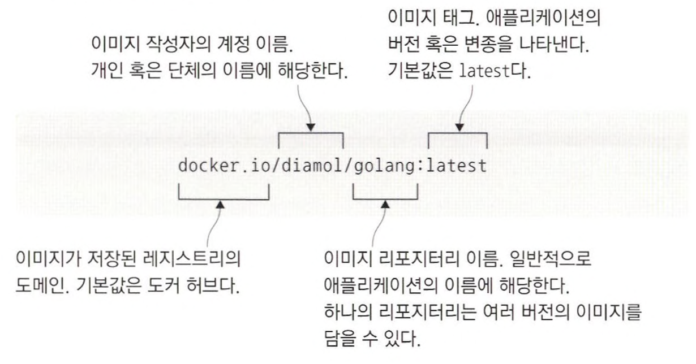
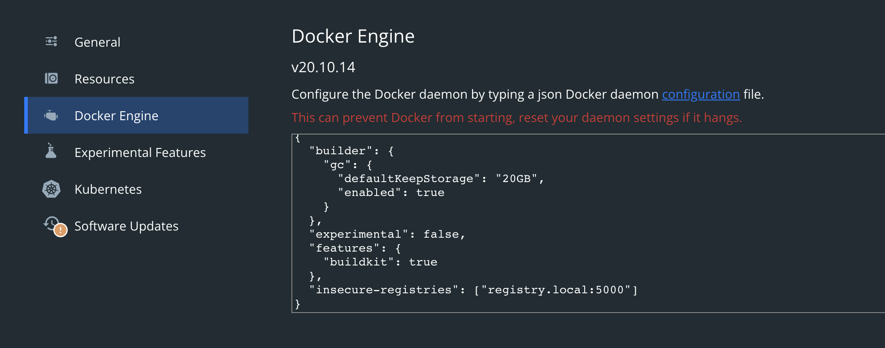
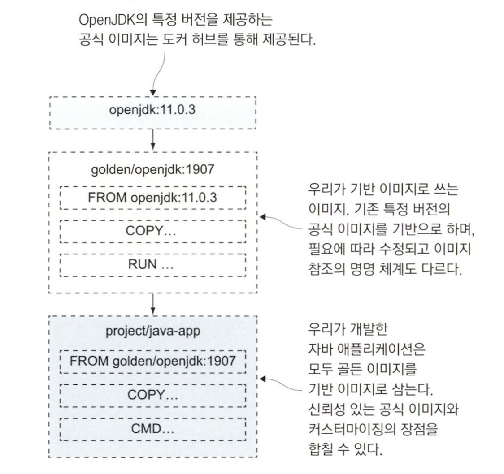

# registry, repository, image tag

내려받은 이미지는 **도커 레지스트리**라고 불리는 서버에 저장된다. 도커 허브는 도커 레지스트리 중에서 가장 유명한 레지스트리이다. <br>
도커 허브는 도커 엔진에 기본으로 설정된 레지스트리이다.

**도커 이미지**에는 이름이 부여되는데, 이 이름에 해당 이미지를 내려받기 위해 필요한 정보가 들어있다. <br>
이미지의 **전체 이름(이미지 참조)** 은 네 개의 요소로 구성된다.



레지스트리와 태그 등의 정보는 따로 지정하지 않아도 도커가 미리 정해진 기본값을 사용한다. <br>
레지스트리의 기본값은 도커 허브이고, 태그의 기본값은 latest다. <br>
이 repository는 누구든지 이미지를 내려받을 수 있지만, push는 diamol 단체의 소속원만 할 수 있다.

직접 애플리케이션을 패키징하려면 항상 태그를 부여해야 한다. <br>
태그는 같은 애플리케이션의 서로 다른 버전을 구별하기 위해 쓰인다.

<br>
<hr>

# 도커 허브에 이미지 푸시

레지스트리에 이미지를 푸시하려면 두 가지 절차가 필요하다.

1. 도커 명령행을 통해 레지스트리에 로그인한다.
2. 이미지에 푸시 권한을 가진 계정명을 포함하는 이미지 참조를 붙인다.

<br>

```
// 도커 허브 계정을 환경 변수로 등록 
export dockerld="도커허브계정이름"
```

<br>

```
docker login --username $dockerId
```

도커 허브에 로그인

<br>

```
docker image tag image-gallery $dockerId/image-gallery:v1
```

기존 이미지에 새로운 이미지 참조를 부여

<br>

```
docker image ls --filter reference=image-gallery --filter reference='*/image-gallery'

// 실행 결과
REPOSITORY               TAG       IMAGE ID       CREATED        SIZE
beyool95/image-gallery   v1        4ea1e7a37cf4   16 hours ago   26.2MB
image-gallery            latest    4ea1e7a37cf4   16 hours ago   26.2MB
```

두 이미지 참조가 같은 이미지를 가리키고 있다.

<br>

```
docker image push $dockerId/image-gallery:v1

// 실행 결과
The push refers to repository [docker.io/beyool95/image-gallery]
7ffb74d8c042: Pushed
06accb9bdca9: Pushed
521c77ed91df: Pushed
598bcbd4ac6d: Pushed
c087aa3a9887: Mounted from diamol/base
20312b574584: Mounted from diamol/base
v1: digest: sha256:488987c83f0657a2ef0451d462d090c7ae47735c98f9fc759c4879a5f4a7961f size: 1574
```

$dockerId/image-gallery:v1 이미지를 레지스트리에 push

이미지를 push할때 실제로 업로드 되는 대상은 이미지 레이어이고, 그래서 Dockerfile 스크립트 최적화가 더 중요해진다. <br>
레지스트리에서도 캐시에 레이어 해시와 일치하는 레이어가 없을 경우에만 실제로 업로드가 이뤄진다. <br>
*Dockerfile 스크립트는 빌드 시간. 디스크 용량을 넘어 네트워크 대역폭까지 영향을 미치는 중요한 요소다.*

<br>

```
echo "https://hub.docker.com/r/$dockerId/image-gallery/tags"

// 실행 결과
https://hub.docker.com/r/beyool95/image-gallery/tags
```

도커 허브에 새로 푸시된 이미지에 대한 도커 허브 웹 페이지 url 출력

기존의 repository가 없는 이미지를 푸시하면 도커 허브에 repository를 새로 생성하고, 공개 상태가 된다.

<br>
<hr>

# 나만의 도커 레지스트리 운영

로컬 네트워크에 전용 레지스트리가 있으면 편리한 점이 많다.

- 인터넷 회선 사용량을 줄여주고 전송 시간도 절약.
- 데이터를 다른 사람의 손에 맡기지 않아도 된다.
- 공개 레지스트리가 다운됐을 때 신속하게 전환 가능.

```
docker run -d -p 5000:5000 --restart always diamol/registry

// 실행 결과
Unable to find image 'diamol/registry:latest' locally
latest: Pulling from diamol/registry
941f399634ec: Already exists
716aca3e500c: Already exists
ee3139e3a39a: Pull complete
aea0fab1b866: Pull complete
a713e401955a: Pull complete
ddeb6e5f6d05: Pull complete
Digest: sha256:49c5a928c870d496013d98d4357c93f35b1896a0385ef275664bc43e69b14950
Status: Downloaded newer image for diamol/registry:latest
29ae44acf4b973bd2ba655201c034775be7fd7b075c73bc90be731cd3c24cd8f
```

로컬 컴퓨터에 전용 레지스트리를 생성

이 레지스트리 서버의 기본 포트는 5000이고, 레지스트리의 도메인 localhost:5000을 사용해 이미지에 태그를 부여하면 새로운 레지스트리에 이미지를 푸시 가능하다.

<br>

```
echo $'\n127.0.0.1 registry.local' | sudo tee -a /etc/hosts

// 실행 결과
127.0.0.1 registry.local
```

```
ping registry.local

// 실행 결과
PING registry.local (127.0.0.1): 56 data bytes
64 bytes from 127.0.0.1: icmp_seq=0 ttl=64 time=0.067 ms
64 bytes from 127.0.0.1: icmp_seq=1 ttl=64 time=0.181 ms
64 bytes from 127.0.0.1: icmp_seq=2 ttl=64 time=0.166 ms
```

이제부터 이미지 참조에 도메인 네임인 registry.local:5000을 사용할 수 있다.

<br>

```
docker image tag image-gallery registry.local:5000/gallery/ui:v1
docker image tag access-log registry.local:5000/gallery/logs:v1
docker image tag image-of-the-day registry.local:5000/gallery/api:v1
```

기존 이미지에 새로 만든 레지스트리 도메인 네임을 추가해 이미지 참조를 부여 <br>

도커의 기본 설정에서는 HTTP를 이용한 레지스트리를 사용할 수 없게 되어 있다. <br>
비보안 레지스트리를 사용하려면 로컬 컴퓨터의 레지스트리를 비보안 레지스트리 허용 목록에 추가해야 한다.

> 이미지 레이어의 저장 경로. 도커 API가 주시하는 포트 번호. 허용된 비보안 레지스트리 목록 등 도커 엔진의 모든 설정은 <br>
> daemon.json이라는 이름의 JSON 포맷으로 된 설정 파일에 들어 있다.



로컬 컴퓨터에서 실행한 레지스트리의 도메인 네임을 비보안 레지스트리 허용 목록에 추가

<br>

```
docker info

// 실행 결과
 Registry: https://index.docker.io/v1/
 Labels:
 Experimental: false
 Insecure Registries:
  hubproxy.docker.internal:5000
  registry.local:5000
```

도커 엔진 설정 정보를 출력해 비보안 레지스트리 허용 목록에 등록됐는지 확인

> 비보안 레지스트리를 사용할 때는 주의가 필요하다. <br>
> 도커 엔진과 레지스트리의 통신 내용을 다른 사람이 엿볼 수 있으며 이미지 푸시 과정에서 레이어가 유출될 수 있다. <br>
> 레지스트리에서 이미지를 받아올 때 가짜 이미지를 받아올 수도 있다.


```
docker image push registry.local:5000/gallery/ui:v1

// 실행 결과
The push refers to repository [registry.local:5000/gallery/ui]
7ffb74d8c042: Pushed
06accb9bdca9: Pushed
521c77ed91df: Pushed
598bcbd4ac6d: Pushed
c087aa3a9887: Pushed
20312b574584: Pushed
v1: digest: sha256:488987c83f0657a2ef0451d462d090c7ae47735c98f9fc759c4879a5f4a7961f size: 1574
```

태그를 부여한 이미지를 푸시

<br>
<hr>

# 이미지 태그 효율적으로 사용

도커 이미지 태그에는 어떤 문자열도 포함시킬 수 있다. <br>
대부분의 소프트웨어가 소숫점으로 구분된 숫자로 버전을 나타낸다. <br>
[major].[minor].[patch] 형태이고, 이 방식으로 두 버전의 대략적인 차이를 짐작할 수 있다.

직접 작성한 Dockerfile 스크립트의 기반 이미지는 정확한 버전을 지정하는 것이 좋다. <br>
개발 팀과 동일한 도구로 빌드하고 동일한 런타임을 사용해 실행할 수 있기 때문이다.

<br>
<hr>

# 공식 이미지에서 골든 이미지로 전환

도커 허브를 통해 이미지를 배포하는 단체들 중에서도 마이크로소프트, 오라클, IBM 같은 신뢰할 수 있는 큰 기업을 **검증된 퍼블리셔**로 지정한다. <br>
이들이 배포하는 이미지는 취약점 탐지 등의 승인 절차를 거쳐 공개된다.

**공식 이미지**는 이와 좀 다르다. <br>
공식 이미지로 배포되는 소프트웨어는 주로 오픈 소스이고, 해당 프로젝트 개발 팀과 도커가 함께 이미지를 관리한다. <br>
이도 역시 취약점 탐색을 마치고 주기적으로 업데이트되고, 최적화된 Dockerfile 스크립트로 구성된다.

대부분 이 공식 이미지를 기반 이미지로 삼아 이미지를 빌드하기 시작하지만, 직접 빌드한 이미지를 사용하다 보면 좀 더 많은 것을 통제하고자 하는 시기가 온다. <br>
이 시점에서 자신이 선호하는 기반 이미지로 전환하고, 이 이미지를 **골든 이미지**라고 한다.



<br>

> 골든 이미지는 공식 이미지를 기반 이미지로 삼아 인증서나 환경 설정값 등 자신이 필요한 설정을 추가한 것이다. <br>
> 골든 이미지는 도커 허브의 기업 repository나 자체 repository에서 관리된다. <br>
> 그리고 해당 기업의 모든 애플리케이션 이미지는 이 골든 이미지를 기반 이미지로 한다.

<br>

```
cd ch05/exercises/dotnet-sdk
docker image build -t golden/dotnetcore-sdk:3.0 .

cd ../aspnet-runtime
docker image build -t golden/aspnet-core:3.0 .
```

닷넷 코어 애플리케이션을 위한 골든 이미지를 빌드할 수 있는 스크립트 실행

<br>

```
FROM golden/dotnetcore-sdk:3.0 AS builder
COPY . .
RUN dotnet publish -o /out/app app.csproj

FROM golden/aspnet-core:3.0
COPY --from=builder /out /app 
CMD ["dotnet", "/app/app.dll"]
```

골든 이미지를 사용한 닷넷 코어 애플리케이션 멀티 스테이지 빌드 스크립트

<br>
<hr>


