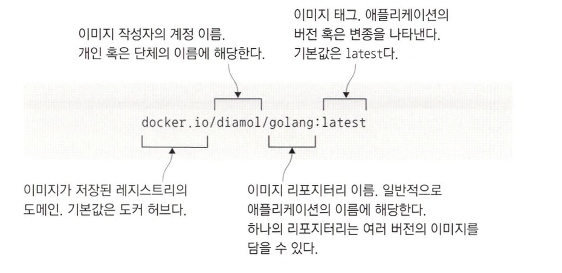
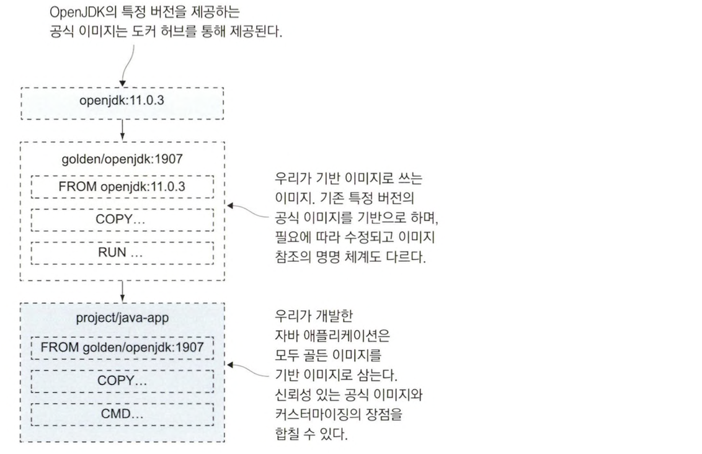

# 도커 허브 등 레지스트리에 이미지 공유하기

## 레지스트리, 레포지터리, 이미지 태그 다루기

도커 플랫폼은 소프트웨어 배포 기능을 내장하고 있습니다.

로컬 컴퓨터에 이미지를 갖고 있지 않더라도 도커가 자동으로 이미지를 내려받아 줍니다.

내려받은 이미지는 도커 레지스트리라고 불리는 서버에 저장됩니다.

### 도커 허브

도커 허브는 도커 레지스트리 중에서 가장 많이 사용되는 레지스트리로 수십만 종 이상의 이미지를 제공하며, 다운로드 횟수가 한 달에 수십억 회에 달합니다.

도커 허브는 도커 엔진에 기본으로 설정된 레지스트리이기도 합니다.

즉, 로컬 컴퓨터에 없는 이미지를 내려받으면 가장 먼저 확인 하는 곳이 도커 허브입니다.

### 도커 이미지의 이름

도커 이미지의 이름이 부여되는데 이 이름에 해당 이미지를 내려받기 위해 필요한 모든 정보가 들어가 있습니다.

이미지의 전체 이름은 다음과 같이 네 개의 요소로 구성됩니다.

```docker
{레지스트리 도메인}/{이미지 작성자 계정}/{이미지 이름}:{이미지 태그}
```



로컬 컴퓨터에서만 사용한다면 이미지 이름을 마음대로 지어도 문제 없지만 레지스트리를 통해 다른 사람이 이미지를 사용하게 하려면 좀 더 상세하게 이름을 지어야 합니다.

`이미지 이름을 통해 특정한 이미지를 식별`할 수 있기 때문입니다.

레지스트리와 태그 등의 정보는 따로 지정하지 않아도 미리 정해진 기본값을 사용합니다.

- 레지스트리의 기본 값은 `도커 허브`를 사용합니다.
- 태그의 기본값은 `latest`를 사용합니다.

만약 이미지의 이름이 diamol/golang 이라면 이미지 참조는 다음과 같습니다.

```docker
docker.io/diamol/golang:latest
```

### 별도의 레지스트리

규모가 큰 회사의 경우 사내 네트워크나 전용 클라우드 환경에 자사의 도커 레지스트리를 별도로 꾸리는 경우가 많습니다.

이미지 참조의 첫 부분에 이런 인하우스 레지스트리의 도메인을 기재하면 도커는 도커 허브 대신 해당 레지스트리를 찾아갑니다.

만약, 내가 [r.sixeyed.com](http://r.sixeyed.com) 이라는 도메인에 나의 전용 레지스트리를 만들고 diamon/golang 이미지를 레지스트리에 푸시했다면 이미지 참조는 다음과 같습니다.

```docker
r.sixeyed.com/diamol/golang
```

### 태그

애플리케이션 버전을 지정하고 싶은 경우 태그를 사용할 수 있습니다.

예를 들어 OpenJDK 이미지 같은 경우 수백개에 달하는 태그가 있습니다.

`openjdk:17`, `openjdk:8u212-jdk` 같이 특정 버전에 해당하는 이미지를 지정할 수 있습니다.

만약, 태그를 따로 지정하지 않는 경우 자동으로 latest 태그가 부여됩니다.

그러나 새로 만든 이미지가 항상 최신 버전의 이미지가 아닐 수도 있기 때문에 태그를 명시적으로 지정하지 않으면 오해를 일으키기 쉽습니다.

그래서 레지스트리에 이미지를 푸시할 때는 항상 명시적으로 태그를 부여하는 것이 좋습니다.

## 도커 허브에 직접 빌드한 이미지 푸시하기

<aside>
💡 이미지 푸시는 도커 허브에서 진행 됩니다.

</aside>

### 도커 명령행을 통해 레지스트리 로그인

도커 허브에 푸시하기 위해 레지스트리에 이미지를 푸시할 권한을 가진 계정 정보를 담아야 합니다.


다음과 같이 login 명령을 이용하여 로그인할 수 있습니다.

```docker
docker login --username {이미지 작성자 계정}
```

패스워드를 정상적으로 입력하면 다음과 같이 출력됩니다.

```docker
Login Succeeded
```

### 이미지 푸시하기

이제 본인의 계정이나 푸시 권한이 부여된 단체 계정에 이미지를 푸시할 수 있습니다.

이미지 푸시전에 다음 명령어를 사용하면 원하는 이미지의 태그를 변경할 수 있습니다.

```docker
docker image tag {이미지 이름} {이미지 작성자 계정}/{이미지 이름}:{태그}
```

이렇게 태그를 지정하면 원본 이미지와 태그를 지정한 이미지 두개의 이미지 참조를 가지게 됩니다.

<aside>
💡 위와 같이 태그를 지정하면 새로운 이미지를 만드는 것이 아닌 원본 이미지를 참조하게 됩니다.

</aside>

이제 다음과 같이 명령어를 입력하면 도커 허브에 이미지를 푸시할 수 있습니다.

```docker
docker image push {이미지 작성자 계정}/{이미지 이름}
```

### 도커 레지스트리의 이미지 레이어

도커 레지스트리도 로컬 컴퓨터에서 동작하는 도커 엔진과 같은 방식으로 이미지 레이어를 다룹니다.

이미지를 푸시할 때 실제로 업로드 대상이 되는 것은 이미지 레이어 입니다.

출력되는 내용을 보면 일련의 레이어의 업로드 상황이 표시됩니다.

다음은 이미지 레이어를 푸시했을때 출력된 내용의 일부입니다.

```docker
The push refers to repository [docker.io/zxcv9203/image-gallery]
7d6b2ce61c84: Pushed 
545f50e2c8c5: Pushed 
315818e5996d: Pushed 
3bb2e7fbe23a: Pushed 
c087aa3a9887: Mounted from diamol/base 
20312b574584: Mounted from diamol/base
```

레지스트리 역시 도커 엔진과 같은 방식으로 이미지 레이어를 다루기 때문에 그만큼 Dockerfile 스크립트의 최적화가 중요합니다.

레지스트리에서도 캐시상에 레이어 해시와 일치하는 레이어가 없을 경우에만 실제로 이루어집니다.

도커 엔진의 레이어 캐시와 완전히 같은 방식이지만, 레지스트리상의 전체 이미지를 대상으로 한다는 점이 다릅니다.

레이어의 90%가 기존 캐시를 재사용할 수 있도록 이미지를 최적화했다면, 이 이미지를 푸시할 때 90%의 레이어는 레지스트리의 캐시를 재사용할 수 있습니다.

이렇듯 최적화된 Dockerfile 스크립트는 빌드 시간, 디스크 용량을 넘어 네트워크 대역폭까지 영향을 미치는 요소입니다.

### 도커 허브와 레지스트리

도커 허브는 레지스트리 중에서도 가장 접근성이 좋고 이미지 공개시 무료로 사용할 수 있습니다.

물론, 레지스트리는 개방형 API 명세이기 때문에 도커 허브이외에도 많은 레지스트리가 존재합니다.

다양한 클라우드 서비스에서 자체 레지스트리 서비스를 제공할 수 있고 직접 레지스트리를 구성하여 사용할 수도 있습니다.

## 나만의 도커 레지스트리 운영하기

로컬 네트워크에 전용 레지스트리가 있으면 다음과 같은 장점이 있습니다.

- 인터넷 회선 사용량을 줄여주며 전송 시간을 절약할 수 있습니다.
- 다른 사람이 함부로 접근할 수 없습니다.
- 사용하는 공개 레지스트리가 다운됐을 때 신속하게 전환할 수 있습니다.

위와 같은 장점을 활용하기 위해 직접 도커 레지스트리를 만들어봅시다.

### 도커 코어 레지스트리 서버

도커 코어 레지스트리 서버는 깃허브 저장소 docker/distribution 에서 개발이 진행됩니다.

코어 레지스트리 서버는 도커 허브와 동일한 레이어 캐시 시스템을 통해 이미지를 내려받고 푸시하는 기본적인 기능을 제공합니다.

다음 명령을 통해 컨테이너 형태로 도커 레지스트리를 실행해봅시다.

```docker
docker container run -d -p 5001:5000 --restart always diamol/registry
```

<aside>
💡 위의 diamol/registry는 코어 레지스트리 서버를 패키징한 이미지입니다.

</aside>

이제 [localhost:5000](http://localhost:5000) 으로 이미지를 푸시할 수 있게 됩니다.

이제 좀 더 활용도를 높이기 위해 hosts 파일에 별명을 추가합시다.

```docker
echo $'\n127.0.0.1 registry.local' | sudo tee -a /etc/hosts
```

이제 이미지를 직접 푸시하기 위해 다음과 같이 tag로 이미지 참조를 부여합시다.

```docker
docker image tag image-gallery registry.local:5001/gallery/ui:v1
```

로컬 컴퓨터에 실행중인 레지스트리에는 별도의 인증 수단이 없으며, 레지스트리 운영을 위해 직접 사용할 수 있을만한 수준은 아닙니다.

하지만 소규모 팀에서는 상당히 유효하고, 자신만의 이미지 참조 명명 체계를 만들 수 있다는 장점도 있습니다.

### 비보안 레지스트리 허용

도커의 기본설정으로는 비보안 프로토콜이 적용된 레지스트리를 사용할 수 없습니다.

현재는 HTTPS가 아닌 HTTP를 사용하고 있으므로, 사용하고 있는 레지스트리를 비보안 레지스트리 허용 목록에 추가해야 합니다.

이를 위해 도커 데스크탑에 다음 과정으로 설정을 추가합시다.

1. 도커 데스크탑 대시보드 실행
2. 화면 우측에 톱니바퀴 모양의 설정(Preference) 선택
3. Docker Engine 탭에 다음 코드 추가

    ```docker
    "insecure-registries" : ["registry.local:5001"]
    ```

4. Docker 재실행

위와 같이 설정한 후 잘 적용되었는지 확인하려면 다음 명령어를 입력하면 됩니다.

```docker
docker info
```

정상적으로 적용되었다면 Insecure Registries 목록에 다음과 같이 registry.local:5001이 추가되어 있을 것 입니다.

```docker
Insecure Registries:
  hubproxy.docker.internal:5555
  registry.local:5001
  127.0.0.0/8
```

### 비보안 레지스트리 주의점

비보안 레지스트리를 사용할 때는 다음과 같은 점을 주의해야 합니다.

- 도커 엔진과 레지스트리의 통신 내용을 제삼자가 엿볼 수 있으며, 이미지 푸시 과정에서 레이어가 유출될 수 있다.
- 레지스트리에서 이미지를 받아올 때 위조된 가짜 이미지를 받아올 수 있다.

모든 상업용 레지스트리 서버는 HTTPS가 적용되어 있으며 도커에서 배포하는 오픈 소스 레지스트리도 HTTPS를 사용하도록 설정할 수 있습니다.

### 레지스트리에 이미지 푸시하기

다음과 같이 이미지를 로컬 레지스트리에 푸시해봅시다.

```docker
docker image push registry.local:5001/gallery/ui:v1
```

실행하면 다음과 같은 결과가 출력되는 것을 볼 수 있습니다.

```docker
The push refers to repository [registry.local:5001/gallery/ui]
7d6b2ce61c84: Pushed 
545f50e2c8c5: Pushed 
315818e5996d: Pushed 
3bb2e7fbe23a: Pushed 
c087aa3a9887: Pushed 
20312b574584: Pushed
```

다시 실행해보면 이미 이미지가 존재하여 푸시가 되지 않는 것을 볼 수 있습니다.

```docker
The push refers to repository [registry.local:5001/gallery/ui]
7d6b2ce61c84: Layer already exists 
545f50e2c8c5: Layer already exists 
315818e5996d: Layer already exists 
3bb2e7fbe23a: Layer already exists 
c087aa3a9887: Layer already exists 
20312b574584: Layer already exists
```

이제 만든 레지스트리를 통해 실제 도메인 네임이나 외부에서 접근할 수 있는 IP 주소가 존재한다면 다른 사용자가 이미지를 공유할 수 있습니다.

## 이미지 태그를 효율적으로 사용하기

도커 이미지 태그에는 어떤 문자열도 포함시킬 수 있으며 같은 이미지에 여러 개의 태그를 부여할 수 있습니다.

이러한 태그를 활용하여 특정한 버전의 이미지를 식별할 수 있습니다.

### 많이 사용되는 이미지 태그 버저닝

일반적으로 다음과 같은 형태로 버저닝을 많이 합니다.

```docker
[major].[minor].[patch]
```

각각의 의미는 다음과 같습니다.

- major : 완전히 다른 기능이 추가된 경우
- minor : 추가된 기능이 있지만 기존 기능은 모두 유지된 경우
- patch : 버그 수정 (기능은 유지)

이미지 태그에도 위와 같은 방식을 사용할 수 있습니다.

## 공식 이미지에서 골든 이미지로 전환하기

### 레지스트리에서 제공되는 이미지를 신뢰할 수 있는가?

도커 허브는 누구나 이미지를 푸시할 수 있고 누구나 내려받을 수 있습니다.

이런 점을 보면 해커가 멀웨어를 배포하기에 좋은 조건입니다.

그럴싸한 이름과 설명을 붙이고 이미지를 푸시한 다음 피해자가 걸리기를 기다리기만 하면 될 것 입니다.

도커 허브는 이러한 상황을 막기 위해 `검증된 퍼블리셔`와 `공식 이미지` 제도를 통해 이러한 피해를 방지합니다.

### 검증된 퍼블리셔

도커 허브를 통해 이미지를 배포하는 단체들 중에서도 마이크로소프트, 오라클, IBM 같은 신뢰할 수 있는 큰 기업을 검증된 퍼블리셔로 지정합니다.

이들이 배포하는 이미지는 취약점 탐지등의 승인 절차를 거쳐 공개 됩니다.

컨테이너에서 새로 나온 최신 버전의 소프트웨어를 실행하고 싶다면 검증된 퍼블리셔가 배포하는 것이 최선입니다.

### 공식 이미지

공식 이미지로 배포되는 소프트웨어는 주로 오픈 소스 소프트웨어로, 해당 프로젝트 개발 팀과 도커가 함께 이미지를 관리합니다.

공식 이미지 역시 취약점 탐색을 거치고 주기적으로 업데이트되며, 잘 최적화된 Dcokerfile 스크립트로 구성됩니다.

공식 이미지의 모든 콘텐츠는 오픈 소스이며 깃허브 저장소에서 Dockerfile 스크립트를 직접 볼 수 있습니다.

### 골든 이미지

대부분 이 공식 이미지를 기반으로 삼아 이미지를 빌드하지만 직접 빌드한 이미지를 사용하다 보면 좀 더 많은 내용을 추가하고 싶을 수 있습니다.

이 시점에서 자신이 선호하는 이미지로 전환하는데 이러한 이미지를 골든 이미지 라고 부릅니다.

다음은 골든 이미지 예시입니다.



골든 이미지는 공식 이미지를 기반 이미지로 삼아 인증서나 환경 설정 값 등 자신이 필요한 설정을 추가한 것입니다.

골든 이미지는 도커 허브의 기업 레포지터리나 자체 레포지터리에서 관리하게 됩니다.

그리고 해당 기업의 모든 애플리케이션 이미지는 골든 이미지를 기반 이미지로 설정합니다.

이런 방식은 프로젝트 개발 팀과 도커가 함께 최적화한 공식 이미지의 이점을 그대로 누리면서 필요한 설정을 추가할 수 있다는 것이 장점입니다.