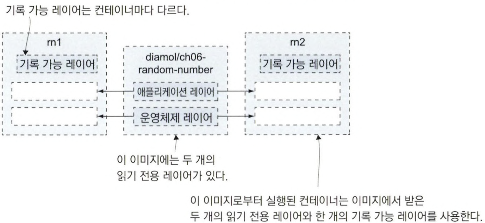
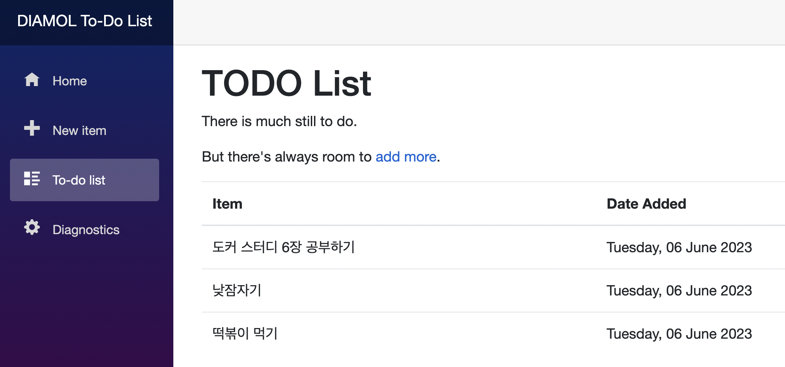
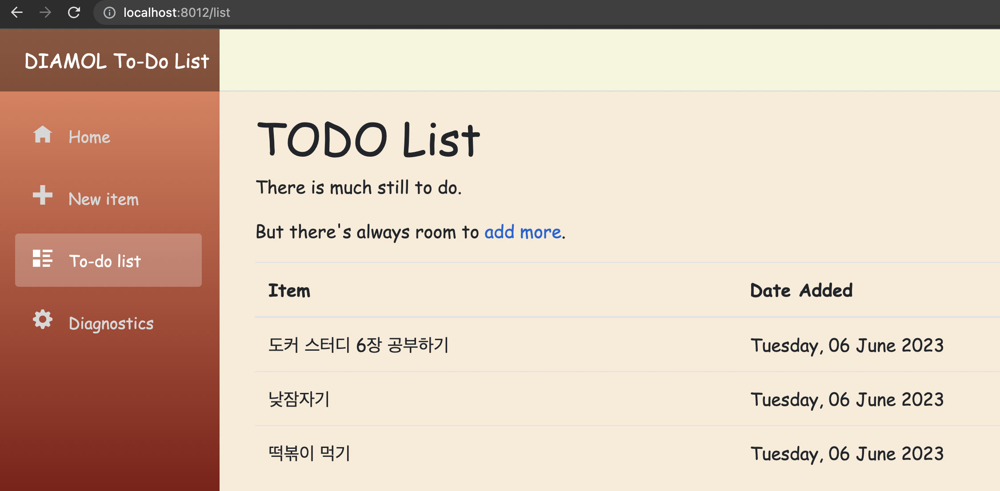
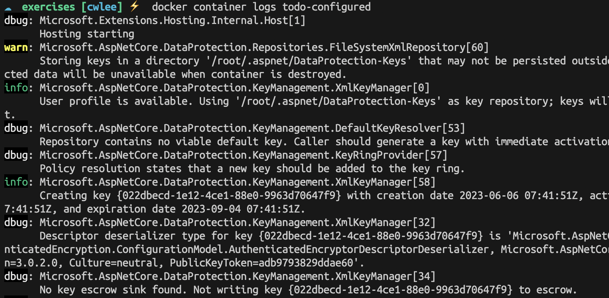
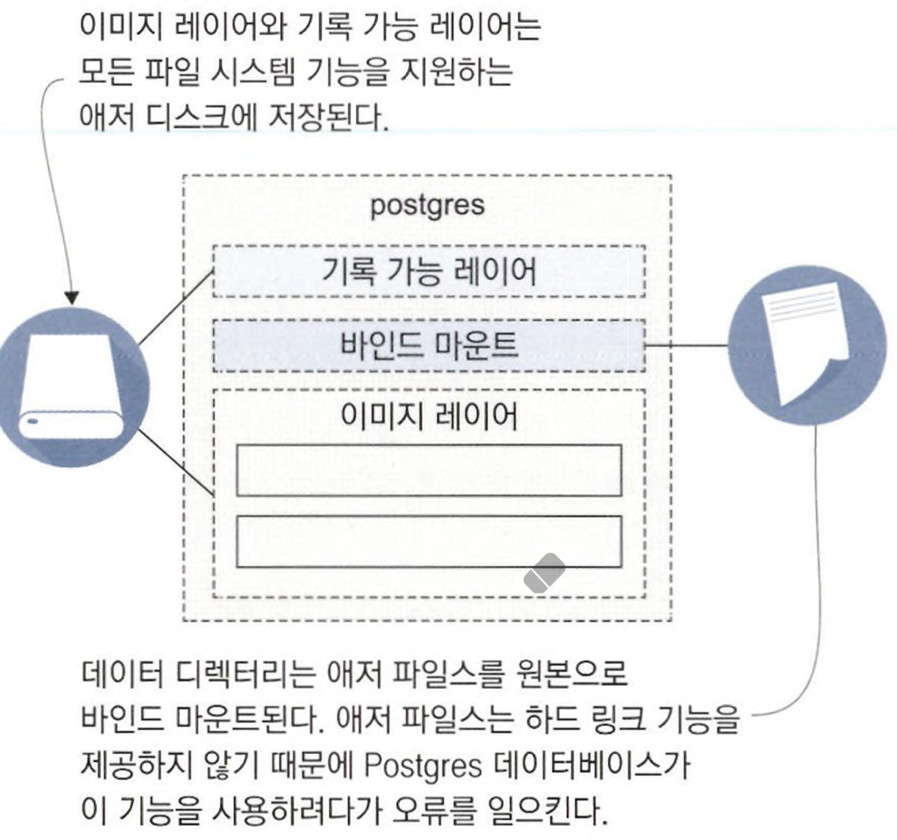
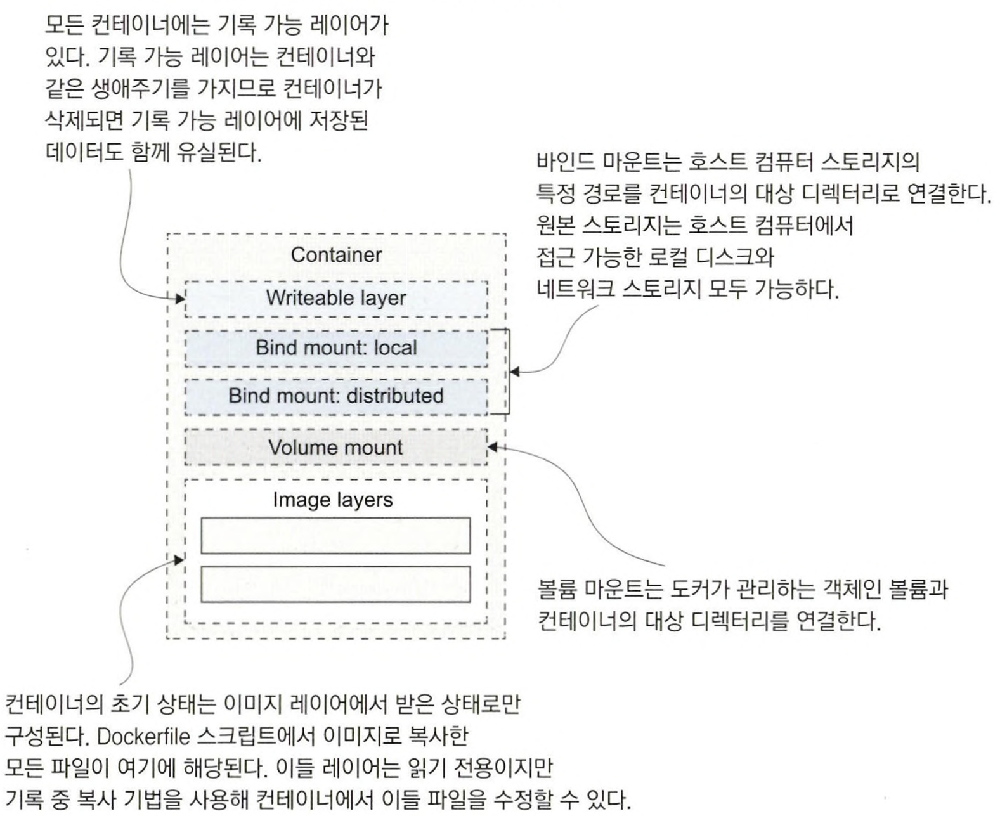

# 6장 도커 볼륨을 이용한 퍼시스턴트 스토리지

## 6.1 컨테이너 속 데이터가 사라지는 이유

### 모든 컨테이너는 독립된 파일 시스템을 갖는다.

같은 이미지에서 실행한 여러 개의 컨테이너는 처음에는 디스크 내용이 모두 같지만, 그중 한 컨테이너에서 애플리테이션 파일을 수정해도 다른 컨테이너나 이미지는  영향을 받지 않는다.

### 컨테이너의 파일 시스템은 단일 디스크다.

이 디스크는 도커가 여러 출처로부터 합쳐 만들고 컨테이너에 전달한 가상 파일 시스템이다.

이 출처는 기본적으로 `이미지 레이어` 와 `기록 가능 레이어` 로 구성된다.

- 이미지 레이어
    - 읽기 전용 레이어
    - 모든 컨테이너가 공유한다.
    - 이미지를 내려받는 순간부터 삭제할 때까지 로컬 컴퓨터의 이미지 레이어에 존재 한다.
- 기록 가능 레이어
    - 쓰기 가능 레이어
    - 컨테이너와 같은 생애 주기를 갖는다.
    - 컨테이너를 실행할 때 생성되며 컨테이너를 삭제할 때 함께 삭제된다.
    - 컨테이너를 종료하는 것만으로는 컨테이너가 삭제되지 않는다.



### 도커는 기록 중 복사를 사용해 파일 수정한다.

이미지 레이어는 읽기 전용이다. 

도커는 `기록 중 복사` 라는 방법을 사용해 읽기 전용 레이어의 파일을 수정할 수 있다.

파일 수정하는 단계

1. 수정하고자 하는 파일을 쓰기 가능 레이어로 복사한다.
2. 쓰기 가능 레이어에서 파일을 수정한다.

📌 파일 내용을 수정한 후 컨테이너를 재시작해 변경된 파일의 내용을 확인한다.

```docker
$ docker container run --name f1 diamol/ch06-file-display

$ echo "http://eltonstoneman.com" > url.txt

$ docker container cp url.txt f1:/input.txt

$ docker container start --attach f1
http://eltonstoneman.com
```

📌 새 컨테이너를 실행해 해당 파일 내용을 확인한다. 처음 실행한 컨테이너를 삭제하고 수정된 데이터가 삭제된 것을 확인한다.

```docker
$ docker container run --name f2 diamol/ch06-file-display
https://www.manning.com/books/learn-docker-in-a-month-of-lunches

$ docker container rm -f f1

$ docker container cp f1:/input.txt
Error: No such container:path: f1:/input.txt
```

---

## 6.2 도커 볼륨을 사용하는 컨테이너 실행하기

도커 볼륨은 도커에서 스토리지를 다루는 단위다.

`볼륨`은 컨테이너와 독립적으로 존재하며 별도의 생애주기를 갖지만, 컨테이너에 연결할 수 있다.

퍼시스턴시가 필요한 `유상태 애플리케이션` 을 컨테이너로 실행하려면 볼륨을 사용해야 한다.

### 볼륨을 사용하는 방법

1. 수동으로 볼륨을 생성해 컨테이너에 연결한다.

1. Dockerfile 스크립트에서 VOLUME 인스트럭션을 사용한다.

인스트럭션을 사용해 만든 이미지로 컨테이너를 실행하면 자동으로 볼륨을 생성한다.

📌 VOLUME 인스트럭션 사용 예제

```docker
FROM diamol/dotnet-aspnet
WORKDIR /app
ENTRYPOINT ["dotnet, "ToDoList.dll"]

VOLUME /data
COPY --from=builder /out/ .
```

📌  todo-list 애플리케이션 이미지로 컨테이너를 실행한다.

```docker
$ docker container run --name todo1 -d -p 8010:80 diamol/ch06-todo-list

$ docker container inspect --format '{{.Mounts}}' todo1
[{volume 688b89a243651402e3928089d03b0fc9bb743220aa3b2705ac79cd1d4f50d1f1 /var/lib/docker/volumes/688b89a243651402e3928089d03b0fc9bb743220aa3b2705ac79cd1d4f50d1f1/_data /data local  true }]

$ docker volume ls
DRIVER    VOLUME NAME
local     688b89a243651402e3928089d03b0fc9bb743220aa3b2705ac79cd1d4f50d1f
```

📌 macOS에서 /var/lib/docker/volumes에 접근이 불가하다.

```
macOS에서 Docker는 가상화된 환경에서 실행됩니다. 
그러므로 Docker 볼륨은 macOS 호스트에서 직접 접근할 수 없는 곳에 저장됩니다. 
대신, Docker Desktop의 VM 내부에 볼륨이 저장되며, 이 VM은 LinuxKit을 기반으로 합니다.

일반적으로 Docker 볼륨의 데이터는 Docker VM 내부의 /var/lib/docker/volumes/ 디렉토리에 저장됩니다. 
그러나 이 디렉토리는 Docker VM 내부에 있으므로 macOS에서 직접 접근하거나 수정하는 것은 권장되지 않습니다.
```

📌  서로 다른 컨테이너가 같은 볼륨을 공유하게 할 수 있다.

```
$ docker container run --name todo2 -d diamol/ch06-todo-list
$ docker container exec todo2 ls /data

$ docker container run -d --name t3 --volumes-from todo1 diamol/ch06-todo-list
$ docker container exec t3 ls /data
todo-list.db
```

두 번째 컨테이너는 새로운 볼륨을 생성해 연결하기 때문에 /data 디렉터리가 비어 있지만, 세 번째 컨테이너는 첫 번째 컨테이너와 볼륨을 공유하므로 애플리케이션의 데이터를 세 번째 컨테이너의 디렉터리에서도 볼 수 있다.

볼륨은 컨테이너 간 파일 공유보다는 업데이트 간 상태를 보존하기 위한 용도로 사용해야 하며, 이미지에서 정의하는 것보다 명시적으로 관리하는 편이 더 낫다.

볼륨에 이름을 붙여 생성하고, 업데이트 시 다른 컨테이너로 옮겨 연결하면 된다.

```
$ docker volume create todo-list

$ docker container run -d -p 8011:80 -v todo-list:/data --name todo-v1 diamol/ch06-todo-list
```



```
$ docker container rm -f todo-v1

$ docker container run -d -p 8012:80 -v todo-list:/data --name todo-v2 diamol/ch06-todo-list:v2
```



### VOLUME 인스트럭션 VS volume 플래그

### VOLUME 인스트럭션

VOLUME 인스트럭션을 사용해 빌드된 이미지로 docker container run 명령에서 볼륨을 지정하지 않으면 항상 새로운 볼륨을 함께 생성한다.

이 볼륨은 무작위로 만들어진 식별자를 가지므로, 컨테이너를 삭제한 후 볼륨을 재사용하려면 이 식별자를 미리 기억해야 한다.

### volume 플래그

`--volume`  플래그는 이미지에 볼륨이 정의돼 있든 말든 지정된 볼륨을 컨테이너에 마운트 한다.

이미지에 볼륨이 정의돼 있더라도 새로운 볼륨이 생성되지 않는다.

---

## 6.3 파일 시스템 마운트를 사용하는 컨테이너 실행하기

`bind mount` 는 호스트 컴퓨터 파일 시스템의 디렉터리를 컨테이너의 파일 시스템의 디렉터리로 만든다.

속도 면에서 뛰어난 SSD 디스크, 고사용성 디스크 어레이, 네트워크상에서 사용하는 분산 스토리지까지 호스트 컴퓨터에서 접근 가능한 파일 시스템이라면 무엇이든 컨테이너에서도 사용할 수 있다.

📌 todo-list에 바인트 마운트로 로컬 디렉터리를 연결한다.

```
$ source="$(pwd}/databases" && target='/data'

$ mkdir ./databases

$ docker container run --mount type=bind,source=$source,target=$target -d -p 8013:80 diamol/ch06-todo-list

$ ls ./databases
```

### 바인드 마운트는 양방향으로 동작한다.

컨테이너에서 만든 파일을 호스트 컴퓨터에서 수정할 수도 있고, 반대로 호스트에서 만든 파일도 컨테이너에서 수정할 수 있다.

✅ 컨테이너 → 호스트 컴퓨터 파일 수정하기

호스트 컴퓨터에 대한 공격을 방지하기 위해 컨테이너는 대개 최소 권한을 가진 계정으로 실행되는데, 바인드 마운트를 사용하면 호스트 컴퓨터 파일에 접근하기 위한 권한 상승이 필요하다.

그래서 Dockerfile 스크립트에서 `USER` 인스트럭션을 사용해 컨테이너에 관리자 권한을 부여한다.

✅ 호스트 컴퓨터의 디렉터리를 읽기 전용으로 컨테이너에 연결하기

```
$ source="$(pwd}/config" && target='/app/config'

$ docker container run --name todo-configured --mount type=bind,source=$source,target=$target,readonly -d -p 8013:80 diamol/ch06-todo-list

$ curl http://localhost:8013

$ docker container logs todo-configured
warn: Microsoft.AspNetCore.DataProtection.Repositories.FileSystemXmlRepository[60]
      Storing keys in a directory '/root/.aspnet/DataProtection-Keys' that may not be persisted outside of the container. Protected data will be unavailable when container is destroyed.
warn: Microsoft.AspNetCore.DataProtection.KeyManagement.XmlKeyManager[35]
      No XML encryptor configured. Key {c648b6b2-5810-4ede-b29f-0dbed962db4e} may be persisted to storage in unencrypted form.
info: Microsoft.Hosting.Lifetime[0]
      Now listening on: http://[::]:80
info: Microsoft.Hosting.Lifetime[0]
      Application started. Press Ctrl+C to shut down.
info: Microsoft.Hosting.Lifetime[0]
      Hosting environment: Production
info: Microsoft.Hosting.Lifetime[0]
      Content root path: /app
```



---


## 6.4 파일 시스템 마운트의 한계점

### ✅ 컨테이너의 마운트 대상 디렉터리가 이미 존재하는 경우

이미 존재하는 디렉터리에 마운트하면 마운트의 원본 디렉터리가 기존 디렉터리를 완전히 대체한다.

이미지에 포함도 있던 원래 파일은 사용할 수 없다.

### ✅ 호스트 컴퓨터의 파일 하나를 컨테이너에 이미 존재하는 디렉터리로 마운트하는 경우

디렉터리의 파일이 합쳐져 이미지에서 온 파일과 호스트에서 마운트된 파일이 모두 나타난다.

```
$ docker container run diamol/ch06-bind-mount
abc.txt
def.txt
$ docker container run --mount type=bind,source="$(pwd)/new/123.txt",target="/init/123.txt" diamol/ch06-bind-mount
123.txt
abc.txt
def.txt
```

### ✅ 분산 파일 시스템을 컨테이너에 바인드 마운트하는 경우

분산 파일 시스템을 사용하면 네트워크상의 모든 컴퓨터에서 데이터에 접근할 수 있다.

하지만, AWS S3, Azure files 등 로컬 컴퓨터 운영체제의 파일 시스템과 다른 경우가 많다.

분산 파일 스토리지를 컨테이너에 마운트하면 일반적인 파일 시스템의 일부처럼 보이기는 하겠지만 지원하지 않는 동작이 있을 수 있다.



애저 파일스는 읽기 및 쓰기 기능은 똑같이 제공하지만 지원하지 않는 기능이 있다. 이 사례에서는 애저 파일스가 지원하지 않는 기능인 파일 링크 생성을 시도하다 실패해서 애플리키에션이 오류를 일으켰다.

---


## 6.5 컨테이너의 파일 시스템은 어떻게 만들어지는가?

컨테이너의 스토리지는 물리적 머신이나 가상 머신에서 사용하는 스토리지와 비교해 선택할 수 있는 범위가 꽤 다르므로 잘 알아두어야 한다.

모든 컨테이너는 도커가 다양한 출처로부터 모아 만든 단일 가상 디스크로 구성된 파일 시스템을 갖는다. 이 파일 시스템을 `유니언 파일 시스템` 이라고 한다.

컨테이너에서 실행되는 애플리케이션 입장에서는 단일 디스크만을 볼 수 있지만, 컨테이너나 이미지를 생성해 사용하는 사용자는 여러 출처를 합쳐 이 디스크를 구성할 수 있다. 여러 개의 이미지 레이어, 역시 하나 이상의 볼륨 마운트와 바인드 마운트를 컨테이너에 연결할 수 있다.

### 컨테이너 스토리지 구성 시 고려해야 할 일반론

```
- 기록 가능 레이어
	- 각 컨테이너마다 독립적인 기록 가능 레이어를 갖지만, 컨테이너가 삭제되면 저장된 데이터는 유실된다.
	- 단기 저장에 적합하다.

- 로컬 바인드 마운트
	- 호스트 컴퓨터와 컨테이너 간 데이터 공유한다.

- 분산 바인드 마운트
	- 네트워크 스토리지와 컨테이너 간에 데이터를 공유한다.
	- 가용성이 높지만 지원하지 않는 파일 시스템 기능이 있거나 성능 면에 차이가 있을 수 있다.

- 볼륨 마운트
	- 컨테이너와 도커 객체인 불륨 간에 데이터를 공유하기 위해 사용한다.
	- 애플리케이션이 불륨에 데이터를 영구적으로 저장한다.

- 이미지 레이어
	- 컨테이너의 초기 파일 시스템을 구성한다.
	- 읽기 전용이며 여러 컨테이너에서 공유한다.
```



---

## 6.6 연습문제