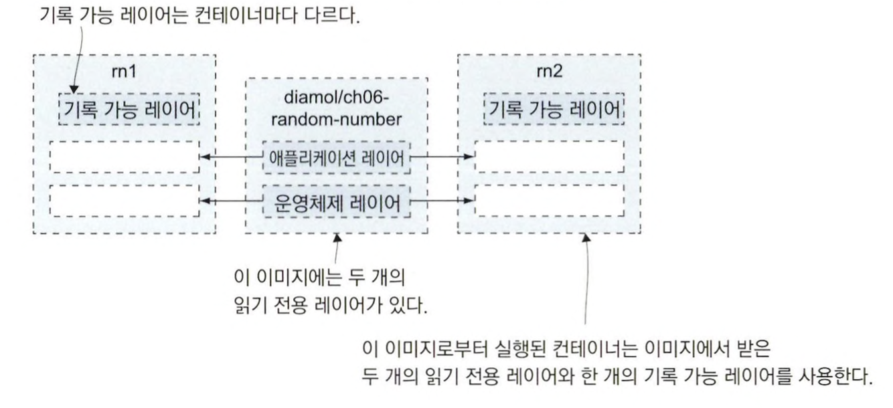
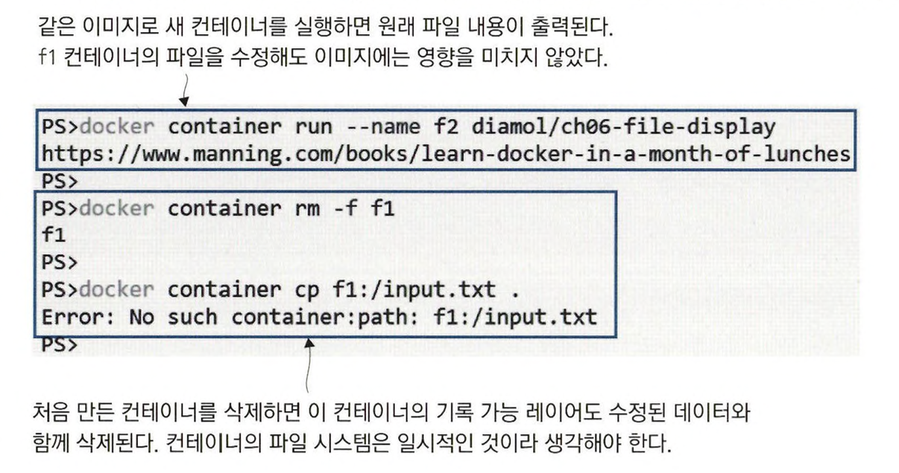
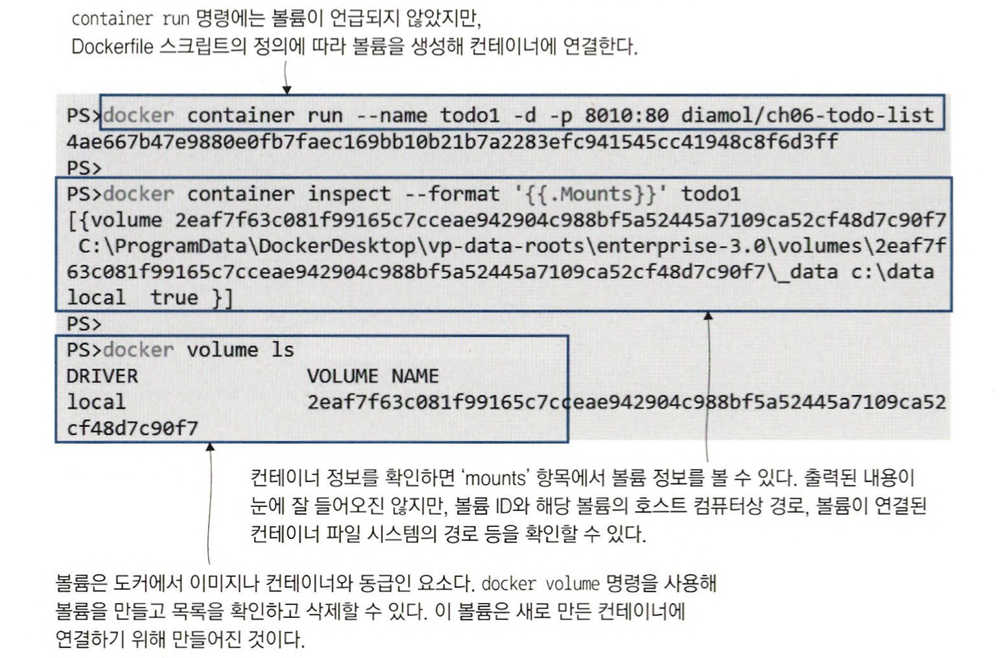
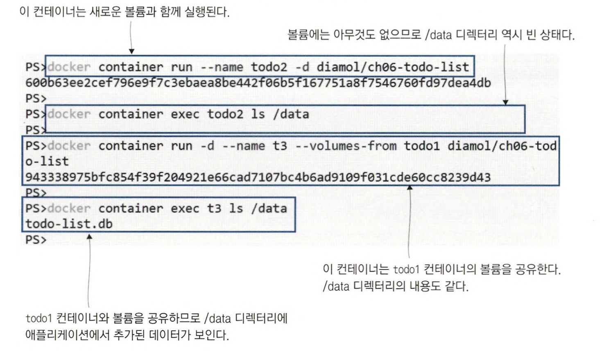
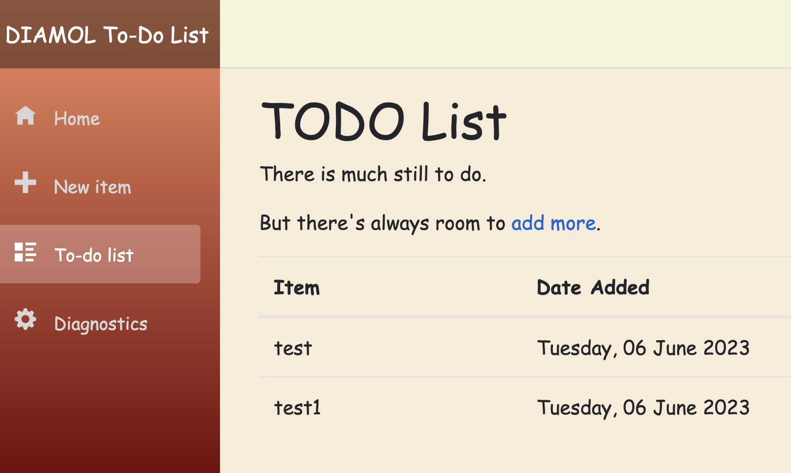
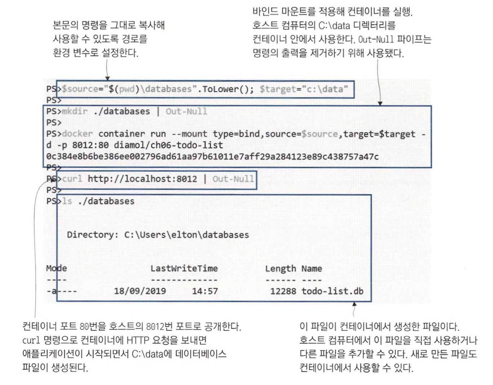
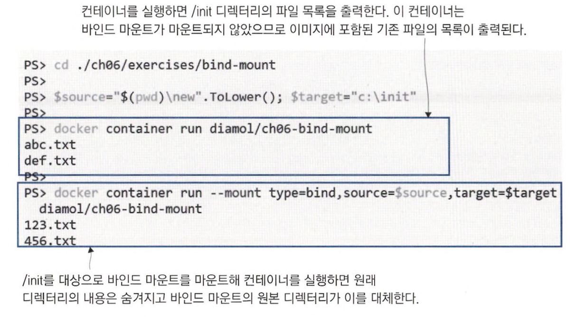
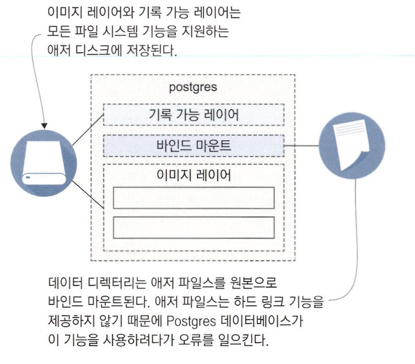
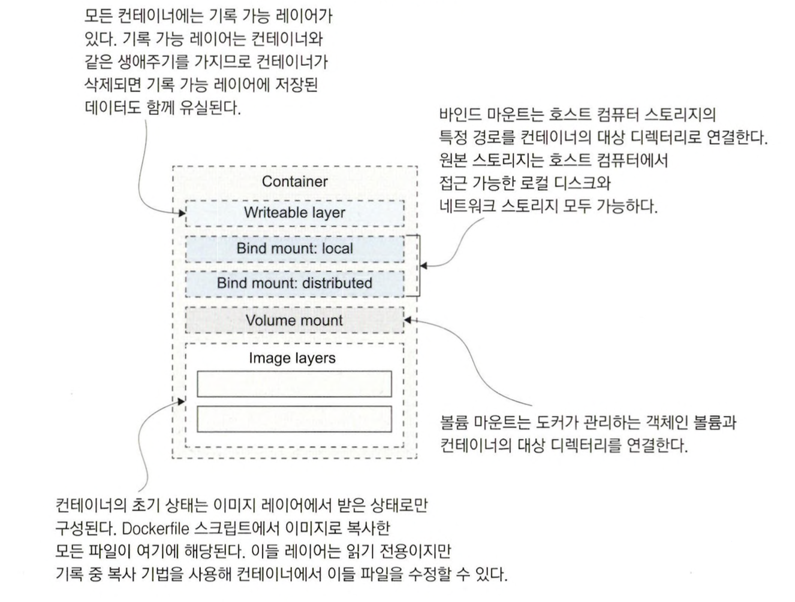

# 컨테이너 속 데이터가 사라지는 이유

> 도커 컨테이너에도 단일 드라이브로 된 파일 시스템이 있다. <br>
> 컨테이너의 디스크 역시 이 이미지 레이어를 순서대로 합쳐 만든 가상 파일 시스템이다. <br>
> 모든 컨테이너는 독립된 파일 시스템을 갖는다. <br>
> 한 컨테이너에서 애플리케이션이 파일을 수정해도 다 른컨테이너나 이미지는 영향을 받지 않는다.

<br>

```
docker container run --name rn1 diamol/ch06-random-number
docker container run --name rn2 diamol/ch06-random-number
```

컨테이너를 실행하면 텍스트 파일에 무작위 숫자를 쓰는 스크립트가 실행된다. <br>
이 두 컨테이너는 같은 이미지로부터 실행됐으나 파일 시스템의 내용은 서로 다르다.

<br>

```
docker container cp rn1:/random/number.txt number1.txt
docker container cp rn2:/random/number.txt number2.txt
```

docker container cp 명령을 사용해 두 컨테이너에서 무작위 숫자가 쓰인 텍스트 파일을 로컬 컴퓨터로 복사

```
cat number1.txt

// 실행 결과
32327
```

```
cat number2.txt

// 실행 결과
8722
```

두 컨테이너는 모두 같은 경로에 파일을 생성했고, 이를 로컬 컴퓨터로 복사해 확인해봤다. <br>

> **컨테이너의 파일 시스템이 서로 독립적**이다. <br>
> 같은 데이터베이스 엔진 이미지로 실행된 두 컨테이너가 서로 전혀 다른 데이터를 담을 수도 있다

<br>

컨테이너의 파일 시스템은 단일 디스크이다. <br>
그러나 이 디스크는 도커가 여러 출처로부터 합쳐 만들고 컨테이너에 전달한 가상 파일 시스템이다. <br>
이 출처는 이미지 레이어와 컨테이너의 기록 가능 레이어로 구성되고, 이미지 레이어는 모든 컨테이너가 공유하지만 기록 가능 레이어는 컨테이너마다 다르다.

모든 컨테이너가 공유하는 이미지 레이어는 읽기 전용이고. 각 컨테이너가 따로 갖는 기록 가능 레이어는 컨테이너와 같은 생애주기를 갖는다. <br>
**이미지 레이어**는 이미지를 내려받은 순간부터 삭제할 때까지 로컬 컴퓨터의 이미지 레이어에 존재한다. <br>
컨테이너의 **쓰기 가능 레이어**는 컨테이너를 실행할 때 생성되며 컨테이너를 삭제할 때 함께 삭제된다.



<br>

> **기록 가능 레이어**를 기존 이미지 레이어에 있는 파일을 수정하는데 사용할 수도 있다. <br>
> 이미지 레이어는 읽기 전용이지만, 도커는 **기록 중 복사**를 이용해 읽기 전용 레이어의 파일을 수정할 수 있다. <br>
> 컨테이너에서 이미지 레이어에 포함된 파일을 수정하려면, 도커가 파일을 쓰기 가능 레이어로 복사해 온 다음 쓰기 가능 레이어에서 파일을 수정한다.

<br>

```
docker run --name f1 diamol/ch06-file-display

echo "http://eltonstoneman.com" > url.txt

docker cp url.txt f1:/input.txt

docker start -a f1

// 실행 결과
Unable to find image 'diamol/ch06-file-display:latest' locally
latest: Pulling from diamol/ch06-file-display
941f399634ec: Already exists
716aca3e500c: Already exists
2755907779b3: Pull complete
Digest: sha256:98c52776132a793d22524080e16a37db52de6a72dc5687cd5f6ae371d14dad12
Status: Downloaded newer image for diamol/ch06-file-display:latest
https://www.manning.com/books/learn-docker-in-a-month-of-lunches

http://eltonstoneman.com
```

컨테이너를 실행해 파일의 내용을 출력. <br>
이후 파일의 내용을 수정 하고 컨테이너를 재시작해 변경된 파일 내용을 확인.

> 컨테이너 속 파일을 수정하면 컨테이너의 동작에 영향을 미친다. <br>
> 그러나 이미지를 공유하는 다른 컨테이너나 이미지는 영향을 받지 않는다. <br>
> 수정된 파일은 해당 컨테이너의 기록 가능 레이어에만 존재하기 때문이다. <br>
> 새로운 컨테이너는 이미지로부터 받은 최초의 내용을 담은 파일 시스템을 가 지며, f1 컨테이너가삭제되면 수정된 파일도 사라진다.

<br>

```
docker run --name f2 diamol/ch06-file-display

docker rm -f f1

docker cp f1:/input.txt
```



새로 실행한 컨테이너는 이미지로부터 받은 원래 내용의 파일을 사용하며, 처음 만든 컨테이너를 삭제하면 그 파일 시스템과 함께 수정된 파일도 사라진다. <br>
컨테이너 파일 시스템은 컨테이너와 같은 생애주기를 갖는다. <br>
컨테이너가 삭제되면 이 컨테이너의 기록 가능 레이어와 여기서 수정된 데이터도 함께 삭제된다.

<br>
<hr>

# 도커 볼륨을 사용하는 컨테이너

도커 볼륨은 도커에서 스토리지를 다루는 단위다. <br>
볼륨은 컨테이너와 독립적으로 존재하며 별도의 생애주기를 갖지만. 컨테이너에 연결할 수 있다. <br>
영속화가 필요한 애플리케이션을 컨테이너로 실행하려면 볼륨을 사용해야 한다.

```
// 볼륨이 사용된 Dockerfile 스크립트
FROM diamol/dotnet-aspnet
WORKDIR /app
ENTRYPOINT ["dotnet", "ToDoList.dll"]

VOLUME /data
COPY --from=builder /out/ .
```

이 이미지는 컨테이너를 실행하면 자동으로 볼륨을 생성해 컨테이너에 연결해 준다. <br>
컨테이너에는 /data 디렉터리의 내용은 볼륨에 영구적으로 저장된다.

<br>

```
docker run --name todo1 -d -p 8010:80 diamol/ch06-todo-list

docker inspect --format '{{.Mounts}}' todo1

docker volume ls
```



<br>

> 도커 이미지에서 볼륨을 정의하면 컨테이너를 생성할 때마다 새로운 볼륨을 만든다. <br>
> 하지만 컨테이너가 같은 볼륨을 공유하게 할 수도 있다.

<br>

```
docker run --name todo2 -d diamol/ch06-todo-list

docker exec todo2 ls /data

docker run -d --name t3 --volumes-from todo1 diamol/ch06-todo-list

docker exec t3 ls /data
```



두 번째 컨테이너는 새로운 볼륨을 생성해 연결하기 때문에 /data 디렉터리가 비어 있다. <br>
세 번째 컨테이너는 첫 번째 컨테이너와 볼륨을 공유하므로 애플리케이션의 데이터를 세 번째 컨테이너의 디렉터리에서도 볼 수 있다.

> 애플리케이션 컨테이너는 종종 자신만이 접근할 수 있는 파일을 필요로 한다. <br>
> 볼륨은 컨테이너 간 파일 공유보다는 업데이트 간 상태를 보존하기 위한 용도로 사용해야 한다. <br>

```
# 경로를 환경 변수로 지정
target='/data'

# 볼륨 생성
docker volume create todo-list

# 볼륨을 연결한 v1 애플리케이션 실행
docker run -d -p 8011:80 -v todo-list:$target --name todo-v1 diamol/ch06-todo-list

# localhost:8011 페이지에서 데이터 추가

# v1 애플리케이션이 실행중인 컨테이너 삭제
docker rm -f todo-v1

# 같은 볼륨을 사용하는 v2 애플리케이션 실행
docker run -d -p 8011:80 -v todo-list:$target --name todo-v2 diamol/ch06-todo-list:v2
```



v1에서 추가한 데이터가 v2에서도 그대로 존재한다.

> Dockerfile 스크립트의 VOLUME 인스트럭션과 docker container 명령의 --volume 플래그는 별개 기능이다. <br>
> VOLUME 인스트럭션을 사용해 빌드된 이미지로 docker container run 명령에서 볼륨을 지정하지 않으면 항상 새로운 볼륨을 함께 생성한다. <br>
> 이 볼륨은 무작위로 만들어진 식별자를 가지므로. 컨테이너를 삭제한 후 볼륨을 재사용하려면 이 식별자를 미리 기억해야 한다. <br>
> 반면 --volume 플래그는 이미지에 볼륨이 정의돼 있든 말든 지정된 볼륨을 컨테이너에 마운트한다.

<br>
<hr>

# 파일 시스템 마운트를 사용하는 컨테이너

호스트의 스토리지를 컨테이너에 좀 더 직접적으로 연결할 수 있는 **바인드 마운트**라는 방법이 있다. <br>
이는 호스트 컴퓨터 파일 시스템의 디렉터리를 컨테이너 파일 시스템의 디렉터리로 만든다. <br>
이 방법으로 컨테이너가 호스트 컴퓨터의 파일에 직접 접근할 수 있고 그 반대도 가능해진다.

<br>

```
source="$(pwd)/databases" && target='/data'

mkdir ./databases

docker run --mount type=bind,source=$source,target=$target -d -p 8012:80 diamol/ch06-todo-list

curl http://localhost:8012

ls ./databases
```



바인드 마운트는 양방향으로 동작한다. <br>
컨테이너에서 만든 파일을 호스트 컴퓨터에서 수정할 수도 있고, 반대로 호스트에서 만든 파일도 컨테이너에서 수정할 수 있다. <br>
바인드 마운트를 사용하면 호스트 컴퓨터 파일에 접근하기 위해 권한 상승이 필요하다. <br>
그래서 Dockerfile 스크립트에서 USER 인스트럭션을 사용해 컨테이너에 관리자 권한을 부여한다.

파일에 쓰기 작업을 할 필요가 없다면 호스트 컴퓨터의 디렉터리를 읽기 전용으로 컨테이너에 연결할 수도 있다. <br>
이 방법은 호스트 컴퓨터에 작성한 설정을 컨테이너에 적용하기 위해 자주 쓰인다.

<br>

```
cd ch06/exercises/todo-list

source="$(pwd)/config" && target='/app/config'

docker run --name todo-configured -d -p 8013:80 --mount type=bind,source=$source,target=$target,readonly diamol/ch06-todo-list

docker logs todo-configured
```

컨테이너를 실행하면 호스트와 컨테이너의 디렉터리가 연결되고 애플리케이션이 설정 파일 디렉터리를 발견해 안에 있는 로그 설정을 읽어 들인다. <br>

> 호스트 컴퓨터가 접근할 수 있는 스토리지라면 무엇이든 바인드 마운트를 통해 컨테이너에 연결할 수 있다. <br>
> 이런 방법으로 분산 스토리지를 컨테이너에 연결해 유상태 애플리케이션에서 사용하게 하면 신뢰성을 크게 개선할 수 있다.


<br>
<hr>

# 파일 시스템 마운트의 한계

**1. 컨테이너의 마운트 대상 디렉터리가 이미 존재하고 이미지 레이어에 이 디렉터리의 파일이 포함되어 있다.**

이미 존재하는 대상 디렉터리에 마운트하면 마운트의 원본 디렉터리가 기존 디렉터리를 완전히 대체한다. <br>
그래서 이미지에 포함돼 있던 원래 파일은 사용할 수 없다.

```
cd ch06/exercises/bind-mount

source="$(pwd)/new" && target='/init'

docker run diamol/ch06-bind-mount

docker run --mount type=bind,source=$source,target=$target diamol/ch06-bind-mount
```



처음 실행한 컨테이너는 두 개의 파일명 abc.txt와 def.txt를 출력했다. <br>
이들 파일은 이미지 레이어에서 컨테이너로 전달된 파일이다. <br>
두 번째 컨테이너는 이미지 레이어에서 받은 파일이 마운트된 파일로 대체됐으므로 파일 목록이 123.txt와 456.txt로 바뀌었다.

<br>

**2. 호스트 컴퓨터의 파일 하나를 컨테이너에 이미 존재하는 디렉터리로 마운트**

디렉터리의 파일이 합쳐져 이미지에서 온 파일과 호스트에서 마운트된 파일이 모두 나타난다. (윈도 컨테이너는 이 기능을 제공하지 않아 동작이 달라진다.)

> 컨테이너 파일 시스템은 윈도 컨테이너와 리눅스 컨테이너의 동작이 일치하지 않는 영역 중 하나다. <br>

<br>

**3. 분산 파일 시스템을 컨테이너에 바인드 마운트**

분산 파일 시스템을 사용하면 네트워크상의 모든 컴퓨터에서 데이터에 접근할 수 있지만, <br>
보통 분산 파일 시스템의 메커니즘은 윈도 파일 공유에 쓰이는 SMB, Azure Files, AWS S3 등 로컬 컴퓨터 운영체제의 파일 시스템과 다른 경우가 많다. <br>
이러한 분산 파일 스토리지를 컨테이너에 마운트하면 일반적인 파일 시스템의 일부처럼 보이기는 하겠지만 지원하지 않는 동작이 있을 수 있다.



<br>
<hr>

# 컨테이너의 파일 시스템은 어떻게 만들어지는가

모든 컨테이너는 도커가 다양한 출처로부터 모아 만든 단일 가상 디스크로 구성된 파일 시스템을 갖는다. *(Union File System)* <br>
컨테이너는 Union File System을 통해 물리적 위치가 서로 다른 파일과 디렉터리에 마치 단일 디스크를 사용하듯 접근할 수 있다.

**컨테이너의 스토리지를 구성할 때 고려해야 할 일반론**

- **기록 가능 레이어**: 비용이 비싼 계산이나 네트워크를 통해 저장해야 하는 데이터의 캐싱 등 단기 저장에 적합
- **로컬 바인드 마운트**: 호스트 컴퓨터와 컨테이너 간 데이터를 공유하기 위해 사용
- **분산 바인드 마운트**: 네트워크 스토리지와 컨테이너 간에 데이터를 공유하기 위해 사용
- **볼륨 마운트**: 컨테이너와 도커 객체인 볼륨 간에 데이터를 공유하기 위해 사용
- **이미지 레이어**: 컨테이너의 초기 파일 시스템을 구성



<br>
<hr>

# 연습 문제

```
docker rm -f $(docker ps -aq)

source="$(pwd)/solution" && configTarget='/app/config' && dataTarget='/new-data'

docker volume create ch06-lab

docker run -d -p 8080:80 --mount type=bind,source=$source,target=$configTarget,readonly --volume ch06-lab:$dataTarget diamol/ch06-lab
```


