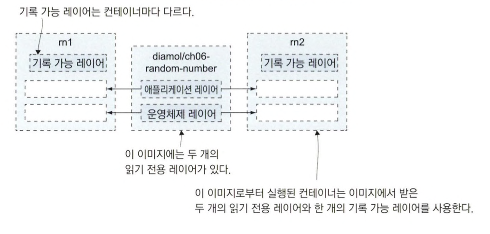
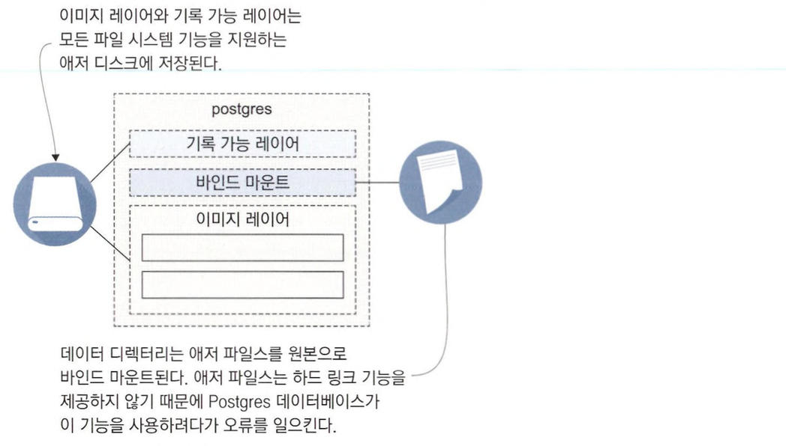
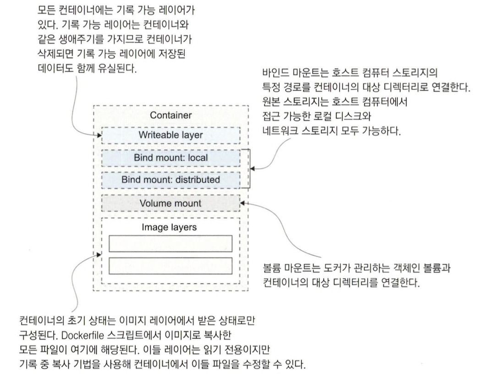

# 도커 볼륨을 이용한 퍼시스턴트 스토리지

컨테이너는 무상태 애플리케이션에게는 최적의 실행 환경입니다.

사용량이 증가하더라도 클러스터에 실행 중인 컨테이너의 수를 늘리기만 하면, 모든 요청이 똑같이 신뢰성 있게 처리됩니다.

또 롤링 업데이트를 통해 서비스 중단 없이 점진적으로 업데이트를 배포할 수 있습니다.

그러나 애플리케이션에 전혀 상태가 없을 수 없습니다.

퍼시스턴시나 성능 향상을 위해 디스크를 사용하는 컴포넌트가 있어야 할 테고, 이 컴포넌트 역시 컨테이너에서 실행됩니다.

스토리지가 관련되면 아무래도 복잡한 상황이 생깁니다.

이렇듯 유상태 애플리케이션을 도커로 실행하려면 고려해야 할 것이 많습니다.

이번 장에서는 도커 볼륨과 마운트에 대해 배우고 컨테이너 파일 시스템이 어떻게 동작하는지 알아봅시다.

## 컨테이너 속 데이터가 사라지는 이유

### 컨테이너의 파일 시스템

모든 컨테이너는 독립된 파일 시스템을 갖습니다.

같은 이미지에서 실행한 여러 개의 컨테이너는 처음에는 디스크 내용이 같지만 그 중 한 컨테이너에서 애플리케이션이 파일을 수정해도 다른 컨테이너 이미지는 영향을 받지 않습니다.

컨테이너의 파일 시스템은 단일 디스크입니다.

그러나 이 디스크는 도커가 여러 출처로부터 합쳐 만들고 컨테이너에 전달한 가상 파일 시스템입니다.

이 출처는 기본적으로 이미지 레이어와 컨테이너의 목록 가능 레이어로 구성되는데, 이미지 레이어는 모든 컨테이너가 공유하지만 기록 가능 레이어는 컨테이너마다 다릅니다.



모든 컨테이너가 공유하는 이미지 레이어는 읽기 전용이고 각 컨테이너가 따로 갖는 기록 가능 레이어는 컨테이너와 같은 생명주기를 가집니다.

즉, 이미지 레이어는 내려받은 순간 부터 삭제하는 순간까지 로컬 컴퓨터의 이미지 레이어에 존재합니다.

반면, 컨테이너의 쓰기 가능 레이어는 컨테이너를 실행할 때 생성되며, 컨테이너를 삭제할 때 삭제됩니다.

### 기록 중 복사

기록 가능 레이어를 새 파일을 만드는데만 사용하는 것은 아닙니다.

기존 레이어에 있는 파일을 수정할 수도 있습니다.

도커는 기록 중 복사라는 방법을 사용해 읽기 전용 레이어의 파일을 수정할 수 있습니다.

컨테이너에서 이미지 레이어에 포함된 파일을 수정하려 하면, 먼저 도커가 이 파일을 쓰기 가능 레이어로 복사해 온 다음 쓰기 가능 레이어에서 파일을 수정합니다.

컨테이너나 애플리케이션에는 이 과정이 드러나지 않지만, 바로 이 방법이 도커가 스토리지를 매우 효율적으로 사용할 수 있는 방법입니다.

만약 컨테이너 속 파일을 수정하면 컨테이너의 동작에 영향을 미치지만, 다른 컨테이너나 이미지는 영향을 받지 않습니다.

### 컨테이너에서 지속되어야할 데이터의 관리

컨테이너 파일 시스템은 컨테이너와 같은 생명 주기를 가집니다.

컨테이너가 삭제되면 해당 컨테이너의 기록 가능 레이어와 여기서 수정된 데이터도 함께 삭제됩니다.


이런 특성때문에 데이터베이스와 같이 데이터를 지속적으로 저장해야 하는 상황에서 도커는 사용하기 어려울 것 같아 보일 수 있습니다.

하지만 도커는 이런 상황도 감안해서 만들어졌습니다.

컨테이너의 가상 파일 시스템은 여전히 이미지 레이어와 기록 가능 레이어로 구성되지만 `도커 볼륨`과 `마운트`를 이용하면 별도의 생명주기를 가질 수 있습니다.

즉, 컨테이너가 종료되더라도 데이터를 계속 유지할 수 있게 됩니다.

## 도커 볼륨을 사용하는 컨테이너 실행하기

### 도커 볼륨

도커 볼륨은 도커에서 스토리지를 다루는 단위입니다.

볼륨은 컨테이너와 독립적으로 존재하며 별도의 생명주기를 가지지만, 컨테이너에 연결할 수 있습니다.

퍼시스턴시가 필요한 stateful 애플리케이션을 컨테이너로 실행하려면 볼륨을 사용해야 합니다.

볼륨을 생성해 애플리케이션 컨테이너에 연결하면 컨테이너 파일 시스템의 한 디렉터리가 됩니다.

나중에 애플리케이션을 업데이트하더라도 새로운 컨테이너에 다시 볼륨을 연결하면 데이터가 그대로 유지됩니다.

### 컨테이너에서 볼륨을 사용하는 방법

컨테이너에서 볼륨을 사용하는 사용하는 방법은 다음과 같습니다.

- 수동으로 직접 볼륨을 생성해 컨테이너에 연결하는 방법
- Dockerfile 스크립트에서 VOLUME 인스트럭션을 사용하는 방법

### Dockerfile 스크립트에서 VOLUME 인스트럭션 사용하기

다음은 Dockerfile 스크립트에서 VOLUME 인스트럭션을 사용하여 도커 볼륨을 사용한 예시입니다.

```docker
FROM diamol/dotnet-aspnet

WORKDIR /app

ENTRYPOINT ["dotnet", "ToDoList.dll"]

VOLUME /data
COPY --from=builder /out/ .
```

다음 명령어를 사용하면 볼륨 정보를 확인할 수 있습니다.

```docker
# 컨테이너 실행
docker container run --name todo1 -d -p 8010:80 diamo/ch06-todo-list

# 컨테이너의 볼륨 정보 확인
docker inspect --format '{{.Mounts}}' todo1

# 볼륨 리스트 조회
docker volume ls
```

### 서로 다른 컨테이너의 볼륨 정보 연결하기

도커 이미지에서 볼륨을 정의하면 컨테이너를 생성할 때마다 새로운 볼륨을 만듭니다.

하지만 컨테이너가 같은 볼륨을 공유하게 할수도 있습니다.

volumes-from 플래그를 이용하면 다른 컨테이너의 볼륨을 연결할 수 있습니다.

다음은 같은 데이터를 공유하는 애플리케이션 컨테이너를 만드는 과정입니다.

```docker
docker container run --name todo2 -d diamol/ch06-todo-list

docker container run -d --name t3 --volumes-from todo1 diamol/ch06-todo-list
```

todo1 컨테이너의 데이터를 추가한 후 다음 명령어로 볼륨간 공유가 잘 이루어지는지 확인해봅시다.

```docker
docker container exec todo2 ls /data
# 결과 X
```

```docker
docker container exec t3 ls /data
# 결과로 todo-list.db 반환
```

볼륨 간 공유를 한 t3 컨테이너는 todo1과 공유가 잘되는 것을 볼 수 있습니다.

### 컨테이너 간 볼륨 공유시 주의점

컨테이너간 볼륨 공유는 이해하긴 쉬워도 모든 일을 해결해 주지는 못합니다.

애플리케이션 컨테이너는 종종 자신만이 접근할 수 있는 파일을 필요로 합니다.

이러한 파일을 다른 컨테이너가 동시에 접근하게 허용하면 애플리케이션이 비정상적으로 동작할 수 있습니다.

볼륨은 컨테이너 간 파일 공유보다는 업데이트 간 상태를 보존하기 위한 용도로 사용해야 하며, 이미지에서 정의하는 것보다는 명시적으로 관리하는 편이 낫습니다.

이때 볼륨에 이름을 붙여 생성하고 업데이트 시 다른 컨테이너로 옮겨 연결하면 됩니다.

### 볼륨 생성 후 컨테이너에 연결하기

다음은 수동으로 볼륨을 생성하고 컨테이너에 연결하는 코드입니다.

```docker
# 복사 대상 경로를 환경 변수로 정의
target='/data'

# 데이터를 저장할 볼륨 생성
docker volume create todo-list

# 볼륨을 연결해 v1 애플리케이션을 실행
docker container run -d -p 8011:80 -v todo-list:$target --name todo-v1 diamol/ch06-todo-list

# 웹 페이지에 접속해 데이터 추가

# v1 애플리케이션이 실행 중인 컨테이너 삭제
docker container rm -f todo-v1

# 같은 볼륨을 사용하도록 v2 애플리케이션 컨테이너 실행
docker container run -d -p 8011:80 -v todo-list:$target --name todo-v2 diamol/ch06-todo-list:v2
```

다시 웹 페이지에 접속해보면 이전에 todo-v1에서 만들었던 데이터가 todo-v2에 저장된 것을 확인할 수 있습니다.

### VOLUME 인스트럭션과 --volume 플래그

VOLUME 인스트럭션과 --volume 플래그는 별개의 기능입니다.

VOLUME 인스트럭션을 사용해 빌드된 이미지로 docker container run 명령에서 볼륨을 지정하지 않으면 항상 새로운 볼륨을 함께 생성합니다.

이 볼륨은 무작위로 만들어진 식별자를 가지므로, 컨테이너를 삭제한 후 볼륨을 재사용하려면 이 식별자를 미리 기억해야 합니다.

반면 --volume 플래그는 이미지에 볼륨이 정의돼 있든 말든 지정된 볼륨을 컨테이너에 마운트합니다.

이미지에 볼륨이 정의돼 있더라도 이 정의가 무시되므로 새로운 볼륨이 생성되지 않습니다.

이미지를 만드는 입장에서는 안전장치 삼아 VOLUME 인스트럭션을 이미지 정의에 포함해두는 것이 좋습니다.

그러면 사용자가 볼륨을 지정하지 않더라도 데이터를 유실할 일이 없습니다.

하지만 역시 사용자 입장에서 보면, `이미지의 기본 볼륨 설정에 의존하지 말고 별도로 이름을 붙여 만든 볼륨을 사용하는 것이 좋습니다.`

## 파일 시스템 마운트를 사용하는 컨테이너 실행하기

### 바인드 마운트

볼륨의 장점은 컨테이너와 스토리지의 생명주기를 분리하면서도 도커를 사용하는 방식 그대로 스토리지를 다룰 수 있다는 점입니다.

볼륨의 경우 호스트 컴퓨터상에 존재하지만 컨테이너와는 분리되어 있습니다.

만약, 호스트의 스토리지를 컨테이너에 좀 더 직접적으로 연결하고 싶다면 바인드 마운트를 사용할 수 있습니다.

`바인드 마운트`는 호스트 컴퓨터 파일 시스템의 디렉터리를 컨테이너 파일 시스템의 디렉터리로 만듭니다.

바인드 마운트도 볼륨과 마찬가지로 컨테이너의 입장에서는 그냥 평범한 디렉터리에 불과합니다.

그러나 도커를 사용하는 입장에서는 컨테이너가 호스트 컴퓨터의 파일에 직접 접근할 수 있고 그 반대도 가능해지므로 좀 더 흥미로운 일을 할 수 있습니다.

바인드 마운트를 사용하면 호스트 컴퓨터의 파일 시스템을 명시적으로 지정해 컨테이너 데이터로 쓸 수 있습니다.

속도 면에서 뛰어난 SSD 디스크, 고사용성 디스크 어레이, 네트워크 상에서 사용하는 분산 스토리지까지 호스트 컴퓨터에서 접근 가능한 파일 시스템이라면 무엇이든 컨테이너에서도 사용할 수 있습니다.

만약 RAID가 적용된 디스크 어레이를 가진 서버가 있다면 이 스토리지를 to-do 앱의 데이터베이스를 저장할 고 신뢰성 스토리지로 활용할 수도 있습니다.

다음은 바인드 마운트를 하는 예제 코드입니다.

```docker
# 환경변수 설정
source=$(pwd)/databases && target='/data'

mkdir ./databases

# 바인드 마운트 적용
docker container run --mount type=bind,source=$source,target=$target -d -p 8012:80 diamol/ch06-todo-list

curl http://localhost:8012

ls ./databases
```

바인드 마운트는 양방향으로 작동합니다.

컨테이너에서 만든 파일을 호스트 컴퓨터에서 수정할 수도 있고, 반대로 호스트에서 만든 파일도 컨테이너에서 수정할 수 있습니다.

호스트 컴퓨터에 대한 공격을 방지하기 위해 컨테이너는 대개 최소 권한을 가진 계정으로 실행되는데, 바인드 마운트를 사용하면 호스트 컴퓨터 파일에 접근하기 위해 권한 상승이 필요합니다.

그래서 Dockerfile 스크립트에서 USER 인스트럭션을 사용해 컨테이너에 관리자 권한을 부여합니다.

파일에 쓰기 작업을 할 필요가 없다면 호스트 컴퓨터의 디렉터리를 읽기 전용으로 컨테이너에 연결할 수도 있습니다.

읽기 전용으로 실행하기 위해서는 다음과 같이 `readonly` 키워드만 붙이면 됩니다.

```docker
docker container run --mount type=bind,source=$source,target=$target,readonly -d -p 8012:80 diamol/ch06-todo-list
```

## 파일 시스템 마운트의 한계점

바인드 마운트와 볼륨을 효율적으로 사용하기 위해서는 각 요소의 핵심 사용 시나리오와 한계점을 이해해야 합니다.

### 컨테너의 마운트 대상 디렉터리가 이미 존재하고 이미지 레이어에 이 디렉터리에 파일이 포함된 경우

이미 존재하는 대상 디렉터리에 마운트하면 마운트의 원본 디렉터리가 기존 디렉터를 완전히 대체하게 됩니다.

그래서 이미 이미지에 존재했던 파일은 사용할 수 없게 됩니다.

### 호스트 컴퓨터의 파일 하나를 컨테이너에 이미 존재하는 디렉터리로 마운트 하는 경우

디렉터리의 파일이 합쳐져 이미지에서 온 파일과 호스트에서 마운트된 파일이 모두 나타납니다.

```
💡 단 윈도우 컨테이너는 이 기능을 제공하지 않아 동작이 달라집니다.

```

### 분산 파일 시스템을 사용하는 경우

분산 파일 시스템을 사용하면 네트워크상의 모든 컴퓨터에서 데이터에 접근할 수 있지만, 대개 분산 파일 시스템의 매커니즘은 로컬 컴퓨터 운영체제의 파일 시스템과 다른 경우가 많습니다.

이러한 분산 파일 스토리지를 컨테이너에 마운트하면 일반적인 파일 시스템의 일부처럼 보이기는 하겠지만 지원하지 않는 동작이 있을 수 있습니다.

예를 들어, 애저 파일스 서비스의 스토리지를 컨테이너 스토리지로 사용해 Postgres 데이터베이스를 실행한 경우인데, 애저 파일스는 읽기 및 쓰기 기능은 똑같이 제공하지만 지원하지 않는 기능이 있습니다.

다음 사례에서는 애저 파일스가 지원하지 않는 기능인 파일 링크 생성을 시도하다 실패해서 애플리케이션이 오류를 일으켰습니다.



위와 같은 시나리오는 매우 드물지만 한번 발생하면 회피할 방법이 없기 때문에 주의해야 합니다.

바인드 마운트의 원본 스토리지가 컨테이너에서 사용하는 모든 파일 시스템을 제공하지 않을 수 있다는 점을 항상 명시해 두어야 합니다.

컨테이너에 분산 스토리지를 마운트할 계획이라면, 이런 위험과 함께 분산 스토리지의 성능이 로컬 스토리지와 큰 차이가 있다는 것도 고려해야 합니다.

디스크를 많이 사용하는 애플리케이션을 분산 스토리지를 마운트한 컨테이너에서 실행한다면 모든 파일 입출력이 네트워크를 거쳐야 하는 만큼 최악의 경우 애플리케이션이 멈춰 버릴 가능성도 있습니다.

## 컨테이너의 파일 시스템은 어떻게 만들어지는가?

### 유니언 파일 시스템

모든 컨테이너는 도커가 다양한 출처로부터 모아 만든 단일 가상 디스크로 구성된 파일 시스템을 갖습니다.

이러한 파일 시스템을 `유니언 파일 시스템` 이라고 합니다.

컨테이너는 유니언 파일 시스템을 통해 물리적 위치가 서로 다른 파일과 디렉터리에 마치 단일 디스크를 사용하듯 접근할 수 있습니다.



컨테이너에서 실행되는 애플리케이션의 입장에서는 단일 디스크만을 볼 수 있지만, 컨테이너나 이미지를 생성해 사용하는 사용자는 여러 출처를 합쳐 이 디스크를 구성할 수 있습니다.

여러 개의 이미지 레이어, 역시 하나 이상의 볼륨 마운트와 바인드 마운트를 컨테이너에 연결할 수 있습니다.

그러나 기록 가능 레이어는 하나밖에 가질 수 없습니다.

이제 각 컨테이너 스토리지를 구성할 때 고려해야하는 사항들을 알아봅시다.

### 기록 가능 레이어

비용이 비싼 계산이나 네트워크를 통해 저장해야 하는 데이터의 캐싱 등 단기 저장에 적합합니다.
 
```
💡 각 컨테이너마다 독립적인 기록 가능 레이어를 갖지만, 컨테이너가 삭제되면 여기 저장된 데이터는 유실 되는 점을 기억해야 합니다.

```

### 로컬 바인드 마운트

호스트 컴퓨터와 컨테이너 간 데이터를 공유하기 위해 사용합니다.

개발자의 로컬 컴퓨터에서 컨테이너로 소스 코드를 전달하기 위해 사용하면 로컬 컴퓨터에서 수정한 내용이 이미지 빌드 없이도 즉시 컨테이너로 전달될 수 있습니다.

### 분산 바인드 마운트

네트워크 스토리지와 컨테이너 간에 데이터를 공유하기 위해 사용합니다.

가용성이 높지만 로컬 디스크와 비교해 지원하지 않는 파일 시스템 기능이 있거나 성능 면에서 차이가 있을 수 있습니다.

읽기 전용으로 설정 파일을 전달하거나 공유 캐시로 활용할 수 있으며 읽기 쓰기 가능으로 데이터를 저장해 동일 네트워크 상의 모든 컨테이너나 컴퓨터와 데이터를 공유하는데 적합합니다.

### 볼륨 마운트

컨테이너와 도커 객체인 볼륨 간에 데이터를 공유하기 위해 사용됩니다.

볼륨 마운트를 사용하면 애플리케이션이 볼륨에 데이터를 영구적으로 저장합니다.

컨테이너를 교체하는 방식으로 애플리케이션을 업데이트해도, 이전 버전 컨테이너의 데이터를 그대로 유지할 수 있습니다.

### 이미지 레이어

이미지 레이어는 컨테이너의 초기 파일 시스템을 구성합니다.

레이어는 적층 구조를 갖는데, 후속 레이어와 이전 레이어의 내용이 서로 충돌하는 경우 후속 레이어의 내용이 적용됩니다.

레이어는 읽기 전용이며 여러 컨테이너가 공유합니다.
