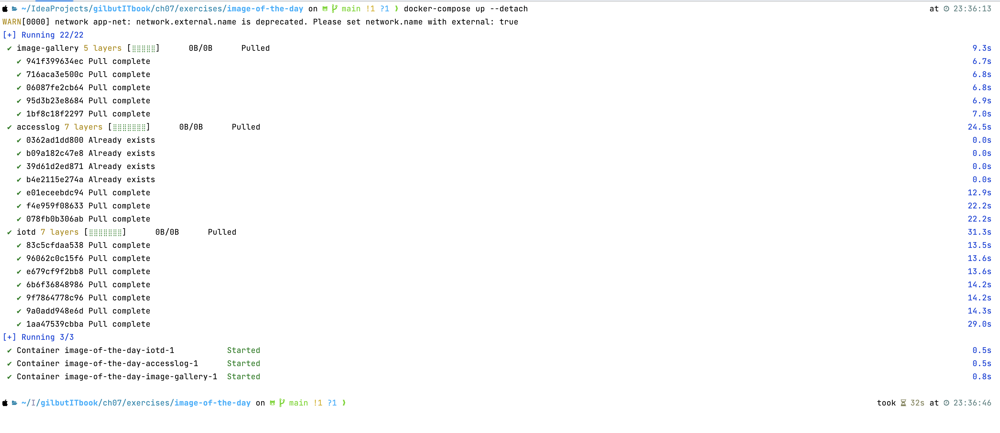

# 7장 도커 컴포즈로 분산 애플리케이션 실행하기

## 7.1 도커 컴포즈 파일의 구조

> 도커 컴포즈 파일이란 `애플리케이션의 상태`, 모든 컴포넌트가 실행중 일 때의 상태를 기술하는 파일<br>
> `docker container run` 으로 컨테이너를 실행할 때 지정하는 모든 옵션을 모아 놓은 파일

<table>
<tr>
<td align="center">script</td><td align="center">구조</td>
</tr>
<tr>
<td align="center" colspan="2">

```shell
docker container run -p 8020:80 --name todo-web --network nat diamol/ch06-todo-list
```
</td>
</tr>
<tr>
<td>

```dockerfile
version: '3.7'

servies:
    todo-web:
        image: diamol/ch06-todo-list
        ports:
            - "8020:80"
        networks:
            - app-net
networks:
    app-net:
        external:
            name: nat
```
</td>
<td>

</td>
</tr>
</table>

#### version

- docker compose file 형식 버전
- [docker compose version 별 특징](https://meetup.nhncloud.com/posts/277) 

#### services

- 애플리케이션 구성하는 모든 컴포넌트 정의
- container = service ∵ 하나의 서비스를 같은 이미지로 여러 컨테이너에서 실행
- 서비스 이름 = 컨테이너 이름 = 도커 네트워크 내 DNS name

#### networks

- 서비스 컨테이너가 연결될 모든 도커 네트워크 정의
- external = nat 네트워크가 이미 존재하므로 새로 생성 x

> 실습 1) docker network 생성 후 docker-compose 명령어로 애플리케이션 시작

<table>
<tr>
<td align="center">script</td><td align="center">결과</td>
</tr>
<tr>
<td>

```shell
docker network create nat

docker-compose up
```
</td>
<td>

</td>
</tr>
</table>

## 7.2 도커 컴포즈를 사용해 여러 컨테이너로 구성된 애플리케이션 실행하기

<table>
<tr>
<td align="center">script</td><td align="center">구조</td>
</tr>
<tr>
<td>

```dockerfile
accesslog:
    image: diamol/ch04-access-log

iotd:
image: diamol/ch04-image-of-the-day
ports:
- "80"

image-gallery:
image: diamol/ch04-image-gallery
ports:
- "8010:80"
  depends_on:
- accesslog
- iotd
```
</td>
<td>

</td>
</tr>
</table>

> 실습 2) application scale-out

<table>
<tr>
<td align="center">script</td><td align="center">결과</td>
</tr>
<tr>
<td>

```dockerfile
docker-compose up --detach
```
</td>
<td>

</td>
</tr>
<tr>
<td>

```dockerfile
# 컨테이너 3개로 늘림
docker-compose up -d --scale iotd=3
```
</td>
<td>

</td>
</tr>
<tr>
<td>

```shell
docker-compose stop
docker-compose start
docker-compose ls
```
</td>
<td>

</td>
</tr>
<tr>
<td>

```shell
docker-compose down
docker-compose start
docker-compose ls
```
</td>
<td>

</td>
</tr>
</table>

- accesslog, iotd 실행 후 image-gallery 서비스 시작 ∵ 의존 관계
- `docker-compose stop`
  - 모든 컨테이너 **중지**
  - cpu나 메모리를 점유하진 않지만 파일 시스템 그대로 유지
  - 다시 시작하면 기존 컨테이너 재실행
  - **scale out 유지**
- `docker-compose down`
  - 모든 컨테이너 **제거**
  - external flag 없으면 네트워크, 볼륨도 제거 대상
  - **scale out 유지 x**

## 7.3 도커 컨테이너 간의 통신

> 컨테이너 교체 &rarr; IP 주소 변경 &rarr; 도커에서 DNS를 통해 service discovery 기능 제공

> 실습 3) DNS를 통한 트래픽 분산 확인


## 7.4 도커 컴포즈로 애플리케이션 설정값 지정하기

> PostgreSQL를 통한 to-do application service 정의

```dockerfile
services:
    todo-db:
        image: diamol/postgres:11.5
        ports:
            - "5433:5432"
        networks:
            - app-net

    todo-web:
        image: diamol/ch06-todo-list
        ports:
            - "8020:80"
        environment:
            - Database:Provider=Postgres
        depends_on:
            - todo-db
        networks:
            - app-net
        sevrets:
            - source: postgres-connection
              target: /app/config/secrets.json
```

#### environment

- 컨테이너 안에서 사용할 환경 변수 값 정의

#### secrets

- 실행 시 컨테이너 내부의 파일에 기록된 비밀값 정의
- 애플리케이션 실행 시 컨테이너에 `/app/config/secrets.json` 파일 생성
- 위 파일에는 `postgres-connection` 이름의 비밀키값 저장


## 7.5 도커 컴포즈도 만능은 아니다

- docker compose 내 애플리케이션이 지속적으로 상태 유지 기능 존재 x
- 강제로 종료되면 애플리케이션 재실행을 위해 `docker-compose up` 명령어 다시 실행 필요 

