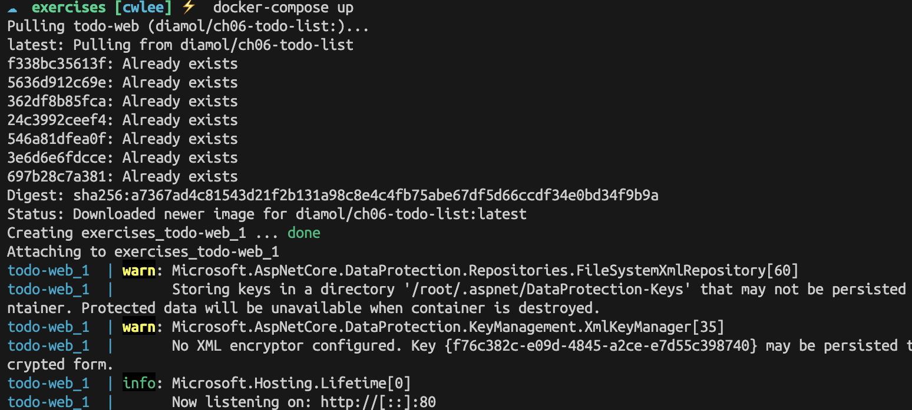
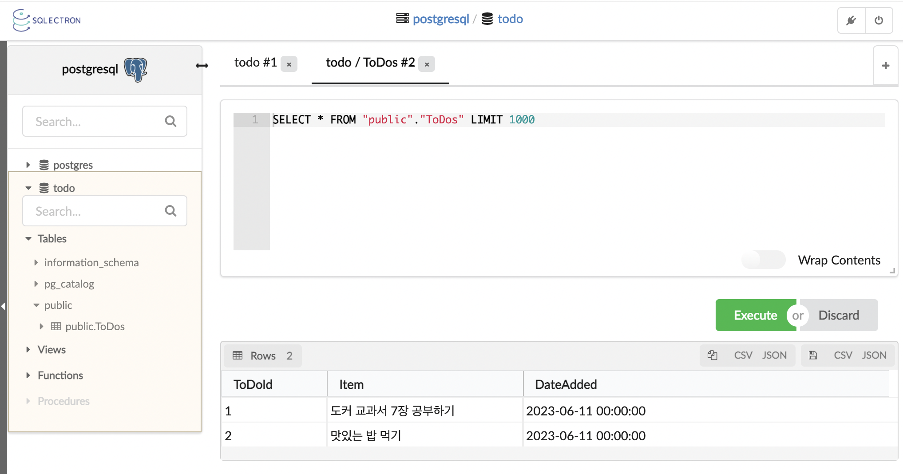
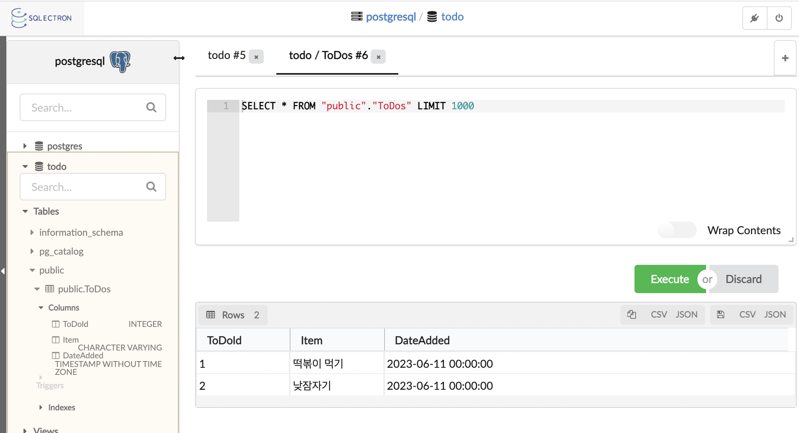

# 7장 도커 컴포즈로 분산 애플리케이션 실행하기

## 7.1 도커 컴포즈 파일의 구조

분산 애플리케이션을 기준으로 보면 Dockerfile 스크립트는 애플리케이션의 한 부분을 패키징하는 수단에 지나지 않는다.

웹 프론트엔드, 백엔드 API, 데이터베이스를 갖춘 애플리케이션을 패키징하려면 각 컴포넌트에 하나씩 세 개의 Dockerfile 스크립트가 필요하다. 그렇다면 이들 컨테이너는 누가 실행해야 할까?

`도커 컴포즈 파일` 에 애플리케이션의 구조를 정의하면 된다. 도커 컴포즈 파일은 애플리케이션을 ‘원하는 상태’, 다시 말해 모든 컴포넌트가 실행 중일 때 어떤 상태여야 하는지를 기술하는 파일이다.

📌 도커 컴포즈 파일 스트립트

```docker
version: '3.7'

services:
	todo-web:
		image: diamol/ch06-todo-list
		ports:
			- "8020:80"
		networks:
			- app-net

networks:
	app-net:
		external:
			name: nat
```

도커 컴포즈는 사람도 쉽게 읽고 이해할 수 있으며, JSON으로 변환하기 쉬운 `YAML`문법으로 기술된다. 

YAML 문법은 들여쓰기를 통해 구조를 정의하기 때문에 들여쓰기가 중요하다.

| field |  |
| --- | --- |
| image | 실행할 이미지 지정 |
| ports | 공개할 포트에 대한 정보 |
| networks | 컨테이너가 접속할 도커 네트워크 정의 |
| external | nat 네트워크가 이미 존재하므로 새로 생성하지 말라는 의미 |

서비스 이름은 컨테이너의 이름이자 도커 네트워크상에서 다른 컨테이너들이 해당 컨테이너를 식별하기 위한 DNS 네임으로 쓰인다.

📌 도커 컴포즈의 최상위 문(statement)

```docker
🔥 version
도커 컴포즈 파일 형식의 버전

🔥 services
애플리케이션을 구성하는 모든 컴포넌트를 열거하는 부분
도커 컴포즈에서는 실제 컨테이너 대신 서비스(service)의 개념을 단위로 삼는다.
하나의 서비스를 같은 이미지로 여러 컨테이너에서 실행할 수 있기 때문이다.

🔥 networks
서비스 컨테이너가 연결될 모든 도커 네트워크를 열거하는 부분
```

```
❓ 도커 컴포즈에서는 실제 컨테이너 대신 서비스(service)의 개념을 단위로 삼는다.
   하나의 서비스를 같은 이미지로 여러 컨테이너에서 실행할 수 있기 때문이다.

❗️ Docker Compose를 사용하여 하나의 서비스에 여러 개의 컨테이너를 실행하는 것은 스케일링에 유용한 접근 방식이다.
다음의 도커 파일에서 'web', 'db', 'cache'는 각각 하나의 서비스를 나타내고, 이 각각의 서비스는 각기 다른 Docker 이미지를 기반으로 한 컨테이너들을 생성한다.
만약 'web' 서비스를 여러 인스턴스로 스케일링하고 싶다면, Docker Compose는 이를 쉽게 할 수 있게 한다.
동일한 'my_web_app' 이미지를 기반으로 하는 여러 'web' 컨테이너를 실행하여 이를 하나의 'web' 서비스로 관리할 수 있다.

$ docker-compose up --scale web=5

위의 명령어는 'web' 서비스를 5개의 컨테이너 인스턴스로 스케일링한다. 
이것은 5개의 독립적인 'web' 컨테이너를 실행하지만, 
이들은 모두 동일한 'my_web_app' 이미지를 기반으로 하며, 동일한 네트워크 및 볼륨 설정 등을 공유하게 된다.

이런 식으로, Docker Compose는 같은 이미지를 사용하는 여러 컨테이너를 하나의 서비스로 그룹화하여, 
컨테이너의 생성, 구성, 관리를 훨씬 쉽게 만드는 기능을 제공합니다.
```

```
version: '3'
services:
  web:
    image: my_web_app
    ports:
      - "5000:5000"
  db:
    image: postgres
    volumes:
      - db_data:/var/lib/postgresql/data
  cache:
    image: redis
volumes:
  db_data: {}
```

📌 도커 네트워크 생성

```
$ docker network create nat

$ docker-compose up
```

🖥 실행 결과

- 현재 있는 리소스와 애플리케이션을 구성하는 리소스를 비교해 더 필요한 요소를 생성한다.
- 애플리케이션을 구성하는 단일 컨테이너가 실행된다.
- 컨테이너의 로그에 표준 출력을 연결해 애플리케이션의 로그를 보여 준다.



### 도커 컴포즈 파일의 장점

1. 도커 컴포즈 파일은 애플리케이션의 소스 코드, Dockerfile 스크립트와 함께 형상 관리 도구로 관리된다.
2. 도커 컴포즈 파일에 애플리케이션의 모든 실행 옵션이 기술된다.
3. README 파일에 애플리케이션 이미지 이름이나 공개해야 할 포트 번호를 문서화할 필요가 없다.

---

## 7.2 도커 컴포즈를 사용해 여러 컨테이너로 구성된 애플리케이션 실행하기

📌 여러 개의 컨테이너로 구성된 이미지 갤러리를 기술한 컴포즈 스크립트

```
version: '3.7'

services:
  accesslog:
    image: diamol/ch04-access-log
    networks:
      - app-net

  iotd:
    image: diamol/ch04-image-of-the-day
    ports:
      - "80"
    networks:
      - app-net
    
  image-gallery:
    image: diamol/ch04-image-gallery
    ports:
      - "8010:80"
    depends_on:
      - accesslog
      - iotd
    networks:
      - app-net

networks:
  app-net:
    external:
      name: nat
```

1. accesslog : 공개하는 포트 등 설정값 없이 이미지 이름만 정의
2. iotd : 이미지 이름과 80번 포트를 호스트 컴퓨터의 무작위 포트를 통해 공개하도록 작성
3. image-gallery
    - 이미지 이름과 80번 포트를 호스트 컴퓨터 8010번 포트를 통해 공개
    - depends_on 항목을 추가해 다른 두 서비스에 의존한다는 사실을 기술함.

```
☁  image-of-the-day [cwlee] ⚡  docker-compose up --detach       
Creating image-of-the-day_iotd_1      ... done
Creating image-of-the-day_accesslog_1 ... done
Creating image-of-the-day_image-gallery_1 ... done
```

```
☁  image-of-the-day [cwlee] ⚡  docker ps  
CONTAINER ID   IMAGE                          COMMAND                  CREATED          STATUS          PORTS                                       NAMES
df4961766ea9   diamol/ch04-image-gallery      "/web/server"            16 seconds ago   Up 15 seconds   0.0.0.0:8010->80/tcp, :::8010->80/tcp       image-of-the-day_image-gallery_1
2190c9a37f16   diamol/ch04-image-of-the-day   "java -jar /app/iotd…"   17 seconds ago   Up 16 seconds   0.0.0.0:50409->80/tcp                       image-of-the-day_iotd_1
db39ba6a2bc8   diamol/ch04-access-log         "docker-entrypoint.s…"   17 seconds ago   Up 16 seconds   80/tcp                                      image-of-the-day_accesslog_1
```

📌  도커 컴포즈를 사용해 iotd 서비스의 컨테이너 수를 늘린다. 웹 페이지를 리프레스하며 iotd 컨테이너 로그를 살펴본다.

```
☁  image-of-the-day [cwlee] ⚡  docker-compose up -d --scale iotd=3
image-of-the-day_accesslog_1 is up-to-date
Creating image-of-the-day_iotd_2 ... done
Creating image-of-the-day_iotd_3 ... done
image-of-the-day_image-gallery_1 is up-to-date

☁  image-of-the-day [cwlee] ⚡  docker-compose logs --tail=1 iotd
Attaching to image-of-the-day_iotd_3, image-of-the-day_iotd_2, image-of-the-day_iotd_1
iotd_2           | 2023-06-11 07:52:30.844  INFO 1 --- [p-nio-80-exec-1] o.s.web.servlet.DispatcherServlet        : Completed initialization in 4 ms
iotd_3           | 2023-06-11 07:52:32.352  INFO 1 --- [p-nio-80-exec-1] o.s.web.servlet.DispatcherServlet        : Completed initialization in 9 ms
iotd_1           |
```

도커 컴포즈는 컨테이너를 관리하는 별도의 명령이지만 내부적으로는 마찬가지로 도커 API를 사용한다. 따라서 도커 컴포즈로 실행한 컨테이너라도 똑같이 도커 명령행으로 관리할 수 있다.

📌 도커 컴포즈를 사용해 여러 개의 컨테이너로 구성된 애플리케이션을 중지 및 재시작하기

```
☁  image-of-the-day [cwlee] ⚡  docker-compose stop
Stopping image-of-the-day_iotd_3          ... done
Stopping image-of-the-day_iotd_2          ... done
Stopping image-of-the-day_image-gallery_1 ... done
Stopping image-of-the-day_iotd_1          ... done
Stopping image-of-the-day_accesslog_1     ... done

✅ 서비스가 의존 관계에 맞춰 실행된다.
☁  image-of-the-day [cwlee] ⚡  docker-compose start
Starting accesslog     ... done
Starting iotd          ... done
Starting image-gallery ... done

✅ 새 컨테이너를 만드는 대신 중지됐던 기존 컨테이너가 다시 실행되었다.
☁  image-of-the-day [cwlee] ⚡  docker container ls
CONTAINER ID   IMAGE                          COMMAND                  CREATED         STATUS          PORTS                                       NAMES
9dcf2df89a2e   diamol/ch04-image-of-the-day   "java -jar /app/iotd…"   2 minutes ago   Up 12 seconds   0.0.0.0:51384->80/tcp                       image-of-the-day_iotd_3
7b9fafe34d00   diamol/ch04-image-of-the-day   "java -jar /app/iotd…"   2 minutes ago   Up 12 seconds   0.0.0.0:51385->80/tcp                       image-of-the-day_iotd_2
9bab0a755d65   diamol/ch04-image-gallery      "/web/server"            8 minutes ago   Up 11 seconds   0.0.0.0:8010->80/tcp, :::8010->80/tcp       image-of-the-day_image-gallery_1
001e28ceabb6   diamol/ch04-image-of-the-day   "java -jar /app/iotd…"   8 minutes ago   Up 11 seconds   0.0.0.0:51386->80/tcp                       image-of-the-day_iotd_1
27f7b3a5e141   diamol/ch04-access-log         "docker-entrypoint.s…"   8 minutes ago   Up 12 seconds   80/tcp                                      image-of-the-day_accesslog_1
```

### 도커 컴포즈는 클라이언트 측에서 동작하는 도구이다.

도커 컴포즈 명령을 실행하면 `컴포즈 파일의 내용`에 따라 도커 API로 지시를 보낸다.

도커 엔진 자체는 컨테이너를 실행할 뿐, 여러 컨테이너가 하나의 애플리케이션으로 동작하는지 여부는 알지 못한다.

이를 아는 것은 YAML로 적힌 컴포즈 파일을 읽어 애플리케이션의 구조를 이해한 `컴포즈`뿐이다.

```
💡 컴포즈 파일을 수정하거나 도커 명령행으로 직접 애플리케이션을 수정하면, 애플리케이션이 컴포즈 파일에 기술된 구조와 불일치하게 만들 수도 있다.
💡 컴포즈 파일을 통해 리소스를 관리해야 애플리케이션이 성립할 수 있다.
```

```
✅ 컴포즈가 관리하는 리소스를 모두 제거한다. 컨테이너도 마찬가지로 삭제된다.
✅ 네트워크는 컴포즈의 관리 대상이 아니므로 삭제되지 않고 그대로 남아 있다.
☁  image-of-the-day [cwlee] ⚡  docker-compose down
Stopping image-of-the-day_iotd_3          ... done
Stopping image-of-the-day_iotd_2          ... done
Stopping image-of-the-day_image-gallery_1 ... done
Stopping image-of-the-day_iotd_1          ... done
Stopping image-of-the-day_accesslog_1     ... 
Stopping image-of-the-day_accesslog_1     ... done
Removing image-of-the-day_iotd_3          ... done
Removing image-of-the-day_iotd_2          ... done
Removing image-of-the-day_image-gallery_1 ... done
Removing image-of-the-day_iotd_1          ... done
Removing image-of-the-day_accesslog_1     ... done
Network nat is external, skipping

✅ 컴포즈 파일에 정의된 대로 리소스를 다시 생성하고 애플리케이션을 재시작한다.
☁  image-of-the-day [cwlee] ⚡  docker-compose up -d
Creating image-of-the-day_iotd_1      ... done
Creating image-of-the-day_accesslog_1 ... done
Creating image-of-the-day_image-gallery_1 ... done

✅ 컴포즈 파일의 내용은 수정되지 않았으므로 다시 컨테이너 수가 하나가 됐다.
☁  image-of-the-day [cwlee] ⚡  docker container ls
CONTAINER ID   IMAGE                          COMMAND                  CREATED         STATUS         PORTS                                       NAMES
02d42287540a   diamol/ch04-image-gallery      "/web/server"            7 seconds ago   Up 6 seconds   0.0.0.0:8010->80/tcp, :::8010->80/tcp       image-of-the-day_image-gallery_1
80e0a504acc8   diamol/ch04-image-of-the-day   "java -jar /app/iotd…"   7 seconds ago   Up 6 seconds   0.0.0.0:51452->80/tcp                       image-of-the-day_iotd_1
b13830ee5dc9   diamol/ch04-access-log         "docker-entrypoint.s…"   7 seconds ago   Up 6 seconds   80/tcp                                      image-of-the-day_accesslog_1
```

---

## 7.3 도커 컨테이너 간의 통신

### 서비스 디스커버리 기능

도커에 DNS 서비스가 내장돼 있다. IP 주소가 변경돼도 문제가 없도록 도커에서 DNS를 이용해 서비스 디스커버리 기능을 제공한다.

컨테이너에서 실행 중인 애플리케이션도 다른 구성 요소에 접근하기 위해 이 DNS 서비스를 사용한다.

컨테이너 이름을 도메인 삼아 조회하면 해당 컨테이너의 IP 주소를 찾아 준다.

만약 도메인이 가리키는 대상이 컨테이너가 아니면, 도커 엔진을 실행 중인 컴퓨터에 요청을 보내 호스트 컴퓨터가 속한 네트워크나 인터넷의 IP주소를 조회한다.

📌 웹 컨테이너에서 DNS 조회 명령을 실행해 본다.

```
☁  docker-study [cwlee] ⚡  docker container exec -it image-of-the-day_image-gallery_1 sh
/web # nslookup accesslog
nslookup: can't resolve '(null)': Name does not resolve

Name:      accesslog
Address 1: 172.18.0.2 image-of-the-day_accesslog_1.nat
/web #
```

### 로드 밸런싱

📌  iotd 컨테이너를 스케일아웃한 후, DNS 조회 명령을 실행해 본다.

```
☁  image-of-the-day [cwlee] ⚡  docker-compose scale iotd=3     
WARNING: The scale command is deprecated. Use the up command with the --scale flag instead.
Creating image-of-the-day_iotd_2 ... done
Creating image-of-the-day_iotd_3 ... done

☁  image-of-the-day [cwlee] ⚡  docker container exec -it image-of-the-day_image-gallery_1 sh
/web # nslookup iotd
nslookup: can't resolve '(null)': Name does not resolve

Name:      iotd
Address 1: 172.18.0.7 image-of-the-day_iotd_3.nat
Address 2: 172.18.0.8 image-of-the-day_iotd_2.nat
Address 3: 172.18.0.3 image-of-the-day_iotd_1.nat
```

하나의 도메인에 대해 DNS 조회 결과에 여러 개의 IP 주소가 나올 수 있다. 도커 컴포즈는 이 점을 활용해 간단한 `로드 밸런싱`을 구현할 수 있다. 여러 개의 IP 주소가 담긴 조회 결과를 어떻게 활용할지는 전적으로 애플리케이션이 결정한다. 

---

## 7.4 도커 컴포즈로 애플리케이션 설정값 지정하기

### PostgreSQL

강력한 기능을 갖춘 오픈 소스 관계형 데이터베이스로, 폭넓은 용도로 사용된다.

도커에서도 잘 동작하므로 애플리케이션 컨테이너와 데이터 베이스 컨테이너를 따로 실행하며 분산 애플리케이션을 구동하는 데 사용할 수 있다.

📌 PostgreSQL 데이터베이스를 사용하는 to-do 애플리케이션 서비스 정의

```
services:
	todo-db:
		image: diamol/postgres:11.5
		ports:
			- "5433:5432"
		networks:
			- app-net

	todo-web:
		image: diamol/ch06-todo-list
		ports:
			- "8020:80"
		environment:
			- Database:Provider=Postgres
		depends_on:
			- todo-db
		networks:
			- app-net
		secrets:
			- source: postgres-connection
				target: /app/config/secrets.json
```

```
✅ environment
컨테이너 안에서 사용될 환경 변수 값이 정의된다.
애플리케이션이 실행되면 컨테이너 안의 환경 변수 Database:Provider의 값이 Postgres로 설정된다.

✅ secrets
실행 시 컨테이너 내부의 파일에 기록될 비밀값을 정의한다.
이 애플리케이션이 실행되면 컨테이너에 /app/config/secrets.json 파일이 생기고,
이 파일에는 postgres-connection이라는 이름의 비밀값의 값이 기록된다.
```

비밀값은 주로 클러스터 환경에서 쿠버네티스나 도커 스웜같은 컨테이너 플랫폼을 통해 제공된다.

평소에는 클러스터 데이터베이스에 암호화돼 있기 때문에 데이터베이스 패스워드, 인증서, API 키 등 민감한 정보로 구성된 설정값을 전달하는 데 적합하다.

도커를 단일 컴퓨터에서 실행하는 상황이라면 비밀값을 보관하는 클러스터 데이터베이스가 없을 것이므로 파일을 통해 비밀값을 전달해도 된다.

📌 로컬 파일에서 비밀값을 읽어오는 컴포즈 파일

```
secrets:
	postgres-connection:
		file: ./config/secrets.json
```

애플리케이션 설정값을 컴포즈 파일에 정의하면, 같은 도커 이미지라도 다양하게 활용할 수 있고, 서로 다른 각 환경에 대한 설정을 명시적으로 정의할 수 있다.

개발 환경이나 테스트 환경의 컴포즈 파일을 별도로 작성해 두면 공개하는 포트를 환경에 따라 달리하거나 애플리케이션의 기능을 선택적으로 활성화할 수 있다.

```
☁  todo-list-postgres [cwlee] ⚡  docker-compose ps
            Name                           Command              State                    Ports                  
----------------------------------------------------------------------------------------------------------------
todo-list-postgres_todo-db_1    docker-entrypoint.sh postgres   Up      0.0.0.0:5433->5432/tcp,:::5433->5432/tcp
todo-list-postgres_todo-web_1   dotnet ToDoList.dll             Up      0.0.0.0:8030->80/tcp,:::8030->80/tcp
```



### 도커는 패키징된 애플리케이션과 설정값 분리할 수 있다.

패키징된 애플리케이션과 설정값을 분리할 수 있다는 것도 도커의 핵심적인 장점 중 하나이다.

각 환경마다 컴포즈 파일에서 쉽게 정의할 수 있는 환경 변수나 바인드 마운트 설정, 비밀값 등으로 설정값이 적용된다.

이런 방법을 통해 모든 환경에서 동일한 이미지를 사용하므로 개발 환경과 테스트 환경에서 모든 검증을 마친 이미지를 그대로 운영 환경에 투입할 수 있다.

---

## 7.5 도커 컴포즈도 만능은 아니다.

도커 컴포즈는 도커 스웜이나 쿠버네티스같은 완전한 컨테이너 플랫폼이 아니다. 도커 컴포즈에는 이들과 달리 애플리케이션이 지속적으로 정의된 상태를 유지하도록 하는 기능이 없다.

일부 컨테이너가 오류를 일으키거나 강제로 종료되더라도 docker-compose up 명령을 다시 실행하지 않는 한 애플리케이션의 상태를 원래대로 되돌릴 수 없다.

---

## 7.6 연습 문제

```
- 호스트 컴퓨터가 재부팅되거나 도커 엔진이 재시작되면 애플리케이션 컨테이너도 재시작되도록 한다.
- 데이터베이스 컨테이너는 바인드 마운트에 파일을 저장해 애플리케이션을 재시작하더라도 데이터를 유지할 수 있도록 한다.
- 테스트를 위해 웹 애플리케이션은 80번 포트를 주시하도록 한다.
```

```docker
version: '3.7'

services:
  todo-web:
    image: diamol/ch06-todo-list
    restart: always
    ports:
      - "80:80"
    environment:
      - Database:Provider=Postgres
    depends_on:
      - todo-db
    networks:
      - app-net
    secrets:
      - source: postgres-connection
        target: /app/config/secrets.json

  todo-db:
    image: diamol/postgres:11.5
    restart: always
    ports:
      - "5433:5432"
    volumes:
      - ./data:/var/lib/postgresql/data
    networks:
      - app-net

networks:
  app-net:
    external:
      name: nat

secrets:
  postgres-connection:
    file: postgres-connection.json
```

```docker
☁  solution [cwlee] ⚡  docker-compose down 
Stopping solution_todo-web_1 ... done
Stopping solution_todo-db_1  ... done
Removing solution_todo-web_1 ... done
Removing solution_todo-db_1  ... done
Network nat is external, skipping

☁  solution [cwlee] ⚡  docker-compose up -d
Creating solution_todo-db_1 ... done
Creating solution_todo-web_1 ... done
```

✅ 컨테이너를 재시작해도 같은 데이터가 조회된다. </br>
