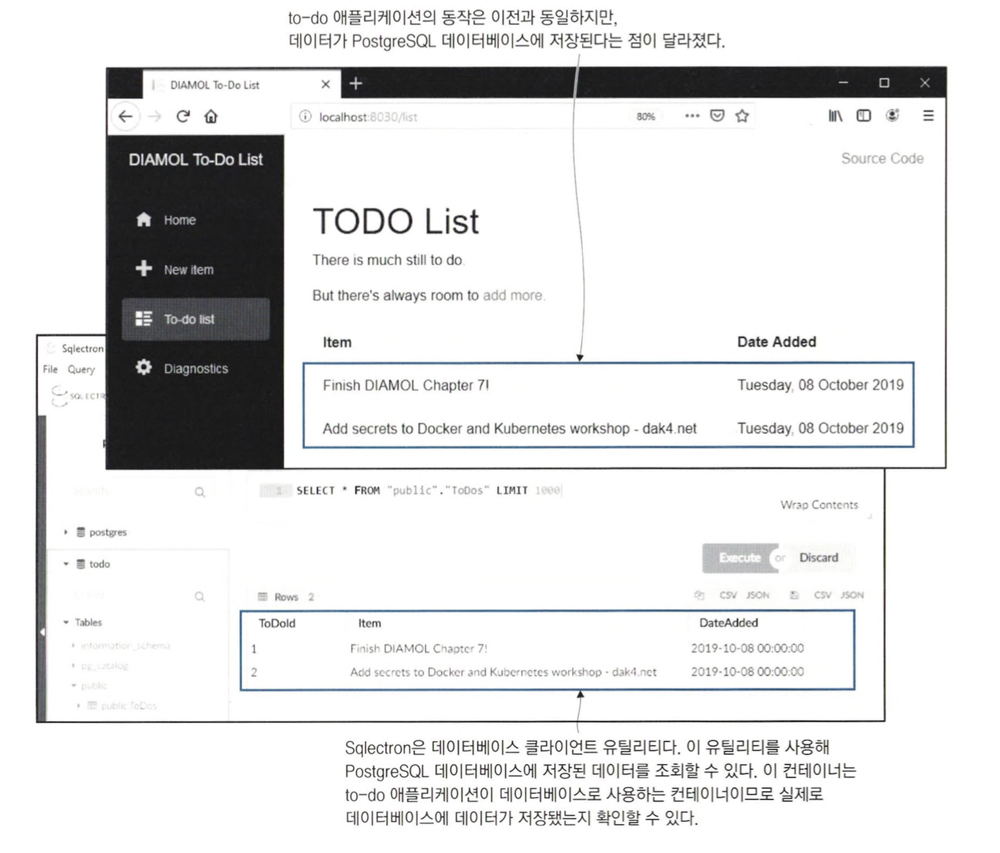

# 도커 컴포즈 파일의 구조

분산 애플리케이션을 기준으로 보면 Dockerfile 스크립트는 애플리케이션의 한 부분을 패키징하는 수단에 지나지 않는다. <br>
front, back, db를 갖춘 애플리케이션을 패키징하려면 각 컴포넌트에 하나씩 세 개의 Dockerfile 스크립트가 필요하다. <br>
직접 각각의 컨테이너를 실행할 수도 있지만, 도커 컴포즈 파일에 애플리케이션의 구조를 정의하여 한 번에 실행할 수도 있다.

<br>

```yaml
version: '3.7'

services:
  
  todo-web:
    image: diamol/ch06-todo-list 
    ports:
      - "8020:80" 
    networks:
      - app-net 
        
networks:
  app-net:
    external: 
      name: nat
```

도커 컴포즈는 사람이 읽고 이해하기 쉽고, JSON으로 변환하기 쉬운 yaml 문법으로 작성한다. <br>
위의 도커 컴포즈 파일은 세 개의 statement로 구성된다.

- version은 도커 컴포즈 파일 형식의 버전이다.
- services는 애플리케이션을 구성하는 모든 컴포넌트를 연결하는 부분이다. 도커 컴포즈에서는 실제 컨테이너 대신 서비스 개념을 단위로 삼는다.
- networks는 서비스 컨테이너가 연결될 모든 도커 네트워크를 열거하는 부분이다.

<br>

도커 컴포즈를 사용해 이 애플리케이션을 실행하면 컨테이너 하나가 실행돼 스크립트에 정의된 구성을 갖춘다. <br>
최종적인 결과는 `docker container run -p 8020:80 —name todo-web --network nat diamol/ch06-todo-list`를 실행한 것과 같은 상태가 된다.

<br>

```
cd ch07/exercises/todo-list

docker-compose up

// 실행 결과
Creating todo-list_todo-web_1 ... done
Attaching to todo-list_todo-web_1
todo-web_1  | warn: Microsoft.AspNetCore.DataProtection.Repositories.FileSystemXmlRepository[60]
todo-web_1  |       Storing keys in a directory '/root/.aspnet/DataProtection-Keys' that may not be persisted outside of the container. Protected data will be unavailable when container is destroyed.
todo-web_1  | warn: Microsoft.AspNetCore.DataProtection.KeyManagement.XmlKeyManager[35]
todo-web_1  |       No XML encryptor configured. Key {a9bc3ccf-e1f3-4b1a-86cf-3c0ed27899ee} may be persisted to storage in unencrypted form.
todo-web_1  | info: Microsoft.Hosting.Lifetime[0]
todo-web_1  |       Now listening on: http://[::]:80
todo-web_1  | info: Microsoft.Hosting.Lifetime[0]
todo-web_1  |       Application started. Press Ctrl+C to shut down.
todo-web_1  | info: Microsoft.Hosting.Lifetime[0]
todo-web_1  |       Hosting environment: Production
todo-web_1  | info: Microsoft.Hosting.Lifetime[0]
todo-web_1  |       Content root path: /app
```

docker-compose 명령어를 실행하면 현재 작업 디렉터리에서 `docker-compose.yml` 파일을 찾는다. <br>
해당 파일을 발견하면 애플리케이션 정의를 읽고, 실행한다.

도커 컴포즈 파일은 애플리케이션의 소스 코드, Dockerfile 스크립트와 함께 형상 관리 도구로 관리된다. <br>
그리고 이 파일에 애플리케이션의 모든 실행 옵션이 기술된다.


<br>
<hr>

# 도커 컴포즈를 사용해 여러 컨테이너로 구성된 애플리케이션 실행

```yaml
version: '3.7'

services:

  accesslog:
    image: diamol/ch04-access-log
    networks:
      - app-net

  iotd:
    image: diamol/ch04-image-of-the-day
    ports:
      - "80"
    networks:
      - app-net

  image-gallery:
    image: diamol/ch04-image-gallery
    ports:
      - "8010:80"
    depends_on:
      - accesslog
      - iotd
    networks:
      - app-net

networks:
  app-net:
    external:
      name: nat
```


<br>

```
cd ch07/exercises/image-of-the-day

docker-compose up -d
```


<br>

컴포즈 파일을 사용해 여러 개의 컨테이너로 구성된 애플리케이션을 마치 한 덩어리처럼 다룰 수 있다. <br>
API 서비스는 상태가 없으므로 컨테이너를 늘리는 방법으로 스케일 아웃할 수 있다. <br>
웹 컨테이너가 API에 데이터를 요청하면 도커가 여러 개의 API 컨테이너에 이 요청을 고르게 분배해 준다.

<br>

```
docker-compose up -d --scale iotd=3

// 실행 결과
image-of-the-day_accesslog_1 is up-to-date
Creating image-of-the-day_iotd_2 ... done
Creating image-of-the-day_iotd_3 ... done
image-of-the-day_image-gallery_1 is up-to-date
```

```
docker-compose logs --tail=1 iotd

// 실행 결과
Attaching to image-of-the-day_iotd_2, image-of-the-day_iotd_3, image-of-the-day_iotd_1
iotd_1           | 2023-06-11 03:33:58.448  INFO 1 --- [           main] iotd.Application                         : Started Application in 1.456 seconds (JVM running for 1.699)
iotd_2           | 2023-06-11 03:35:45.822  INFO 1 --- [           main] iotd.Application                         : Started Application in 2.248 seconds (JVM running for 2.651)
iotd_3           | 2023-06-11 03:35:45.822  INFO 1 --- [           main] iotd.Application                         : Started Application in 2.321 seconds (JVM running for 2.67)
```

> API 서비스의 컨테이너를 두 개 늘렸다. <br>
> 웹 애플리케이션이 API에 데이터를 요청하고 이 요청을 늘어난 컨테이너가 고르게 나눠 처리하는데, <br>
> API 서비스가 요청을 처리할 때마다 남기는 컨테이너 로그로 이를 확인할 수 있다.

<br>

```
docker-compose stop 

docker-compose start
 
docker container ls
```

컴포즈로 애플리케이션을 중지할 경우 각 컨테이너의 목록이 표시되지만 애플리케이션을 재시작할 때는 서비스의 이름만 열거된다. <br>
컨테이너 목록을 확인해보면 컨테이너가 생성되고 30분이 지났지만 방금 실행된 것으로 나온다. <br>
**이를 보면 새 컨테이너를 만드는 대신 중지됐던 기존 컨테이너가 다시 실행된 것임을 알 수 있다.**


<br>

> 도커 컴포즈는 YAML 파일에 정의된 애플리케이션 정의에 의존하는 클라이언트 측 도구이다. <br>
> 도커 컴포즈로 애플리케이션을 배포하면 애플리케이션을 구성하는 다양한 리소스가 생성되지만, 도커 엔진의 입장에서는 이들이 어떤 관계를 갖는지 알 수 없다. <br>
> 컴포즈 파일을 통해 리소스를 관리해야 애플리케이션이 성립할 수 있다.


<br>
<hr>

# 도커 컨테이너 간의 통신

컨테이너는 도커 엔진으로부터 부여받은 자신만의 가상 IP 주소를 가지며 모두 같은 도커 네트워크로 연결돼 이 IP 주소를 통해 서로 통신할 수 있다. <br>
그러나 애플리케이션 컨테이너가 교체되면 IP 주소도 변경된다. <br>
IP 주소가 변경돼도 문제가 없도록 도커에서 DNS를 이용해 서비스 디스커버리 기능을 제공한다.

컨테이너에서 실행 중인 애플리케이션은 다른 구성 요소에 접근하기 위해 DNS 서비스를 사용한다. <br>
컨테이너 이름을 도메인 삼아 조회하면 해당 컨테이너의 IP 주소를 찾아 준다. <br>
만약 도메인이 가리키는 대상이 컨테이너가 아니면, 도커 엔진을 실행 중인 컴퓨터에 요청을 보내 호스트 컴퓨터가 속한 네트워크나 인터넷의 IP 주소를 조회한다.

```
docker container exec -it image-of-the-day_image-gallery_1 sh

nslookup accesslog

// 실행 결과
nslookup: can't resolve '(null)': Name does not resolve

Name:      accesslog
Address 1: 172.18.0.3 image-of-the-day_accesslog_1.nat
```

nslookup 명령어로 도메인을 DNS 서비스에서 조회했다. <br>
**DNS 조회를 사용하면 컨테이너가 교체돼 IP 주소가 변경되더라도 항상 새로 만들어진 컨테이너에 접근할 수 있다.**


<br>
<hr>

# 도커 컴포즈로 애플리케이션 설정 값 지정

```yaml
version: "3.7"

services:
  todo-db:
    image: diamol/postgres:11.5
    ports:
      - "5433:5432"
    networks:
      - app-net

  todo-web:
    image: diamol/ch06-todo-list
    ports:
      - "8030:80"
    environment:
      - Database:Provider=Postgres
    depends_on:
      - todo-db
    networks:
      - app-net
    secrets:
      - source: postgres-connection
        target: /app/config/secrets.json

networks:
  app-net:

secrets:
  postgres-connection:
    file: ./config/secrets.json
```

- environment에는 컨테이너 안에서 사용될 환경변수 값이 정의된다. 애플리케이션이 실행되면 컨테이너 안의 환경 변수 Database:Provider의 값이 Postgres로 설정된다.
- secrets에는 실행 시 컨테이너 내부의 파일에 기록될 비밀값을 정의한다. 이 애플리케이션이 실행되면 컨테이너에 /app/config/secrets.json 파일이 생기고. 이 파일에는 postgres-connection이라는 이름의 비밀값이 기록된다.

> 비밀값은 주로 클러스터 환경에서 쿠버네티스나 도커 스웜 같은 컨테이너 플랫폼을 통해 제공된다. <br>
> 클러스터 데이터베이스에 암호화돼 있기 때문에 데이터베이스 패스워드. 인증서, API 키 등 민감한 정보로 구성된 설정값을 전달하는 데 적합하다.

<br>

```
cd ch07/exercises/todo-list-postgres

docker-compose up -d

docker-compose ps

// 실행 결과
            Name                           Command              State           Ports
----------------------------------------------------------------------------------------------
todo-list-postgres_todo-db_1    docker-entrypoint.sh postgres   Up      0.0.0.0:5433->5432/tcp
todo-list-postgres_todo-web_1   dotnet ToDoList.dll             Up      0.0.0.0:8030->80/tcp
```




<br>
<hr>

# 도커 컴포즈도 만능은 아니다

도커 컴포즈는 도커 스웜이나 쿠버네티스같은 완전한 컨테이너 플랫폼이 아니다. <br>
도커 컴포즈에는 이들과 달리 애플리케이션이 지속적으로 정의된 상태를 유지하도록 하는 기능이 없다. <br>
일부 컨테이너가 오류를 일으키거나 강제로 종료 되더라도 docker-compose up 명령을 다시 실행하지 않는 한 애플리케이션의 상태를 원래대로 되돌릴 수 없다.

<br>
<hr>

# 연습 문제

[docker restart.docs](https://docs.docker.com/config/containers/start-containers-automatically/)

```yaml
version: "3.7"

services:
  todo-db:
    image: diamol/postgres:11.5
    restart: always
    environment:
      - PGDATA=/var/lib/postgresql/data
    volumes:
      - type: bind
        source: /data/postgres
        target: /var/lib/postgresql/data
    networks:
      - app-net

  todo-web:
    image: diamol/ch06-todo-list
    restart: always
    ports:
      - "8050:80"
    environment:
      - Database:Provider=Postgres
    depends_on:
      - todo-db
    secrets:
      - source: postgres-connection
        target: /app/config/secrets.json

secrets:
  postgres-connection:
    file: postgres-connection.json

networks:
  app-net:
    external:
      name: nat
```


