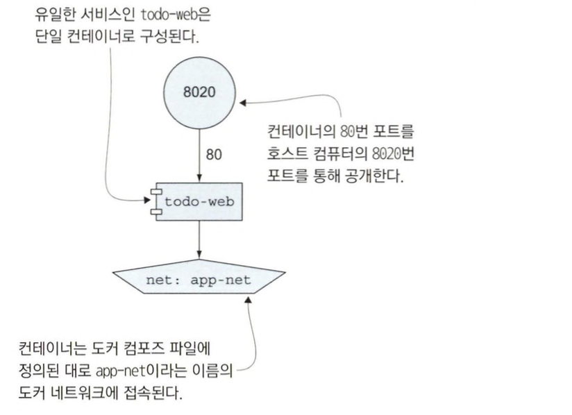
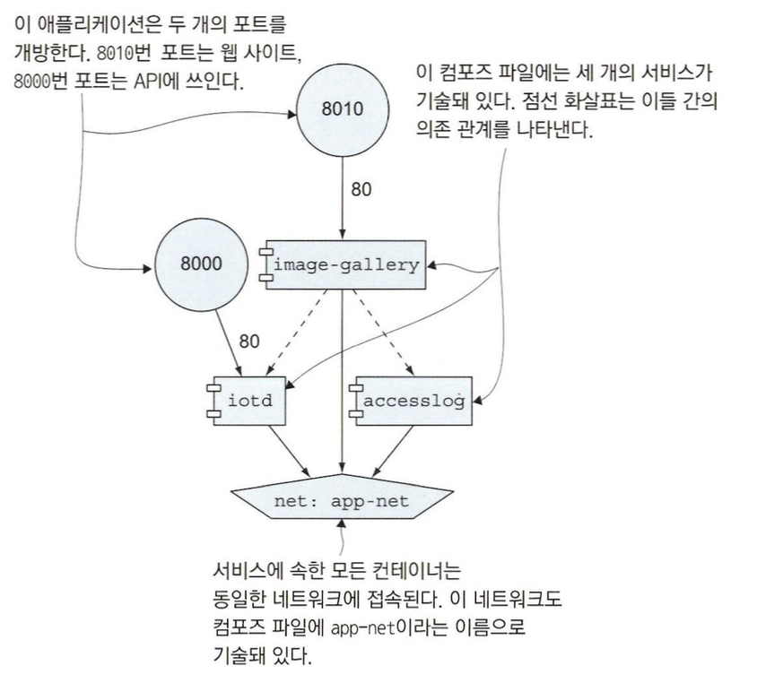
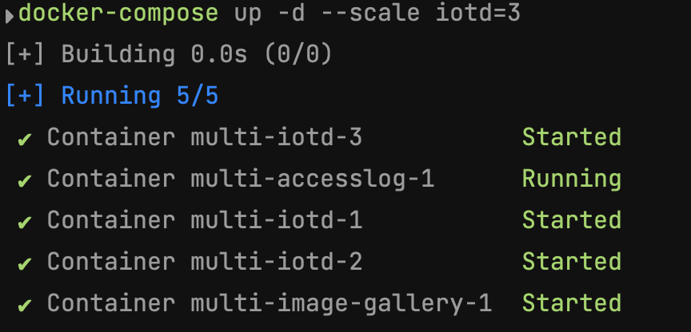
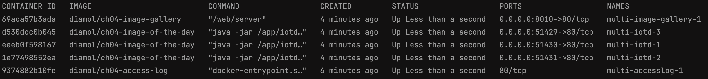
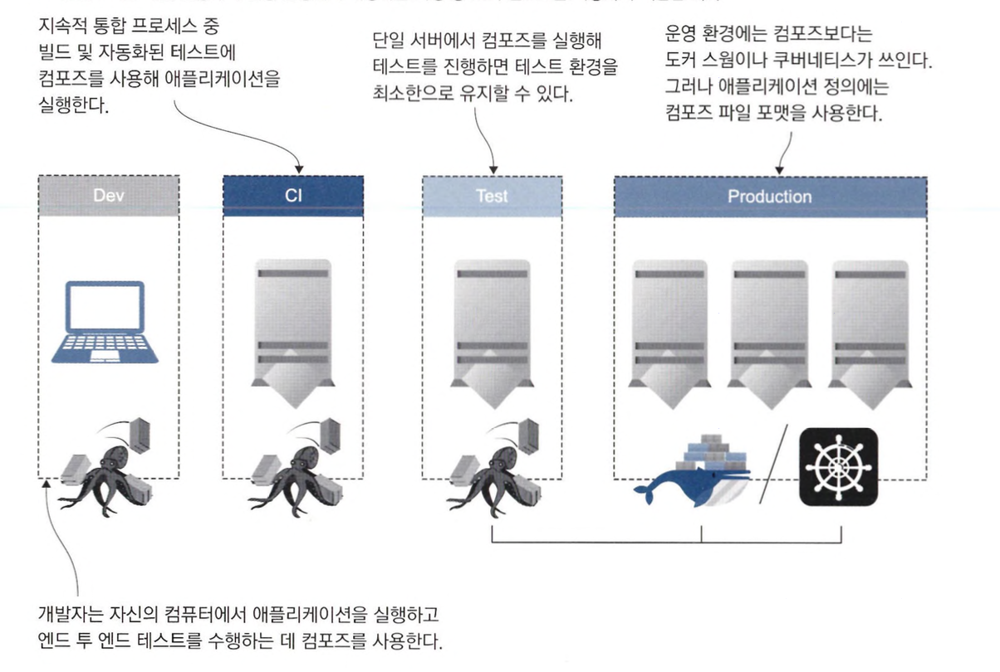

# 도커 컴포즈로 분산 애플리케이션 실행하기

## 도커 컴포즈 파일의 구조

### 도커 컴포즈란

하나의 웹 서버를 띄우려고 한다면 웹 프론트엔드, 웹 백엔드, DB와 같이 최소 3개의 컨테이너는 같이 띄워야 할 것 입니다.

직접 하나하나 컨테이너를 띄울 수도 있지만 이렇게 수동으로 컨테이너를 생성하는 것은 실수 등으로 인해 온갖 버그의 원인이 됩니다.

이런 상황을 막기 위해 도커 컴포즈를 사용할 수 있습니다.

도커 컴포즈 파일은 `모든 컴포넌트가 실행 중일 때 어떤 상태일지 기술하는 파일`입니다.

쉽게 말해 docker container run 명령으로 컨테이너를 실행할 때 지정하는 모든 옵션을 한데 모아 놓은 파일입니다.

도커 컴포즈 파일을 정의하고 실행하면 `컨테이너, 네트워크, 볼륨 등 필요한 모든 도커 객체를 만들도록 도커 API에 명령`을 내립니다.

### 도커 컴포즈 예시

도커 컴포즈 파일은 YAML 문법으로 작성됩니다.

다음은 도커 네트워크에 도커 컨테이너 하나가 연결된 애플리케이션을 정의한 도커 컴포즈 파일입니다.

```go
version: "3.7"

services:
  todo-web:
    image: diamol/ch06-todo-list
    ports:
      - "8020:80"
    networks:
      - app-net
networks:
  app-net:
    external:
      name: nat
```

위의 도커 컴포즈 파일은 다음과 같은 세 개의 최상위 문을 구성됩니다.

- version
    - 도커 컴포즈 파일의 버전을 가리킵니다.
    - 버전마다 문법과 표현 가능한 요소가 다르기 때문에 버전을 꼭 명시해주는 것이 좋습니다.
    - 버전을 명시하지 않을 경우 버전 1로 간주하게 됩니다.
- services
    - 애플리케이션을 구성하는 모든 컴포넌트를 정의하는 부분입니다.
    - 도커 컴포즈에서는 실제 컨테이너 대신 서비스 개념을 단위로 삼습니다.
    - 하나의 서비스를 같은 이미지로 여러 컨테이너에서 실행할 수 있기 때문입니다.
- networks
    - 서비스 컨테이너가 연결될 모든 도커 네트워크를 정의하는 부분입니다.

다음은 도커 컴포즈 파일로 선언한 애플리케이션 구성도입니다.



### 도커 컴포즈 실행

도커 컴포즈를 사용하려면 docker-compose 명령을 실행하면 됩니다.

```go
docker-compose up 
```

### 도커 컴포즈의 장점

도커 컴포즈를 사용하면 다음과 같은 장점을 얻을 수 있습니다.

- 설정 사항을 간접적으로 문서화할 수 있다.
- 여러 컴포넌트를 한번에 관리할 수 있다.
- 각 컨테이너의 인스턴스 수를 간단하게 변경할 수 있습니다.

## 도커 컴포즈를 사용해 여러 컨테이너로 구성된 애플리케이션 실행

### 도커 컴포즈 파일 정의하기

다음과 같이 여러 개의 컨테이너를 하나의 도커 컴포즈 파일로 묶을 수 있습니다.

```yaml
version: "3.7"

services:
  accesslog:
    image: diamol/ch04-access-log

  iotd:
    image: diamol/ch04-image-of-the-day
    ports:
      - "80"
  image-gallery:
    image: diamol/ch04-image-gallery
    ports:
      - "8010:80"
    depends_on:
      - accesslog
      - iotd
```

위의 파일에 새롭게 추가된 `depends_on` 은 의존하는 서비스를 명시하는 항목입니다.

`depends_on` 을 지정하는 경우 `depends_on` 으로 지정된 서비스를 먼저 실행하려고 시도합니다.

### 도커 컴포즈 파일 구성도



### 도커 컴포즈 파일 실행

이번에는 도커 컴포즈 파일을 백그라운드에서 동작하도록 `-d` 옵션을 추가해서 실행해봅시다.

```bash
docker-compose up -d
```

만약 특정 컨테이너의 수를 늘리고 싶다면 다음과 같이 scale 옵션을 주어서 컨테이너 수를 늘릴 수 있습니다.

```bash
docker-compose up -d --scale=3 iotd=3
```



### 도커 컴포즈 재실행

`docker-compose` 명령을 통해 재실행하는 경우 컨테이너 삭제 후 재 생성이 아니라 컨테이너 중지 후 재 실행으로 실행 되게 됩니다.

이를 확인하기 위해 다음과 같이 명령어를 입력해봅시다.

```yaml
docker-compose stop
docker-compose start
docker container ls
```

방금 종료 후 재실행 했지만 컨테이너 생성시간은 그보다 이전으로 나오는 것을 확인할 수 있습니다.


### 도커 컴포즈는 클라이언트 측에서 동작하는 도구다

도커 컴포즈 명령을 실행하면 도커 API로 지시를 보냅니다.

도커 엔진 자체는 컨테이너를 실행할 뿐, 여러 컨테이너가 하나의 애플리케이션으로 동작하는지 여부는 알지 못합니다.

이를 아는 것은 YAML로 적힌 컴포즈 파일을 읽어 애플리케이션의 구조를 이해한 컴포즈 뿐입니다.

그러므로 컴포즈를 사용해 애플리케이션을 관리하려면 컴포즈 파일을 작성하고 이 파일을 읽을 수 있게 해야합니다.

여기서 `주의해야 할 점`은 컴포즈 파일을 수정하거나 도커 명령행으로 직접 애플리케이션을 수정하면, 애플리케이션이 컴포즈 파일에 기술된 구조와 불일치하게 만들 수도 있습니다.

이 상태에서 도커 컴포즈로 다시 애플리케이션을 관리하려 하면 비정상적인 동작을 보일 수도 있습니다.

예를 들어 아까 명령어를 통해 컨테이너의 수를 늘렸지만 다시 도커 컴포즈 명령을 통해 재실행해보면 1개만 작동하는 것을 볼 수 있습니다.

```yaml
docker-compose up -d
[+] Building 0.0s (0/0)                                                                                                                                                                                                                                                          
[+] Running 4/4
 ✔ Network multi_default            Created                                                                                                                                                                                                                                 0.0s 
 ✔ Container multi-iotd-1           Started                                                                                                                                                                                                                                 0.4s 
 ✔ Container multi-accesslog-1      Started                                                                                                                                                                                                                                 0.4s 
 ✔ Container multi-image-gallery-1  Started
```

```yaml
CONTAINER ID   IMAGE                                                                    COMMAND                  CREATED         STATUS                    PORTS                    NAMES
ba03d96e9a3a   diamol/ch04-image-gallery                                                "/web/server"            3 seconds ago   Up 2 seconds              0.0.0.0:8010->80/tcp     multi-image-gallery-1
033f662c50b0   diamol/ch04-image-of-the-day                                             "java -jar /app/iotd…"   4 seconds ago   Up 2 seconds              0.0.0.0:49750->80/tcp    multi-iotd-1
0ac21ae377ba   diamol/ch04-access-log                                                   "docker-entrypoint.s…"   4 seconds ago   Up 2 seconds              80/tcp                   multi-accesslog-1
a0c4b4ec66f3   diamol/ch06-todo-list                                                    "dotnet ToDoList.dll"    15 hours ago    Exited (0) 15 hours ago                            docker-compose-todo-web-1
```

이렇게 의도치 않은 동작을 할 수 있기 때문에 도커 컴포즈를 사용하는 경우 컴포즈 파일을 통해서만 리소스를 관리하는 것이 좋습니다.

## 도커 컨테이너 간의 통신

### 서비스 디스커버리

컨테이너는 도커 엔진으로부터 부여 받은 자신만의 가상 IP 주소를 가지며, 모두 같은 도커 네트워크로 연결되어 할당 받은 IP 주소를 통해 통신합니다.

하지만 애플리케이션 생애주기 동안에 컨테이너가 교체되면 IP주소도 변경되어 문제가 발생할 수 있습니다.

이런 상황에 대비해 도커에서 DNS를 이용해 서비스 디스커버리 기능을 제공합니다.

도커에서는 서비스 디스커버리를 통해 컨테이너의 이름을 도메인 삼아 조회하여 해당 컨테이너의 IP 주소를 찾아줍니다.

만약, 도메인이 가르키는 대상이 컨테이너가 아니면 도커 엔진을 실행중인 컴퓨터에 요청을 보내 호스트 컴퓨터가 속한 네트워크나 인터넷의 IP 주소를 조회합니다.

다음과 같이 컨테이너의 DNS 조회 명령을 통해 서비스 디스커버리가 잘 동작하는지 확인해봅시다.

```bash
docker-compose up -d --scale iotd=3

docker container exec -it multi-image-gallery-1 sh

nslookup accesslog

# 결과
# nslookup: can't resolve '(null)': Name does not resolve

# Name:      accesslog
# Address 1: 172.22.0.3 multi-accesslog-1.multi_default

exit
```

도커 네트워크에 연결된 모든 컨테이너는 이 네트워크의 범위에 포함되는 IP 주소를 부여받습니다.

그리고 이 네트워크를 통해 컨테이너 간 통신이 가능합니다.

DNS 조회를 사용하면 컨테이너가 교체돼 IP 주소가 변경되더라도 항상 새로 만들어진 컨테이너에 접근할 수 있습니다.

## 도커 컴포즈로 애플리케이션 설정 값 지정하기

### 데이터베이스를 활용한 웹서비스 실행하기

웹 서비스를 사용할때 데이터를 저장하기 위해 데이터베이스를 사용할 수 있습니다.

이번에는 로컬에다 데이터를 저장하는 것이 아닌 postgresql에 데이터를 저장하는 도커 컴포즈 파일을 작성해봅시다.

```yaml
version: "3.7"
services:
  todo-db:
    image: diamol/postgres:11.5
    ports:
      - "5433:5432"
    networks:
      - app-net
  todo-web:
    image: diamol/ch06-todo-list
    ports:
      - "8020:80"
    environment:
      - Database:Provider=postgres
    depends_on:
      - todo-db
    networks:
      - app-net
    secrets:
      - source: postgres-connection
        target: /app/config/secrets.json
networks:
  app-net:
    external:
      name: nat

secrets:
  postgres-connection:
    file: ./config/secrets.json
```

웹 애플리케이션을 보면 다음과 같은 설정 값이 추가된 것을 볼 수 있습니다.

- enviroment
  - 컨테이너 안에서 사용될 환경 변수 값이 정의됩니다.
  - 위의 예제에서는 환경변수 Database:Provider의 값이 Postgres로 설정됩니다.
- secrets
  - 실행 시 컨테이너 내부의 파일에 기록될 비밀값을 정의합니다.
  - 위의 예제에서는 /app/config/secrets.json 파일이 생기고 이 파일에는 postgres-connection 이라는 이름의 비밀 값이 기록됩니다.

### 비밀값

비밀값은 주로 클러스터 환경에서 쿠버네티스나 도커 스웜 같은 컨테이너 플랫폼을 통해 제공됩니다.

평소에는 클러스터 데이터베이스에 암호화돼 있기 때문에 데이터베이스 패스워드, 인증서, API 키 등 민감한 정보로 구성된 설정 값을 전달하는데 적합합니다.

```
💡 도커를 단일 컴퓨터에서 실행하는 상황이라면 비밀값을 보관하는 클러스터 데이터베이스가 없을 것이므로 파일을 통해 비밀값을 전달해도 됩니다.

```

호스트 컴퓨터의 파일이 컨테이너에 영향을 미친다는 점에서 바인드 마운트와 비슷한 상황입니다.

하지만, 이 값을 비밀값으로 정의했기 때문에 추후 클러스터 환경에서 암호화된 진짜 비밀값으로 이전할 수 있는 여지를 남겨 둔 것 입니다.

### 애플리케이션 설정 값을 컴포즈 파일에 설정했을 때 이점

- 같은 도커 이미지라도 다양하게 활용할 수 있고 서로 다른 각 환경에 대한 설정을 명시적으로 정의할 수 있습니다.
  - 개발 환경과 테스트 환경의 컴포즈 파일을 별도로 작성해 두면 공개하는 포트를 환경에 따라 달리하거나 애플리케이션의 기능을 선택적으로 활성화할 수 있습니다.
  - 패키징된 애플리케이션과 설정값을 분리할 수 있습니다.

## 도커 컴포즈도 만능은 아니다

### 도커 컴포즈의 장점 - 문서화

도커 컴포즈는 복잡한 분산 애플리케이션의 설정을 짧고 명료한 포맷의 파일로 나타낼 수 있게 해줍니다.

YAML 형식으로 작성된 컴포즈 파일은 애플리케이션 배포 요령을 전달하는 목적으로는 워드로 작성된 문서 파일보다 훨씬 낫습니다.

예전에는 이런 문서 파일로 애플리케이션 배포 과정을 몇 페이지에 걸쳐 설명해야 했고 문서의 최신화도 해주어야 했습니다.

반면, 컴포즈 파일은 훨씬 간단하고 그 자체가 애플리케이션 배포 과정이므로 변경에 맞춰 따로 수정할 필요조차 없습니다.

### 도커 컴포즈의 동작

도커 컴포즈를 사용하면 애플리케이션 정의하고 이 정의를 도커 엔진을 실행 중인 단일 컴퓨터에 적용할 수 있습니다.

이 컴퓨터에 실제 활성 상태인 도커 리소스를 파악하고 컴포즈 파일에 기재된 리소스와 비교하여 추가로 필요한 리소스를 도커 API를 통해 요청해서 수정하거나 생성합니다.

docker-compose up 명령을 실행하기만 하면 내가 정의한 상태대로 애플리케이션을 실행할 수 있게 됩니다.

### 도커 컴포즈는 완전한 컨테이너 플랫폼이 아니다

하지만 도커 컴포즈도 만능은 아닙니다.

도커 컴포즈는 도커 스웜이나 쿠버네티스 같은 완전한 컨테이너 플랫폼이 아니기 때문에 애플리케이션이 지속적으로 정의된 상태를 유지하도록 하는 기능이 없습니다.

일부 컨테이너가 오류를 일으키거나 강제로 종료되더라도 docker-compose up 명령을 다시 실행하지 않는 한 애플리케이션의 상태를 원래대로 되돌릴 수 없습니다.

### 애플리케이션의 생애주기 중에서 도커 컴포즈를 사용하기 적합한 상황

다음은 애플리케이션 생애주기 중에서 도커 컴포즈를 사용하기 적합한 상황을 나타낸 그림입니다.

