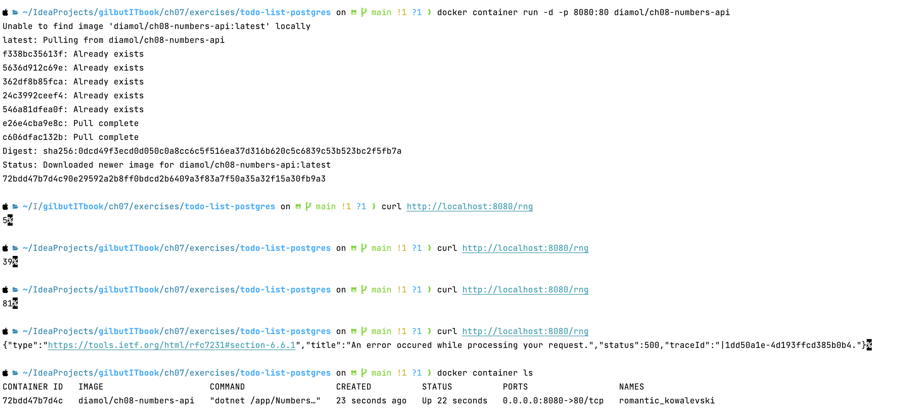
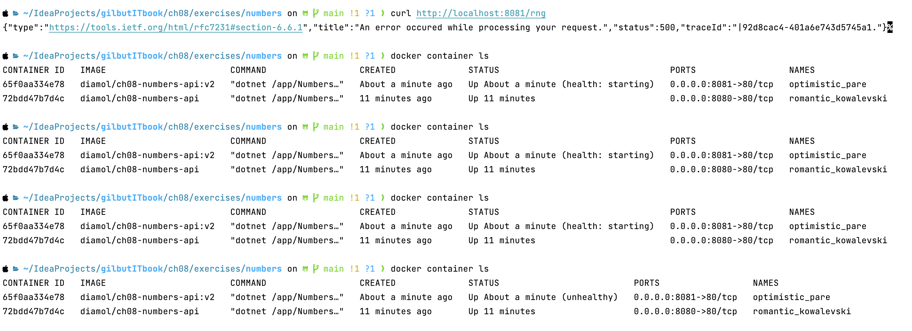
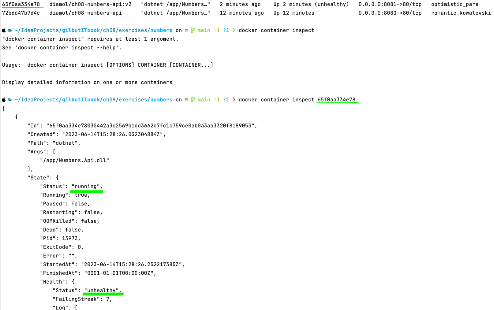
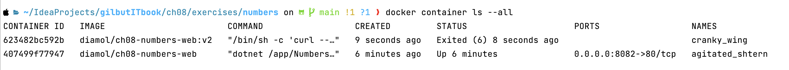
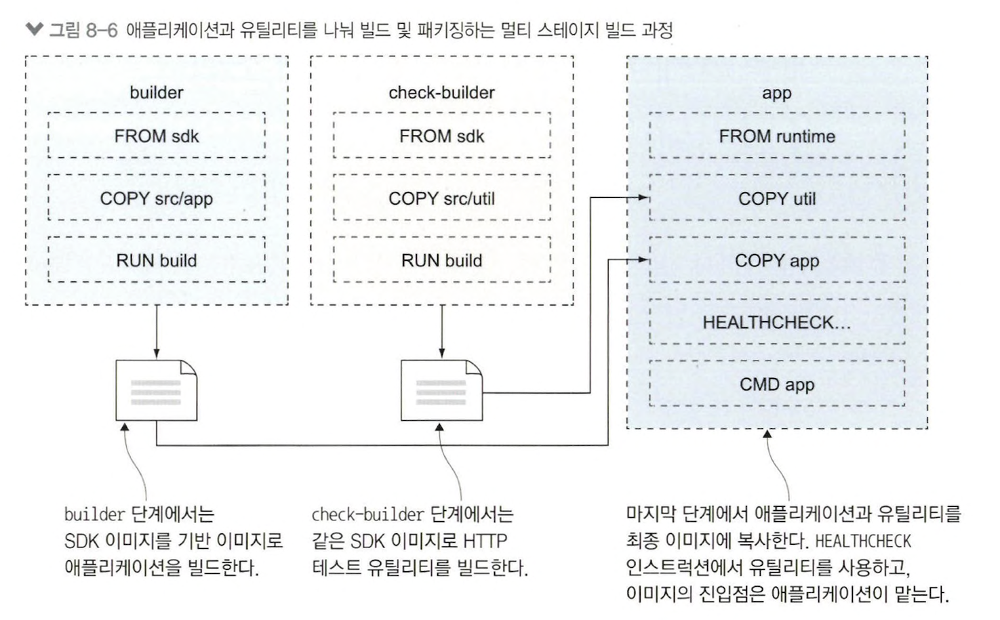
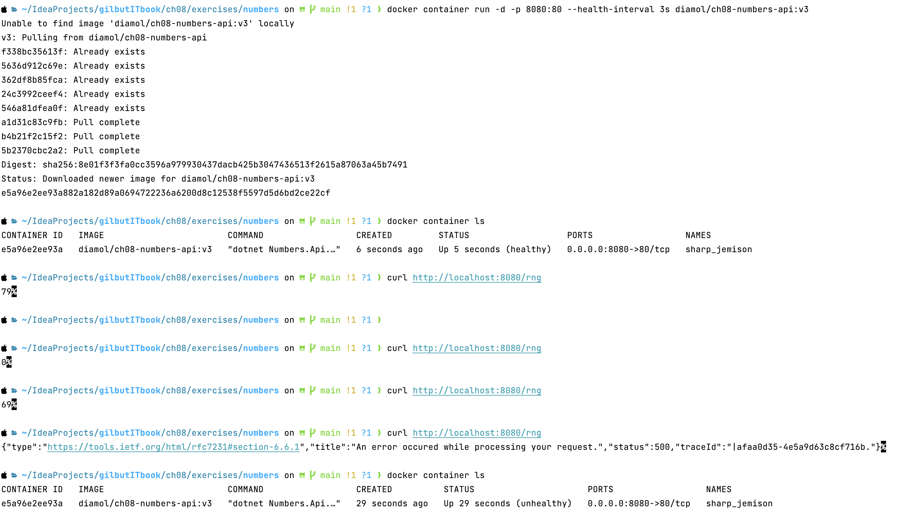
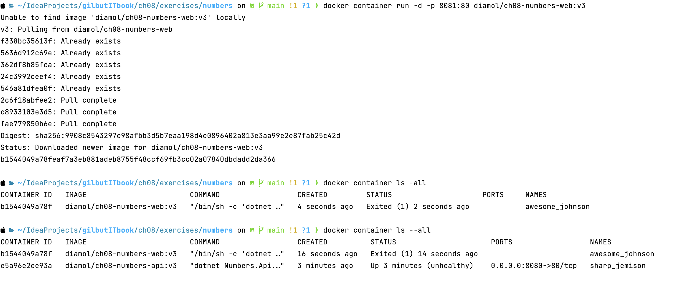
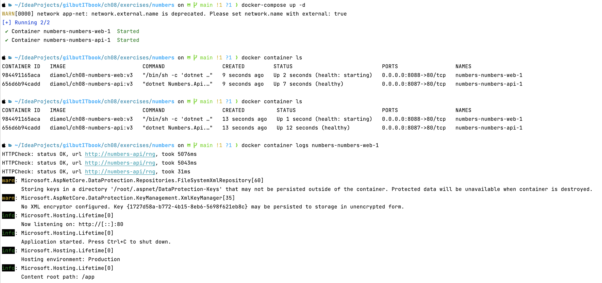
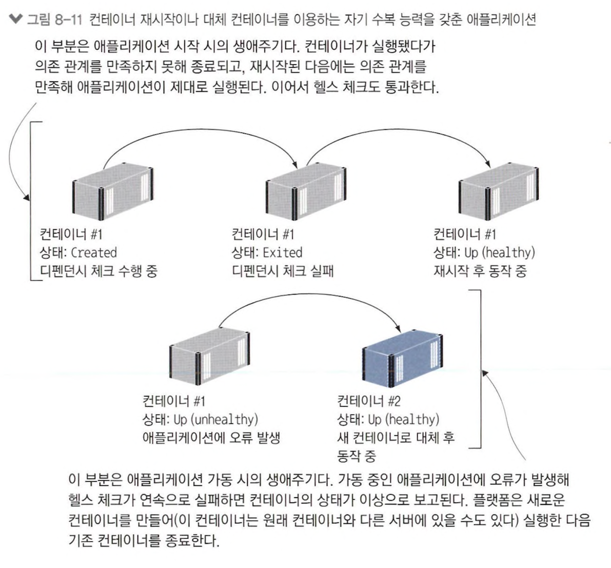

# 8장 헬스 체크와 디펜던시 체크로 애플리케이션의 신뢰성 확보하기

## 8.1 헬스 체크를 지원하는 도커 이미지 빌드하기

> 실습 1) API container 실행 후 API 요청 및 컨테이너 상태 확인



> dockerfile healthcheck

```dockerfile
FROM diamol/dotnet-aspnet

ENTRYPOINT ["dotnet", "/app/numbers.Api.dll"]
HEALTHCHECK CMD curl --fail http://localhost/health

WORKDIR /app
COPY --from=builder /out/ .
```

- `--fail` : 요청이 성공하면 curl이 0 반환, 실패하면 curl로 전달받은 상태 코드 도커 전달<br>
&rArr; `0 : 0 이외의 값 = 헬스 체크 정상 : 비정상` 간주



> 왜 애플리케이션이 비정상임에도 컨테이너는 실행중인 상태일까?

- 도커는 failover를 안전하게 처리 불가능



- 도커 엔진 단일 서버에서 동작
- 이상이 생긴 컨테이너 도커가 중지 후 재시작 가능 &rarr; 해당 시간 애플리케이션 동작 x
- 이상이 생긴 컨테이너 삭제 후 재실행 가능 but 컨테이너 내 보관된 데이터 유실, 해당 시간 동작 x<br>
&rArr; 이상 상태 발생 통보만 할 뿐 컨테이너 상태는 유지, 일시적인 헬스 체크 실패면 다시 컨테이너 상태 healthy로 변경<br>
&rArr; docker swarm, k8s 사용 이유!

## 8.2 디펜던시 체크가 적용된 컨테이너 실행하기

```dockerfile
FROM diamol/dotnet-aspnet

ENV RngApi:Url=http://numbers-api/rng

CMD curl --fail http://numbers-api/rng && \
    dotnet Numbers.Web.dll
   
WORKDIR /app
COPY --from=builder /out/ .
```

- 애플리케이션 의존 관계 만족 검사 기능
- dependency check : 애플리케이션 실행 전에 필요한 요구 사항 확인
- 만족하지 않는 요구 사항 존재 시 애플리케이션 실행 x



## 8.3 애플리케이션 체크를 위한 커스텀 유틸리티 만들기

> 도커 이미지에는 구동에 필요한 최소한의 내용만 저장 &rarr; curl 요청 보단 커스텀 유틸리티

#### custom utility 장점

- 도커 이미지에 애플리케이션 추가 필요 x
- shell script로는 추가하기 어려운 복잡한 체크 로직 적용 가능
- 컨테이너 실행 전에 확인 필요한 모든 사항 검증 가능



> health check 내 custom utility로 curl 대체

```dockerfile
FROM diamol/dotnet-aspnet

ENTRYPOINT ["dotnet", "Numbers.Api.dll"]
HEALTHCHECK CMD ["dotnet", "Utilities.HttpCheck.dll", "-u", "http://localhost/health"]

WORKDIR /app
COPY --from=http-check-builder /out/ .
COPY --from=builder /out/ .
```



> dependency check 내 custom utility로 curl 대체

```dockerfile
FROM diamol/dotnet-aspnet

ENV RngApi:Url=http://numbers-api/rng

CMD dotnet Utilities.HttpCheck.dll -c RngApi:Url -t 900 && \
    dotnet Numbers.Web dll
    
WORKDIR /app
COPY --from=http-check-builder /out/ .
COPY --from=builder /out/ .
```



## 8.4 도커 컴포즈에 헬스 체크와 디펜던시 체크 정의하기

```yaml
numbers-api:
    image: diamol/ch08-numbers-api:v3
    restart: on-failure   # 컨테이너 비정상 종료 시 재실행
    ports:
      - "8087:80"
    healthcheck:
      test: ["CMD", "dotnet", "Utilities.HttpCheck.dll", "-t", "150"]   # health check
      interval: 5s        # health check 간격
      timeout: 1s         # 그 때까지 응답 못받으면 실패로 간주 하는 제한 시간
      retries: 2          # 컨테이너 상태를 이상으로 간주할 때까지 필요한 연속 실패 횟수
      start_period: 5s    # 컨테이너 실행 후 첫 헬스 체크 실시 시간 간격 -> 애플리케이션 시작 시간 오래 걸릴 때 필요
    networks:
      - app-net
```

- 상당히 적극적인 설정
- prod 환경에선 느슨하게 설정 필요 ∵ 헬스 체크에도 CPU, memory 필요



## 8.5 헬스 체크와 디펜던시 체크로 복원력 있는 애플리케이션을 만들 수 있는 이유



- 20개의 API container, 50개의 Web Applicatoin Container
- 50개보다 20개가 먼저 실행되야할 필요 x &rarr; 20개 중 19개 무사히 실행 됐는데 마지막 1개 5분 소요로 50개 실행 x
- API container 하나 부족하더라도 50개 실행에 문제 x
- **일단 건너뛴 후 추후에 재시도** &rarr; 메모리를 잃지 않은 새 컨테이너로 대체