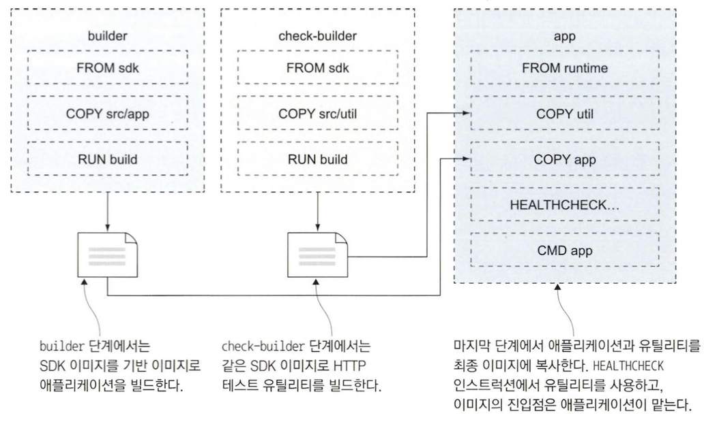
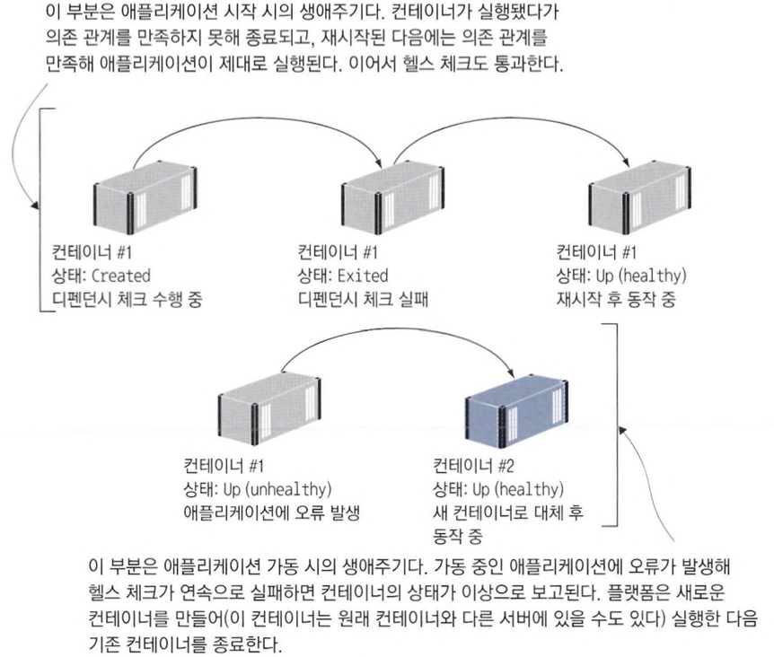

# 8장 헬스 체크와 디펜던시 체크로 애플리케이션의 신뢰성 확보하기

운영 환경에서는 도커 스웜이나 쿠버네티스 같은 컨테이너 플랫폼상에서 애플리케이션을 실행하게 될텐데, 이들 플랫폼은 애플리케이션이 스스로 이상에서 회복할 수 있도록 해 주는 기능을 제공한다. 

플랫폼이 컨테이너에서 실행 중인 애플리케이션 상태가 정상인지 확인할 수 있는 정보를 이미지에 함께 패키징할 수 있다. 이런 방법으로 애플리케이션이 정상적으로 동작하지 않게 되면 플랫폼이 비정상 컨테이너를 삭제하고 새 컨테이너로 대체한다.

## 8.1 헬스 체크를 지원하는 도커 이미지

컨테이너를 실행하면 내부에서 특정 프로세스가 실행되는데, 도커가 확인하는 것은 이 `프로세스의 실행 상태`이다.

프로세스가 정상적으로 실행 중인 것이 애플리케이션이 정상적인 상태라는 의미는 아니다.

도커는 애플리케이션의 상태가 실제로 정상인지 확인할 수 있는 정보를 도커 이미지에 직접 넣을 수 있는 기능을 제공한다.

📌 헬스 체크 로직이 없는 상태에서 생길 수 있는 문제를 먼저 확인해보자.

```bash
# API 컨테이너를 실행한다.
$ docker container run -d -p 8080:80 diamol/ch08-numbers-api

# API를 세 번 호출한다.
$ curl http://localhost:8080/rng
$ curl http://localhost:8080/rng
$ curl http://localhost:8080/rng

# 네 번째부터 API 호출이 실패한다.
$ curl http://localhost:8080/rng

# 컨테이너 상태를 확인한다.
$ docker container ls
```

API는 처음 세 번째 호출까지는 정상 동작하지만 네 번째 호출부터 http 500 ‘Internal Server Error’ 응답을 반환한다. 컨테이너 목록을 확인하면 해당 컨테이너는 여전히 Up으로 나온다.

⚠️ 도커 입장에서는 애플리케이션에 문제가 없다. 컨테이너 런타임은 프로세스 안에서 무슨일이 일어나는지, 애플리케이션이 정상적으로 동작 중인지 알 방법이 없다.

### HEALTHCHECK 인스트럭션

컨테이너 런타임은 HEALTHCHECK 인스트럭션에 정의된 정보를 이용해 컨테이너에서 동작 중인 애플리케이션의 상태가 정상인지 확인할 수 있다.

도커는 일정한 시간 간격으로 컨테이너 안에서 지정된 명령을 실행한다. 상태 코드가 정상이면 컨테이너도 정상으로 간주되지만, 상태 코드가 연속으로 일정 횟수 이상 실패로 나오면 해당 컨테이너를 이상 상태로 간주한다.

```bash
FROM diamol/dotnet-aspnet

ENTRYPOINT ["dotnet", "/app/Numbers.Api.dll"]
HEALTHCHECK CMD curl --fail http://localhost/health

WORKDIR /app
COPY --from=builder /out/ .
```

- /health로 HTTP 요청을 보내는데, 이 엔드포인트의 응답은 애플리케이션의 정상 여부다.
- `—-fail` 옵션을 붙이면 curl이 전달받은 상태 코드를 도커에 전달한다.

📌 이미지를 빌드한다.

```bash
$ docker image build -t diamol/ch08-numbers-api:v2 -f ./numbersapi/Dockerfile.v2 .
```


```bash
# 버전 v2 이미지로 API 컨테이너를 실행하라
$ docker container run -d -p 8081:80 diamol/ch08-numbers-api:v2

# 30초 정도 기다린 다음 컨테이너 목록을 확인한다.
$ docker container ls

# API를 세 번 호출한다.
$ curl http://localhost:8080/rng
$ curl http://localhost:8080/rng
$ curl http://localhost:8080/rng

# 네 번째부터 API 호출이 실패한다.
$ curl http://localhost:8080/rng

# 도커가 이상 상태를 감지하는지 확인한다.
$ docker container ls
```

컨테이너 이상 상태는 도커 API를 통해 보고된다. 따라서 컨테이너를 실행 중인 플랫폼도 컨테이너의 이상 상태를 통보받고 애플리케이션을 복구하기 위한 조치를 취할 수 있다. 가장 최근의 헬스 체크 수행 결과도 저장돼 있어 컨테이너의 상태를 조사할 때 이 결과를 열람할 수 있다.

📌 container inspect 명령으로 가장 최근 컨테이너의 상태를 출력한다.

```bash
$ docker container inspect $(docker container ls --last 1 --format '{{.ID}}'
```

---

## 8.2 디펜던시 체크가 적용된 컨테이너 실행하기

여러 컨테이너에 나뉘어 실행되는 분산 애플리케이션은 이상이 생긴 컨테이너를 교체할 때는 처음 애플리케이션을 실행할 때처럼 `컨테이너 간 의존 관계` 를 고려하지 않는다.

📌 무작위 숫자 애플리케이션을 실행한다.

```bash
$ docker container rm -f $(docker container ls -aq)

$ docker container run -d -p 8082:80 diamol/ch08-numbers-web

$ docker container ls
```

서버 프로세스가 실행 중이고 컨테이너도 정상이지만, API를 사용할 수 없는 상태이므로 웹 애플리케이션도 제대로 동작하지 않는다.

### 디펜던시 체크 추가하기

디펜던시 체크는 애플리케이션 실행 전에 필요한 요구 사항을 확인하는 기능이다.

모든 요구 사항이 확인되면 디펜던시 체크가 성공하고 애플리케이션이 실행된다.

디펜던시 체크는 헬스 체크처럼 별도의 인스트럭션으로 도커에 구현된 것은 아니고 애플리케이션 실행 명령에 로직을 추가하는 방법으로 구현한다.

📌 실행 명령에 디펜던시 체크를 추가한 Dockerfile 스크립트

```docker
FROM diamol/dotnet-aspnet

ENV RngApi:Url=http://numbers-api/rng

CMD curl --fail http://numbers-api/rng && \
	  dotnet Numbers.Web.dll

WORKDIR /app
COPY --from=builder /out/ .
```

- CMD 인스트럭션에 정의된 명령은 컨테이너를 실행할 때 실행된다.
- && 앞에 오는 명령이 성공하면 뒤에 오는 명령을 실행한다.
- API가 사용 가능한 상태라면 curl 명령이 성공하고 이어지는 닷넷 코어 애플리케이션 실행 명령을 실행할 것이다.
- API를 사용할 수 없다면 curl 명령이 실패하고 뒤에 오는 명령도 실행되지 않아 컨테이너가 그대로 종료된다.

---

## 8.3 애플리케이션 체크를 위한 커스텀 유틸리티 만들기

실무에서 개발하는 애플리케이션을 테스트하는 목적으로는 curl을 사용하지 않는다.

`보안` 정책상의 이유로 이미지에 curl을 포함시킬 수 없기 때문이다.

### 커스텀 유틸리티의 장점

애플리케이션과 같은 언어로 구현된 커스텀 유틸리티의 장점은 다음과 같다.

1. 애플리케이션과 같은 도구를 사용하므로 이미지에 추가적인 소프트웨어를 포함시킬 필요가 없다.
2. 셀 스크립트로는 표현하기 까다로운 복잡한 체크 로직을 적용할 수 있다.
3. 애플리케이션과 같은 설정을 사용해 대상 URL을 여러 곳에 반복 정의하거나 수정에서 누락시키는 일을 방지할 수 있다.
4. 애플리케이션과 같은 라이브러리 환경에서 데이터베이스 접속이나 인증서 파일의 존재 유무 등 컨테이너 실행 전에 확인이 필요한 모든 사항을 검증할 수 있다.

📌 애플리케이션과 유틸리티를 나눠 빌드 및 패키징하는 멀티 스테이지 빌드 과정



HEALTHCHECK 인스트럭션에서 curl 대신 닷넷 코어로 구현된 테스트 유틸리티를 사용한다.

```docker
FROM diamol/dotnet-aspnet

ENTRYPOINT ["dotnet", "Numbers.Api.dll"]
HEALTHCHECK CMD ["dotnet", "Utilities.HttpCheck.dll", "-u", "http://localhost/health"]

WORKDIR /app
COPY --from=http-check-builder /out/ .
COPY --from=builder /out/ .
```

📌 무작위 숫자 API를 v3 버전의 컨테이너로 실행한다.

```bash
# 기존 컨테이너를 모두 삭제한다.
$ docker container rm -f $(docker container ls -aq)

# 버전 v3 이미지로 API 컨테이너를 실행하라
$ docker container run -d -p 8080:80 --health-interval 5s diamol/ch08-numbers-api:v3

# 5초 정도 기다린 다음 컨테이너 목록을 확인한다.
$ docker container ls

# API를 세 번 호출한다.
$ curl http://localhost:8080/rng
$ curl http://localhost:8080/rng
$ curl http://localhost:8080/rng

# 네 번째부터 API 호출이 실패한다.
$ curl http://localhost:8080/rng

# 도커가 이상 상태를 감지하는지 확인한다.
$ docker container ls
```

📌 컨테이너 실행 시의 디펜던시 체크에도 커스텀 유틸리티 사용하기

```docker
FROM diamol/dotnet-aspent

ENV RngApi:Url=http://numbers-api/rng

CMD dotnet Utilities.HttCheck.dll -c RngApi:Url -t 900 && \
    dotnet Numbers.Web.dll

WORKDIR /app
COPY --from=http-check-builder /out/ .
COPY --from=builder /out/ .
```

웹 애플리케이션 컨테이너는 numbers-api라는 도메인으로 API 컨테이너를 찾는데, API 컨테이너를 실행할 때 이 이름을 지정하지 않았기 때문에 API를 찾지 못한다.

API가 없으므로 컨테이너가 바로 종료된다.

---

## 8.4 도커 컴포즈에 헬스 체크와 디펜던시 체크 정의하기

도커 컴포즈는 애플리케이션의 상태에 이상이 생겼을 때 어느 정도 복원할 수 있는 기능이 있다. 그러나 도커 컴포즈는 이상이 생긴 컨테이너를 새 컨테이너로 대체하지는 않는다. 단일 서버에서 애플리케이션을 실행 중이라면 더 심각한 장애를 일으킬 수 있기 때문이다.

하지만 종료된 컨테이너를 재시작하거나 이미지에 정의되지 않은 헬스 체크를 추가할 수는 있다.

📌 도커 컴포즈 파일에서 헬스 체크 옵션 설정하기

```docker
numbers-api:
	image: diamol/ch08-numbers-api:v3
	ports:
		- "8087:80"
	healthcheck:
		interval: 5s
		timout: 1s
		retries: 2
		start_period: 5s
	networks:
		- app-net
```

도커 컴포즈 파일에서는 헬스 체크의 옵션을 더 세세하게 설정할 수 있다.

📌 도커 컴포즈 파일에 헬스 체크 정의하기

```docker
numbers-api:
	image: diamol/ch08-numbers-api:v3
	restart: on-failure
	ports:
		- "8088:80"
	healthcheck:
		test: ["CMD", "dotnet", "Utilites.HttpCheck.dll", "-t", "150"]
		interval: 5s
		timout: 1s
		retries: 2
		start_period: 5s
	networks:
		- app-net
```

- `test 필드` 가 헬스체크를 위해 실행하는 명령이다.
- `restart: on-failure` → 컨테이너가 예기치 않게 종료되면 컨테이너를 재시작한다.

API 컨테이너의 준비가 끝나기 전에 웹 애플리케이션 컨테이너가 실행되면 디펜던시 체크가 실패해 웹 컨테이너가 종료된다. 하지만 결국 API 컨테이너도 실행될 것이므로 마지막에는 디펜던시 체크도 성공해 애플리케이션이 제대로 동작한다.

📌 도커 컴포즈를 이용해 무작위 숫자 애플리케이션을 실행한다.

```docker
$ docker-compose up -d

$ docker container ls

$ docker container logs numbers-numbers-web-1
```

1. 두 컨테이너를 동시에 생성한다.
2. API 컨테이너가 시작되는 동안 웹 애플리케이션 컨테이너의 디펜던시 체크가 실행된다.
3. 디펜던시 체크에 실패해 컨테이너가 종료된다.
4. 웹 서비스는 실패 시 재시작하도록 설정돼 있으므로 기존 컨테이너가 재시작된다.
5. 디펜던시 체크가 성공하고 애플리케이션이 동작 상태에 들어간다.

---

## 8.5 헬스 체크와 디펜던시 체크로 복원력있는 애플리케이션을 만들 수 있는 이유

디펜던시와 헬스 체크를 도입하면 처음부터 플랫폼이 실행 순서를 보장하게 할 필요가 없다. 가능한 한 빨리 컨테이너를 실행하면 된다.

일부 컨테이너가 의존 관계를 만족하지 못한 상태라면 재실행되거나 다른 컨테이너로 교체될 것이다.

애플리케이션은 자기 수복이란 일시적인 오류를 플랫폼이 해소해주는 것이다. 애플리케이션에 메모리 누수를 일으키는 까다로운 버그가 있더라도 플랫폼에서 해당 컨테이너를 메모리를 잃지 않은 새 컨테이너로 대체하면 된다. 버그를 수정한 것은 아니지만 애플리케이션은 계속 동작할 수 있다.



하지만 헬스 체크와 디펜던시 체크에 주의가 필요하다. 헬스 체크는 주기적으로 자주 실행되므로, 시스템에 부하를 주는 내용이어서는 안된다. 자원을 너무 많이 소모하지 않으면서 애플리케이션이 실질적으로 동작 중인지 검증할 수 있는 핵심적인 부분을 테스트해야 한다. 

디펜던시 체크는 애플리케이션 시작 시에만 실행된다. 그러므로 테스트에 소모되는 리소스에 너무 크게 신경 쓸 필요는 없다. 하지만 테스트 대상이 빠짐없이 정확하도록 주의해야 한다. 디펜던시 체크에서 누락된 의존 관계가 있고 이 문제를 플랫폼이 해결하지 못한다면 애플리케이션에도 문제가 생길 것이다.