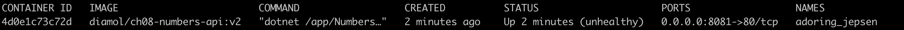
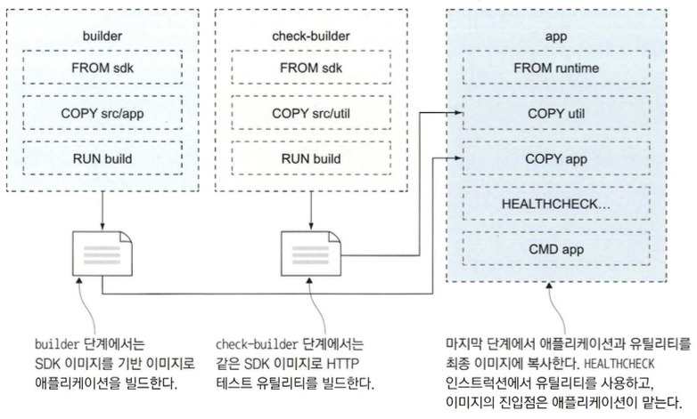
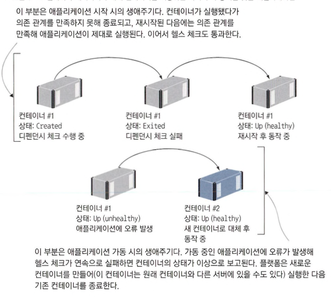

# 헬스 체크와 디펜던시 체크로 애플리케이션의 신뢰성 확보하기

## 헬스 체크를 지원하는 도커 이미지 빌드하기

```shell
docker run -dp 8080:80 diamol/ch08-numbers-api
curl http://localhost:8080/rng * 4
docker ps
```

- 4번에 api호출을 하면 500 error를 반환하는 컨테이너입니다. 하지만 오류가 있어도 컨테이너 상태는 정상입니다.

```
cd ./ch08/exercises/number
docker image build -t diamol/ch08-number-api:v2 -f ./numbers-api/Dockerfile.v2 .
```

- 헬스 체크 기능을 갖춘 애플리케이션 예시을 빌드합니다.

```shell
docker run -dp 8081:80 diamol/ch08-numbers-api:v2
curl http://localhost:8081/rng * 4
docker ps
```



```
 docker inspect $(docker ps --last 1 --format '{{.ID}}')
```

- State > Health > Status 필드에 unhealthy 로 나오는걸 확인할 수 있습니다.

## 디펜던시 체크가 적용된 컨테이너 실행하기

- 여러 컨테이너에 나뉘어 실행되는 분산 애플리케이션은 이상이 생긴 컨테이너를 교체할 때 처음 애플리케이션을 실행할 때처럼 컨테이너 간 의존 관계를 고려하지 않기 때문에 문제가 발생할 수 있습니다.

```shell
docker rm -f $(docker ps -aq)
docker run -dp 8082:80 diamol/ch08-numbers-web
docker ps
```

- 실행하면 정상적으로 보이지만 버튼 클릭시 오류가 발생합니다.
- 이러한 문제를 해결하기 위해 애플리케이션 실행 전에 필요한 요구 사항을 확인하는 디펜던시 체크 기능을 추가할 수 있습니다.

```shell
 docker run -dp 8084:80 diamol/ch08-number-web:v2
 docker ps -a
```

- 컨테이너 실행 중 오류로 실행하지 않았음을 확인할 수 있습니다.

## 애플리케이션 체크를 위한 커스텀 유틸리티 만들기

- curl은 유용하지만 이미지의 크기만 증가하고 외부 공격에 노출될 여지를 늘리기 때문에 별도의 커스텀 유틸리티를 사용하는 것이 좋습니다.
- 커스텀 유틸리티의 장점
  - 이미지에 추가적 인 소프트웨어를 포함시킬 필요가 없음
  - 재시도 횟수나 분기등 셸스크립트로는 표현하기 까다로운 복잡한 체크 로직을 적용
  - 대상 URL을 여러 곳에 반복 정의하거나 수정에서 누락시키는 일을 방지
  - 데이터베이스 접속이나 인증서 파일의 존재 유 무 등 컨테이너 실행 전에 확인이 필요한 모든 사항을 검증



```shell
docker rm -f $(docker ps -aq)
docker run -dp 8080:80 --health-interval 5s diamol/ch08-numbers-api:v3
docker ps
curl http://localhost:8080/rng
docker ps
```

```shell
docker run -dp 8081:80 diamol/ch08-numbers-web:v3
docker ps -a
```

- 커스텀 유틸리티를 사용한 헬스 체크 예제입니다.

## 도커 컴포즈에 헬스 체크와 디펜던시 체크 정의하기

```
cd ./ch08/exercises/numbers
docker-compose up -d
docker ps
docker logs numbers-numbers-web-1
```

- 헬스 체크와 디펜던시 체크가 되어있는 docker-compose를 실행합니다.
- 도커 컴포즈가 디펜던시 체크를 할 수 있는 범위가 단일 서버로 제한됩니다.

## 헬스 체크와 디펜던시 체크로 복원력있는 애플리케이션을 만들 수 있는 이유



- 헬스 체크는 주기적으로 자주 실행되므로 시스템에 부하를 주는 내용이어서는 안 됩니다.
- 디펜던시 체크는 애플리케이션 시작 시에만 실행되므로 소모되는 리소스에 너무 크게 신경 쓸 필요는 없고 테스트 대상이 빠짐없이 정확하도록 주의해야합니다.
