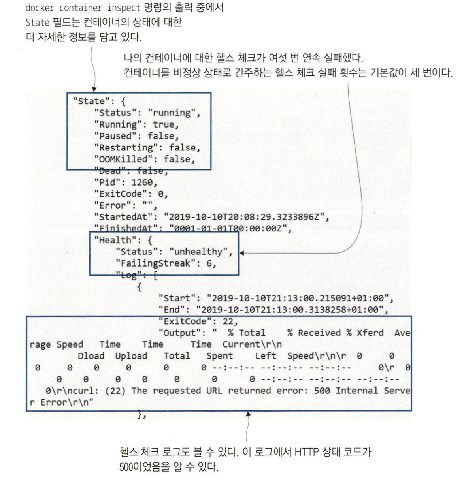
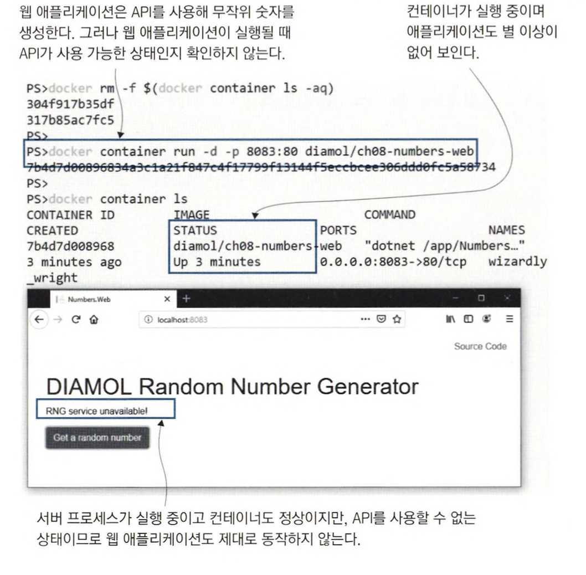
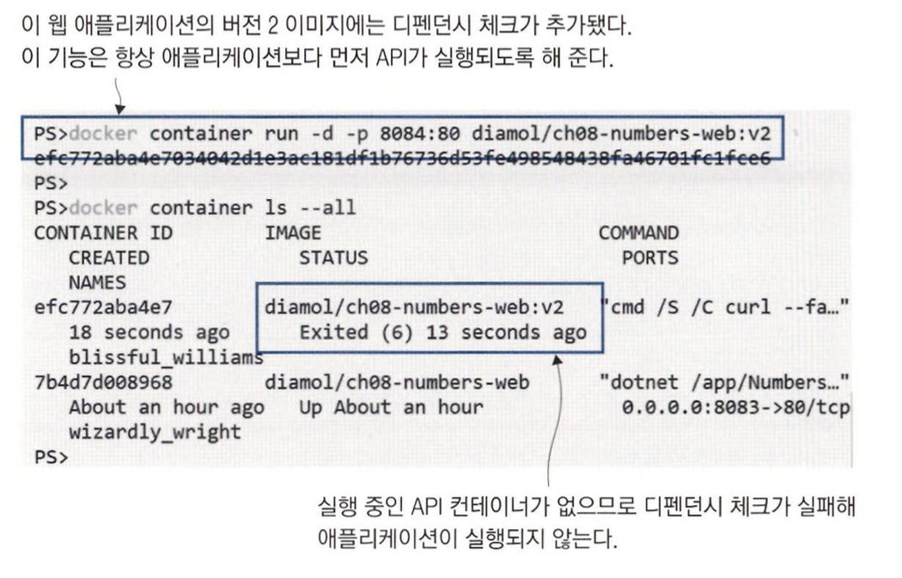
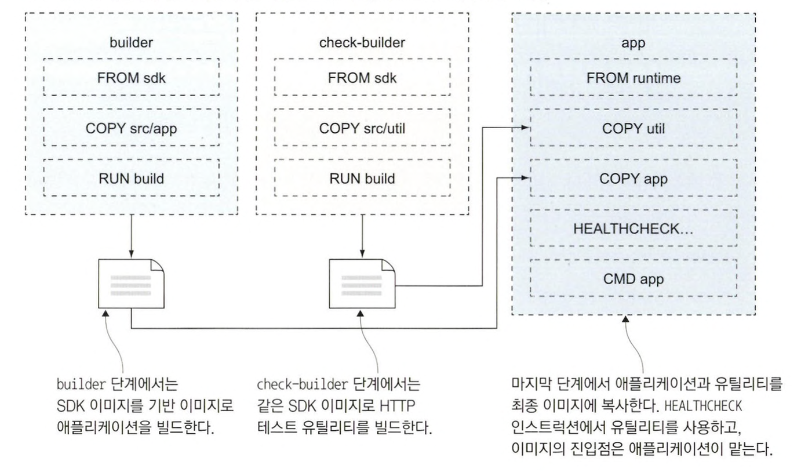
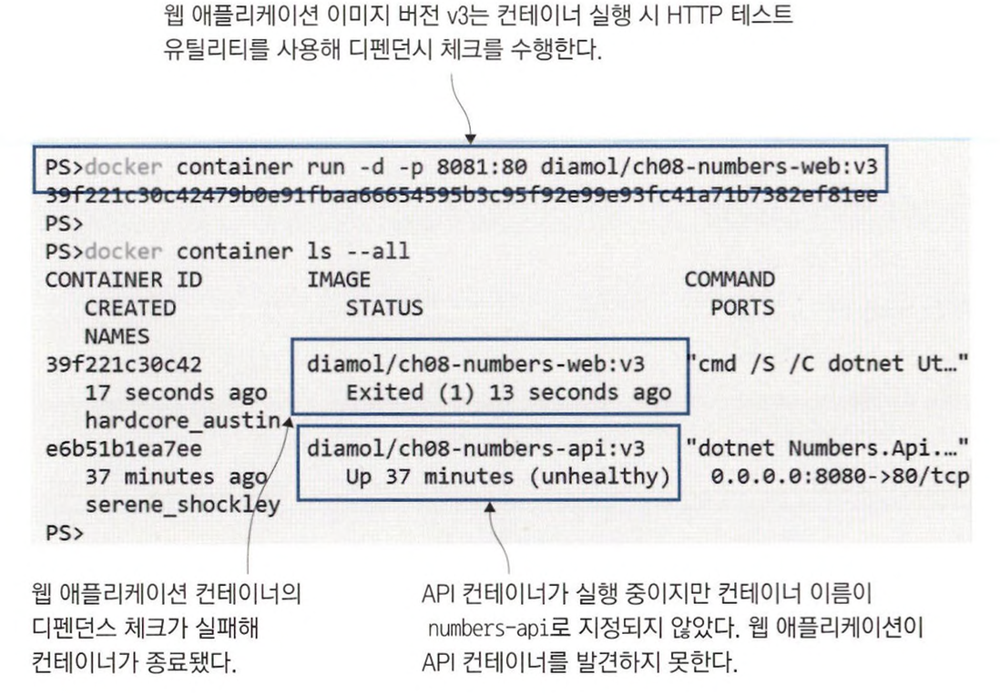
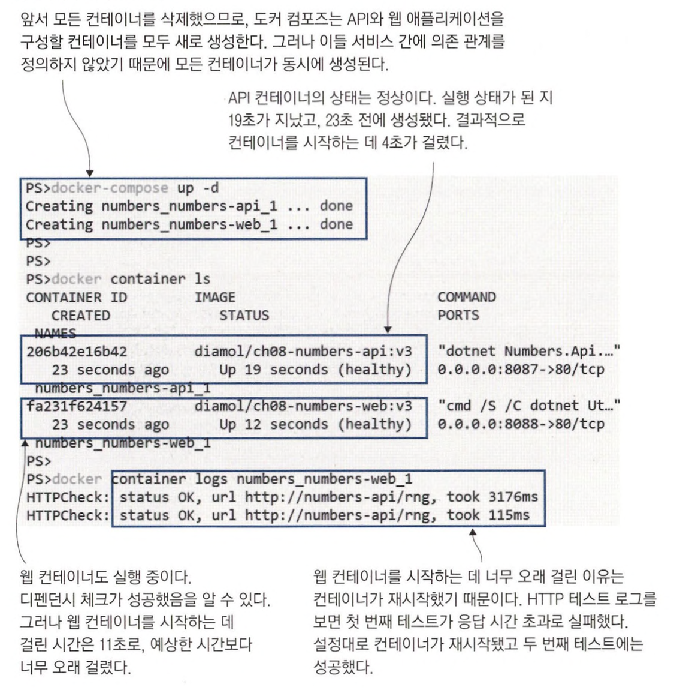
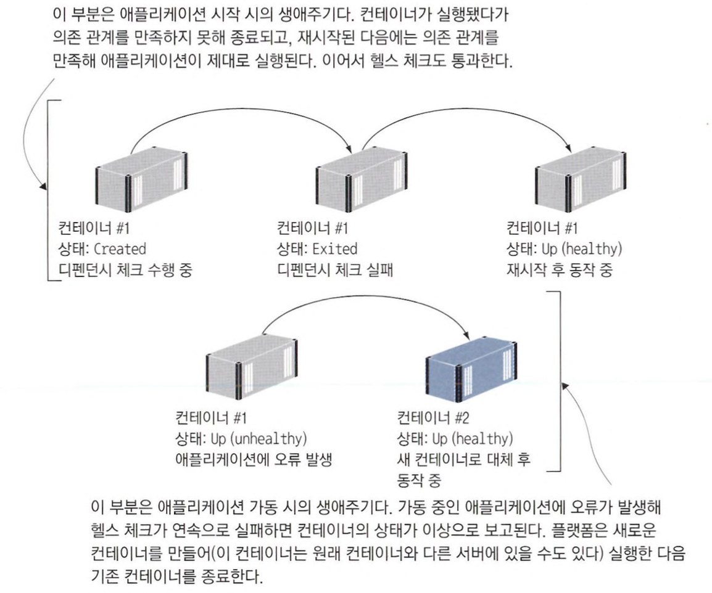

# 헬스 체크를 지원하는 도커 이미지 빌드

도커는 컨테이너를 시작할 때마다 애플리 케이션의 기본적인 상태를 확인한다. <br>
컨테이너를 실행하면 내부에서 애플리케이션 실행 파일이나 자바 혹은 셸 스크립트 같은 특정한 프로세스가 실행되는데 <br>
도커가 확인하는 것은 이 프로세스의 실행 상태다. 만약 이 프로세스가 종료됐다면 컨테이너도 종료 상태가 된다. 

이 정도 수준에서 보장되는 것은 프로세스가 실행 상태라는 점뿐이지 애플리케이션의 정상적인 상태가 아니다. <br>
도커는 애플리케이션의 상태가 실제로 정상인지 확인할 수 있는 정보를 도커 이미지에 직접 넣을 기능을 제공한다.

<br>

```
// 이 애플리케이션은 api를 3번 호출하면 비정상 상태로 빠지고 그 이후의 호출은 실패한다.
docker run -d -p 8080:80 diamol/ch08-numbers-api

curl localhost:8080/rng
89%

curl localhost:8080/rng
31%

curl localhost:8080/rng
31%

curl localhost:8080/rng
{"type":"https://tools.ietf.org/html/rfc7231#section-6.6.1","title":"An error occured while processing your request.","status":500,"traceId":"|7cf3120a-44d7eeec8760b32c."}%

docker ps
```

네 번째 호출부터는 500에러를 반환하지만, 컨테이너의 상태는 여전히 up으로 나온다.

<br>

> Dockerfile에서 HEALTHCHECK 인스트럭션을 이용하여 동작 중인 애플리케이션의 상태가 정상인지 확인할 수 있다. <br>
> HEALTHCHECK 인스트럭션에는 도커가 컨테이너 안에서 실행하는 명령을 지정하게 되는데, 이 명령이 반환하는 상태 코드를 보고 애플리케이션의 상태를 판단한다. <br>
> 도커는 일정한 시간 간격으로 컨테이너 안에서 지정된 명령을 실행한다. <br>
> 상태 코드가 연속으로 일정 횟수 이상 실패로 나오면 해당 컨테이너를 이상 상태로 간주한다.


<br>

```
FROM diamol/dotnet-aspnet

ENTRYPOINT ["dotnet", "/app/Numbers.Api.dll"]
HEALTHCHECK CMD curl --fail http://localhost/health

WORKDIR /app
COPY --from=builder /out/ .
```

ENTRYPOINT 인스트럭션으로 dotnet 명령을 실행하고, 헬스 체크 시에는 엔드포인트 /health로 HTTP 요청을 보낸다. <br>
--fail을 붙이면 curl이 받는 상태 코드를 도커에 전달한다. <br>
요청이 성공하면 curl이 0을 반환하고 실패하면 0 이외의 숫자를 반환하는데, 도커는 0을 헬스 체크 정상, 0 이외의 값을 비정상으로 간주한다.

<br>

```
cd ch08/exercises/numbers

docker image build -t diamol/ch08-numbers-api:v2 -f ./numbers-api/Dockerfile.v2 .

docker run -d -p 8081:80 diamol/ch08-numbers-api:v2

docker ps

curl localhost:8081/rng
27%

curl localhost:8081/rng
51%

curl localhost:8081/rng
49%

curl localhost:8081/rng
{"type":"https://tools.ietf.org/html/rfc7231#section-6.6.1","title":"An error occured while processing your request.","status":500,"traceId":"|609d0306-4c47a4871ee78355."}%

docker ps

// 실행 결과
CONTAINER ID   IMAGE                        COMMAND                  CREATED          STATUS                     PORTS                    NAMES
4d1d67dc1cd9   diamol/ch08-numbers-api:v2   "dotnet /app/Numbers…"   2 minutes ago    Up 2 minutes (unhealthy)   0.0.0.0:8081->80/tcp     xenodochial_lehmann
```

**버그가 발생한 후 시간이 흐르니 컨테이너의 상태가 unhealthy가 됐다.**

> 컨테이너의 이상 상태는 도커 API를 통해 보고된다. <br>
> 그리고 가장 최근의 헬스 체크 수행 결과도 저장돼 있어 컨테이너의 상태를 조사할 때 이 결과를 열람할 수 있다. <br>

<br>

```
docker container inspect $(docker container ls --last 1 --format '{{.ID}}')
```



> **왜 이상 상태에 있는 컨테이너를 재시작하거나 다른 컨테이너로 교체하지 않은 것일까 ?** <br>
> 그 이유는 도커가 이런 작업을 안전하게 처리할 수 없기 때문이다. <br>
> 도커 엔진은 단일 서버에서 동작하는데, 이상이 생긴 컨테이너를 도커가 중지하고 재시작할 수는 있지만 그 시간 동안에는 애플리케이션이 동작하지 않는다. <br>
> 이상이 생긴 컨테이너를 제거하고 완전히 같은 설정으로 새 컨테이너를 실행할 수도 있지만, 이 경우에도 컨테이너에 보관된 데이터가 유실되고 <br>
> 그 시간 동안 애플리케이션도 동작하지 않는다. 도커 입장에서는 이상 상태를 보이는 컨테이너를 교체하는 작업을 직접 수행했을 때 상황을 더 악화시키지 않을 것이라는 <br>
> 보장이 없으므로, 이상 상태 발생을 통보만 할뿐 컨테이너는 그대로 두는 것이다. 물론 헬스 체크도 계속 수행된다.

<br>
<hr>

# 디펜던시 체크가 적용된 컨테이너 실행

여러 컨테이너에 나뉘어 실행되는 분산 애플리케이션은 또 다른 문제가 있을 수 있다. <br>
이상이 생긴 컨테이너를 교체할 때는 처음 애플리케이션을 실행할 때처럼 컨테이너 간 의존 관계를 고려하지 않기 때문이다.

```
docker rm -f $(docker container ls -aq)

docker run -d -p 8082:80 diamol/ch08-numbers-web
```



컨테이너 상태는 정상인데 핵심 의존 관계를 만족하지 않아 애플리케이션이 정상적으로 동작하지 않는 상황이다. <br>
의존 관계를 만족하는지 점검하는 디펜던시 체크 기능도 도커 이미지에 추가할 수 있다. <br>
*디펜던시 체크는 헬스 체크처럼 별도의 인스트럭션으로 도커에 구현된 것은 아니고 애플리케이션 실행 명령에 로직을 추가하는 방법으로 구현한다.*

<br>

```
FROM diamol/dotnet-aspnet

ENV RngApi:Url=http://numbers-api/rng

CMD curl --fail http://numbers-api/rng && \
    dotnet Numbers.Web.dll
    
WORKDIR /app
COPY --from=builder /out/ .
```

CMD 인스트럭션을 보면 애플리케이션 실행 전에 API가 사용 가능한지 확인하는 것을 알 수 있다. <br>
CMD 인스트럭션에 정의된 명령은 컨테이너를 실행할 때 실행된다.

<br>

```
docker run -d -p 8084:80 diamol/ch08-numbers-web:v2

docker ps -all
```



v2 컨테이너는 실행한 지 몇 초 만에 curl 명령을 실패해 사용 가능한 API를 발견하지 못하고 종료된다. <br>

<br>
<hr>

# 애플리케이션 체크를 위한 커스텀 유틸리티 만들기

실무에서는 애플리케이션을 테스트하는 목적으로 curl을 사용하지 않는다. <br>
보안 정책상의 이유로 이미지에 curl을 포함시킬 수 없기 때문이다. <br>
실제 애플리케이션 체크에는 애플리케이션과 같은 언어로 구현된 별도의 커스텀 유틸리티를 사용하는 것이 낫다. <br>
커스텀 유틸리티의 장점은 다음과 같다.

- 커스텀 유틸리티를 실행할 때도 애플리케이션과 같은 도구를 사용하므로 이미지에 추가적인 소프트웨어를 포함시킬 필요가 없다.
- 재시도 횟수나 분기 등 셸 스크립트로는 표현하기 까다로운 복잡한 체크 로직을 적용할 수 있다.
- 애플리케이션과 같은 설정을 사용해 대상 URL을 여러 곳에 반복 정의하거나 수정에서 누락 시키는 일을 방지할 수 있다.
- 애플리케이션과 같은 라이브러리 환경에서 데이터베이스 접속이나 인증서 파일의 존재 유무 등 컨테이너 실행 전에 확인이 필요한 모든 사항을 검증할 수 있다.



<br>

```
FROM diamol/dotnet-aspnet

ENTRYPOINT ["dotnet", "Numbers.Api.dll"]
HEALTHCHECK CMD ["dotnet", "Utilities.HttpCheck.dll", "-u",
    "http://localhost/health"]
    
WORKDIR /app
COPY --from=http—check-builder /out/ .
COPY --from=builder /out/ .
```

```
docker rm -f $(docker container ls -aq)

docker run -d -p 8080:80 --health-interval 5s diamol/ch08-numbers-api:v3

curl localhost:8080/rng
44%

curl localhost:8080/rng
35%

curl localhost:8080/rng
26%

curl localhost:8080/rng
{"type":"https://tools.ietf.org/html/rfc7231#section-6.6.1","title":"An error occured while processing your request.","status":500,"traceId":"|42cdc506-48154aec2169be35."}%

docker ps

// 실행 결과
CONTAINER ID   IMAGE                        COMMAND                  CREATED              STATUS                          PORTS                  NAMES
2e019f21ed55   diamol/ch08-numbers-api:v3   "dotnet Numbers.Api.…"   About a minute ago   Up About a minute (unhealthy)   0.0.0.0:8080->80/tcp   trusting_chatterjee
```

<br>

> 아래는 Dockerfile 스크립트의 마지막 빌드 단계다. <br>
> -t 옵션은 유틸리티가 요청에 대한 응답을 기다릴 제한 시간을 설정한 것이고. -c 옵션은 애플리케이션과 같은 설정 파일을 읽어 그 설정대로 대상 URL을 지정한 것이다.

```
FROM diamol/dotnet-aspnet

ENV RngApi:Url=http://numbers-api/rng

CMD dotnet Utilities.HttpCheck.dll -c RngApi:Url -t 900 && \
    dotnet Numbers.Web.dll
    
WORKDIR /app
COPY --from=http-check-builder /out/ .
COPY --from=builder /out/ .
```

```
docker run -d -p 8081:80 diamol/ch08-numbers-web:v3

docker ps -all
```



<br>
<hr>

# 도커 컴포즈에 헬스 체크와 디펜던시 체크 정의

```yaml
numbers-api:
  image: diamol/ch08-numbers-api:v3
  ports:
    - "8087:80"
  healthcheck:
    interval: 5s
    timeout: 1s 
    retries: 2 
    start_period: 5s
  networks:
    - app-net
```

도커 컴포즈 파일에서는 헬스 체크의 옵션을 더 세세하게 설정할 수 있다.

- interval은 헬스 체크 실시 간격을 의미한다.
- timeout은 그때까지 응답을 받지 못하면 실패로 간주하는 제한 시간을 의미한다.
- retries는 컨테이너 상태를 이상으로 간주할 때까지 필요한 연속 실패 횟수를 의미한다.
- start_period는 컨테이너 실행 후 첫 헬스 체크를 실시하는 시간 간격을 의미한다.

<br>

이미지에 헬스 체크가 정의되지 않았다면, 컴포즈 파일에 정의할 수 있다. <br>
test 필드가 헬스 체크를 위해 실행하는 명령이다.

```yaml
numbers—web:
  image: diamol/ch08-numbers-web:v3
  restart: on-failure
  ports:
    - "8088:80"
  healthcheck:
    test: ["CMD", "dotnet", "Utilities.HttpCheck.dll" "-t", "150"]
    interval: 5s
    timeout: 1s
    retries: 2
    start_period: 10s
  networks:
    - app-net
```

<br>

```
cd ch08/exercises/numbers

docker rm -f $(docker container ls -aq)

docker-compose up -d

docker ps

docker logs numbers_numbers-web_1

// 실행 결과
HTTPCheck: status OK, url http://numbers-api/rng, took 5054ms
HTTPCheck: status OK, url http://numbers-api/rng, took 5051ms
HTTPCheck: status OK, url http://numbers-api/rng, took 5039ms
HTTPCheck: status InternalServerError, url http://numbers-api/rng, took 32ms
HTTPCheck: status InternalServerError, url http://numbers-api/rng, took 5044ms
HTTPCheck: status InternalServerError, url http://numbers-api/rng, took 5041ms
HTTPCheck: status InternalServerError, url http://numbers-api/rng, took 5038ms
HTTPCheck: status InternalServerError, url http://numbers-api/rng, took 5040ms
```

의존 관계가 정의되지 않았으므로 컴포즈를 실행하면 두 컨테이너를 동시에 생성한다. <br>
API 컨테이너가 시작하는 동안 웹 애플리케이션 컨테이너의 디펜던시 체크가 실행된다. <br>
웹 서비스는 실패 시 재시작하도록 설정돼 있으므로 기존 컨테이너가 재시작된다.



<br>

> **왜 도커 컴포즈 파일에 depends_on 설정을 사용해 직접 디펜던시 체크를 하도록 하지 않았을까 ? ** <br>
> 그 이유는 도커 컴포즈가 디펜던시 체크를 할 수 있는 범위가 단일 서버로 제한되기 때문이다.

<br>
<hr>

# 헬스 체크와 디펜던시 체크로 복원력있는 애플리케이션을 만들 수 있는 이유

디펜던시 체크와 헬스 체크를 도입하면 처음부터 플랫폼이 실행 순서를 보장하게 할 필요가 없다. <br>
가능한 한 빨리 컨테이너를 실행하면 된다. <br>
일부 컨테이너가 의존 관계를 만족하지 못한 상태라면 재실행되거나 다른 컨테이너로 교체될 것이다.



<br>

> 헬스 체크는 주기적으로 자주 실행되므로, 시스템에 부하를 주는 내용이어서는 안 된다. <br>
> 자원을 너무 많이 소모하지 않으면서 애플리케이션이 실질적으로 동작 중인지 검증할 수 있는 핵심적인 부분을 테스트해야 한다. <br>


