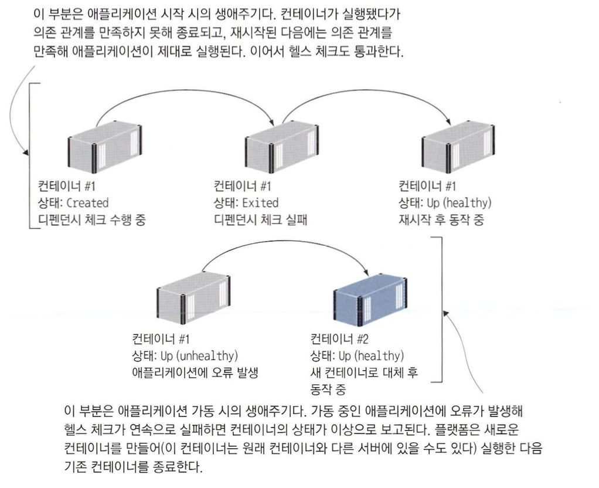

# 헬스 체크와 디펜던시 체크로 애플리케이션의 신뢰성 확보하기

## 헬스 체크를 지원하는 도커 이미지 빌드하기

### 도커의 컨테이너 헬스체크

도커는 컨테이너를 시작할 때마다 애플리케이션의 기본적인 상태를 확인합니다.

애플리케이션 프로세스가 종료될 경우 컨테이너도 종료상태로 변하게 됩니다.

이렇게만 하더라도 기본적인 헬스체크는 가능하지만 `컨테이너의 처리용량을 넘어서 503 에러만을 반환할때도 프로세스는 살아있기 때문에 도커는 컨테이너를 정상이라고 판단`하게 됩니다.

이런 상황을 해결하기 위해 도커는 애플리케이션의 상태가 실제로 정상인지 확인할 수 있는 정보를 도커 이미지에 직접 넣을 수 있습니다.

### HEALTHCHECK 인스트럭션

컨테이너 런타임은 HEALTHCHECK 인스트럭션에 정의된 정보를 이용하여 컨테이너에서 동작 중인 애플리케이션의 상태가 정상인지 확인할 수 있습니다.

`HEALTHCHECK 인스트럭션`에서는 `도커가 컨테이너 안에서 실행하는 명령을 지정`하게 되는데, 이 `명령이 반환하는 상태 코드를 보고 애플리케이션의 상태를 판단`합니다.

도커는 일정한 시간 간격으로 컨테이너 안에 지정된 명령을 실행하고 상`태 코드가 연속으로 일정 횟수 이상 실패로 나오게 되면 해당 컨테이너를 문제가 발생한 상태로 간주`하게 됩니다.

다음은 HEALTHCHECK 인스트럭션을 적용한 도커 파일 스크립트입니다.

```docker
FROM diamol/dotnet-sdk AS builder

WORKDIR /src
COPY src/Numbers.Api/Numbers.Api.csproj .
RUN dotnet restore

COPY src/Numbers.Api/ .
RUN dotnet publish -c Release -o /out Numbers.Api.csproj

FROM diamol/dotnet-aspnet

ENTRYPOINT ["dotnet", "app/Numbers.Api.dll"]
HEALTHCHECK CMD curl --fail http://localhost/health

WORKDIR /app
COPY --from=builder /out/ .
```

위에서 HEALTHCHECK 인스트럭션을 보면 다음과 같이 작성되어 있습니다.

```docker
HEALTHCHECK CMD curl --fail http://localhost/health
```

위의 명령은 `/health` 로 HTTP 요청을 보낸 후 지정한 `--fail` 옵션으로 인해 성공시 0, 실패시 0 이외의 수를 반환합니다.

```
💡 도커는 0을 헬스 체크 정상, 0 이외의 값을 비정상으로 간주합니다.

```

### 헬스체크 해보기

해당 도커 파일을 빌드하고 실행한 후 헬스체크를 정상적으로 하는지 확인해봅시다.

```
💡 해당 이미지는 3번 요청 후 에러를 발생시킵니다.

```

```bash
docker container run -d -p 8081:80 diamol/ch08-numbers-api:v2

curl http://localhost:8081/rng
curl http://localhost:8081/rng
curl http://localhost:8081/rng
curl http://localhost:8081/rng

```

잠시 기다리면 도커가 이상 상태를 감지하여 상태가 변경된 것을 볼 수 있습니다.

```bash
CONTAINER ID   IMAGE                        COMMAND                  CREATED              STATUS                          PORTS                  NAMES
626ac0dbe7ca   diamol/ch08-numbers-api:v2   "dotnet /app/Numbers…"   About a minute ago   Up About a minute (unhealthy)   0.0.0.0:8081->80/tcp   relaxed_williamson
```

### 헬스체크 상태 확인

컨테이너의 이상 상태는 `도커 API를 통해 보고`됩니다.

따라서 컨테이너를 실행 중인 플랫폼도 컨테이너의 이상 상태를 통보받고 애플리케이션을 복구하기 위한 조치를 취할 수 있습니다.

그리고 가장 최근의 헬스 체크 수행 결과도 저장돼 있어 컨테이너의 상태를 조사할 때 이 결과를 열람할 수 있습니다.

헬스 체크가 수행중이라면 그 결과 역시 inspect 명령을 통해 확인할 수 있습니다.

```bash
docker container inspect $(docker container ls --last 1 --format '{{.ID}}')
```

```
💡 `--last` 플래그를 붙이면 가장 최근에 만든 컨테이너에 대한 정보를 볼 수 있습니다.

```

해당 명령을 치면 JSON으로 헬스체크 상태 및 결과들을 볼 수 있습니다.

```bash
"Id": "626ac0dbe7ca21ea17de580268dcfc4d31e12b11ff59ec337f65e51f06da7396",
"Created": "2023-06-11T11:19:36.527756466Z",
"Path": "dotnet",
"Args": [
    "/app/Numbers.Api.dll"
],
"State": {
    "Status": "running",
    "Running": true,
    "Paused": false,
    "Restarting": false,
    "OOMKilled": false,
    "Dead": false,
    "Pid": 34354,
    "ExitCode": 0,
    "Error": "",
    "StartedAt": "2023-06-11T11:19:36.702230133Z",
    "FinishedAt": "0001-01-01T00:00:00Z",
    "Health": {
        "Status": "unhealthy",
        "FailingStreak": 9,
        "Log": [
            {
							...
							...
```

헬스체크를 통해 애플리케이션이 unhealthy 상태가 된것을 볼 수 있습니다.

하지만 JSON 결과를 잘 보면 컨테이너 상태는 여전히 실행중이라고 나오는 것을 볼 수 있습니다.

도커가 직접 컨테이너를 재시작하거나 교체하지 않는 이유는 도커가 이러한 작업을 안전하게 처리할 수 없기 때문입니다.

도커 엔진은 단일 서버에서 동작하는데, 이상이 생긴 컨테이너를 도커가 중지하고 재시작할 수는 있지만 그 시간동안에는 애플리케이션이 동작하지 않게 됩니다.

이상이 생긴 컨테이너를 제거하고 완전히 같은 설정으로 새 컨테이너를 실행할 수도 있지만, 이 경우에도 컨테이너에 보관된 데이터가 유실되고 그시간 동안 애플리케이션도 동작하지 않습니다.

도커 입장에서는 `이상 상태를 보이는 컨테이너를 교체하는 작업을 직접 수행했을 때 더 악화시키지 않을 것이라는 보장이 없으므로 이상 상태를 통보하기만 합니다.`

`이상 상태가 발생했다고 하더라도 헬스체크는 계속 수행되며 헬스 체크가 성공하게 된다면 다시 정상으로 돌아갑니다.`

도커가 동작하는 여러 대의 서버로 구성되고 도커 스웜이나 쿠버네티스가 관리하는 클러스터 환경에서는 헬스 체크 기능이 더욱 유용합니다.

## 디펜던시 체크가 적용된 컨테이너 실행하기

### 컨테이너 간의 의존관계

여러개의 서버로 구성된 클러스터는 일부 컨테이너가 비정상 상태가 되더라도 새 컨테이너를 실행해 상태를 복구할 수 있습니다.

따라서 몇몇 컨테이너가 응답하지 않게 되더라도 서비스 중단으로 이어지지 않습니다.

그러나 여러 컨테이너에 나뉘어 실행되는 분산 애플리케이션은 이와는 또 다른 문제를 겪을 수 있습니다.

`이상이 생긴 컨테이너를 교체할 때는 처음 애플리케이션을 실행할 때 처럼 컨테이너 간 의존관계를 고려하지 않기 때문`입니다.

### 디펜던시 체크 기능

이런 상황을 해결 하기 위해 의존관계를 만족하는지 점검하는 디펜던시 체크 기능도 도커 이미지에 추가할 수 있습니다.

디펜던시 체크는 애플리케이션 실행 전에 필요한 요구 사항을 확인하는 기능으로, 실행 시점이 헬스 체크와는 조금 다릅니다.

모든 요구사항이 확인되면 디펜던시 체크가 성공하고 애플리케이션이 실행됩니다.

반대로 만족하지 못하는 요구사항이 있다면 디펜던시 체크가 실패해 애플리케이션이 실행되지 않습니다.

디펜던시 체크는 헬스 체크처럼 별도의 인스트럭션으로 도커에 구현된 것은 아니고 애플리케이션 실행 명령에 로직을 추가하는 방법으로 구현합니다.

다음은 디펜던시를 추가한 도커파일 스크립트입니다.

```docker
FROM diamol/dotnet-sdk AS builder

WORKDIR /src
COPY src/Numbers.Api/Numbers.Api.csproj .
RUN dotnet restore

COPY src/Numbers.Api/ .
RUN dotnet publish -c Release -o /out Numbers.Api.csproj

FROM diamol/dotnet-aspnet

ENV RngApi:Url=http://numbers-api/rng

CMD curl --fail http://numbers-api/rng && \
    dotnet Numbers.Web.dll

WORKDIR /app
COPY --from=builder /out/ .
```

위의 스크립트는 API가 사용가능한 상태라면 curl 명령이 성공하고 이어지는 닷넷 코어 애플리케이션 실행 명령을 실행할 것입니다.

API를 사용할 수 없다면 curl 명령이 실패할 것이고 뒤에 오는 명령도 실행되지 않아 컨테이너가 그대로 종료될 것입니다.

컨테이너를 전부 삭제한 상태에서 다시 컨테이너를 실행해봅시다.

```bash
docker container run -d -p 8084:80 diamol/ch08-numbers-web:v2
```

```bash
docker ps -a

CONTAINER ID   IMAGE                        COMMAND                  CREATED         STATUS                     PORTS     NAMES
7cd64ae68f8e   diamol/ch08-numbers-web:v2   "/bin/sh -c 'curl --…"   3 seconds ago   Exited (6) 3 seconds ago             dreamy_keldysh
```

컨테이너가 바로 종료되는 것을 확인할 수 있습니다.

위와 같은 방식으로 필요한 애플리케이션이 떠져있는지 확인하여 컨테이너를 실행시키도록 처리할 수 있습니다.

## 애플리케이션 체크를 위한 커스텀 유틸리티 만들기

### curl의 한계

curl은 웹 애플리케이션이나 API를 테스트하는데 매우 유용한 도구입니다.

하지만 실무에서 개발하는 애플리케이션을 테스트하는 목적으로는 curl을 사용하지 않습니다.

보안 정책상의 이유로 이미지에 curl을 포함시킬 수 없기 때문입니다.

`도커이미지에는 애플리케이션을 구동하는데 필요한 최소한의 내용`만 들어가야 합니다.

사용하지 않을 도구를 추가해봤자 이미지의 크기만 증가하고 외부 공격에 노출될 여지를 늘릴 뿐입니다.

curl이 컨테이너 상태 체크에 유용한 도구이기는 하지만 애플리케이션 체크에는 별도의 커스텀 유틸리티를 사용하는 것이 더 좋습니다.

### 커스텀 유틸리티의 장점

애플리케이션 상태 체크시에 커스텀 유틸리티를 사용할 때의 장점은 다음과 같습니다.

- 커스텀 유틸리티를 실행할 때도 애플리케이션과 같은 도구를 사용하므로 이미지에 추가적인 소프트웨어를 포함시킬 필요가 없습니다.
- 재시도 횟수나 분기 등 셸 스크립트로 표현하기 까다로운 복잡한 체크 로직을 적용할 수 있습니다.
- 애플리케이션과 같은 설정을 사용해 URL을 여러 곳에 반복 정의하거나 수정에서 누락시키는 일을 방지할 수 있습니다.
- 애플리케이션과 같은 라이브러리 환경에서 데이터베이스 접속이나 인증서 파일의 존재 유무 등 컨테이너 실행 전에 확인이 필요한 모든 사항을 검증할 수 있습니다.

### 커스텀 유틸리티로 curl 대체하기

다음은 닷넷 코어로 구현된 테스트 유틸리티를 사용하는 방식입니다.

```docker
FROM diamol/dotnet-sdk AS builder

WORKDIR /src
COPY src/Numbers.Api/Numbers.Api.csproj .
RUN dotnet restore

COPY src/Numbers.Api/ .
RUN dotnet publish -c Release -o /out Numbers.Api.csproj

# http check utility
FROM diamol/dotnet-sdk AS http-check-builder

WORKDIR /src
COPY src/Utilities.HttpCheck/Utilities.HttpCheck.csproj .
RUN dotnet restore

COPY src/Utilities.HttpCheck/ .
RUN dotnet publish -c Release -o /out Utilities.HttpCheck.csproj

FROM diamol/dotnet-aspnet

ENTRYPOINT ["dotnet", "Numbers.Api.dll"]
HEALTHCHECK CMD ["dotnet", "Utilities.HttpCheck.dll", "-u", "http://localhost/health"]

WORKDIR /app
COPY --from=http-check-builder /out/ .
COPY --from=builder /out/ .
```

이제 위의 스크립트를 빌드 후 실행시켜 봅시다.

```bash
docker rm -f $(docker ps -aq)

docker container run -d -p 8080:80 --health-interval 5s diamol/ch08-numbers-api:v3

curl localhost:8080/rng
curl localhost:8080/rng
curl localhost:8080/rng
# 실패
curl localhost:8080/rng
```

시간이 좀 지난 후 확인해보면 unhealthy 상태로 변경된 것을 확인할 수 있습니다.

```bash
CONTAINER ID   IMAGE                        COMMAND                  CREATED              STATUS                          PORTS                  NAMES
f72bbaaa3f32   diamol/ch08-numbers-api:v3   "dotnet Numbers.Api.…"   About a minute ago   Up About a minute (unhealthy)   0.0.0.0:8080->80/tcp   vibrant_hamilton
```

### 디펜던시 체크시에 커스텀 유틸리티 사용하기

디펜던시 체크시에도 curl 요청 대신 커스텀 유틸리티를 사용할 수 있습니다.

다음은 디펜던시 체크시 커스텀 유틸리티를 사용하도록 작성한 도커파일 스크립트입니다.

```docker
 # build
FROM diamol/dotnet-sdk AS builder

WORKDIR /src
COPY src/Numbers.Api/Numbers.Api.csproj .
RUN dotnet restore

COPY src/Numbers.Api/ .
RUN dotnet publish -c Release -o /out Numbers.Api.csproj

# http check utility
FROM diamol/dotnet-sdk AS http-check-builder

WORKDIR /src
COPY src/Utilities.HttpCheck/Utilities.HttpCheck.csproj .
RUN dotnet restore

COPY src/Utilities.HttpCheck/ .
RUN dotnet publish -c Release -o /out Utilities.HttpCheck.csproj

# app
FROM diamol/dotnet-aspnet

ENV RngApi:Url=http://numbers-api/rng

CMD dotnet Utilities.HttpCheck.dll -c RngApi:Url -t 900 && \
    dotnet Number.Web.dll

WORKDIR /app
COPY --from=http-check-builder /out/ .
COPY --from=builder /out/ .
```

이제 동작은 똑같이 유지하면서 애플리케이션 이미지에서 curl을 사라지게 했습니다.

### 커스텀 테스트 유틸리트를 통한 이미지 이식성 향상

커스텀 테스트 유틸리티를 사용하면 이미지 이식성이 향상됩니다.

컨테이너 플랫폼마다 헬스 체크와 디펜던시 체크를 정의하고 실행하는 방법에 차이가 있습니다.

그러나 모든 로직을 테스트 유틸리티에 포함시킨다면 도커 컴포즈, 도커 스웜, 쿠버네티스 등 어떤 환경에서도 그대로 동작시킬 수 있습니다.

## 도커 컴포즈에 헬스 체크와 디펜던시 체크 정의하기

### 도커 컴포즈 파일에 헬스체크 설정하기

도커 컴포즈 파일에도 헬스 체크를 적용할 수 있습니다.

다음은 헬스 체크를 적용한 도커 컴포즈 파일입니다.

```yaml
version: "3.7"

services:
  numbers-api:
    image: diamol/ch08-numbers-api:v3
    ports:
      - "8087:80"
    healthcheck:
      interval: 5s
      timeout: 1s
      retries: 2
      start_period: 5s
    networks:
      - app-net
```

도커 컴포즈 파일에서는 헬스 체크의 옵션을 더 세세하게 설정할 수 있습니다.

위의 예제에서 사용된 옵션들은 다음과 같습니다.

- interval
    - 헬스 체크를 실시하는 간격을 의미합니다.
- timeout
    - 그때까지 응답을 받지 못하면 실패로 간주하는 제한 시간을 의미합니다.
- retrites
    - 컨테이너 상태를 이상으로 간주할 때 까지 필요한 연속 실패 횟수를 의미합니다.
- start_period
    - 컨테이너 실행 후 첫 헬스 체크를 실시하는 시간 간격을 의미합니다.
    - 애플리케이션을 시작할 때 시간이 오래걸리는 경우 필요합니다.

이런 설정 값은 애플리케이션, 환경에 따라 달라질 수 있으므로 실제 테스트 후 적합한 값을 찾아 설정해야 합니다.

이미지에 헬스 체크가 정의되지 않은 경우 컴포즈 파일에서 정의할 수도 있습니다.

다음은 헬스체크 스크립트를 지정하는 도커 컴포즈 파일입니다.

```yaml
numbers-web:
    image: diamol/ch08-numbers-web:v3
    restart: on-failure
    ports:
      - "8088:80"
    healthcheck:
      test: ["CMD", "dotnet", "Utilities.HttpCheck.dll", "-t", "150"]
      interval: 5s
      timeout: 1s
      retries: 2
      start_period: 10s
    networks:
      - app-net
```

위의 스크립트에 포함한 이미지는 디펜던시 체크를 진행하고 있습니다.

스크립트에는 `restart: on-failure` 설정이 있기 때문에 컨테이너가 예기치 않게 종료되면 컨테이너를 재시작 합니다.

그러나 의존관계를 정의한 depends_on 설정이 없으므로 도커 컴포즈는 컨테이너를 어떤 순서로든 실행할 수 있습니다.

API 컨테이너의 준비가 끝나기 전에 웹 애플리케이션 컨테이너가 실행되면 디펜던시 체크가 실패해 웹 컨테이너가 종료됩니다.

하지만 결국 API 컨테이너도 실행될 것이므로 마지막에는 디펜던시 체크도 성공해 애플리케이션이 제대로 동작합니다.

### 도커 컴포즈 파일에 depends_on 설정을 사용하지 않는 이유

도커 컴포즈 파일에 depends_on 설정을 사용해  직접 디펜던시 체크를 하지 않는 이유는 `도커 컴포즈가 디펜던시 체크를 할 수 있는 범위가 단일 서버로 제한`되기 때문입니다.

이에 비하면 운영 환경에서 애플리케이션을 실제 시작할 때 일어나는 상황은 이보다 훨씬 예측하기 어렵습니다.

## 헬스 체크와 디펜던시 체크로 복원력 있는 애플리케이션을 만들 수 있는 이유

### 분산 시스템 관리

여러 개의 요소로 구성된 분산 시스템으로 동작하는 애플리케이션은 유연성과 기민성 면에서 뛰어납니다.

그러나 반대 급부로 그만큼 관리가 어려워집니다.

구성 요소 간의 복잡한 의존관계를 보면, 이들 의존 관계를 각 구성 요소를 시작하는 순서에 반영해 모델링하고 싶을 수 있습니다.

하지만 이러한 방법은 현명한 방법이 아닙니다.

물리 서버가 한대라면 도커 컴포즈에 웹 컨테이너보다 API 컨테이너를 먼저 실행시키라고 지시할 수 있습니다.

하지만 `여러개의 서버를 사용하여 걸쳐 많은 컨테이너를 관리해야하는 경우 이러한 대처가 어렵습니다.`

예를 들어 웹 애플리케이션 컨테이너가 50개 존재하고 API 컨테이너가 20개 존재한다고 가정해봅시다.

API 컨테이너가 20개 켜질때 동안 웹 애플리케이션이 50개가 켜지지 않는 것은 굉장히 비효율적일 것입니다.

특히, API 컨테이너가 19개 켜진상황에서 1개가 어떤 이유로 인해 늦게 켜진다면 그때동안 웹 애플리케이션이 켜지지 않아 서비스가 불가능 할 것입니다.

### 디펜던시 체크와 헬스 체크를 이용하기

디펜던시 체크와 헬스 체크를 도입하면 처음부터 플랫폼이 실행 순서를 보장하게 할 필요가 없습니다.

가능한 한 빨리 컨테이너를 실행시키고 일부 컨테이너가 의존관계를 만족하지 못한 경우에는 재실행되거나 다른 컨테이너로 교체되게 하면 됩니다.

이런 방식으로 하는게 동작하는 상태로 만드는데 훨씬 빠를 것입니다.



### 헬스 체크와 디펜던시 체크의 주의 사항

`헬스 체크`는 주기적으로 자주 실행되기 때문에 시스템에 부하를 주어선 안됩니다.

`자원을 너무 많이 소모하지 않으면서 애플리케이션이 실질적으로 동작 중인지 검증할 수 있는 핵심적인 부분을 테스트`해야 합니다.

`디펜던시 체크`는 애플리케이션 시작시에만 실행되므로 테스트에 소모되는 리소스에 너무 크게 신경쓸 필요는 없습니다.

하지만 `테스트 대상이 빠짐없이 정확하도록 주의`해야 합니다.

디펜던시 체크에 누락된 의존 관계가 있고 이 문제를 플랫폼이 해결하지 못한다면 애플리케이션에도 문제가 생길 것 입니다.