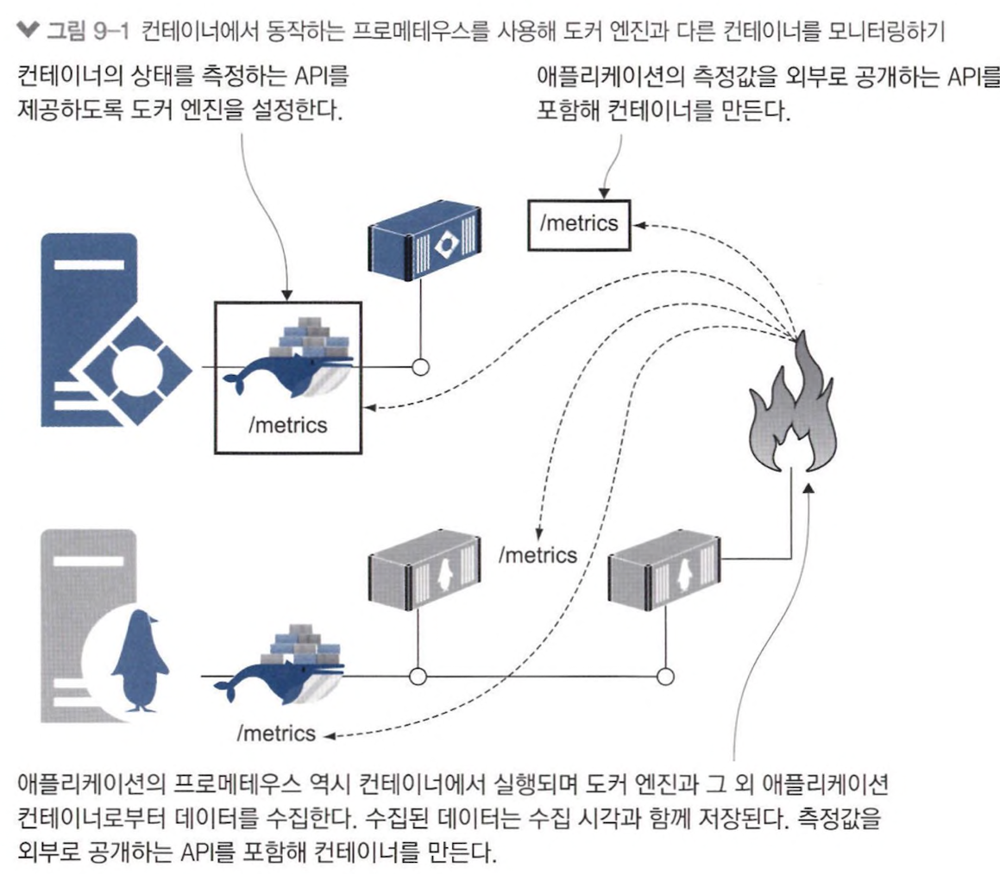
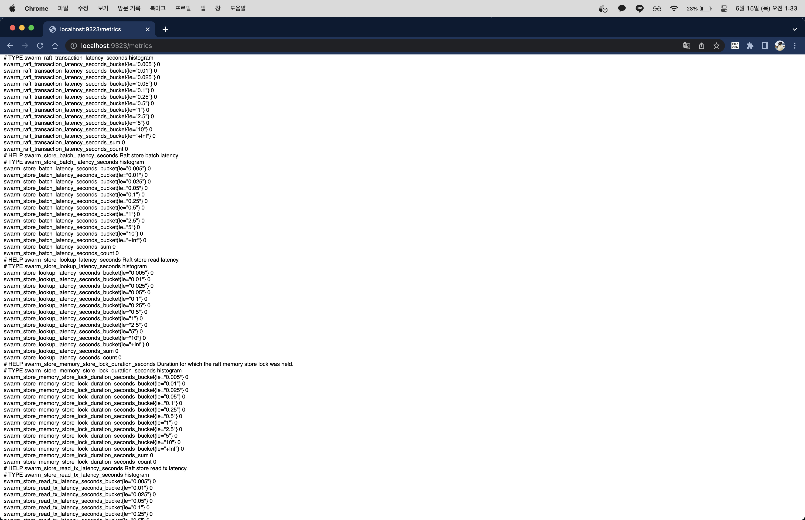
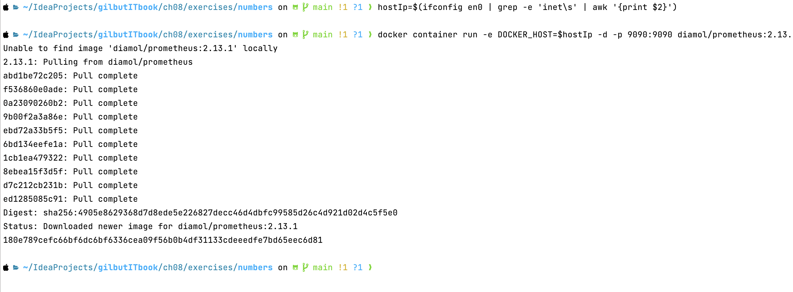
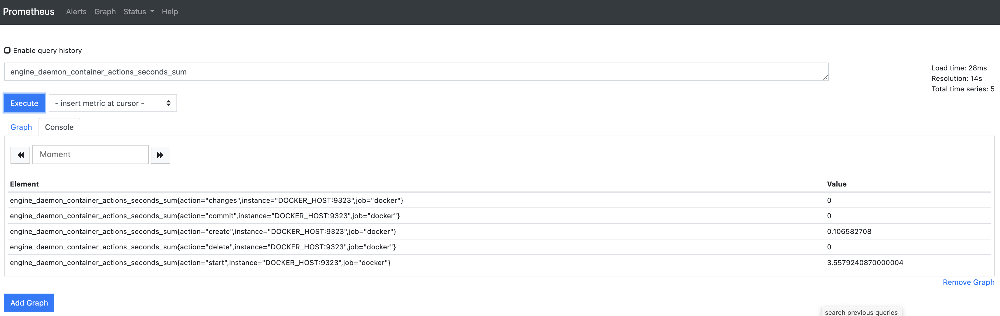
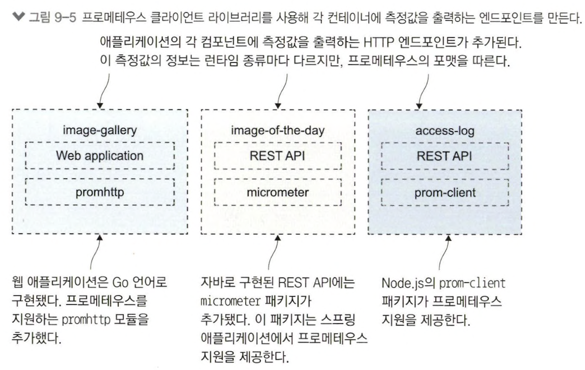
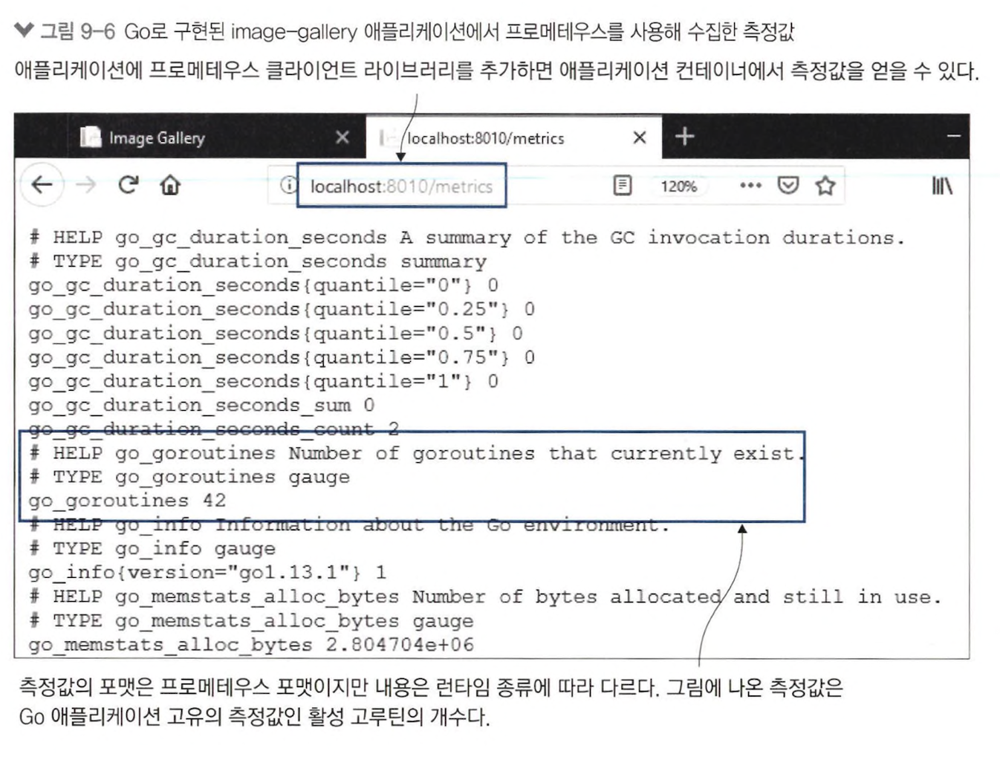
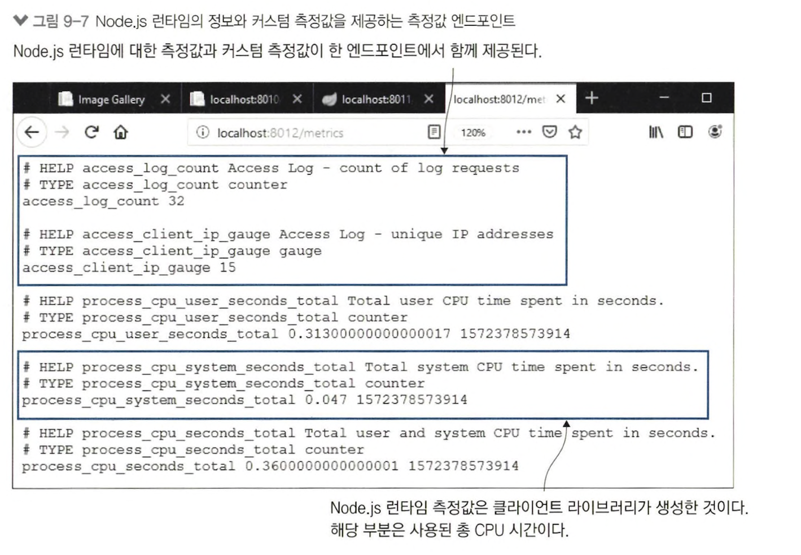
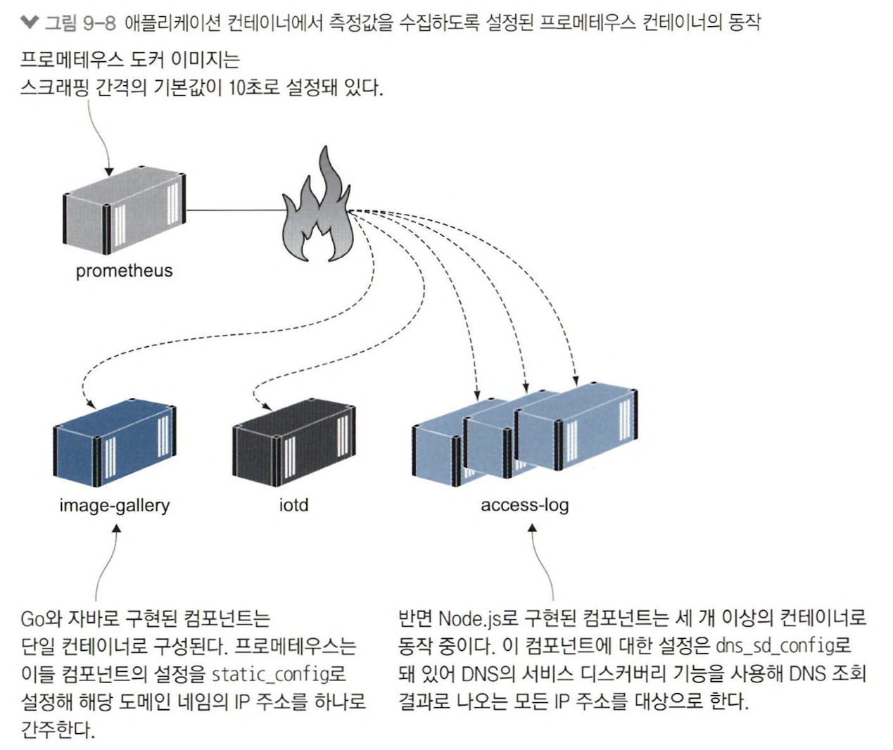
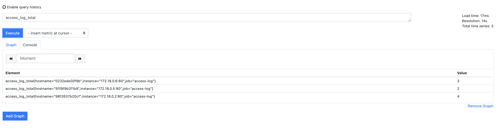

# 9장 컨테이너 모니터링으로 투명성 있는 애플리케이션 만들기

## 9.1 컨테이너화된 애플리케이션에서 사용되는 모니터링 기술 스택

> 프로메테우스 사용한 모니터링 기술 스택



#### 프로메테우스 장점

- 애플리케이션 프레임워크에 관계 없이 표준 형태로 모니터링 가능
- 도커 엔진 측정값 같은 형식으로 추출 가능

```json
{
  "metrics-addr": "0.0.0.0:9323",
  "experimental": true
}
```

> 실습 1) 프로메테우스 형식으로 측정값 출력 위한 도커 엔진 설정



> 실습 2) 컨테이너로 프로메테우스를 실행하여 현재 도커 실행중인 로컬 정보 조회 





- `engine_daemon_container_actions_seconds_sum` : 컨테이너 각 활동에 걸린 시간

## 9.2 애플리케이션의 측정값 출력하기



- 프로메테우스로 수집한 정보 = 런타임 수준의 측정값 ex) 컨테이너가 처리하는 작업, 해당 작업의 부하
- Go 애플리케이션 측정값 = 현재 활성 상태인 고루틴 개수
- Java 애플리케이션 측정값 = JVM 사용중인 메모리 용량 정보



> 실습 3) 애플리케이션 트래픽 증가 후 모니터링

```shell
for i in {1..5}; do curl http://localhost:8010 > /dev/null; done
```



## 9.3 측정값 수집을 맡을 프로메테우스 컨테이너 실행하기

> 프로메테우스 폴링 방식으로 데이터 수집(= scrapping)

- scrapping 대상 endpoint 정의 필요
- 클러스터에 있는 모든 컨테이너 조회 가능
- 단일 서버 내 docker-compose 환경에선 docker dns를 통해 조회

<table>
<tr>
<td align="center">script</td><td align="center">구조</td>
</tr>
<tr>
<td>

```yaml
global:
  scrape_interval: 10s

scrape_configs:
  - job_name: "image-gallery"
    metrics_path: /metrics
    static_configs:
      - targets: ["image-gallery"]

  - job_name: "iotd-api"
    metrics_path: /actuator/prometheus
    static_configs:
      - targets: ["iotd"]

  - job_name: "access-log"
    metrics_path: /metrics
    scrape_interval: 3s
    dns_sd_configs:
      - names:
          - accesslog
        type: A
        port: 80

  - job_name: "docker"
    metrics_path: /metrics
    static_configs:
      - targets: ["DOCKER_HOST:9323"]
```
</td>
<td>

</td>
</tr>
</table>

- `static_config` : host명으로 단일 컨테이너 지정
- `dns_sd_config` : DNS service discover 기능을 통해 여러 컨테이너 지정할 수 있고 스케일링에 따라 대상 컨테이너 자동 확대 가능
- `scrape_interval` : 10초에 한번씩 모든 컨테이너에서 수집

> 실습 4) 스케일링 적용 후 트래픽 모니터링

```shell
docker-compose -f docker-compose-scale.yml up -d --scale accesslog=3

for i in {1..10}; do curl http://localhost:8010 > /dev/null; done
```



- traffic 균등 분배

## 9.4 측정값 시각화를 위한 그라파나 컨테이너 실행하기

> 실습 5) 그라파나가 포함된 컴포즈 파일로 애플리케이션 실행

```shell
vim ./docker-compose-with-grafana.yml # diamol/ch09-grafana -> grafana/grafana

docker-compose -f ./docker-compose-with-grafana.yml up -d --scale accesslog=3

for i in {1..20}; do curl http://localhost:8010 > /dev/null; done  
```

<table>
<tr>
<td align="center">설명</td><td align="center">명령어</td>
</tr>
<tr>
<td>
HTTP Status Code 200으로<br>처리된 응답수
</td>
<td>

```text
sum(image_gallery_requests_total{code="200"}) without(istance)
```
</td>
</tr>
<tr>
<td>
현재 처리 중인 요청 수
</td>
<td>

```text
sum(image_gallery_in_flight_requests) without(instance)
```
</td>
</tr>
<tr>
<td>
메모리 사용량
</td>
<td>

```text
go_memstats_stack_inuse_bytes{job="image-gallery"}
```
</td>
</tr>
<tr>
<td>
활성 고루틴 수
</td>
<td>

```text
sum(go_goroutines{job="image_gallery"}) without(instance)
```
</td>
</tr>
</table>