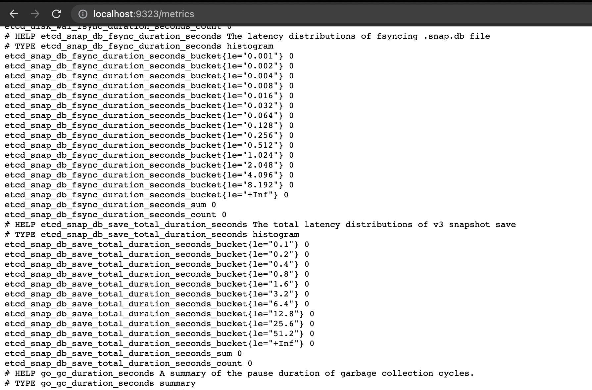
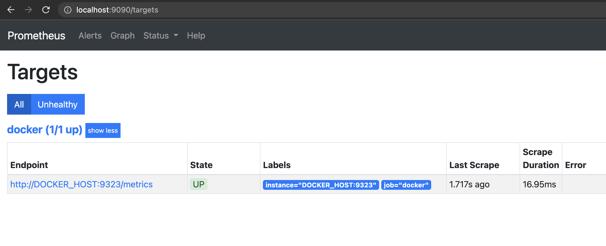
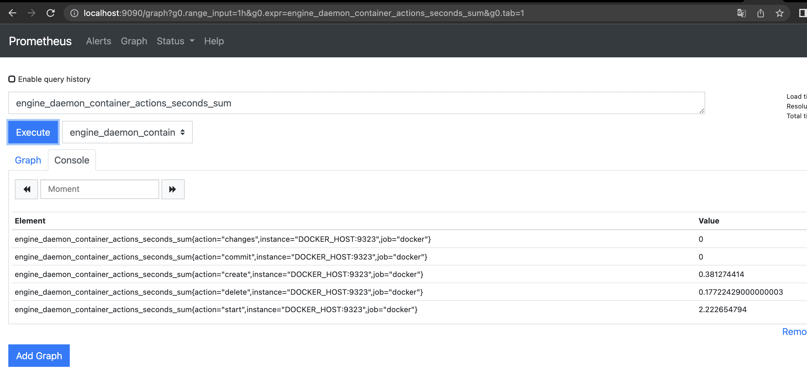
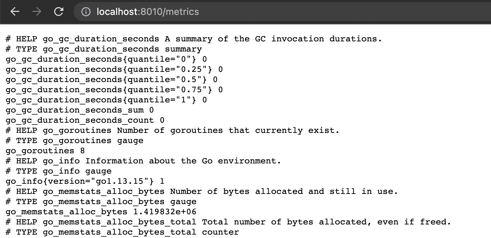
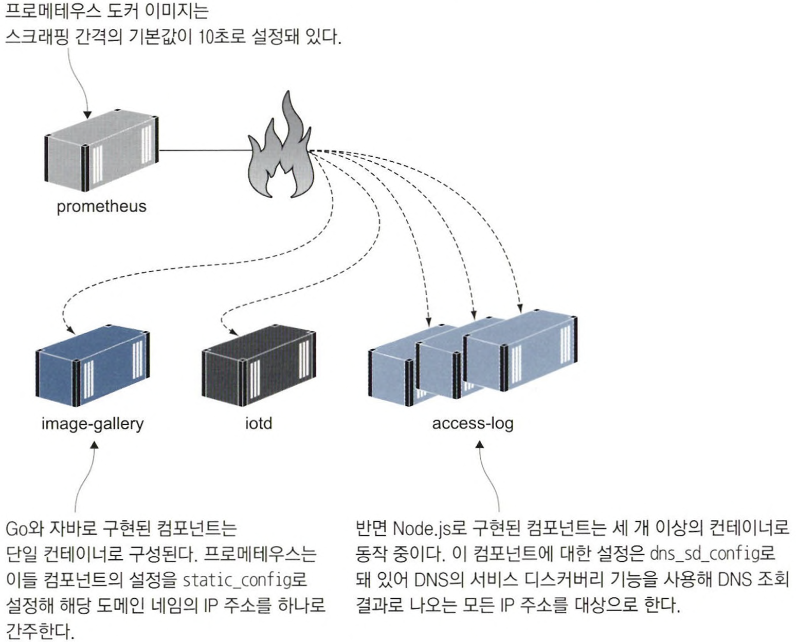
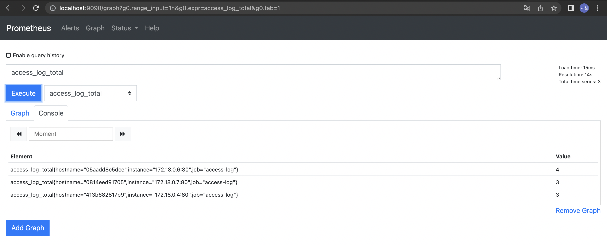
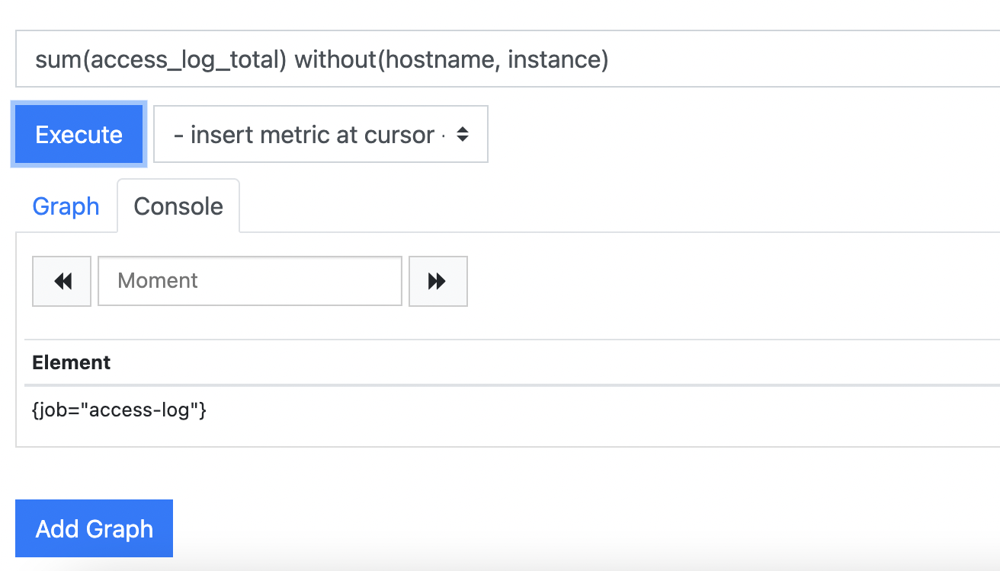
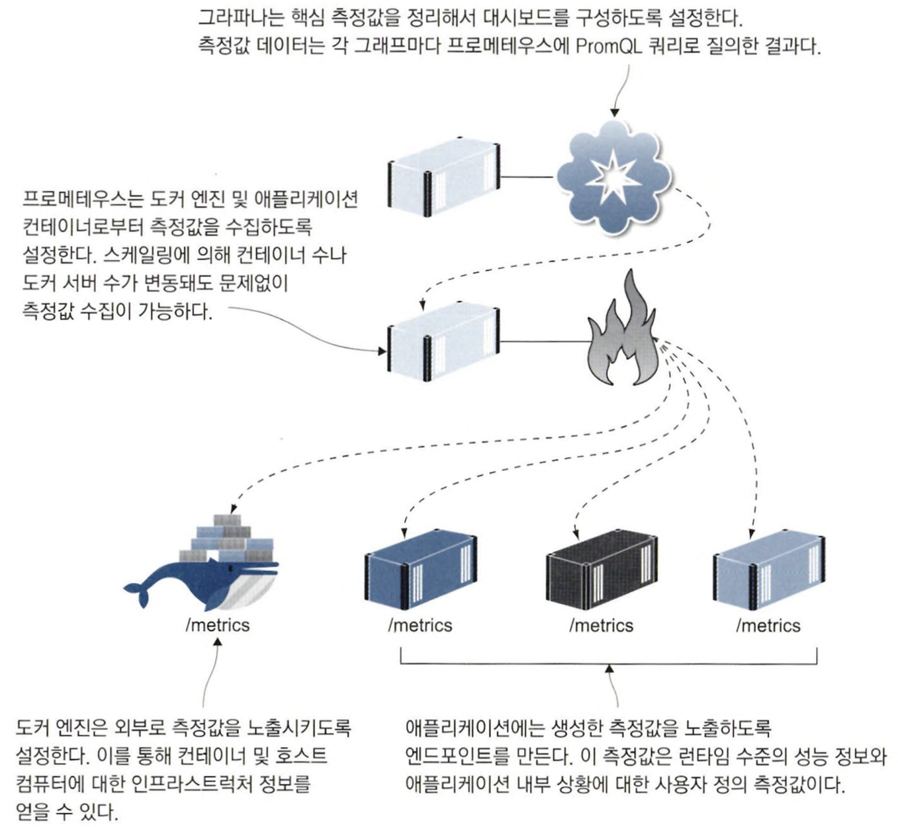

# 9장 컨테이너 모니터링으로 투명성 있는 애플리케이션 만들기

컨테이너에서 실행하는 애플리케이션에 있어 `투명성` 은 매우 중요한 요소다. 투명성을 확보하지 못하면 애플리케이션이 뭘하고 있는지 또는 어떤 상태에 있는지, 문제가 있다면 어떤 부분이 원인인지조차 알 수 없다.

## 9.1 컨테이너화된 애플리케이션에서 사용되는 모니터링 기술 스택

프로메테우스를 사용하면 모니터링의 중요한 측면인 `일관성` 이 확보된다. 모든 애플리케이션에서 똑같이 구성된 측정값을 내놓기 때문에 모든 애플리케이션을 똑같은 표준적인 형태로 모니터링할 수 있다.

프로메테우스의 또 다른 장점은 도커 엔진의 측정값도 같은 형식으로 추출할 수 있다는 점이다. 이 기능을 사용하려면 도커 엔진 설정에서 프로메테우스 측정 기능을 명시적으로 활성화해야 한다.

📌 daemon.json에 다음 두 값을 추가한다.

```docker
"metrics-addr" : "0.0.0.0:9323",
"experimental" : true
```

📌  도커 엔진이 HTTP API를 통해 외부로 공개하는 상태 정보의 예



측정된 각 상태 정보가 이름과 값의 쌍 형태로 표현되는 간단한 텍스트 기반 포맷으로 돼 있다. 그리고 각 이름-값 쌍 앞에는 해당 정보가 어떤 정보인지. 값의 데이터 타입은 무엇인지에 대해 간단한 안내 설명이 붙는다.

📌  프로메테우스를 컨테이너에서 실행해 현재 도커를 실행 중인 컴퓨터의 정보를 수집한다.

```docker
hostIP=$(ifconfig en0 | grep -e 'inet\s' | awk '{print $2}')

# 환경 변수로 로컬 컴퓨터의 IP 주소를 전달해 컨테이너를 실행
docker container run -e DOCKER_HOST=$hostIP -d -p 9090:9090 diamol/prometheus:2.13.1
```

프로메테우스가 포함된 diamol/Promethus 이미지의 설정 중 DOCKER_HOST 환경 변수를 사용해 호스트 컴퓨터와 통신하고 도커 엔진의 상태 측정값을 수집한다

📌 프로메테우스는 간단한 웹 UI를 통해 측정값을 확인하거나 쿼리를 실행할 수 있다.





각 상태별 컨테이너 수나 실패한 헬스 체크 횟수 같은 고수준 정보부터 도커 엔진이 점유 중인 메모리 용량 같은 저수준 정보까지 

다양하다. 애플리케이션 또한 자신의 상태 정보를 제공하는데, 이들 정보의 자세한 정도는 애플리케이션마다 다르다. 컨테이너마다 측정값을 수집할 엔드포인트를 만들고 프로메테우스가 이들 엔드포인트에서 주기적으로 정보를 수집하게 해야 한다.

## 9.2 애플리케이션의 측정값 출력하기

애플리케이션의 유용한 정보를 측정값으로 구성하려면 이들 정보를 생성하는 코드를 작성해 HTTP 엔드포인트로 출력해야 한다. 주요 프로그래밍 언어에는 프로메테우스의 라이브러리가 제공된다.

프로메테우스 클라이언트 라이브러리를 통해 수집된 정보는 `런타임 수준의 측정값` 으로, 해당 컨테이너가 처리하는 작업이 무엇이고 이 작업의 부하가 어느 정도인지에 대한 정보가 런타임의 관점에서 표현돼 있다.

✅ Go로 구현된 image-gallery 애플리케이션에서 프로메테우스를 사용해 수집한 측정값

애플리케이션에 Go 언어용 프로메테우스 클라이언트 라이브러리를 추가한다.



✅ Node.js에서 커스텀 프로메테우스 측정값을 선언하고 사용하기

```docker
// 측정값 선언하기
const accessCounter = new prom.Counter({
		name: "access_log_total",
		help: "Access Log - 총 로그 수"
});

const clientIpGauge = new prom.Gauge({
    name: "access_client_ip_currnet",
    help: "Access Log - 현재 접속 중인 IP 주소"
});

// 측정값 갱신하기
accessCounter.inc();
clientIpGauge.set(countOfIpAddresses);
```

프로메테우스의 측정값 중 가장 간단한 종류로 카운터와 게이지가 있다.

- 카운터의 값은 현상 유지 혹은 증가만 가능하다.
- 게이지의 값은 증가와 감소가 모두 가능하다.

## 9.3 측정값 수집을 맡을 프로메테우스 컨테이너 실행하기

프로메테우스는 직접 측정값을 대상 시스템에서 받아다 수집하는 풀링 방식으로 동작한다.

프로메테우스에서는 측정값을 수집하는 이 과정을 `스크래핑`이라고 한다.

프로메테우스를 실행하면 스크래핑 대상 엔드포인트를 설정해야 한다.

📌 애플리케이션 측정값을 스크래핑하기 위한 프로메테우스 설정

```docker
global:
	scrape_interval: 10s

scrape_configs:
	- job_name: "image-gallery"
		metric_path: /metrics
		static_configs:
			- targets: ["image-gallery"]

	- job_name: "iotd-api"
		metric_path: /actuator/prometheus
		static_configs:
			- targets: ["iotd"]

	- job_name: "access-log"
		metrics_path: /metrics
		dns_sd_configs:
			- names:
				- accesslog
					type: A
					port: 80
```

- 프로메테우스가 10초마다 한 번씩 모든 컨테이너에서 측정값을 수집한다.
- 컨테이너의 IP 주소를 알기 위해서 DNS를 사용한다.
- DNS의 서비스 디스커버리 기능을 사용해 DNS 조회 결과로 나오는 모든 IP주소를 대상으로 한다.



✏️ 원하는 설정값이 기본값으로 포함된 프로메테우스 이미지를 만들면 매번 추가로 설정을 작성하지 않아도 되며, 필요한 경우에는 기본값을 수정할 수 있다.

📌 특정 서비스에 스케일링을 적용하고 웹 애플리케이션에서 부하를 가해 본다.

```docker
$ docker-compose -f docker-compose-scale.yml up -d --scale accesslog=3

# HTTP GET 요청을 열 번 보냄
$ for i in {1..10}; do curl http://localhost:8010 > /dev/null; done
```



레이블을 붙여 측정값에 정보를 추가하는 기능을 프로메테우스의 기능 중에서도 가장 강력한 것 중하나다. 이 기능을 활용하면 같은 측정값을 다양한 입도에서 다룰 수 있다.

📌 프로메테우스 웹 UI에서 Add Graph 버튼을 클릭하면 새로운 쿼리로 그래프를 추가할 수 있다.



📌 간단한 프로메테우스 쿼리의 예.

```docker
sum(image_gallery_requests_total{code="200"}) without(instance)
```

- sum() : 괄호 안 표현식의 결과를 통합하는 역할
- {code=”200”} : WHERE, HAVING 절처럼 필터 조건을 지정하는 데 쓰인다.
- without(instance): 측정값을 통합할 때 무시할 레이블을 지정하는 데 쓰이며, GROUP BY와 유사한 역할을 한다.

## 9.4 측정값 시각화를 위한 그라파나 컨테이너 실행하기

측정값을 열람하거나 데이터 시각화를 위한 쿼리를 확인하고 손보는 데는 프로메테우스 웹 UI를 사용하고 이 쿼리를 연결해 대시보드를 구성하는 데는 그라파나를 사용한다. 각 데이터 점은 이해하기 쉽게 시각화되며, 대시보드로 애플리케이션의 상황을 일목요연하게 파악할 수 있다.

그라파나 대시보드는 애플리케이션의 핵심 정보를 다양한 수준에서 제공한다. 시각화된 그래프 하나하나는 PromQL로 작성된 단일 쿼리로 그려지며, 이들 쿼리는 측정값의 취합이나 필터링 이상의 복잡한 작업을 필요로 하지 않는다.

📌 환경 변수로 지정된 IP주소는 컴포즈 파일을 통해 프로메테우스 컨테이너로 전달된다. 도커 컴포즈로 애플리케이션을 실행한 다음 약간의 부하를 가한다.

```docker
$ export HOST_IP=$(ip route get 1 | awk '{print $NF;exit}')

# 그라파나가 포함된 컴포즈 파일로 애플리케이션을 실행
$ docker-compose -f ./docker-compose-with-grafana.yml up -d --scale accesslog=3

# 측정값에 변화가 생기도록 부하를 약간 가한다.
$ for i in {1..20}; do curl http://localhost:8010 > /dev/null; done
```

✅ 네 가지 측정 값과 PromQL 쿼리

- HTTP 응답 코드 200으로 처리된 응답의 수
    - 카운터 측정값
        
        ```docker
        sum(image_gallery_requests_total{code="200"}) without(instance)
        ```
        
- 현재 처리 중인 요청 수
    - 게이지 측정값
        
        ```docker
        sum(image_gallery_in_flight_requests) without(instance)
        ```
        
- 메모리 사용량
    
    ```docker
    go_memstats_stack_bytes{job="image-gallery"}
    ```
    
- 활성 고루틴 수
    - 이 그래프를 통해 웹 컴포넌트의 부하에 급격한 증가가 있었는지 알 수 있다.
        
        ```docker
        sum(go_goroutines{job="image_gallery"}) without(instance)
        ```
        

대시보드의 그래프는 절대적인 값보다는 변화하는 추세에서 알 수 있는 정보가 더 많다. 중요한 것은 평균값에서 벗어나 수치가 튀어오르는 순간이 언제인지다. 컴포넌트의 측정값을 조합해 애플리케이션의 컴포넌트에 발생한 이상 현상과 이들의 상관관계를 찾아야 한다.

## 9.5 투명성의 수준

간단한 개념 검증 수준의 프로덕트에서 실제 서비스가 가능한 수준으로 나아가기 위해서는 투명성이 반드시 필요하다. 실제 운영 환경 모니터링이라면 자세한 상황을 알려주는 대시보드가 필요하다. 애플리케이션을 구성하는 각 컴포넌트도 자신만의 추가적인 정보를 모니터링하는 대시보드를 따로 가질 수 있다.

가장 중요한 것은 애플리케이션의 전체 상황을 조망하는 대시보드다. 측정값 중에서 가장 애플리케이션에 중요한 데이터를 모아 하나의 화면으로 구성할 수 있어야 한다.

✅ 컨테이너화된 애플리케이션의 모니터링 과정, 프로메테우스가 모니터링의 중심이 된다.
