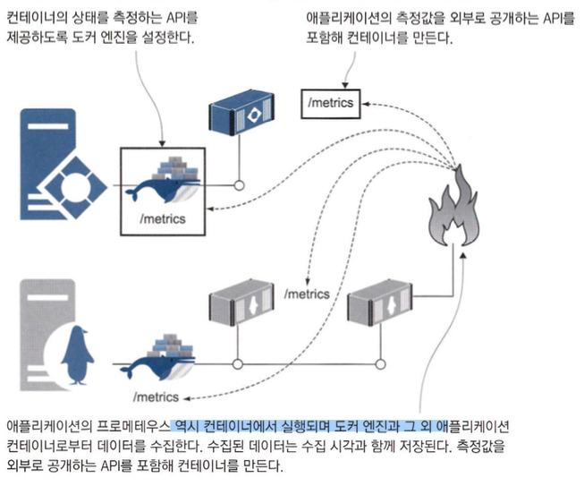
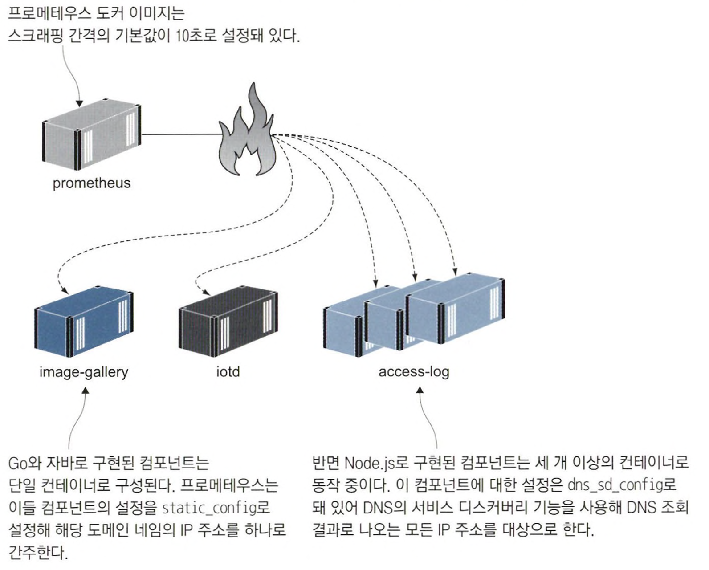
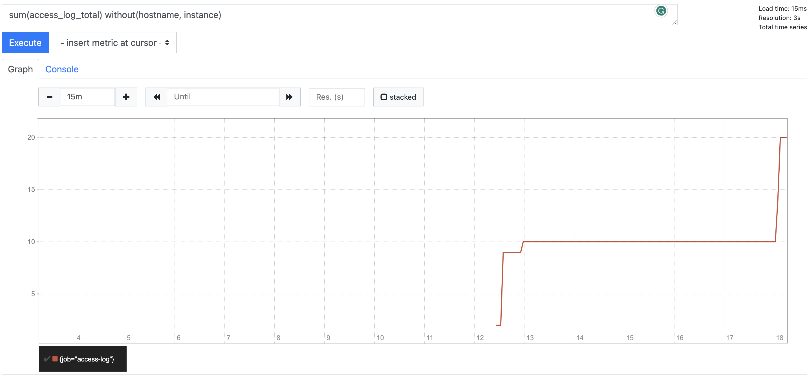
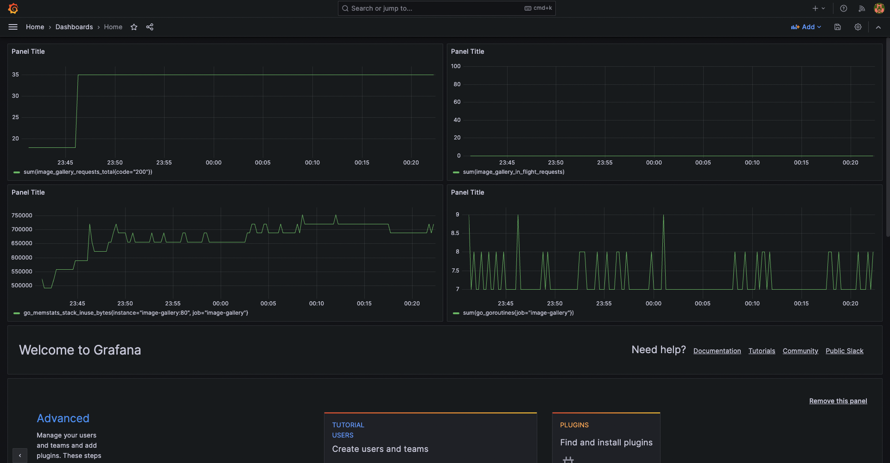

# 컨테이너 모니터링으로 투명성 있는 애플리케이션 만들기

- 프로메테우스를 시용해 애플리케이션 컨테이너에서 측정된 수치를 수집하고 그라파나를 사용해 수치를 시각화해 이해하기 쉬운 대시보드 형태로 구성할 수 있습니다.

## 컨테이너화된 애플리케이션에서 사용되는 모니터링 기술 스택



- 모든 애플리케이션을 똑같은 표준적인 형태로 모니터링할 수 있는 일관성이 확보할 수 있습니다.
- 도커 엔진의 측정값도 같은 형식으로 추출할 수 있습니다.

```json
  "metrics-addr" : "0.0.0.0:9323",
  "experimental" : true
```

- 9323 포트를 통해 측정값을 공개하는 도커엔진 설정입니다.
- `http://localhost:9323/metrics`를 통해 확인할 수 있습니다.
- 프로메테우스는 위 엔드포인트를 통해 값을 수집하면서 타임스탬프 값을 덧붙여 저장하여 시간에 따른 값의 변화를 추적할 수 있습니다.

```shell
hostIP=$(ifconfig en0 | grep -e 'inet\s' | awk '{print $2}')
docker run -e DOCKER_HOST=$hostIP -d -p 9090:9090 diamol/prometheus:2.13.1
```

## 애플리케이션의 측정값 출력하기

```
cd ./ch09/exercises
docker rm -f $(docker ps -aq)
docker network create nat
docker-compose up -d
```

- image-gallery 애플리케이션의 프로메테우스 클라이언트가 적용된 새로운 버전을 사용하는 도커 컴포즈 파일을 실행합니다.
- `http://localhost:8010/metrics` go로 구현된 클라이언트의 메트릭입니다.
- `http://localhost:8011/actuator/prometheus` java로 구현된 API의 메트릭입니다.
- 프로메테우스를 사용하면 연산중심(컴포넌트가 처리하는 이벤트의 수. 평균 응답 처리 시간)의 정보과 비즈니스 중심(현재 시스템을 사용 중인 활성 사용자 수나 새로운 서비스를 사용하는 사용자 수)의 정보를 수집할 수 있습니다.

```shell
for i in {1..5}; do curl http://localhost:8010 〉 /dev/null; done
```

- 스크립트를 통해 요청 후 `http://localhost:8012/metrics`를 통해 메트릭 확인 가능 합니다.
- 모니터링할 떄 기준
  - 외부 시스템과의 통신에 걸린 시간과 성공적으로 응답을 받았는지 여부에 대한 기록 : 외부 시스템이 애플리케이션의 속도나 이상 상태에 영향을 줬는지 알 수 있습니다.
  - 로그로 남길 가치가 있는 모든정보 : 로그로 남기는 것보다는 측정값으로 수집하는 편이 메모리. 디스크 용량. CPU 시간 면에서 유리하고 추세를 볼 수 있도록 시각화하기도 쉽습니다.
  - 업무부서에서 필요로 하는 애플리케이션의 상태 및 사용자 행동에 관한 모든 정보 : 실시간 정보로 대시보드를 구성할 수 있습니다.

## 측정값 수집을 맡을 프로메테우스 컨테이너 실행하기

- 스크래핑(scraping)
  - 프로메테우스는 직접 측정값을 대상 시스템에서 받아다 수집하는 풀링 방식으로 동작하는데 프로메테우스에서는 측정값을 수집하는 이 과정을 스크래핑이라고 합니다.



- 원하는 설정값이 기본값으로 포함된 프로메테우스 이미지를 만들면 매번 추가로 설정을 작성하지 않아도됩니다.

```shell
docker-compose -f docker-compose-scale.yml up -d --scale accesslog=3
for i in {1..10}; do curl http://localhost:8010 > /dev/null; done
```

- accesslog 컨테이너를 3개로 늘려서 image-gallery 애플리케이션에 10번 요청하는 내용입니다.
- `http://localhost:9090`으로 접속하여 `access_log_total`로 선택하여 조회하면 3개에 컨테이너에 분배된 걸 확인할 수 있습니다.



- 그래프로도 조회 가능합니다.

## 측정값 시각화를 위한 그라파나 컨테이너 실행하기

- m1의 경우 `docker-compose-with-grafana.yml`파일에서 그라파나 이미지를 `diamol/ch09-grafana` -> `grafana/grafana` 수정해야합니다

```shell
hostIP=$(ifconfig en0 | grep -e 'inet\s' | awk '{print $2}')
docker-compose -f ./docker-compose-with-grafana.yml up -d --scale accesslog=3
for i in {1..20}; do curl http://localhost:8010 > /dev/null; done
```

- 그라파나가 들어있는 docker-compose 예제를 실행하고 20번의 요청을 합니다.
- `http://localhost:3000`로 그라파나 웹을 접속합니다.
  ```json
      "user" : "admin",
      "password" : "admin",
  ```
  

## 투명성의 수준


- 애플리케이션을 구성하는 각 컴포넌트도 자신만의 추가적인 정보를 모니터링하는 대시보드를 따로 가질 수 있습니다.

  ```
  ex) API 엔드포인트 별 대시보드, 페이지 별 대시보드
  ```
