# 컨테이너화된 애플리케이션에서 사용되는 모니터링 기술 스택

컨테이너화된 애플리케이션에서의 모니터링은, 컨테이너를 다룰 수 있으며 컨테이너 플랫폼과 연동해 정적인 컨테이너 혹은 <br>
IP 주소 목록 없이도 실행 중인 애플리케이션을 속속들이 들여다볼 수 있는 도구를 갖춘 새로운 모니터링 방식이 필요하다. <br>
프로메테우스가 이런 기능을 제공하고, 프로메테우스도 컨테이너에서 동작하기 때문에 분산 애플리케이션에 어렵지 않게 모니터링을 추가할 수 있다.

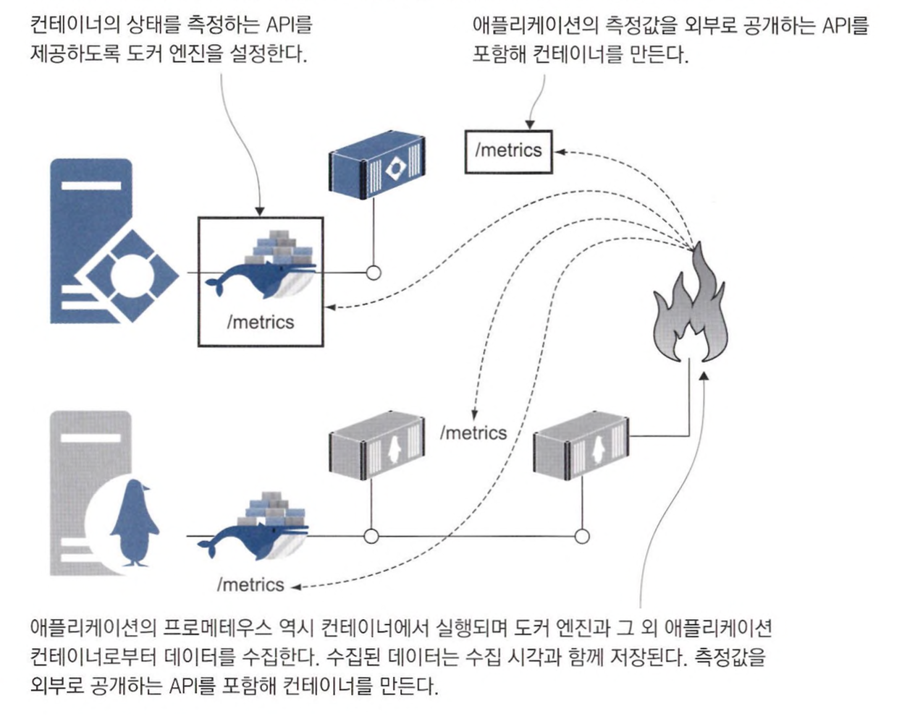

<br>

> 프로메테우스를 사용하면 모니터링의 중요한 측면인 일관성이 확보된다. <br>
> 측정값을 추출하기 위한 쿼리 언어도 한 가지만 익히면 되고. 전체 애플리케이션 스택에 똑같은 모니터링을 적용할 수 있다. <br>
> 또 다른 장점은 도커 엔진의 측정값도 같은 형식으로 추출할 수 있다는 점이다. <br>
> 이를 통해 컨테이너 플랫폼에서 벌어지는 일도 파악할 수 있다.

<br>

도커 엔진의 측정 값을 추출하기 위해 아래 설정을 도커 엔진에 추가

```
"metrics-addr" : "0.0.0.0:9323",
"experimental": true
```

도커 엔진의 상태 측정 기능을 활성화한 후 `http://localhost:9323/metrics`에서 도커 엔진의 상태 정보를 볼 수 있다.

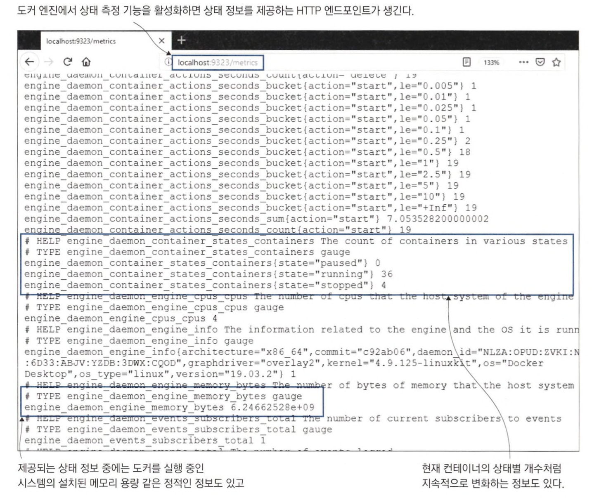

<br>

```
// 로컬 컴퓨터의 ip 주소를 환경변수로 정의
hostIP=$(ifconfig en0 | grep -e 'inet\s' | awk '{print $2}')

docker run -e DOCKER_HOST=$hostIP -d -p 9090:9090 diamol/prometheus:2.13.1
```

프로메테우스가 포함된 diamol/Prometheus 이미지의 설정 중 DOCKER_HOST 환경 변수를 사용해 호스트 컴퓨터와 통신하고 도커 엔진의 상태 측정값을 수집한다. <br>

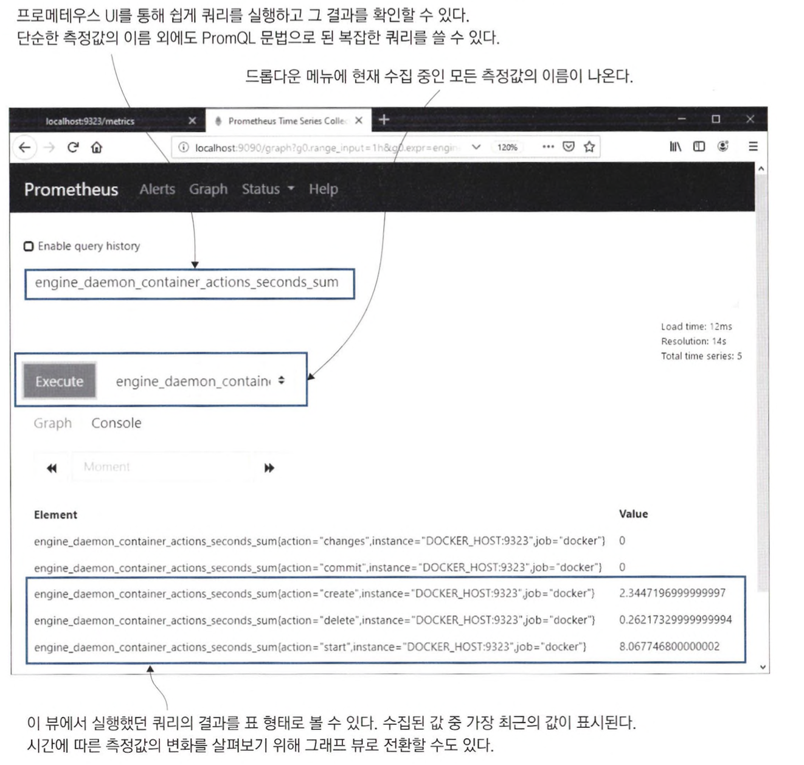

<br>
<hr>

# 애플리케이션의 측정값 출력

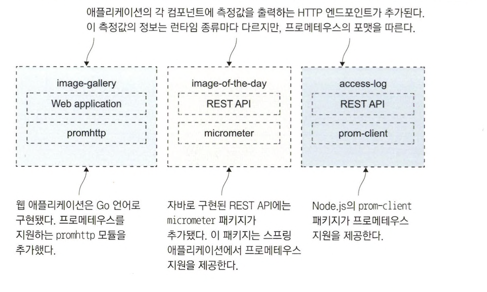

프로메테우스 클라이언트 라이브러리를 통해 수집된 정보는 런타임 수준의 측정값으로, <br>
해당 컨테이너가 처리하는 작업이 무엇이고 이 작업의 부하가 어느 정도인지에 대한 정보가 표현되어 있다.

<br>

```
cd ch09/exercises

docker rm -f $(docker container ls -aq)

docker network create nat

docker-compose up -d
```

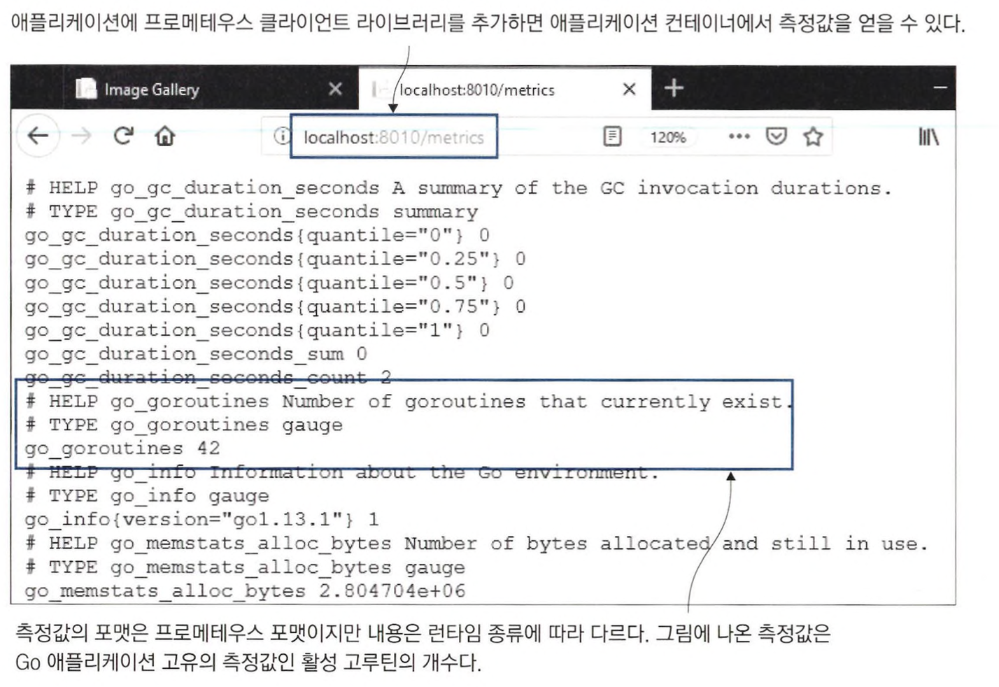

*웹 브라우저에서 http://localhost:8011/actuator/prometheus에 접근하면 이와 비슷한 형태로 자바 REST API의 측정값을 볼 수 있다.*

이러한 런타임 상태 측정값은 도커 엔진에서 얻은 인프라스트럭처 측정값과는 또 다른 수준의 정보를 제공한다. <br>
측정값의 마지막 수준은 애플리케이션에서 우리가 직접 노출시키는 핵심 정보로 구성된 애플리케이션 측정값이다. <br>
애플리케이션 측정값은 컴포넌트가 처리하는 이벤트의 수, 평균 응답 처리 시간처럼 연산 중심의 정보일 수도 있고, <br>
현재 시스템을 사용 중인 활성 사용자 수나 새로운 서비스를 사용하는 사용자 수와 같이 비즈니스 중심의 정보일 수도 있다.

프로메테우스 클라이언트 라이브러리로 이러한 애플리케이션 측정값을 수집할 수 있다. <br>
이런 정보를 수집하기 위해서는 애플리케이션에서 명시적으로 이 정보를 생성하는 코드를 작성해야 한다.

<br>

```
// 반복문을 돌며 HTTP GET 요청을 보냄
for i in {1..5}; do curl http://localhost:8010 > /dev/null; done
```

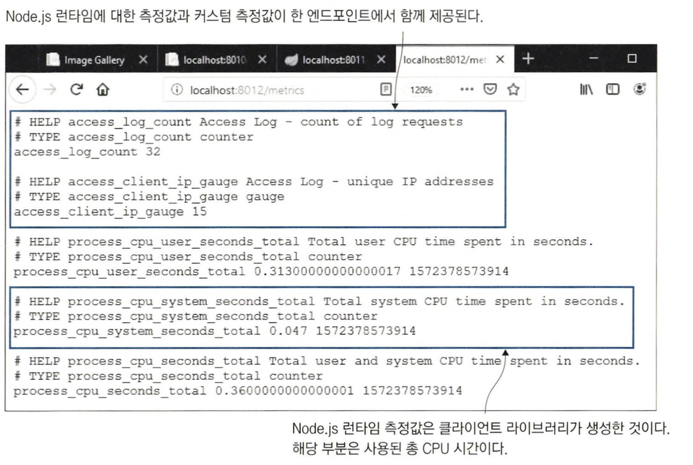

<br>
<hr>

# 측정값 수집을 맡을 프로메테우스 컨테이너 실행

프로메테우스는 직접 측정값을 대상 시스템에서 받아다 수집하는 풀링 방식으로 동작한다. *(스크래핑)* <br>
프로메테우스를 실행하면 스크래핑 대상 엔드포인트를 설정해야 한다.

<br>

```yaml
global:
  scrape_interval: 10s

scrape_configs:
  - job_name: "image-gallery"
    metrics_path: /metrics
    static_configs:
      - targets: ["image-gallery"]

  - job_name: "iotd-api"
    metrics_path: /actuator/prometheus
    static_configs:
      - targets: ["iotd"]

  - job_name: "access-log"
    metrics_path: /metrics
    scrape_interval: 3s
    dns_sd_configs:
      - names:
          - accesslog
        type: A
        port: 80
        
  - job_name: "docker"
    metrics_path: /metrics
    static_configs:
      - targets: ["DOCKER_HOST:9323"]
```

> 전역 설정인 global 항목을 보면 스크래핑 간격이 기본값인 10초로 설정돼있고, 각 컴포넌트마다 스크래핑 작업을 의미하는 job 설정이 정의돼 있다. <br>
> job 설정은 해당 스크래핑 작업의 이름과 측정값을 수집할 엔드포인트. 대상 컨테이너를 지정하는 정보로 구성된다. <br>
> **static_config**는 호스트명으로 단일 컨테이너를 지정한다. <br>
> **dns_sd_config**는 DNS 서비스 디스커버리 기능을 통해 여러 컨테이너를 지정할 수 있고 스케일링에 따라 대상 컨테이너를 자동으로 확대할 수도 있다.

이 설정으로 프로메테우스가 10초마다 한 번씩 모든 컨테이너에서 측정값을 수집한다. <br>
프로메테우스는 DNS의 응답 중에서 가장 앞에 오는 IP 주소를 사용하므로 도커 엔진이 DNS 응답을 통해 로드 밸런싱을 적용한 경우 그 컨테이너 모두에서 측정값을 받아올 수 있다.

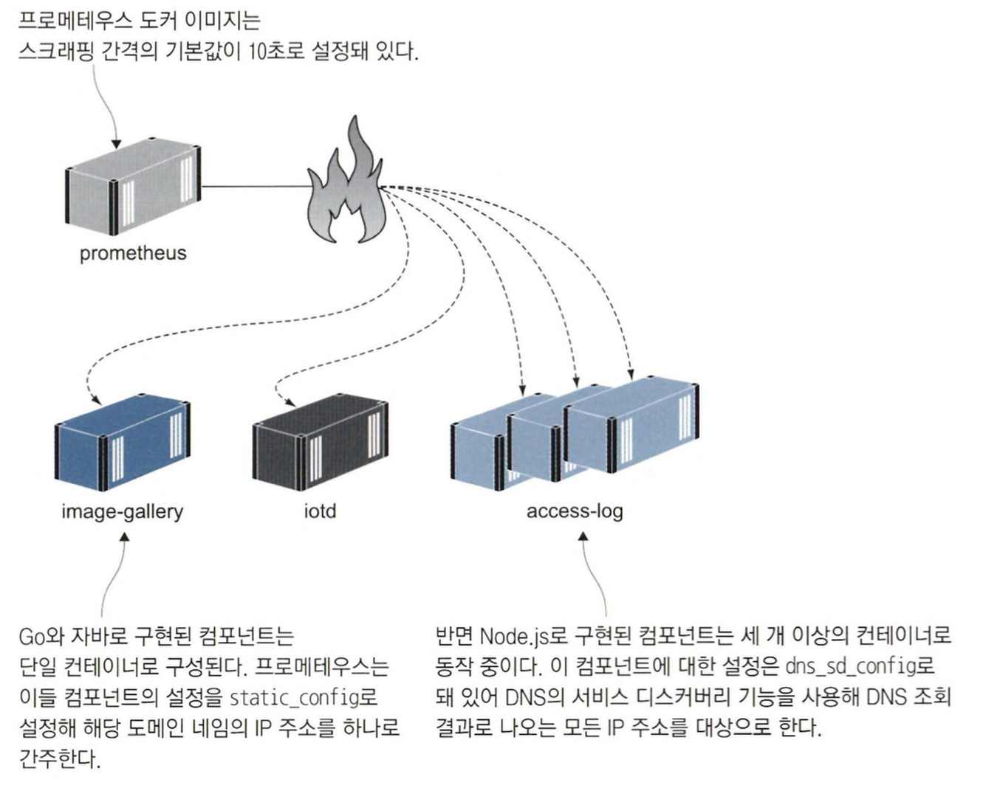

<br>

```
docker-compose -f docker-compose-scale.yml up -d --scale accesslog=3

for i in {1..10}; do curl http://localhost:8010 > /dev/null; done
```

웹 애플리케이션은 요청을 받을 때마다 access-log 서비스를 호출하고, <br>
access-log 서비스는 세 개의 컨테이너가 동작 중이므로 서비스에 대한 요청은 이들 컨테이너에 고르게 분배될 것이다. <br>
로드 밸런싱이 잘 적용되었는지를 확인하기 위해선, 수집된 측정값에 컨테이너의 호스트명 정보를 확인하면 된다.

<br>

`http://localhost:9090/graph`에 접속해 access_log_total을 선택하고 Execute를 클릭 <br>

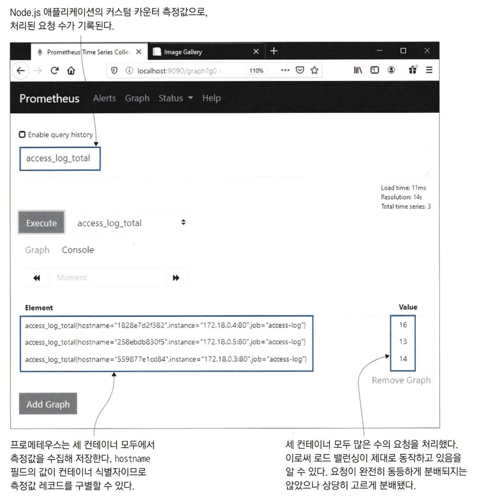

<br>

Add Graph를 클릭 후 `sum(access_log_total) without(hostname, instance)` 쿼리를 입력 <br>

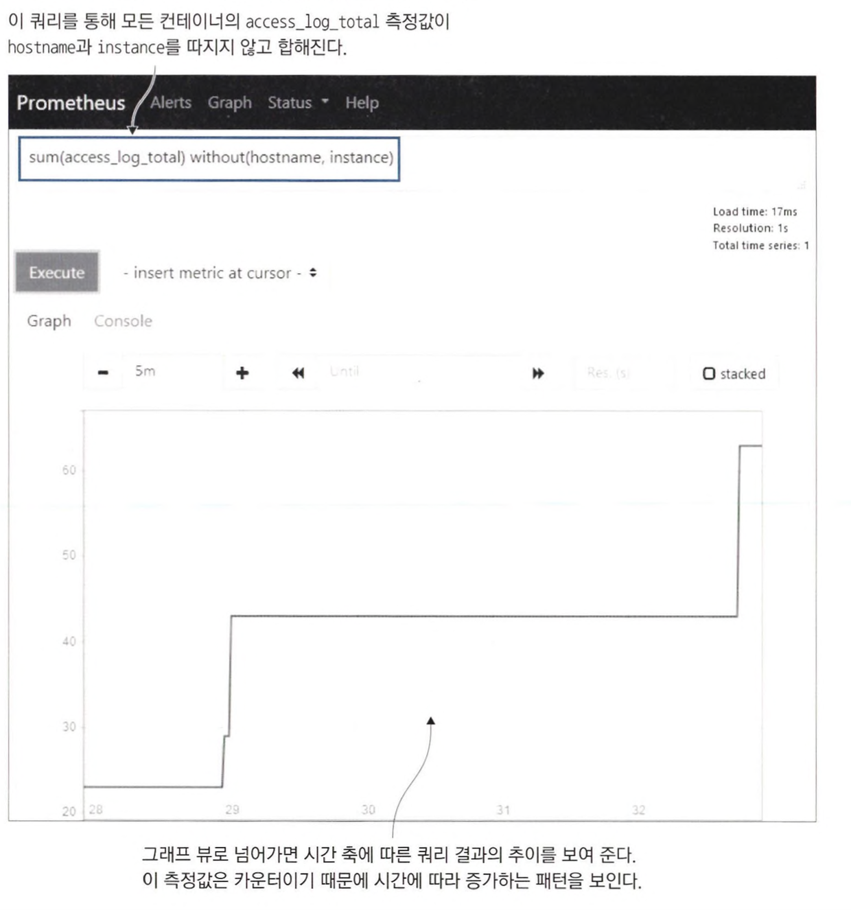

<br>
<hr>

# 측정값 시각화를 위한 그라파나 컨테이너 실행

프로메테우스를 사용해 데이터를 수집했다면, 측정값을 열람하거나 데이터 시각화를 위한 쿼리를 확인하는데는 프로메테우스 웹 UI를 사용하고 <br>
이 쿼리를 연결해 대시보드를 구성하는데는 그라파나를 사용한다.

<br>

```
HOST_IP=$(ifconfig en0 | grep -e 'inet\s' | awk '{print $2}')

docker-compose -f ./docker-compose-with-grafana.yml up -d --scale accesslog=3

for i in {1..20}; do curl http://localhost:8010 > /dev/null; done
```

`http://localhost:3000` 접근

그라파나의 웹 ui는 포트 3000을 사용하며, 사용자명 admin 비밀번호 admin을 입력하여 로그인할 수 있다. <br>

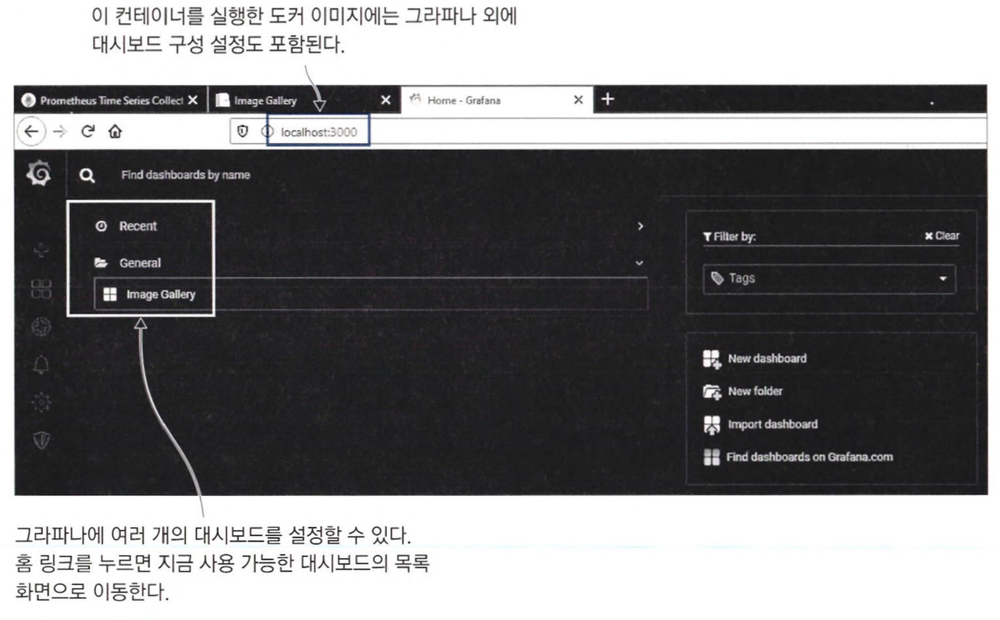

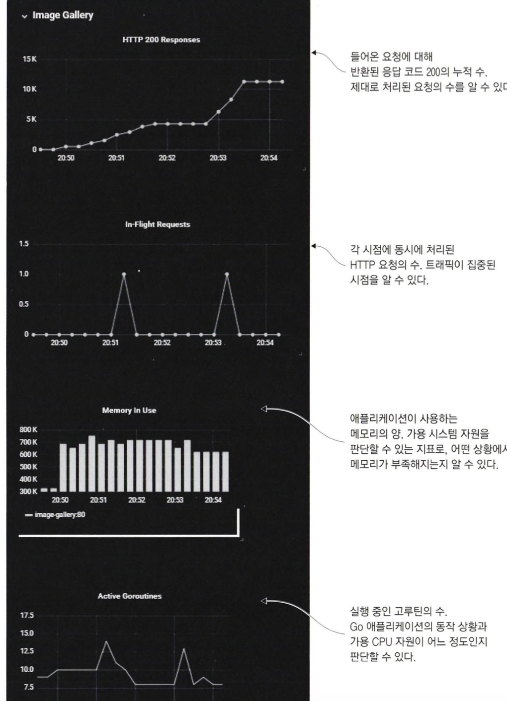

- HTTP 응답 코드 200으로 처리된 응답의 수
  - sum(image_gallery_requests_total{code="200"}) without(instance)
- 현재 처리 중인 요청 수
  - sum(image_gallery_in_flight_requests) without(instance)
- 메모리 사용량
  - go_memstats_stack_inuse_bytes{job="image-gallery"}
- 활성 고루틴 수
  - sum(go_goroutines{job="image_gallery"}) without(instance)


<br>
<hr>

# 투명성의 수준

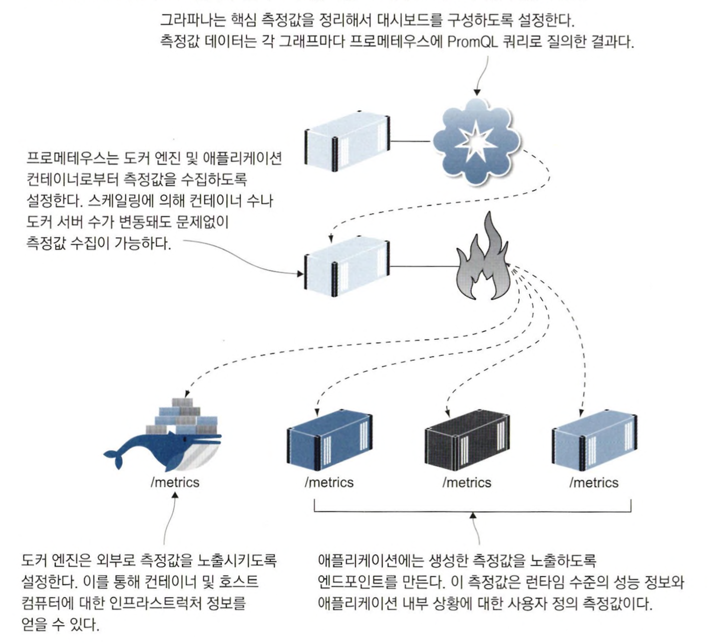

실제 운영 환경 모니터링이라면 이 예시보다 더 자세한 상황을 알려 주는 대시보드가 필요하다. <br>
디스크 용량. CPU, 메모리, 네트워크 자원 등 모든 서버의 상황을 보여 주는 인프라스트럭처 대시보드도 생각해 볼 수 있다. <br>
**측정값 중에서 애플리케이션에 중요한 데이터를 모아 하나의 화면으로 구성할 수 있어야 한다.**

<br>
<hr>

# 연습 문제

```yaml
version: "3.7"

services:
  todo-list:
    image: diamol/ch09-todo-list
    ports:
      - "8080:80"
    networks:
      - app-net

  prometheus:
    image: diamol/ch09-lab-prometheus
    ports:
      - "9090:9090"
    networks:
      - app-net

  grafana:
    image: diamol/ch09-lab-grafana
    ports:
      - "3000:3000"
    depends_on:
      - prometheus
    networks:
      - app-net

networks:
  app-net:
    external:
      name: nat
```


