# 컨테이너 모니터링으로 투명성 있는 애플리케이션 만들기

### 모니터링과 투명성

애플리케이션의 자동 스케일링 기능은 애플리케이션에 들어오는 트래픽 부하에 맞춰 자신의 규모를 조절하며, 간할적인 오류에 대응해 스스로를 복원할 수 있습니다.

하지만 그렇다 하더라도 만약을 위해 지속적인 애플리케이션과 이상이 발생했을 때 통보하는 기능이 필요합니다.

컨테이너에서 실행하는 애플리케이션에 있어 투명성은 매우 중요한 요소입니다.

투명성을 확보하지 못하면 애플리케이션이 뭘하고 있는지 또는 어떤 상태에 있는지, 문제가 있다면 어떤 부분이 원인인지 조차 알 수 없습니다.

## 컨테이너화된 애플리케이션에서 사용되는 모니터링 기술 스택

### 컨테이너 환경에서의 모니터링

컨테이너 환경 이전의 전통적인 애플리케이션 모니터링이라고 하면 다음과 같은 형태가 대표적이었습니다.

- 서버의 목록
- 현재 동작 상태(잔여 디스크 공간, 메모리와 CPU 사용량 등)가 표시된 대시보드
- 과부하가 걸리거나 응답하지 않는 서버가 발생하면 경보가 울리는 형태

이에 비해 컨테이너화된 애플리케이션의 환경은 훨씬 역동적입니다.

애플리케이션은 수십 개에서 수백 개에 이르는 컨테이너에 걸쳐 실행되고 컨테이너는 플랫폼에 의해 끊임없이 생성됐다가 삭제되기를 반복합니다.

### 프로메테우스

컨테이너 환경에서 모니터링을 하기 위해서는 `컨테이너를 다룰 수 있고 컨테이너 플랫폼과 연동해 정적인 컨테이너 혹은 IP 주소 목록 없이도 실행 중인 애플리케이션을 속속들이 들여다 볼 수 있는 도구를 갖춘 새로운 모니터링 방식`이 필요합니다.

프로메테우스는 이런 역할이 가능한 오픈 소스 도구입니다.

프로메테우스는 CNCF에서 개발을 담당하며 다양한 곳에서 널리 사용되고 있습니다.

프로메테우스 역시 컨테이너에서 동작하기 때문에 분산 애플리케이션에 어렵지 않게 모니터링을 추가할 수 있습니다.

다음은 프로메테우스를 사용한 모니터링 기술 스택을 나타낸 것 입니다.

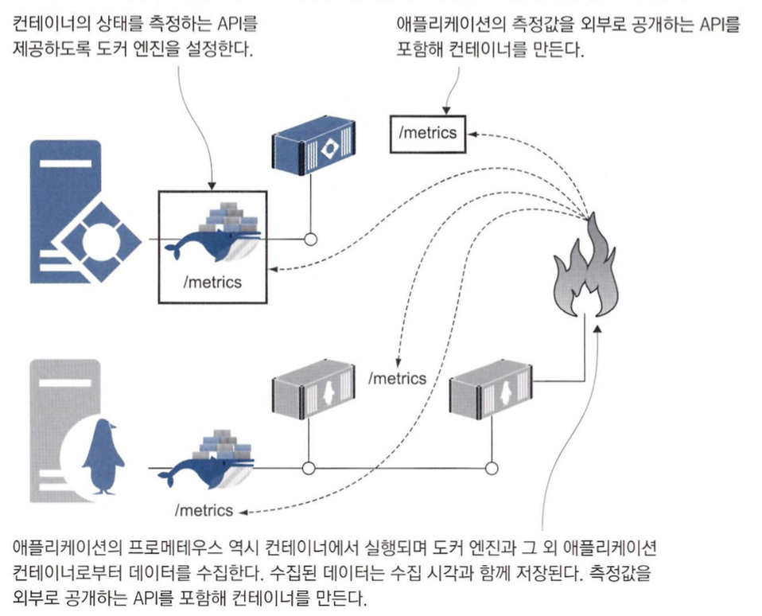

### 프로메테우스를 통해 모니터링의 일관성 확보

프로메테우스를 사용하면 모니터링의 중요한 측면이 일관성을 확보할 수 있습니다.

모든 애플리케이션에서 똑같이 측정값을 내놓기 때문에 언어나 프레임워크와 상관 없이 표준적인 형태로 모니터링할 수 있습니다.

측정 값을 추출하기 위한 쿼리 언어도(PromQL) 하나만 익히면 되고, 전체 애플리케이션 스택에 똑같은 모니터링을 적용할 수 있습니다.

### 프로메테우스를 통해 도커 엔진의 측정 값 추출하기

프로메테우스의 또 다른 장점은 도커 엔진의 측정 값도 같은 형식으로 추출할 수 있습니다.

이를 통해 컨테이너 플랫폼에 벌어지는 일도 파악할 수 있습니다.

이 기능을 사용하기 위해서는 도커 데스크톱에서 다음과 같은 값을 추가하면 됩니다.

```json
"metrics-addr": "0.0.0.0:9323",
"experimental": true  
```

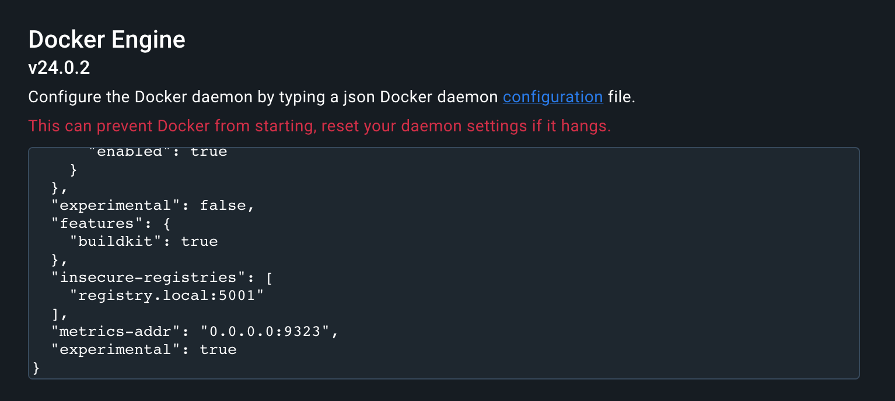

도커 엔진의 상태 측정 기능을 활성화 했다면 http://localhost:9323/metrics 에서 도커 엔진의 상태 정보를 볼 수 있습니다.

지금 본 상태 정보 출력 포맷이 프로메테우스 포맷입니다.

측정된 각 상태 정보가 이름과 값의 쌍 형태로 표현되는 간단한 텍스트 기반 포맷으로 되어 있습니다.

그리고 이름-값 쌍 앞에는 해당 정보가 어떤 정보인지, 값의 데이터 타입은 무엇인지에 대해 간단한 안내 설명이 붙습니다.

이 텍스트 정보가 컨테이너 모니터링의 핵심입니다.

정보 항목마다 별도의 엔드포인트를 통해 실시간으로 값을 제공합니다.

프로메테우스는 이 값을 수집하면서 타임스탬프 값을 덧 붙여 저장하므로 저장된 값을 정리해 시간에 따른 값의 변화를 추적할 수 있습니다.

이제 다음과 같이 프로메테우스를 컨테이너에서 실행해 현재 도커를 실행 중인 컴퓨터의 정보를 수집해봅시다.

```bash
# 로컬 컴퓨터의 IP 주소 확인필요

docker container run -e DOCKER_HOST={로컬 컴퓨터 IP} -d -p 9090:9090 diamol/prometheus:2.13.1
```

위의 이미지는 DOCKER_HOST 환경 변수를 사용해 호스트 컴퓨터와 통신하고 도커 엔진의 측정 값을 수집하게 됩니다.

웹 인터페이스 메뉴의 Status → Target 항목에서 원하는 대상이 정상적으로 연결되었는지 확인할 수 있습니다.

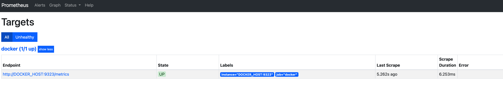

프로메테우스의 웹 인터페이스를 통하면 어떤 정보가 수집됐는지 일목요연하게 볼 수도 있고, 간단한 쿼리를 사용할 수도 있습니다.

이들 정보는 각 상태별 컨테이너 수나 실패한 체크 횟수 같은 고수준 정보부터 도커 엔진이 점유 중인 메모리 용량 같은 저수준 정보까지 다양합니다.

## 애플리케이션의 측정값 출력하기

### 애플리케이션 메트릭 수집하기

다양한 애플리케이션의 메트릭을 수집하기 위해 다음과 같이 프로메테우스 클라이언트 라이브러리를 사용하여 측정값을 출력하고 수집해봅시다.

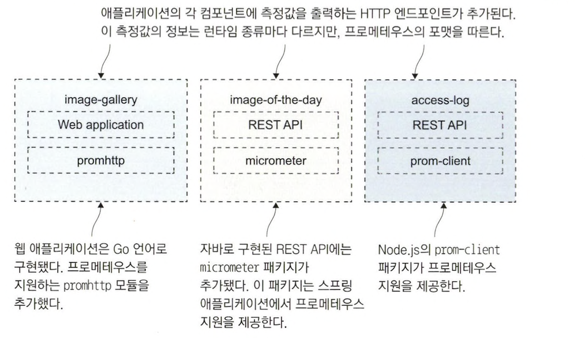

<aside>
💡 프로메테우스 클라이언트 라이브러리를 통해 수집된 정보는 런타임 수준의 측정 값으로 `해당 컨테이너가 처리하는 작업이 무엇이고 이 작업의 부하가 어느정도인지에 대한 정보가 런타임의 관점에서 표현`되어 있습니다.

</aside>

이제 다음 애플리케이션을 실행해 메트릭을 수집해봅시다.

```yaml
version: "3.7"

services:
  accesslog:
    image: diamol/ch09-access-log
    ports:
      - "8012:80"
    networks:
      - app-net

  iotd:
    image: diamol/ch09-image-of-the-day
    ports:
      - "8011:80"
    networks:
      - app-net

  image-gallery:
    image: diamol/ch09-image-gallery
    ports:
      - "8010:80"
    depends_on:
      - accesslog
      - iotd
    networks:
      - app-net

networks:
  app-net:
    external:
      name: nat
```

다음 경로에 접근해보면 메트릭이 잘 수집되는 것을 확인할 수 있습니다.

- http://localhost:8011/actuator/prometheus
- http://localhost:8010/metrics

수집하는 애플리케이션 측정 값들은 단순히 인프라스트럭쳐 측정값과는 다른 다음과 같은 정보들을 제공해줍니다.

- 컴포넌트가 처리하는 이벤트의 수
- 평균 응답 처리 시간
- 현재 시스템을 사용 중인 활성 사용자 수
- 새로운 서비스를 사용하는 사용자 수

그리고 이러한 메트릭을 직접 선언하여 애플리케이션에서 생성하여 전달할 수 있습니다.

### 애플리케이션에서 어떠한 값을 수집할지

어떤 값을 수집할지는 어떤 애플리케이션이냐에 따라 달라집니다.

다음은 어떤 값을 수집할 때 참고할만한 기준입니다.

- 외부 시스템과의 통신에 걸린 시간과 성공적으로 응답을 받았는지 여부에 대한 기록
    - 이 측정 값으로 외부 시스템이 애플리케이션의 속도나 이상 사앹에 영향을 줬는지 알 수 있습니다.
- 로그로 남길 가치가 있는 모든 정보
    - 로그로 남기는 것보다는 측정 값으로 수집하는 편이 메모리, 디스크 용량, CPU 시간 면에서 저렴하고 추세를 볼 수 있도록 시각화하기도 쉽습니다.
- 사업 부서에서 필요로 하는 애플리케이션의 상태 및 사용자 행동에 관한 모든 정보
    - 측정값을 활용하면 과거 정보를 수고를 들여 보고하는 대신 실시간 정보로 대시보드를 구성할 수 있습니다.

## 측정 값 수집을 맡은 프로메테우스 컨테이너 실행하기

### 스크래핑

프로메테우스는 직접 측정값을 대상 시스템에서 받아다 수집하는 풀링 방식으로 동작합니다.

프로메테우스에서는 측정 값을 수집하는 과정을 스크래핑이라고 합니다.

프로메테우스를 실행하면 스크래핑 대상 엔드포인트를 설정해야 합니다.

다음은 애플리케이션의 측정 값을 스크래핑하기 위한 설정입니다.

```yaml
# 전역설정
global:
	# 스크래핑 10초마다 실행
  scrape_interval: 10s

# 스크래핑 설정
scrape_configs:
  - job_name: "image-gallery" # job 이름
    metrics_path: /metrics # 메트릭 경로
    static_configs: # 호스트명으로 단일 컨테이너 지정
      - targets: ["image-gallery"]

  - job_name: "iotd-api"
    metrics_path: /actuator/prometheus
    static_configs:
      - targets: ["iotd"]

  - job_name: "access-log"
    metrics_path: /metrics
    scrape_interval: 3s
    dns_sd_configs: # DNS 디스커버리 기능을 통해 여러 컨테이너를 지정
      - names:
          - accesslog
        type: A
        port: 80
```

위의 설정을 요약하면 다음과 같습니다.

- 프로메테우스가 10초마다 한 번씩 모든 컨테이너에서 메트릭을 수집한다.
- image-gallery, iotd-api는 단일 컨테이너를 대상으로 수집합니다.
    - 스케일링 적용시 의도치 않은 동작을 보일 수 있습니다.
- accesslog는 DNS 디스커버리 기능을 통해 여러 컨테이너에서 메트릭을 수집합니다.

다음은 스크래핑이 일어나는 과정을 나타낸 그림입니다.

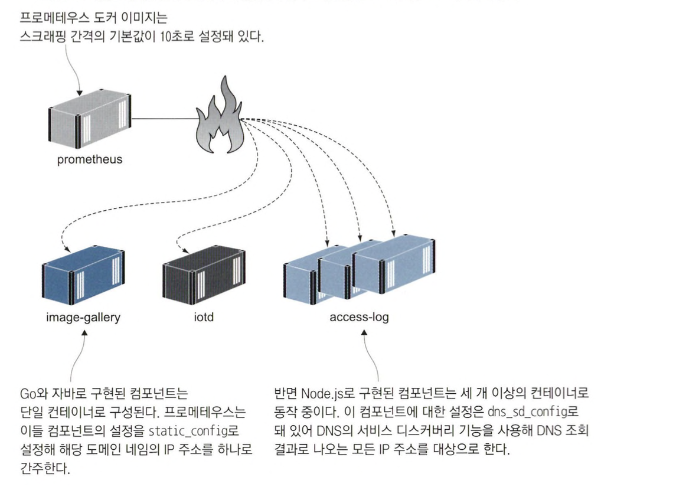

### 컨테이너 스케일링 후 요청해보기

컨테이너를 스케일링해 컨테이너의 수를 증가시키면 프로메테우스가 모든 컨테이너에서 측정값을 수집하게 됩니다.

```bash
docker-compose up -d --scale accesslog=3

for i in {1..10}; do curl http://localhost:8010 > /dev/null; done
```

웹 애플리케이션은 요청을 받을 때마다 access-log 서비스를 호출하고 access-log 서비스는 세 개의 컨테이너가 동작 중이므로 서비스에 대한 요청은 이들 컨테이너에 고르게 분배될 것 입니다.

프로메테우스에 들어가서 측정값을 살펴보면 다음과 같이 로드밸런싱이 잘 된 것을 확인할 수 있습니다.

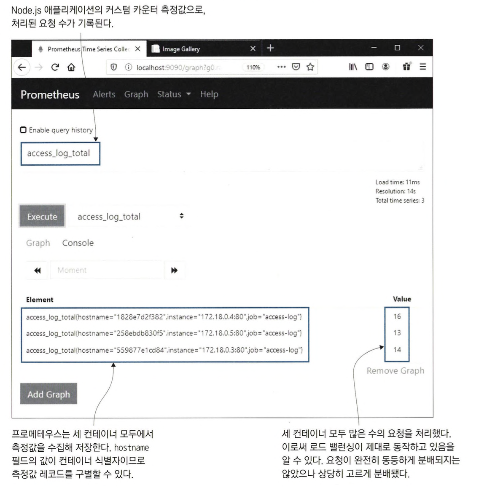

### 쿼리를 사용해 값을 그래프로 표현하기

프로메테우스 웹 UI에서 Add Graph 버튼을 클릭하면 새로운 쿼리로 그래프를 추가할 수 있습니다.

텍스트박스에 다음과 같이 쿼리를 입력해봅시다.

```bash
sum(access_log_total) without(hostname, instance)
```

이어서 Excute 버튼을 누르면 다음과 같이 시간에 따른 요청 수를 그래프로 확인할 수 있습니다.

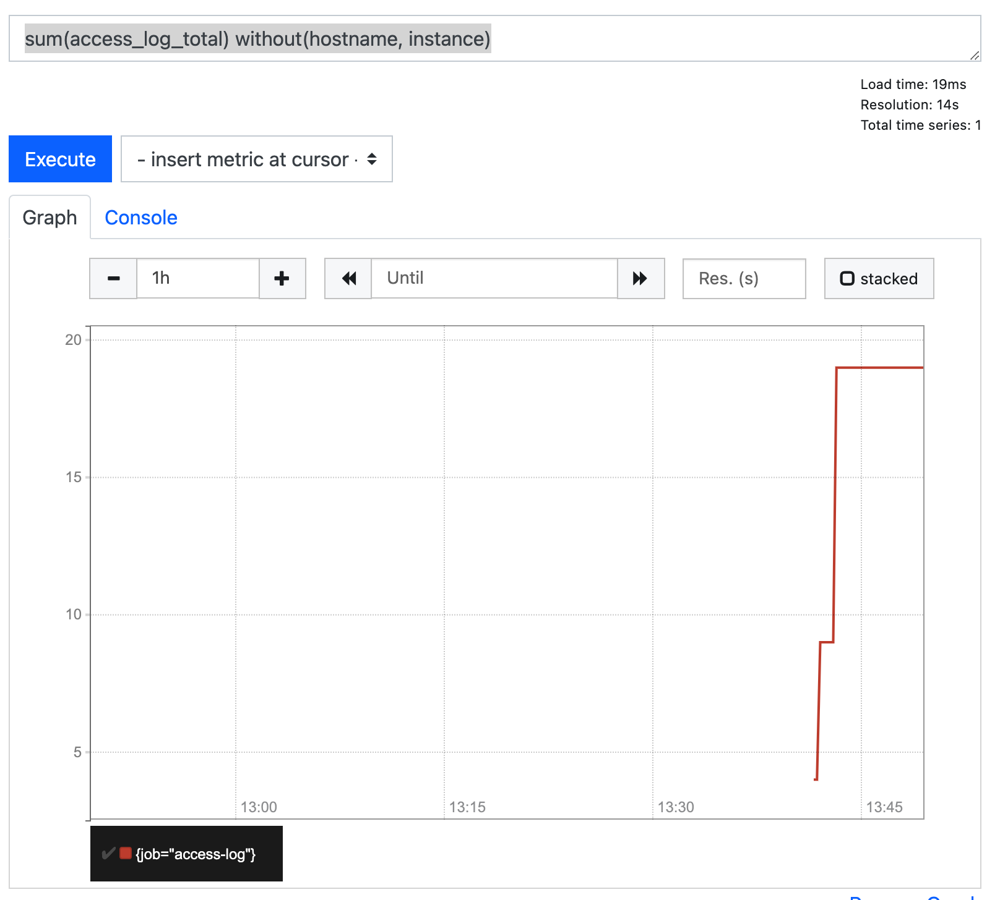
### PromQL

sum() 쿼리는 프로메테우스에서 쓰이는 쿼리 언어인 PromQL로 구현돼 있습니다.

PromQL은 쿼리 값의 시간에 따른 추이 또는 변화율을 확인하거나 측정값 간의 상관관계를 보여 주는 여러 통계 함수를 갖추고 있습니다.

하지만 유용한 대시보드를 꾸리는 데 꼭 이런 기능까지 필요하지는 않습니다.

프로메테우스 포맷은 구조화가 잘 돼 있기 때문에 간단한 쿼리로도 핵심 측정 값을 쉽게 시각화할 수 있습니다.

레이블을 이용한 필터를 적용하거나 합을 구하는 등의 기본적인 기능만으로 쓸 만한 대시보드를 작성할 수 있습니다.

예를 들어 다음과 같은 쿼리를 통해 간단한 대시보드를 구성할 수 있습니다.

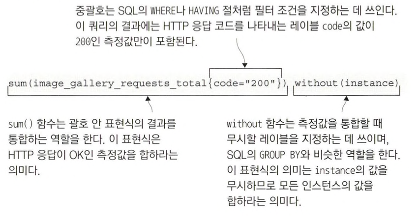
하지만 대시보드로 사용하기에는 부족하며 제대로 된 대시보드를 만들기 위해서는 그라파나(Grafana)를 사용하는 것이 좋습니다.

## 측정값 시각화를 위한 그라파나 컨테이너 실행하기

### 데이터 시각화하기

프로메테우스를 통해 필요한 데이터를 수집했다면 측정값을 열람하거나 데이터 시각화를 위한 쿼리를 확인하고 손보는 데는 프로메테우스 웹 UI를 사용할 수 있습니다.

그리고 확인한 쿼리를 연결하여 대시보드를 구성하기 위해 그라파나를 사용할 수 있습니다.

각 데이터들을 이해하기 쉽게 시각화하고 대시보드로 애플리케이션 상황을 쉽게 파악할 수 있습니다.

다음은 그라파나로 구성한 대시보드 예시입니다.
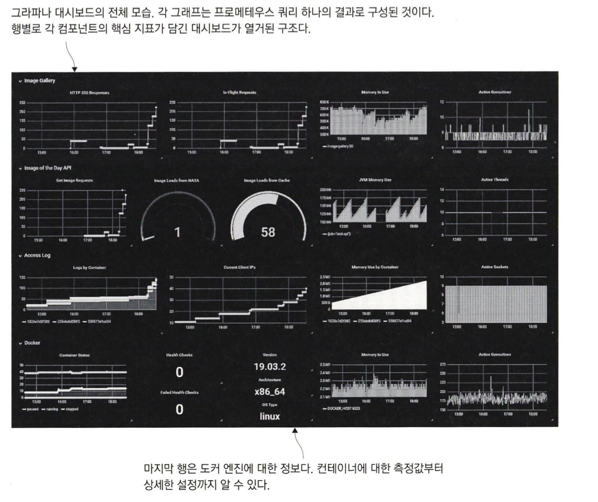

```bash
# monitoring-with-grafana 디렉터리로 이동
docker-compose up -d --scale accesslog=3

# 요청 보내기
for i in {1..20}; do curl http://localhost:8010 > /dev/null; done

# 대시보드 확인 (http://localhost:3000)
```

### 그라파나 대시보드 항목 확인

다음은 확인할 수 있는 대시보드 모습입니다.

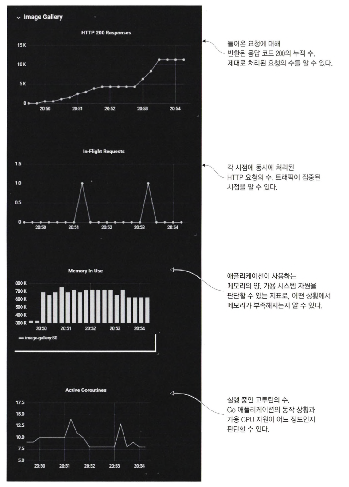

이 대시보드에는 애플리케이션의 부하가 얼마나 되는지, 이를 감당하기 위한 시스템의 부하는 어느 정도인지 판단할 수 있는 다음 네 가지 측정값이 쓰였습니다.

- HTTP 응답 코드 200으로 처리된 응답의 수
  - 이 값은 요청에 대해 HTTP 200 응답을 보낸 누적 개수입니다.
  - 이 값을 계산하기 위해 카운터 측정값을 누적 계산하는 다음과 같은 PromQL 쿼리가 쓰였습니다.

      ```bash
      sum(image_gallery_requests_total{code="200"}) without(instance)
      ```

      <aside>
      💡 필터링 조건을 바꿔 code = “500”을 사용하면 서버 오류의 누적 개수가 됩니다.

      </aside>

- 현재 처리 중인 요청 수
  - 이 값은 해당 시점에 처리 중인 요청의 수입니다.
  - 게이지 측정값이므로 증가와 감소가 가능하며 필터링 조건 없이 전체 컨테이너의 측정값을 합산합니다.
  - 이 값을 계산하기 위해 카운터 측정값을 누적 계산하는 다음과 같은 PromQL 쿼리가 쓰였습니다.

      ```bash
      sum(image_gallery_in_flight_requests) without(instance)
      ```

- 메모리 사용량
  - 이 값은 애플리케이션의 컨테이너가 현재 사용중인 메모리 사용량입니다.
  - 메모리 사용량에서 잡 이름에 필터링 조건을 걸어 다음과 같은 쿼리를 사용합니다.

      ```bash
      go_memstats_stack_inuse_bytes{job="image-gallery"}
      ```

- 활성 고루틴 수
  - 해당 컴포넌트의 부하를 나타내는 대략적인 지표입니다.
  - 잡 이름에 필터링 조건을 걸어 수집합니다.

      ```bash
      sum(go_gorutines{job="image_gallery"}) without(instance)
      ```


## 투명성의 수준

### 컨테이너 모니터링의 개요

컨테이너 기술 초기의 모니터링은 정말 골치 아픈 문제였습니다.

예전에는 핑덤같은 외부 서비스로 API 동작 상태를 확인하거나 사용자 리포팅에 의존하는 수 밖에 없었습니다.

오늘날의 컨테이너 모니터링은 이미 시행착오를 거친 신뢰성 있는 수단을 사용합니다.

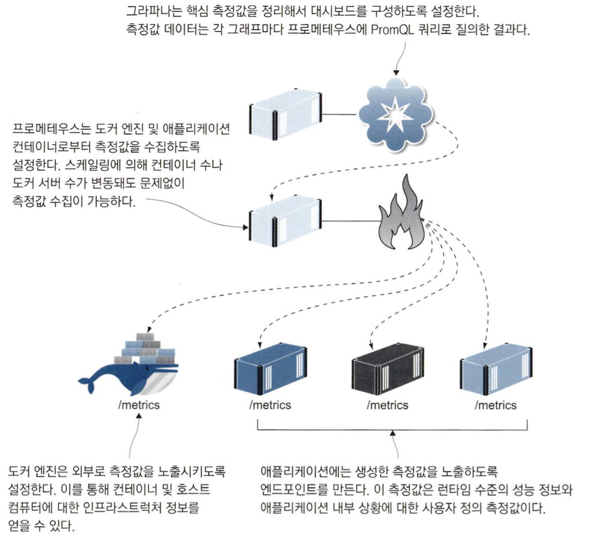

### 실제 운영환경에서의 모니터링

예제에서는 하나의 대시보드만을 만들었지만 실제 운영환경에서는 더 자세한 환경을 알려주는 대시보드가 필요합니다.

예를 들어 가용한 디스크 용량, CPU, 메모리, 네트워크 자원 등 모든 서버의 상황을 보여주는 인프라스트럭처 대시보드도 생각해볼 수 있습니다.

애플리케이션을 구성하는 각 컴포넌트도 자신만의 추가적인 정보를 모니터링하는 대시보드를 따로 가질 수 있습니다.

이를테면 웹 애플리케이션의 페이지 별 혹은 API 엔드포인트별로 응답 시간을 분류해 본다거나 하는 것이 가능합니다.

가장 중요한 것은 애플리케이션의 전체 상황을 조망하는 대시보드입니다.

측정값 중에서 가장 애플리케이션에 중요한 데이터를 모아 하나의 화면으로 구성할 수 있어야 합니다.

그래야만 한눈에 이상 상황을 파악하고 사태가 악화되기 전에 과감한 조치를 취할 수 있습니다.