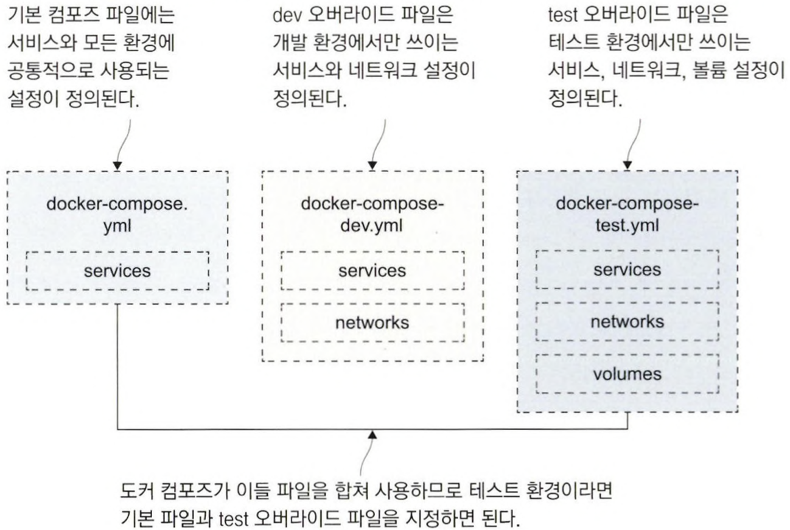

# 10장 도커 컴포즈를 이용한 여러 환경 구성

## 10.1 도커 컴포즈로 여러 개의 애플리케이션 배포하기

조직에서는 같은 애플리케이션을 버전을 달리해 서로 다른 환경에서 구동해야 하는 경우가 있다. 여러 환경을 구성해 용도별로 사용하려면, 환경마다 애플리케이션이 다르게 동작하게끔 해야 한다. 서버에 있는 같은 파일을 여러 컨테이너가 쓰려고 해서는 안 된다. 이런 것이 가능하려면 도커 컴포즈 파일에서 이런 기능을 지원해야 한다. 그 전에 먼저 도커 컴포즈가 어떤 도커 리소스가 애플리케이션의 일부인지 아닌지 판단하는 원리를 먼저 고려해야 하는데, 그 기준은 레이블 명명 규칙을 따른다.

### 도커 컴포즈 리소스 이름 규칙

도커 컴포즈는 도커 리소스가 어떤 애플리케이션의 일부인지 아닌지를 판정하기 위해 `프로젝트`라는 개념을 사용한다. 도커 컴포즈가 도커 리소스를 만들 때 이 프로젝트 이름을 리소스의 이름에 접두사로 붙이고, 컨테이너 이름에는 번호를 접미사로 붙인다.

- 디렉터리명 : app1
- 컴포즈 파일에 정의된 서비스 : web
- 볼륨 : disk

⇒ 볼륨 이름 : app1_disk / 컨테이너 이름 : app1_web

### 프로젝트 이름 변경해 같은 애플리케이션 실행

컴포즈가 사용하는 프로젝트 이름의 기본값을 바꿀 수 있으므로 이 프로젝트 이름을 바꾸는 방법으로 단일 도커 호스트에 같은 애플리케이션을 여러 벌 실행시킬 수 있다.

```bash
# 프로젝트 이름을 새로 지정한다.
☁  exercises [main] ⚡  docker-compose -f ./todo-list/docker-compose.yml -p todo-test up -d
Creating network "todo-test_app-net" with the default driver
Creating todo-test_todo-web_1 ... done

☁  exercises [main] ⚡  docker container port todo-test_todo-web_1 80
0.0.0.0:50182
```

무작위로 정해진 공개 포트를 일일이 찾아야하는 것은 바람직한 일이 아니다. 컴포즈 파일을 복사해 필요한 부분만 수정하는 방법도 가능하겠지만, 컴포즈가 제공하는 기능 중 더 좋은 방법이 있다. 설정을 오버라이드하는 것이다.

---

## 10.2 도커 컴포즈의 오버라이드 파일

하나의 애플리케이션을 여러 설정으로 실행해야 할 필요가 생긴 경우 대부분은 컴포즈 파일을 여러 개 두는 방법을 쓴다.

그러나 이 방법은 `유지 보수 측면` 에서 바람직하지 않다. `오버라이드 파일`은 이런 문제를 해결하는 기능이다.

도커 컴포즈는 여러 파일을 합쳐 컴포즈 파일을 구성하는데, 나중에 지정된 파일의 내용이 이전 파일의 내용을 오버라이드, 즉 덮어 쓰기한다.

1. 기본적인 애플리케이션 구조와 모든 환경에서 공통으로 쓰이는 속성이 정의된 `docker-compose.yml` 파일이 있다.
2. 환경별로 작성된 오버라이드 파일이 해당 환경에서 달라진 속성을 정의한다.
    - 이들 파일의 내용은 기본 파일과 중복되지 않는다.



📌 속성 하나를 변경하는 도커 컴포즈 오버라이드 파일

```bash
# docker-compose.yml - 기본 파일
services:
	todo-web:
		image: diamol/ch06-todo-list
		ports:
			- 80
		environmnet:
			- Database:Provider=Sqlite
		networks:
			- app-net

# docker-compose-v2.yml - 오버라이드 파일
services:
	todo-web:
		image: diamol/ch06-todo-list:v2
```

✅ 기본 컴포즈 파일의 구조를 유지해야 도커 컴포즈가 두 정의를 연결 지을 수 있다.

✅ 도커 컴포즈는 하나 이상의 파일이 인자로 지정됐을 때 이들 파일을 병합한다.

✅ config 부명령을 이용해 입력 파일의 내용을 검증해 내용이 유효한 경우에만 최종 출력을 확인한다.

📌 도커 컴포즈를 사용해 파일을 병합한 결과를 출력한다.

```bash
$ docker-compose -f ./todo-list/docker-compose.yml. -f ./todo-list/docker-compose-v2.yml config
networks:
  app-net: {}
services:
  todo-web:
    environment:
      Database:Provider: Sqlite
    image: diamol/ch06-todo-list:v2
    networks:
      app-net: {}
    ports:
    - target: 80
version: '3.7'
```

✅ 도커 컴포즈가 오버라이드 파일을 병합하는 순서는 인자로 받은 순서를 따른다.

- 인자로 지정된 순서가 먼저인 파일이 순서가 나중인 파일보다 우선한다.

📌 기본 컴포즈 파일을 변경하기 위한 오버라이드 파일의 예

이 파일에 정의된 속성값은 기본 컴포즈 파일에 병합돼 속성을 추가하거나 기존 속성 값을 변경하는 역할을 한다.

```bash
services:
	numbers-api:
		ports:
			- "8087:80"
		healthcheck:
			disable: true

	numbers-web:
		entrypoint:
			- dotnet
			- Numbers.Web.dll
		ports:
			- "8088:80"

networks:
	app-net:
		name: numbers-dev
```

```bash
$ docker-compose -f ./numbers/docker-compose.yml -f ./numbers/docker-compose-dev.yml -p number-dev up -d
$ docker-compose -f ./numbers/docker-compose.yml -f ./numbers/docker-compose-test.yml -p number-test up -d
$ docker-compose -f ./numbers/docker-compose.yml -f ./numbers/docker-compose-uat.yml -p number-uat up -d

☁  exercises [main] ⚡  docker ps  
CONTAINER ID   IMAGE                        COMMAND                  CREATED          STATUS                     PORTS                                   NAMES
57d739a57357   diamol/ch08-numbers-web:v3   "/bin/sh -c 'dotnet …"   4 minutes ago    Up 4 minutes               0.0.0.0:80->80/tcp, :::80->80/tcp       number-uat_numbers-web_1
cf57c5b80833   diamol/ch08-numbers-api:v3   "dotnet Numbers.Api.…"   4 minutes ago    Up 4 minutes (unhealthy)   0.0.0.0:8090->80/tcp, :::8090->80/tcp   number-uat_numbers-api_1
c31992157ea1   diamol/ch08-numbers-web:v3   "/bin/sh -c 'dotnet …"   4 minutes ago    Up 4 minutes (healthy)     0.0.0.0:8080->80/tcp, :::8080->80/tcp   number-test_numbers-web_1
```

환경별로 실행된 컨테이너는 도메인 네임을 사용해 서로를 식별하지만, 같은 도커 네트워크에 접속한 컨테이너끼리만 통신이 가능하다.

📌 테스트 환경의 애플리케이션을 제거한다.

프로젝트의 이름을 기본값에서 변경했으니 애플리케이션을 종료할 때도 다시 프로젝트 이름을 정확하게 지정해야 한다.

```bash
$ docker-compose -f ./numbers/docker-compose.yml -f ./numbers/docker-compose-test.yml -p numbers-test down
```

오버라이드 파일을 사용하면 애플리케이션 정의를 재사용할 수 있지만 그만큼 오버라이드 관리에 드는 오버헤드도 발생한다. 따라서 애플리케이션 배포 및 폐기 스크립트의 작서오가 자동화를 익혀 두기 바란다.

---

## 10.3 환경 변수와 비밀값을 이용해 설정 주입하기

오버라이드 파일을 사용해 환경별로 다른 설정값을 적용한다. 이 파일에는 웹 애플리케이션의 기본적인 정보와 비밀값 형태로 설정 파일을 지정했다.

📌 웹 서비스와 비밀값이 정의된 컴포즈 파일

```bash
 개services:
	todo-web:
		image: diamol/ch06-todo-list
		secrets:
			- source: todo-db-connection
				target: /app/config/secrets.json
```

- source : 컨테이너 런타임이 비밀값의 값을 읽어 오는 곳
- target: 컨테이너 안에서 비밀값이 위치할 경로

✅ 이 파일은 스크립트에서 사용된 `todo-db-connection` 비밀 값이 해당 파일에 정의돼있지 않기 때문에 단독으로 사용하면 유효하지 않다. 다음은 개발 환경을 위한 추가 설정과 비밀 값을 정의한다.

📌 개발 환경만을 위한 추가 설정과 비밀값이 정의된 오버라이드 파일

```bash
services:
	todo-web:
		ports:
			- 8089:80
		environment:
			- Database:Provider=Sqlite
		env_file:
			- ./config/logging.debug.env

secrets:
	todo-db-connection:
		file: ./config/empty.json	
```

- environment 프로퍼티
    - 컨테이너 안에서만 사용되는 환경 변수를 추가한다.
- env_file 프로퍼티
    - 텍스트 파일의 경로를 값으로 받는다.
    - 이 파일에 정의된 환경 변수가 컨테이너에 적용된다.
    - 텍스트 파일에 변수 이름과 값을 등호로 구분해 한 줄에 하나씩 정의한다.
- secrets 프로퍼티
    - 컴포즈 파일의 최상위 프로퍼티
    - todo-db-connection의 실제 값 혹은 경로가 정의된다.
    

```bash
# 오버라이드 파일을 적용해 애플리케이션 실행하기
☁  exercises [main] ⚡  docker-compose -f ./todo-list-configured/docker-compose.yml -f ./todo-list-configured/docker-compose-dev.yml -p todo-dev up -d
Creating network "todo-dev_default" with the default driver
Creating todo-dev_todo-web_1 ... done
```

### 호스트 컴퓨터의 환경 변수 값을 컨테이너에 전달하기

컴포즈 파일을 수정하지 않아도 설정값을 변경할 수 있기 때문에 애플리케이션의 이식성이 향상된다.

📌 호스트 컴퓨터의 환경 변수 값을 사용한 컴포즈 파일

```bash
todo-web:
	ports:
		- "${TODO_WEB_PORT}:80"
	environment:
		- Database:Provider=Postgres
	env_file:
		- ./config/logging.information.env
	networks:
		- app-net
```

```bash
💡 컴포즈로 애플리케이션을 실행할 때 대상 디렉터리에서 .env 파일을 발견하면, 이 파일을 환경 파일로 간주하고 파일의 내용으로부터 환경 변수를 읽어들여 애플리케이션을 실행하기 전에 먼저 적용한다.
```

📌 환경 파일을 이용해 컨테이너 설정값 및 도커 컴포즈 실행 옵션 적용하기

```bash
# 컨테이너 설정값 - 공개 포트
TODO_WEB_PORT=8877
TODO_DB_PORT=5432

# 도커 컴포즈 실행 옵션 - 컴포즈 파일 지정, 프로젝트 이름
COMPOSE_PATH_SEPARATOR=;
COMPOSE_FILE=docker-compose.yml;docker-compose-test.yml
COMPOSE_PROJECT_NAME=todo_ch10
```

도커 컴포즈는 .env 파일만을 환경 파일로 간주하기 때문에 환경 파일 여러 개를 만들어 바뀌 가면서 사용할 수 없다.

### 정리

```bash
1. environment 프로퍼티
간단하고 컴포즈 파일의 가독성이 좋다.
평문 텍스트로 작성되기 때문에 민감한 정보에 사용하지 않는 것이 좋다.

2. secrets 프로퍼티
모든 컨테이너 런타임에서 적용 가능하다.
민감한 정보가 유출될 우려도 없기 때문에 유연성 면에서 가장 뛰어나다.
로컬 파일 시스템에 저장할 수 있고 도커 스웜이나 쿠버네티스 클러스터에 저장할 수 있다.

3. env_file 프로퍼티
서비스 간에 공유하는 설정이 많은 경우에 유용하다.
컴포즈가 로컬에 위치한 파일을 읽어 각 설정값을 지정해 주기 때문에
원격 컴퓨터에서 실행 중인 도커 엔진을 다룰 때도 로컬 컴퓨터의 값을 적용할 수 있다.

4. 환경 파일 .env는 환경을 막론하고 기본 설정을 지정할 때 유용하다.
```

---

## 10.4 확장 필드로 중복 제거하기

도커 컴포즈 설정 기능은 비교적 단순한 기능이기 때문에 사용하다 보면 금세 나름의 한계점에 부닥친다.

서비스 간 많은 설정값을 공유하는 컴포즈 파일의 덩치가 점점 커지는 문제다.

이런 문제를 해결하기 위해 도커 컴포즈의 기능인 `확장 필드` 를 사용할 수 있다.

📌 도커 컴포즈 파일에 정의된 확장 필드

이름에 앰퍼샌드 문법을 사용한다.

```bash
x-labels: &logging
	logging:
		options:
			max-size: '100m'
			max-file: '10'

x-labels: &labels
		app-name: image-gallery
```

📌 서비스 정의에서 YAML 병합을 통해 확장 필드를 사용한 예

`<<:*` 위치에 해당 YAML 파일의 확장 필드값이 병합된다.

```bash
services:
	iotd:
		ports:
			- 8080:80
		<<: *logging
		labels:
			<<: *labels
			public: api
```

📌 config 부명령을 사용해 컴포즈 파일의 확장 필드가 처리되는 것을 확인한다.

```bash
☁  exercises [main] ⚡  docker-compose -f ./image-gallery/docker-compose.yml -f ./image-gallery/docker-compose-prod.yml config
WARNING: The HOST_IP variable is not set. Defaulting to a blank string.
networks:
  app-net:
    name: image-gallery-prod
services:
  accesslog:
    image: diamol/ch09-access-log
    labels:
      app-name: image-gallery
    logging:
      options:
        max-file: '10'
        max-size: 100m
    networks:
      app-net: {}
  grafana:
    depends_on:
      prometheus:
        condition: service_started
    image: diamol/ch09-grafana
    labels:
      app-name: image-gallery
    logging:
      options:
        max-file: '10'
        max-size: 100m
    networks:
      app-net: {}
    ports:
    - published: 3000
      target: 3000
  ...
```

확장 필드는 컴포즈 파일을 관리하는 베스트 프랙티스 중 한 가지 방법이다. 특히 로깅 및 레이블 설정은 모든 서비스에 공통적으로 적용되는 경우가 많다. 모든 애플리케이션에서 활용되는 것은 아니지만 잘 익혀두면 중복이 많은 YAML 파일을 작성할 때 매우 유용하다.

하지만, 확장 필드에도 여러 컴포즈 파일에 한꺼번에 적용할 수 없다는 한계점이 있다. 이 때문에 코어 컴포즈 파일에 정의된 확장 필드를 오버라이드 파일에서 사용할 수는 없다.

---

## 10.5 도커를 이용한 설정 워크플로 이해하기

도커 컴포즈를 이용해 서로 다른 환경을 정의하는 방법을 세 가지 핵심 영역 위주로 살펴본다.

### 애플리케이션 구성 요소의 조합

```bash
모든 환경에서 전체 스택을 실행할 필요는 없다.
오버라이드 파일을 사용하면 공통된 서비스는 그대로 두고 환경마다 
필요한 서비스를 달리하는 설정을 깔끔하고 간편하게 작성할 수 있다.
```

### 컨테이너 설정

```bash
각 환경의 상황과 요구 사항에 맞춰 설정을 바꿀 필요가 있다.
오버라이드 파일과 도커 네트워크로 각 애플리케이션을 분리하면서 단일 서버에 여러 개의 애플리케이션을 실행할 수 있다.
```

### 애플리케이션 설정

```bash
환경별로 컨테이너 내부 동작이 달라야 하는 경우가 있다.
오버라이드 파일과 환경 파일, 비밀값을 이용해 상황에 맞는 애플리케이션 설정값을 컨테이너에 주입할 수 있다.

```

설정 워크플로에서 가장 중요한 점은 `모든 환경에서 같은 이미지` 를 사용한다는 것이다. 결과적으로 운영 환경에 배포된 소프트웨어는 지금까지 거쳐 온 모든 테스트를 통과한 버전이지만, 컨테이너 플랫폼에서 제공된 설정값에 따라 동작한다.