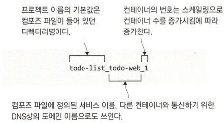

# 도커 컴포즈를 이용한 여러 환경 구성

- 배포가 실패하는 주된 원인은 환경 차이인데 도커로 이주하며 이 문제가 해결되는 이유도 패키지에 모든 의존 모듈이 함께 들어가기 때문입니다. 하지만 환경에 따라 동작을 달리해야 할 필요가 있습니다. 도커 컴포즈의 고급 기능을 사용하여 이를 해결할 수 있습니다.

## 도커 컴포즈로 여러 개의 애플리케이션 배포하기

```shell
cd ./ch10/exercises
docker-compose -f ./numbers/docker-compose.yml up -d
docker-compose -f ./todo-list/docker-compose.yml up -d
docker-compose -f ./todo-list/docker-compose.yml up -d
```

- numbers, todo-list는 실행되지만 3번째 todo-list는 기존에 실행중이므로 대체됩니다. (Running 문구만 있고 책에서 처럼 is up-to-date는 출력 안됨)

```shell
docker-compose -f ./todo-list/docker-compose.yml -p todo-test up -d
docker ps
docker port todo-test-todo-web-1 80
```



- 기존에 컨테이너와 프로젝트 이름을 다르게 지정해주었기 때문에 별개로 실행됩니다.

## 도커 컴포즈의 오버라이드 파일

- 도커 컴포즈는 여러 파일을 합쳐 컴포즈 파일을 구성하는데, 나중에 지정된 파일의 내용이 이전 파일의 내용을 오버라이드합니다.

```shell
docker-compose -f ./todo-list/docker-compose.yml -f ./todo-list/docker-compose-v2.yml config
```

- config 부명령은 설정 파일의 내용이 유효한지 확인할 뿐 애플리케이션을 실제로 실행하지는 않습니다.
- 도커 컴포즈가 오버라이드 파일을 병합하는 순서는 인자로 받은 순서를 따릅니다.

```shell
docker-compose -f ./numbers/docker-compose.yml -f ./numbers/docker-compose-dev.yml -p numbers-dev up -d
docker-compose -f ./numbers/docker-compose.yml -f ./numbers/docker-compose-test.yml -p numbers-test up -d
docker-compose -f ./numbers/docker-compose.yml -f ./numbers/docker-compose-uat.yml -p numbers-uat up -d
```

- dev, test, uat 환경으로 각각 컨테이너를 띄웁니다.
- dev, test, uat 어느 한 쪽에서 문제가 생기더라도 다른 컨테이너에 영향이 없습니다.

```shell
docker-compose -f ./numbers/docker-compose.yml -f ./numbers/docker-compose-test.yml -p numbers-test down
```

- project 이름을 지정해서 실행하였기에 `down`도 지정해야합니다.

## 환경 변수와 비밀값을 이용해 설정 주입하기

- 로깅: 환경별 로그 수준을 달리해 개발환경에서 좀 더 자세한 로그 출력
- 데이터베이스 프로바이더: 애플리케이션 컨테이너에 포함된 파일 형태의 간이 데이터베이스와 별도의 데이터베이스 컨테이너를 선택할 수 있음
- 데이터베이스 커넥션 문자열: 별도의 데이터베이스를 사용하는 경우 적용할 데이터베이스 접속 정보를 지정할 수 있음
- 비밀값: 도커 컴포즈. 도커 스웜. 쿠버네티스에서 모두 지원하는 기능으로 설정값 주입하기에 유용한 기능

```shell
docker-compose -f ./todo-list-configured/docker-compose.yml -f ./todo-list-configured/docker-compose-dev.yml -p todo-dev up -d
curl http://localhost:8089/1ist
docker logs --tail 4 todo-dev-todo-web-1
```

- 환경에 따라 로그레벨을 다르게해서 개발에서는 더 상세한 로그를 출력할 수 있습니다.

## 확장 필드로 중복 제거하기

```shell
docker-compose -f ./docker-compose.yml -f ./docker-compose-prod.yml config
```

- 중복되는 내용을 미리 선언하여 중복을 방지할 수 있습니다. (위 예시에서는 `x-labels`를 중복해서 선언했으므로 오류가 발생함)

  ```yaml
  x-labels: &logging -> x-labels-logging: &logging ->
  x-labels: &labels -> x-labels-logging: &logging ->
  ```

  로 수정하면 작동됩니다.

- 코어 컴포즈 파일에 정의된 확장 필드를 오버라이드 파일에서 사용할 수는 없습니다.

## 도커를 이용한 설정 워크플로 이해하기

- 애플리케이션 구성 요소의 조합: 오버라이드 파일을 사용하면 공통된 서비스는 그대로 두고 환경마다 필요한 서비스(DB, 모니터링 등)를 달리하는 설정을 깔끔하고 간편하게 작성할 수 있습니다.
- 컨테이너 설정: 각 환경과 요구사항에 맞춰 설정을 바꿀수 있게 도와줍니다.
- 애플리케이션 설정: 오버라이드 파일과 환경 파일, 비밀값 을 이용해 상황에 맞는 애플리케이션 설정값을 컨테이너에 주입하여 동작을 달리할 수 있습니다.
