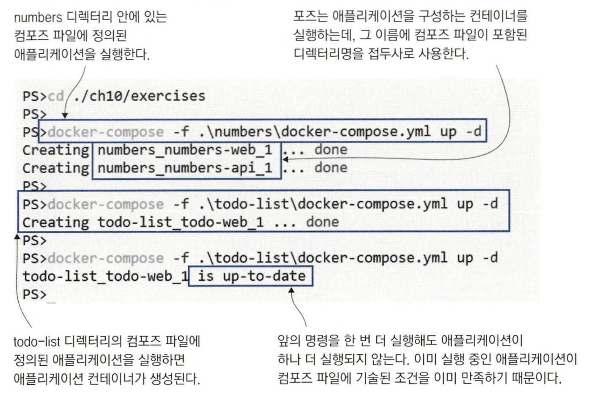
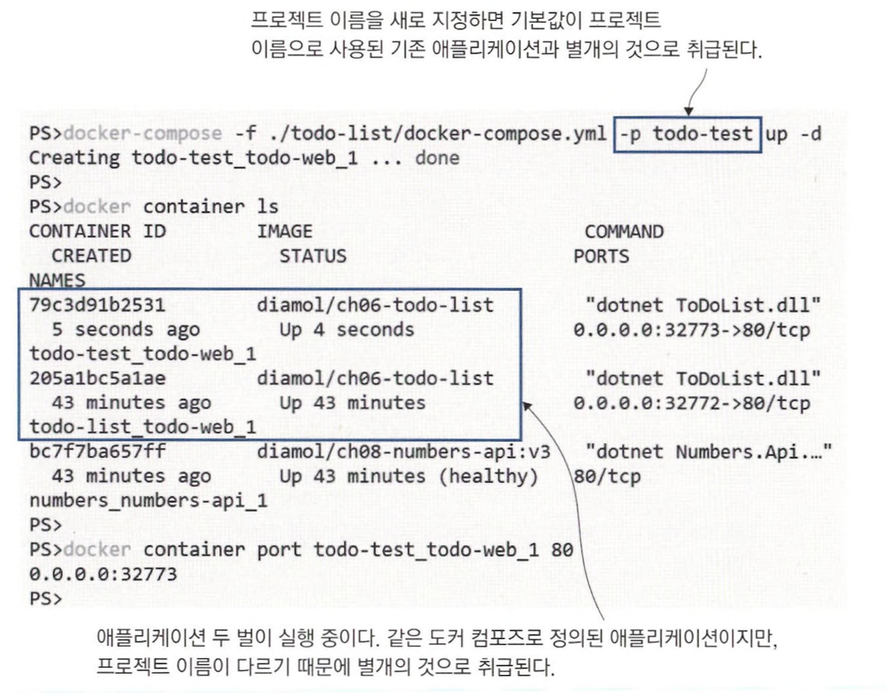
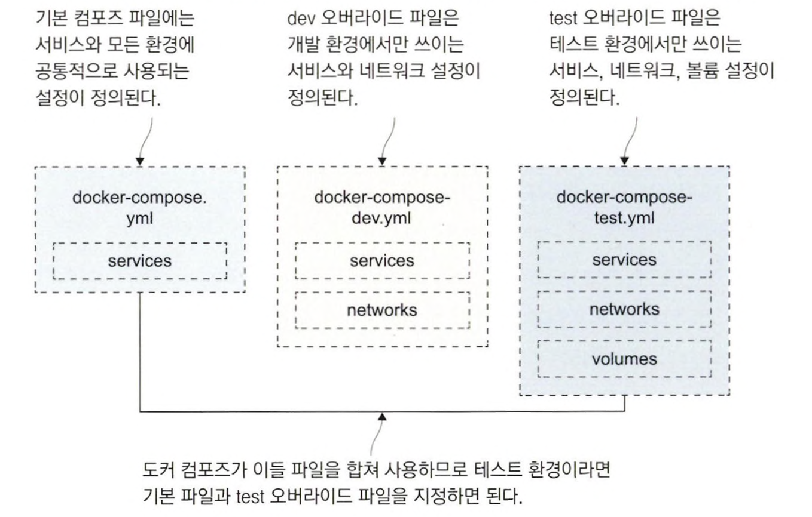
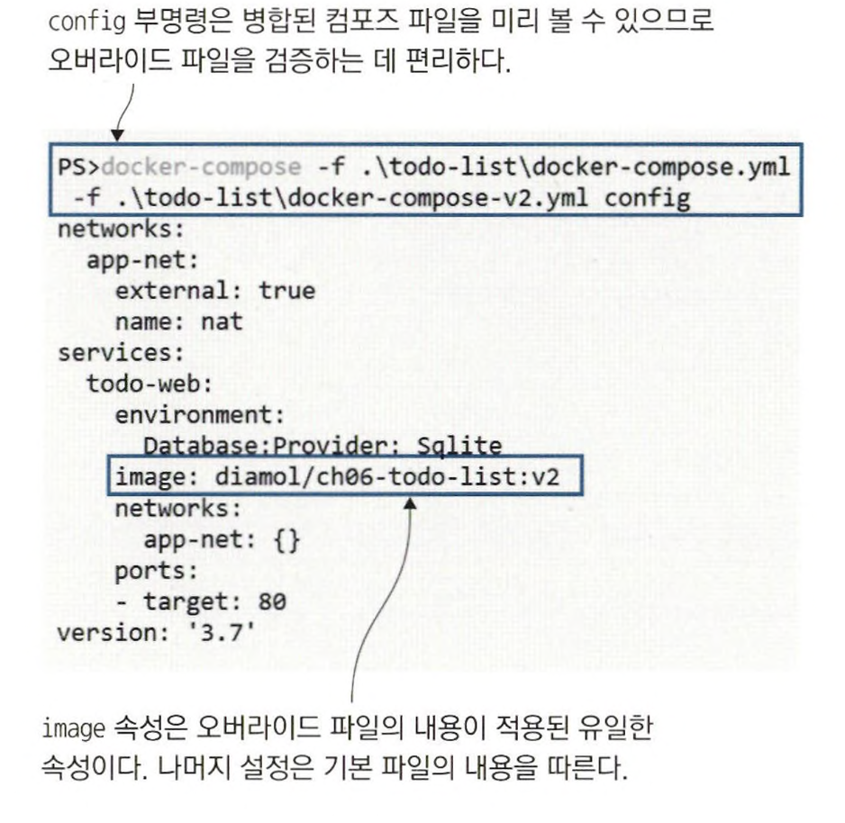
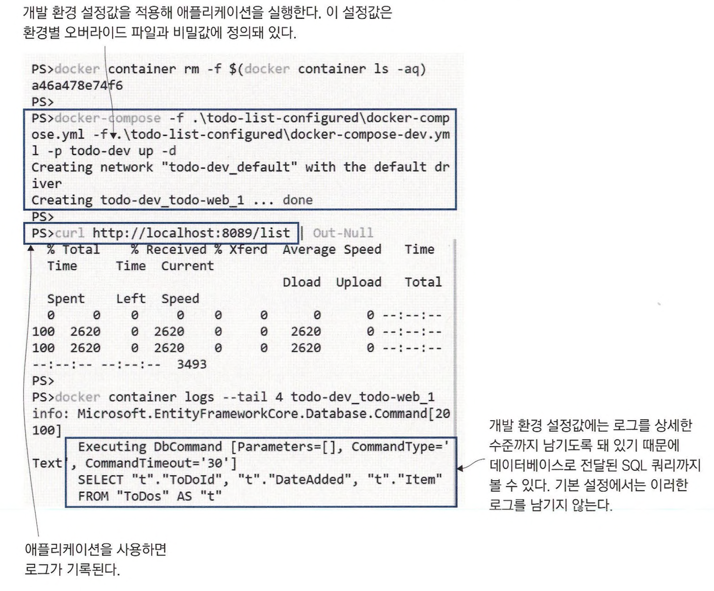
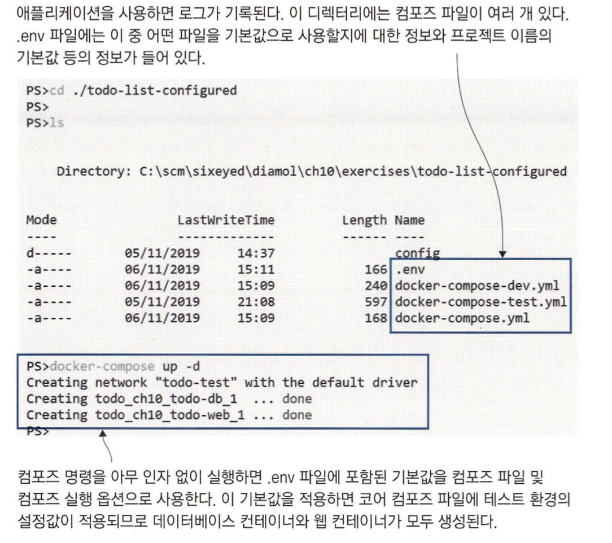
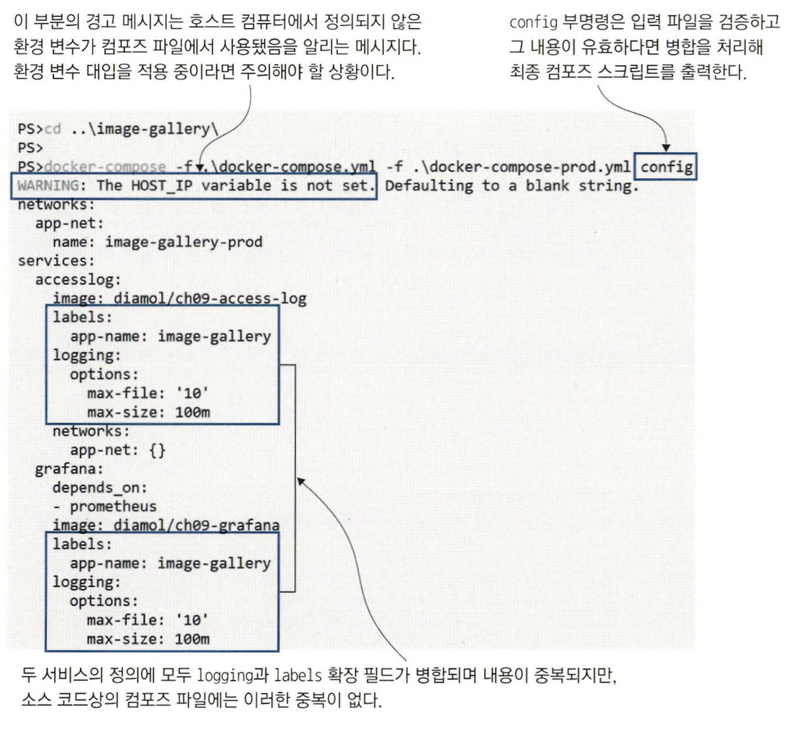

# 도커 컴포즈로 여러 개의 애플리케이션 배포

도커 컴포즈는 여러 개의 컨테이너로 구성된 애플리케이션을 단일 도커 엔진 호스트에서 실행하 기 위한 도구이며 개발 환경이나 테스트 환경에서 주로 쓰인다. <br>
비운영 환경에서는 스케일링 기능이 필요없고, 성능도 높지 않아도 되기 때문에 도커 컴포즈를 쓰기 적합하다.

여러 환경을 구성해 용도별로 사용하려면, 환경마다 애플리케이션이 다르게 동작하게끔 해야 한다. <br>
도커 컴포즈가 어떤 도커 리소스가 애플리케이션의 일부인지 아닌지 판단하는 원리를 먼저 고려해야 하는데. 그 기준은 레이블의 명명 규칙을 따른다.

```
cd ./ch10/exercises

docker-compose -f ./numbers/docker-compose.yml up -d

docker-compose -f ./todo-list/docker-compose.yml up -d

docker-compose -f ./todo-list/docker-compose.yml up -d
```



> 서로 다른 디렉터리에 있는 컴포즈 파일로부터 애플리케이션을 실행할 수는 있지만, 같은 디렉터리에서 실행한 애플리케이션을 하나 더 실행하려고 하니 잘되지 않았다. <br>
> 도커 컴포즈는 도커 리소스가 어떤 애플리케이션의 일부인지 아닌지를 판정하기 위해 **프로젝트(project)**라는 개념을 사용한다. <br>
> 프로젝트 이름의 기본값은 도커 컴포즈 파일이 들어 있던 디렉터리명인데, 도커 컴포즈가 도커 리소스를 만들 때 <br>
> 이 프로젝트 이름을 리소스의 이름에 접두사로 붙이고, 컨테이너 이름에는 번호를 접미사로 붙인다.

<br>

컴포즈가 사용하는 프로젝트 이름의 기본값을 바꿀 수 있으므로 단일 도커 호스트에 같은 애플리케이션을 여러 벌 실행시킬 수 있다.

```
docker-compose -f ./todo-list/docker-compose.yml -p todo-test up -d

docker ps

docker container port todo-test_todo-web_1 80
```



<br>
<hr>

# 도커 컴포즈의 오버라이드 파일

하나의 애플리케이션을 여러 설정으로 실행해야 할 필요가 생긴 경우 대부분은 컴포즈 파일을 여러 개 두는 방법을 쓴다. <br>
그러나 이 방법은 유지보수하기에 어려워서, 오버라이드 파일을 이용한다. <br>
도커 컴포즈는 여러 파일을 합쳐 컴포즈 파일을 구성하는데, 나중에 지정된 파일의 내용이 이전 파일의 내용을 덮어 쓰기한다.

> 기본적인 애플리케이션 구조와 모든 환경에서 공통으로 쓰이는 속성이 정의된 docker-compose.yml 파일이 있고, <br>
> 환경별로 작성된 오버라이드 파일이 해당 환경에서 달라진 속성을 정의한다.



<br>

```yaml
# docker-compose.yml - 기본 파일 
services:
  todo-web:
    image: diamol/ch06-todo-list
    ports:
      - 80
    environment:
      - Database:Provider=Sqlite
    networks:
      — app-net
    
# docker-compose-v2.yml - 오버라이드 파일 
services:
  todo-web:
    image: diamol/ch06—todo—list:v2
```

이 예제의 오버라이드 파일은 image 속성값 하나만 변경하는데, 이 속성은 기본 파일상의 위치와 마찬가지로 services 블록의 todo-web 블록 아래에 위치한다. <br>
도커 컴포즈는 하나 이상의 파일이 인자로 지정됐을 때 이들 파일을 병합한다. <br>
config 부명령이 이때 유용한데, 이 부명령은 입력 파일의 내용을 검증해 내용이 유효한 경우에만 최종 출력을 내놓는다.

<br>

```
docker-compose -f ./todo-list/docker-compose.yml -f ./todo-list/docker-compose-v2.yml config
```

config 부명령은 설정 파일의 내용이 유효한지 확인할 뿐 애플리케이션을 실제로 실행하지는 않는다. <br>
대신 기본 파일과 오버라이드 파일이 병합된 컴포즈 파일을 미리 볼 수 있다. 



<br>

- docker-compose.yml: 기본 컴포즈 파일. 웹 및 API 서비스가 정의됐으나 포트나 도커 네트워크에 대한 정의는 빠져 있다.
- docker-compose-dev.yml: 개발 환경 대상의 설정. 도커 네트워크 및 서비스의 공개 포트를 정의하고 헬스 체크와 디펜던시 체크를 비활성화한다. 개발자들이 빠르게 애플리케이션
  을 실행하는 것을 목적으로 한다.
- docker-compose-test.yml: 테스트 환경 대상의 설정. 도커 네트워크를 정의하고, 헬스 체크를 설정하고, 웹 서비스의 공개 포트를 정의한다. 그러나 API 서비스의 포트는 공개하지 않는다.
- docker-compose-uat.yml: 사용자 인수 테스트 환경 대상의 설정. 도커 네트워크를 설정하고, 웹 서비스는 80번 표준 포트로 공개하고, 서비스 오류 발생 시 항상 재시작하도록 설정하고, 헬스 체크를 좀 더 꼼꼼하게 하도록 지정한다.

```yaml
# 기본 컴포즈 파일을 변경하기 위한 오버라이드 파일 예
services: 
  numbers—api:
    ports:
      - "8087:80"
    healthcheck: 
      disable: true
      
numbers-web:
  entrypoint:
    - dotnet
    - Numbers.Web.dll 
  ports:
    - "8088:80"

networks:
  app-net:
    name: numbers—dev
```

<br>

```
docker rm -f $(docker container ls -aq)

# 개발 환경
docker-compose -f ./numbers/docker-compose.yml -f ./numbers/docker-compose-dev.yml -p numbers—dev up -d

# 테스트 환경
docker-compose -f ./numbers/docker-compose.yml -f ./numbers/docker-compose-test.yml -p numbers—test up -d

# 인수 테스트 환경
docker-compose -f ./numbers/docker-compose.yml -f ./numbers/docker-compose-uat.yml -p numbers—uat up -d
```

이들 각각은 모두 별개의 도커 네트워크를 사용하므로 서로 독립적이다. <br>
개발 팀에서는 이들 모두를 한 서버에서 실행하고, 팀마다 포트를 달리해 자신의 업무와 관련된 환경에 접근할 수 있다.

<br>

테스트 환경의 애플리케이션을 종료하려면 해당 환경의 컨테이너와 네트워크를 제거해야 한다. <br>
일반적인 상황이라면 docker-compose down 명령을 실행하면 되겠지만, <br>
프로젝트 이름을 기본값에서 변경한 지금은 docker-compose up 명령을 실행할 때 사용한 모든 파일과 프로젝트 정보를 정확히 지정해야 한다. 

```
docker-compose -f ./numbers/docker-compose.yml -f ./numbers/docker-compose-test.yml -p numbers—test down
```

<br>
<hr>

# 환경 변수와 비밀값을 이용해 설정 주입

환경 간에 애플리케이션 설정을 달리해야 하는 경우도 있다. <br>
대부분의 애플리케이션은 설정을 환경 변수나 설정 파일로부터 읽어 오는데. 도커 컴포즈도 이를 지원한다.

오버라이드 파일을 사용해 환경별로 다른 설정값을 적용한다.

```yaml
services: 
  todo-web:
    image: diamol/ch06—todo-list
    secrets:
      - source: todo-db-connection
        target: /app/config/secrets.json
```

컴포즈 파일에서 비밀값의 **원본 위치**와 **대상 위치**를 모두 지정할 수 있는데, <br>
**원본 위치**는 컨테이너 런타임이 비밀값의 값을 읽어 오는 곳이고 **대상 위치**는 컨테이너 안에서 비밀값이 위치할 경로를 의미한다.

이 컴포즈 파일에 사용된 비밀값은 todo-db-connection에서 읽어 오도록 돼 있는데, <br>
이 값을 읽으려면 이 이름으로 정의된 비밀값이 해당 컴포즈 파일에 정의돼 있어야 한다. <br>
그리고 비밀값의 내용은 컨테이너 속 경로 /app/config/secrets.json 파일로 전달된다.

<br>

```yaml
# 개발 환경을 위한 설정과 비밀값이 정의된 오버라이드 파일
services: 
  todo-web:
    ports:
      - 8089:80
    environment:
      - Database:Provider=Sqlite
    env_file:
      - ./config/logging.debug.env

  secrets:
    todo-db-connection:
    file : ./config/empty.json
```

이 오버라이드 파일에는 세 가지 프로퍼티가 정의돼있고, 애플리케이션에 설정 값을 주입해 동작을 변화시키는 역할을 한다.

- environment 프로퍼티는 컨테이너 안에서만 사용되는 환경 변수를 추가한다. 이 환경 변수 값을 적용하면 애플리케이션이 데이터베이스로 파일 데이터베이스인 SQLite를 사용한다.
- env_file 프로퍼티는 텍스트 파일의 경로를 값으로 받는다. 이 파일에 정의된 환경 변수가 컨테이너에 적용된다. 텍스트 파일에 변수 이름과 값을 등호(=)로 구분해 한 줄에 하나씩 정의한다. 같은 환경 변수를 여러 번 정의하지 않아도 환경 변수를 여러 컴포넌트에서 공유해 사용할 수 있다.
- secrets 프로퍼티는 services나 networks처럼 컴포즈 파일의 최상위 프로퍼티이며, 이 프로퍼티의 todo-db-connection의 실제 값 혹은 경로가 정의된다(여기서는 로컬 파일 시스템 상의 파일로 정의됐다).

<br>

```
docker rm -f $(docker container ls -aq)

docker-compose -f ./todo-list-configured/docker-compose.yml -f ./todo-list-configured/docker-compose-dev.yml -p todo-dev up -d

curl localhost:8089/list

docker logs --tail 4 todo-dev_todo-web_1
```

> 도커 컴포즈는 애플리케이션 한 개마다 도커 네트워크를 하나씩 사용하므로 컴포즈 파일에 정의된 네트워크가 없어도 기본 네트워크에 컨테이너를 연결한다.



<br>

호스트 컴퓨터의 환경 변수 값을 컨테이너에 전달하는 방법도 있다. <br>
이 방법을 사용하면 컴포즈 파일을 수정하지 않아도 설정값을 변경할 수 있기 때문에 애플리케이션의 이식성이 향상된다.

```yaml
todo-web: 
  ports:
    - "${TODO_WEB_PORT}:80"
  environment:
    - Database:Provider=Postgres 
  env_file:
    - ./config/logging.information.env
  networks:
    - app-net
```

$가 붙은 중괄호 부분이 괄호 안에 적힌 이름의 환경 변수 값으로 치환된다. <br>

컴포즈로 애플리케이션을 실행할 때 대상 디렉터리에서 .env 파일을 발견하면, <br>
이 파일을 환경 파일로 간주하고 파일의 내용으로부터 환경 변수를 읽어들여 애플리케이션을 실행하기 전에 먼저 적용한다.



> 컴포즈 파일조차 지정하지 않아도 .env 파일에 포함된 기본 설정이 사용된다. <br>
> .env 파일에는 웹 애플리케이션의 공개 포트 같은 컨테이너 설정과, 프로젝트 이름이나 컴포즈 파일 이름 같은 컴포즈 명령 자체에 대한 옵션이 들어있다.


```
# .env 파일의 내용
# 컨테이너 설정값 - 공개 포트
T0D0_WEB_P0RT=8877 
T0D0_DB_P0RT=5432

# 도커 컴포즈 실행 옵션 - 컴포즈 파일 지정, 프로젝트 이름
COMPOSE_PATH_SEPARATOR=;
COMPOSE_FILE=docker-compose.yml;docker-compose-test.yml
COMPOSE_PROJECT_NAME=todo_ch10
``` 

<br>

> 도커 컴포즈는 .env 파일만을 환경 파일로 간주하기 때문에 환경 파일 여러 개를 만들어 바꿔가면서 사용할 수 없다.


<br>
<hr>

# 확장 필드로 중복 제거

도커 컴포즈의 설정 기능의 한계 중 하나는 서비스 간 많은 설정값을 공유하는 컴포즈 파일의 덩치가 점점 커지는 문제이다. <br>
이를 해결하기 위해 **확장 필드**를 사용할 수 있다. <br>
**확장 필드**는 YAML의 여러 블록을 한곳에서 정의하는 기능이다. 컴포즈 파일에서는 스크립트 전체에 걸쳐 이 블록을 재사용하는 효과를 얻을 수 있다.

```yaml
# 도커 컴포즈 파일에 정의된 확장 필드
x-labels: &logging 
  logging:
    options:
      max—size : '100m'
      max-file: '10'
      
x-labels: &labels
  app-name: image-gallery
```

> 블록은 관습적으로 x로 시작하는 이름을 붙인다. <br>
> logging 확장 필드는 컨테이너 로그를 위한 설정을 포함하므로 서비스 정의에 이 블록을 사용할 수 있다. <br>
> labels 확장 필드는 레이블로 사용할 키-값 쌍을 정의 하는데, 이 블록은 서비스 정의의 labels 필드에서 사용할 수 있다. <br>
> logging 필드는 logging 프로퍼티를 포함하므로 이 블록을 서비스에서 바로 사용할 수 있다. <br>
> labels 필드는 labels 프로퍼티를 포함하지 않기 때문에 기존 Tables 필드 안에서 사용돼야 한다.

<br>

```yaml
services:
  
  iotd:
    ports:
      - 8080:80
    <<: *logging 
    labels:
      << : *labels
      public: api
```

확장 필드를 재사용할 때는 *<<:*필드명* 과 같이 쓴다. <br>

<br>

```
cd ./image-gallery

docker-compose -f ./docker-compose.yml -f ./docker-compose-prod.yml config
```



<br>
<hr>

# 도커를 이용한 설정 워크플로

환경은 어떤 식으로든 차이가 있는데, 도커 컴포즈를 이용하면 이러한 환경 간의 설정 차이를 소스 코드 형상 관리를 통해 다룰 수 있다.

- **애플리케이션 구성 요소의 조합**: 오버라이드 파일을 사용하면 공통된 서비스는 그대로 두고 환경마다 필요한 서비스를 달리하는 설정을 깔끔하고 간편하게 작성할 수 있다.
- **컨테이너 설정**: 오버라이드 파일과 도커 네트워크로 각 애플리케이션을 분리하는 방법으로 단일 서버에 여러 개의 애플리케이션을 실행할 수 있다.
- **애플리케이션 설정**: 오버라이드 파일과 환경 파일, 비밀값을 이용해 상황에 맞는 애플리케이션 설정값을 컨테이너에 주입할 수 있다.


