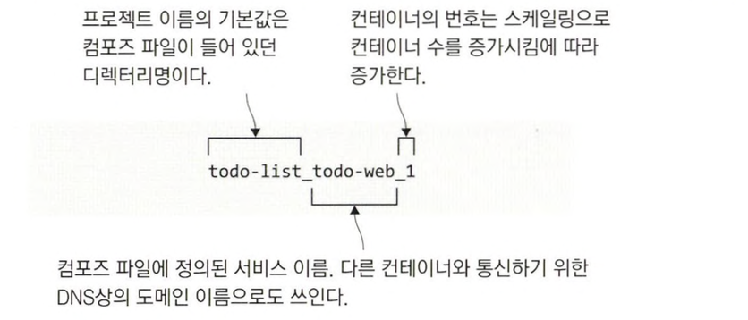
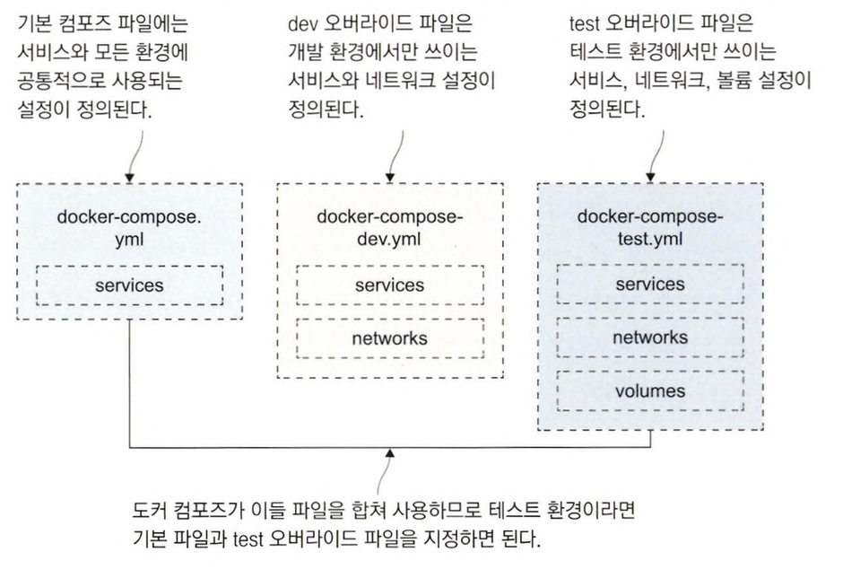
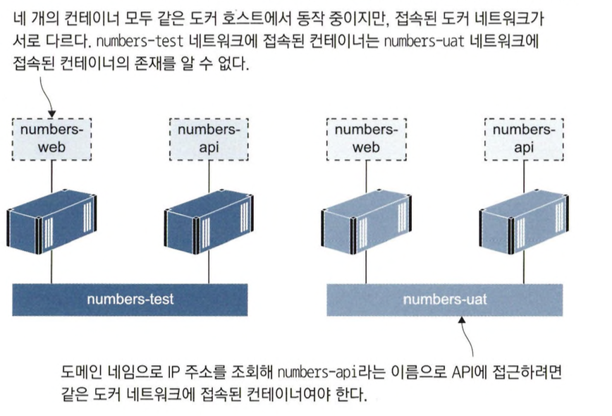
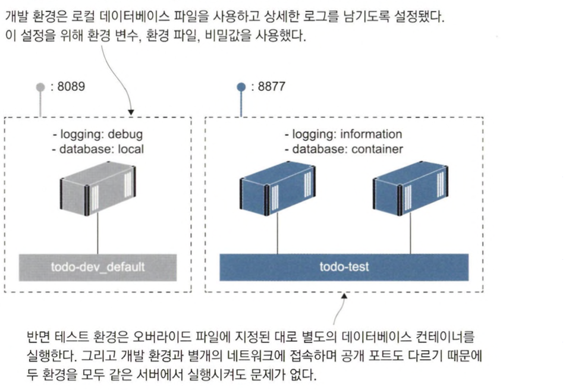

# 도커 컴포즈를 이용한 여러 환경 구성

## 도커 컴포즈로 여러 개의 애플리케이션 배포하기

### 같은 애플리케이션을 다른 환경에서 구동해야 하는 경우

조직에서는 같은 애플리케이션을 버전을 달리해 서로 다른 환경에서 구동해야 할 수 있습니다.

운영 환경은 스케일링등 고려해야할 요소가 많지만 개발 환경 같은 경우는 이러한 스케일링 같은 작업들이 필요하지 않습니다.

이런 환경에서는 여러 개의 컨테이너로 구성된 애플리케이션을 한번에 관리할 수 있는 도커 컴포즈가 유용합니다.

### 도커 컴포즈를 통해 여러 환경을 구성하여 용도별로 사용하기

도커 컴포즈를 이용하여 여러 환경을 구성해서 용도별로 사용하기 위해서는 환경마다 애플리케이션이 다르게 동작하게끔 해야합니다.

무턱대고 여러 컨테이너가 같은 포트를 통해 요청을 받게 하거나, 서버에 있는 같은 파일을 여러 컨테이너가 쓰려고 해서는 안됩니다.

### 프로젝트

`도커 컴포즈는 도커 리소스가 어떤 애플리케이션의 일부인지 아닌지를 판정하기 위해 프로젝트라는 개념을 사용`합니다.

`프로젝트 이름의 기본 값은 도커 컴포즈 파일이 들어 있던 디렉터리명`입니다.

이름은 도커 컴포즈가 도커 리소스를 만들 때 이 프로젝트의 이름을 리소스의 이름에 접두사로 붙이고, 컨테이너 이름에는 번호를 접미사로 붙입니다.

예를 들어 다음과 같은 구조를 가졌다고 가정해보겠습니다.

- 디렉터리 명 : app
- 서비스 : web
- 볼륨 : disk

이 경우 애플리케이션을 실행할 때 app_disk 라는 볼륨과 app_web_1 이라는 컨테이너를 만듭니다.

컨테이너 이름 뒤에 번호가 붙기 때문에 스케일링에도 대응할 수 있습니다.

<aside>
💡 컴포즈가 사용하는 프로젝트 이름의 기본값을 바꿀 수 있으므로 이 프로젝트 이름을 바꾸는 방법으로 단일 도커 호스트에 같은 애플리케이션을 여러 벌 실행시킬 수 있습니다.

</aside>



### 프로젝트 이름 지정하기

도커 컴포즈를 실행할 때 다음과 같이 포트 번호를 지정할 수 있습니다.

```bash
docker-compose -p {프로젝트 명} up
# 예시 (todo-test라는 프로젝트 명으로 지정)
docker-compose -p todo-test up
```

이러한 방법을 사용하면 도커 컴포즈를 사용해 같은 애플리케이션을 여러개 실행할 수 있습니다.

### 프로젝트 이름 지정이 아쉬운 점

프로젝트 이름을 지정하면 간단하게 도커 컴포즈를 같은 환경으로 여러개 생성할 수 있지만 아쉬운 점이 있습니다.

이 경우 무작위로 정해진 공개 포트를 일일이 찾아야하는 수고가 필요합니다.

컴포즈 파일을 복사해 필요한 부분만 수정하는 방법도 가능하지만 좀 더 좋은 방법이 존재합니다.

## 도커 컴포즈의 오버라이드 파일

### 하나의 애플리케이션을 여러 환경으로 실행하는 경우 컴포즈 파일 관리

`하나의 애플리케이션을 여러 설정으로 실행해야 하는 경우 컴포즈 파일을 여러개 두는 방법을 많이 사용`합니다.

하지만 이런 방법은 다음과 부분 때문에 `유지 보수 측면에서 바람직 하지 않습니다.`

- 컴포즈 파일의 내용이 90% 이상이 중복일 확률이 높다.
    - 공통적으로 수정이 발생하거나 추가되어야 하는 내용이 존재하는 경우 파일 마다 변경사항을 적용해주어야 합니다.

### 오버라이드를 통한 문제 해결

도커 컴포즈 파일의 중복문제를 해결하기 위해서 도커 컴포즈는 `오버라이드 파일`을 만들 수 있습니다.

도커 컴포즈는 여러 파일을 합쳐 컴포즈 파일을 구성하는데, 나중에 지정된 파일의 내용이 이전 파일의 내용을 오버라이드 합니다.

다음은 오버라이드 파일을 이용해 도커 컴포즈 파일을 구성하는 예시입니다.



위와 같이 구성하면 설정 파일에 중복된 내용이 없고 유지 보수성이 개선됩니다.

모든 환경에 공통적으로 적용될 내용을 변경하고 싶다면 기본 파일을 수정하면 됩니다.

어느 특정 환경에만 적용하고 싶은 내용이라면 해당 환경의 오버 라이드 파일만 수정하면 됩니다.

### 오버라이드 파일 예시

다음은 도커 컴포즈 오버라이드 파일 예시입니다.

```yaml
# 기본 파일
services:
  todo-web:
    image: diamol/ch06-todo-list
    ports:
      - 80
    environment:
      - Database:Provider=Sqlite
```

```yaml
# 오버라이드 파일
services:
  todo-web:
    image: diamol/ch06-todo-list:v2
```

오버라이드 파일에는 해당 환경에서 변경할 항목만 기술하면 됩니다.

그러나 `기본 컴포즈 파일의 구조를 유지해야 도커 컴포즈가 두 정의를 연결 지을 수 있습니다.`

도커 컴포즈는 하나 이상의 파일을 인자로 됐을 때 파일을 병합합니다.

<aside>
💡 이 때 config 부명령을 통해 입력 파일의 내용을 검증해 유효한 경우에만 최종 출력을 내놓을 수 있습니다.

</aside>

```bash
docker-compose -f ./docker-compose.yml -f ./docker-compose-v2.yml config
```

다음은 위의 명령을 실행한 결과입니다.

```bash
name: override
services:
  todo-web:
    environment:
      Database:Provider: Sqlite
    image: diamol/ch06-todo-list:v2
    networks:
      default: null
    ports:
    - mode: ingress
      target: 80
      protocol: tcp
networks:
  default:
    name: override_default
```

위의 결과를 확인해보면 이미지를 제외한 부분을 제외하고 기본 이미지와 동일한 것을 볼 수 있습니다.

### 도커 컴포즈가 오버라이드 파일을 병합하는 순서

도커 컴포즈가 오버라이드 파일을 병합하는 순서는 인자로 받은 순서를 따릅니다.

다시 말해, `인자로 지정된 순서가 먼저인 파일이 순서가 나중인 파일보다 우선`합니다.

### 오버라이드 파일 응용 예시

도커 컴포즈 오버라이드 파일을 다음과 같이 구성한다고 가정 해봅시다.

- docker-compose.yml
    - 기본 컴포즈 파일
    - 웹 및 API 서비스가 정의 됐으나 포트나 도커 네트워크에 대한 정의는 빠져 있는 상태

    ```yaml
    version: "3.7"
    
    services:
      numbers-api:
        image: diamol/ch08-numbers-api:v3
        networks:
          - app-net
    
      numbers-web:
        image: diamol/ch08-numbers-web:v3
        environment:
          - RngApi__Url=http://numbers-api/rng
        networks:
          - app-net
    
    networks:
      app-net:
    ```

- docker-compose-dev.yml
    - 개발 환경 대상의 설정
    - 도커 네트워크 및 서비스의 공개 포트를 정의하고 헬스 체크와 디펜던시 체크를 비활성화
    - 개발자들이 빠르게 애플리케이션을 실행하는 것을 목적으로 사용

    ```yaml
    version: "3.7"
    
    services:
      numbers-api:
        ports:
          - "8087:80"
        healthcheck:
          disable: true
    
      numbers-web:
        entrypoint:
          - dotnet
          - Numbers.Web.dll
        ports:
          - "8088:80"
    
    networks:
      app-net:
        name: numbers-dev
    ```

- docker-compose-test.yml
    - 테스트 환경 대상의 설정
    - 도커 네트워크를 정의하고, 헬스 체크를 설정하고 웹 서비스의 공개 포트를 정의
    - API 서비스의 포트는 공개하지 않음

    ```yaml
    version: "3.7"
    
    services:
      numbers-api:
        healthcheck:
          interval: 20s
          start_period: 15s
          retries: 4
    
      numbers-web:
        ports:
          - "8080:80"
        restart: on-failure
        healthcheck:
          test: ["CMD", "dotnet", "Utilities.HttpCheck.dll", "-t", "250"]
          interval: 20s
          timeout: 10s
          retries: 4
          start_period: 10s
    
    networks:
      app-net:
        name: numbers-test
    ```

- docker-compose-uat.yml
    - 사용자 인수 테스트 환경 대상의 설정
    - 도커 네트워크를 설정하고, 웹 서비스는 80번 표준 포트로 공개하고 서비스가 오류 발생시 항상 재시작 하도록 설정하고 헬스 체크를 좀 더 꼼꼼하게 하도록 설정

    ```yaml
    version: "3.7"
    
    services:
      numbers-api:
        healthcheck:
          interval: 10s
          retries: 2
        restart: always
        ports:
          - "8090:80"
    
      numbers-web:
        restart: always
        ports:
          - "80:80"
        healthcheck:
          interval: 10s
          retries: 2
    
    networks:
      app-net:
        name: numbers-uat
    ```


다음 도커 컴포즈 파일을 실행하기 위해 다음 명령을 입력하면 됩니다.

```bash
# 기존 컨테이너 모두 제거하기
docker container rm -f $(docker container ls -aq)

# 개발 환경용 설정으로 실행하기
docker-compose -f ./docker-compose.yml -f ./docker-compose-dev.yml -p numbers-dev up -d

# 테스트 환경용 설정으로 실행하기
docker-compose -f ./docker-compose.yml -f ./docker-compose-test.yml -p numbers-test up -d

# 인수 테스트 환경용 설정으로 실행하기
docker-compose -f ./docker-compose.yml -f ./docker-compose-uat.yml -p numbers-uat up -d
```

이제 동시에 같은 환경의 애플리케이션 세 개를 실행 중입니다.

그리고 이들은 각각 `도커 네트워크를 사용하기 때문에 서로 독립적`입니다.

`개발 팀에서는 이들 모두를 한 서버에서 실행하고, 팀마다 포트를 달리해 자신의 업무와 관련된 환경에 접근할 수 있습니다.`

예를 들어 사용자 인수 테스트 환경은 80번 포트로 접근하고, 시스템 테스트 환경은 8080번 포트로, 개발 팀의 통합 테스트 환경은 8088번 포트로 접근하는 식입니다.

다음은 독립된 네트워크를 그림으로 나타낸 예시입니다.



만약 사용이 끝났다면 도커 컴포즈 파일을 사용하여 컨테이너를 종료해야 할 것 입니다.

이때, 다음과 같이 파일 및 프로젝트 이름을 명확하게 지정해 주어야 합니다.

```bash
docker-compose -f ./docker-compose.yml -f ./docker-compose-dev.yml -p numbers-dev down
```

## 환경 변수와 비밀값을 이용해 설정 주입하기

### 도커 컴포즈를 이용한 환경변수와 비밀값 주입하기

애플리케이션을 사용할 때 환경 마다 애플리케이션 설정을 다르게 하여 사용할 수 있습니다.

도커 컴포즈는 이런 상황에서 환경 변수와 비밀 값을 주입시켜줄 수 있습니다.

### 도커 컴포즈에서 환경변수와 비밀값 설정 예시

다음은 비밀값을 전달받은 도커 컴포즈 파일 예시입니다.

```yaml
services:
	todo-web:
		image: diamol/ch06-todo-list
		secrets:
			- source: todo-db-connection
				target: /app/config/secrets.json
```

도커 컴포즈에서 비밀값은 원본 위치와 대상 위치를 모두 지정할 수 있는데, `source는 컨테이너 런타임이 비밀값의 값을 읽어오는 곳이고 target은 컨테이너 안에서 비밀값이 위치할 경로를 의미합니다.`

위의 컴포즈 파일에서는 todo-db-connection에서 읽어와서 컨테이너 내부의 /app/config/secrets.json 에 저장됩니다.

앞서 본 컴포즈 파일은 스크립트에서 사용된 todo-db-connection 비밀값이 해당 파일에 정의되어 있지 않기 때문에 단독으로 사용하면 유효하지 않습니다.

다음은 개발 환경용 오버라이드 파일입니다.

이 파일은 개발 환경을 위한 추가 설정과 비밀 값을 정의합니다.

```yaml
services:
  todo-web:
    ports:
      - 8089:80
    environment:
      - Database:Provider=Sqlite
    env_file:
      - ./config/logging.debug.env

secrets:
  todo-db-connection:
    file: ./config/empty.json
```

위의 오버라이드 파일에는 세 가지 프로퍼티가 정의돼 있습니다.

이들 프로퍼티는 애플리케이션에 설정값을 주입해 동작을 변화시키는 역할을 합니다.

셋 중에 원하는 것만 적용해도 되지만 이들 모두 나름에 장점이 있습니다.

- enviroment
    - 컨테이너 안에서 사용되는 환경 변수를 추가하는 방법입니다.
    - 설정값을 전달하는 가장 간단한 방법입니다.
- env_file
    - 텍스트 파일의 경로를 입력받아 해당 파일에 정의된 환경 변수가 컨테이너에 적용됩니다.
    - `{KEY}={VALUE}` 형태로 저장되어 있어야 합니다.
    - 같은 환경 변수를 여러 번 정의하지 않고 환경 변수를 여러 컴포넌트에서 공유해 사용할 수 있습니다.
- secrets
    - services나 networks 처럼 컴포즈 파일의 최상위 프로퍼티로 사용되며 비밀값의 실제 값 혹은 경로를 정의합니다.

위와 같은 방법으로 외부로부터 설정값을 주입받아 애플리케이션을 실행할 수 있습니다.

### 호스트 컴퓨터의 환경 변수 값을 컨테이너 전달하기

컴포즈 파일안에서 지정하는 방법말고도 호스트 컴퓨터의 환경 변수 값을 컨테이너에 전달하는 방법을 사용할 수 있습니다.

호스트 컴퓨터의 환경 변수 값을 컨테이너 전달하면 다음과 같은 장점을 얻을 수 있습니다.

- 컴포즈 파일을 수정하지 않아도 설정 값을 변경할 수 있기 때문에 애플리케이션의 이식성이 향상 됩니다.
    - 다른 컴퓨터에서 환경 변수 값만 바꾸면 설정이 다른 테스트 환경을 하나 더 꾸릴 수 있기 때문에 편리합니다.

다음은 호스트 컴퓨터의 환경 변수를 사용한 컴포즈 파일 예시입니다.

```yaml
services:
  todo-web:
    ports:
      - "${TODO_WEB_PORT}:80"
```

### `.env` 파일 자동읽기

도커 컴포즈 파일은 `.env` 파일을 발견하면 자동으로 읽어 애플리케이션을 실행하기 전에 먼저 적용하는 기능을 합니다.

도커 컴포즈 파일과 `.env` 의 경로가 같다면 자동으로 적용됩니다.

단, 주의해야 할 점이있는데 도커 컴포즈는 `.env` 만을 환경 파일로 간주하기 때문에 환경 파일 여러 개를 만들어 바꿔 가면서 사용할 수 없습니다.

## 설정 주입 방법 정리

### enviroment

enviroment 프로퍼티를 사용하는 방법은 `간단하고 가독성도 좋습니다.`

그러나 `평문 텍스트로 작성되기 때문에 API 키나 데이터베이스 접속 정보 같은 민감한 정보에는 사용하지 않는 것이 좋습니다.`

### secrets

secrets 프로퍼티를 사용하여 비밀값에 설정 값을 지정하는 방법은 `모든 컨테이너 런타임에서 적용 가능하고 민감한 정보가 유출될 우려도 없기 때문에 유연성 면에서 가장 뛰어납니다.`

비밀값의 실제 값은 로컬 파일 시스템이나 도커 스웜이나 쿠버네티스 클러스터에 저장할 수도 있습니다.

`실제 값이 어디에 저장되든 애플리케이션 실행될 때 컨테이너 속의 특정한 파일로 전달`됩니다.

### env_file

env_file 프로퍼티를 사용하여 설정 값을 저장한 파일을 지정하는 방법은 `서비스 간에 공유하는 설정이 많을 때 유용`합니다.

도커 컴포즈가 로컬에 위치한 파일을 읽어 각 설정값을 지정해 주기 때문에 원격 컴퓨터에서 실행 중인 도커 엔진을 다룰 때도 로컬 컴퓨터의 설정값을 적용할 수 있습니다.

### .env

`.env` 를 이용하는 방법은 환경을 막론하고 `기본설정을 지정할 때 유용`합니다.

## 확장 필드로 중복 제거하기

### 확장 필드

서비스가 점점 커지게 되면 설정값을 공유하는 컴포즈 파일의 크기 역시 커지게 됩니다.

이런 문제를 해결하기 위해서 도커 컴포즈는 `확장 필드`를 지원합니다.

확장 필드는 `YAML의 여러 블록을 한곳에서 정의하는 기능`입니다.

확장 필드는 다음과 같은 장점을 가질 수 있습니다.

- 스크립트 전체에 걸쳐 블록을 재사용할 수 있습니다.
    - 스크립트의 중복을 제거하여 잠재적인 오류를 줄여 줄 수 있습니다.
    - YAML 병합 문법에 익숙한 경우 직관적으로 사용이 가능합니다.

확장 필드는 최상위 블록(services, networks 등) 외부라면 어디서든 정의할 수 있으며 앰퍼샌드 + 이름(&이름)의 형태로 사용됩니다.

### 확장 필드 사용 예시

다음은 확장필드를 사용한 컴포즈 파일 예시입니다.

```yaml
x-labels: &logging
  logging:
    options:
      max-size: '100m'
      max-file: '10'

x-labels: &labels
  app-name: image-gallery
```

위의 파일을 보면 logging과 labels라는 두 개의 확장 필드가 존재합니다.

<aside>
💡 블록은 관습적으로 x로 시작하는 이름을 붙입니다.

</aside>

&logging 필드는 컨테이너 로그를 위한 설정을 포함하므로 서비스 정의에 사용됩니다.

&labels 확장 필드는 레이블로 사용할 키-값 쌍을 저장하고 있으며 서비스의 labels 필드에서 사용합니다.

확장 필드를 사용하기 위해서는 YAML 병합 문법을 사용합니다.

사용법은 다음과 같습니다.

```yaml
<<: *필드명
```

위와 같이 사용하면 확장 필드로 선언한 값으로 대체되게 됩니다.

다음은 확장 필드를 사용한 예시입니다.

```yaml
services:
	iotd:
	  ports:
	    - 8080:80
	  <<: *logging
	  labels:
	    <<: *labels
	    public: api
```

위의 코드에서는 `<<: *logging` 는 다음으로 대체됩니다.

```yaml
logging:
  options:
    max-size: '100m'
    max-file: '10'
```

`<<: *labels` 역시 다음과 같이 대체됩니다.

```yaml
app-name: image-gallery
```

최종적으로 다음과 같은 형태로 실행되게 됩니다.

```yaml
services:
	iotd:
	  ports:
	    - 8080:80
	logging:
	  options:
	    max-size: '100m'
	    max-file: '10'
	  labels:
			app-name: image-gallery
	    public: api
```

### 확장 필드 정리

확장 필드는 컴포즈 파일을 관리하는 베스트 프랙티스 중 한 가지 방법입니다.

특히 로깅 및 레이블 설정은 모든 서비스에 공통적으로 적용되는 경우가 많습니다.

모든 애플리케이션에서 활용되는 것은 아니지만 잘 익혀 두면 `중복이 많은 YAML 파일을 작성할 때 매우 유용`합니다.

하지만 `확장 필드에도 여러 컴포즈 파일에 한꺼번에 적용할 수 없다는 한계점`이 있습니다.

이 때문에 코어 컴포즈 파일에 정의된 확장 필드를 오버라이드 파일에서 사용할 수는 없습니다.

이 점은 컴포즈의 한계라기보다는 YAML 포맷의 한계에 가깝지만 잘 알아 둘 필요가 있습니다.

## 도커를 이용한 설정 워크플로 이해하기

### 소스 코드 형상 관리 도구로 환경 관리하기

소스 코드 형상 관리 도구로 시스템의 모든 환경에 대한 설정을 관리할 수 있다면 다음과 같은 장점을 얻을 수 있습니다.

- 애플리케이션의 원하는 어떤 버전이라도 해당 버전의 코드를 불러와 소스 코드에 포함된 배포 스크립트만 실행할 수 있습니다.
- 운영 환경과 동일한 설정으로 애플리케이션을 실행해 신속하게 버그를 재현해 볼수 있습니다.

그리고 도커 컴포즈를 이용하면 이러한 환경 간의 차이를 소스 코드 형상 관리 도구를 이용하여 관리할 수 있습니다.

### 도커 컴포즈를 이용해 서로 다른 환경을 정의하는 방법

도커 컴포즈를 이용하여 서로 다른 환경을 정의하는 방법은 다음과 같이 세 가지 핵심 영역으로 나눌 수 있습니다.

- 애플리케이션 구성 요소의 조합
- 컨테이너 설정
- 애플리케이션 설정

### 애플리케이션 구성 요소의 조합

모든 환경에서 전체 스택을 실행할 피요는 없습니다.

예를 들어, 모니터링을 위한 대시보드는 개발자에게는 필요 없을 것이고 환경마다 바라보는 데이터베이스가 다를 것입니다.

오버라이드 파일을 사용하면 `공통된 서비스는 두고 환경마다 필요한 서비스를 달리하는 설정을 깔끔하고 간편하게 작성`할 수 있습니다.

### 컨테이너 설정

각 환경의 상황과 요구 사항에 맞춰 설정을 바꿀 필요가 있습니다.

공개 포트는 다른 컨테이너와 충돌하지 않도록 중복되지 않아야 하고, 볼륨 경로는 테스트 환경에서는 로컬 드라이브를 사용하겠지만 운영 환경에서는 공유 스토리지가 사용될 것 입니다.

`오버라이드 파일과 도커 네트워크로 각 애플리케이션을 분리하는 방법으로 이런 요구 사항을 모두 만족시키면서 단일 서버에 여러 개의 애플리케이션을 실행`할 수 있습니다.

### 애플리케이션 설정

환경별로 컨테이너 내부 동작이 달라야 하는 경우가 있습니다.

애플리케이션이 생성하는 로그 수준이나, 로컬 데이터를 저장하기 위해 사용하는 캐시 크기를 달리할 수 있고, 아예 특정 기능을 켜거나 꺼야 할 수도 있습니다.

`오버라이드 파일과 환경 파일, 비밀값을 이용해 상황에 맞는 애플리케이션 설정값을 컨테이너에 주입`할 수 있습니다.

### 환경별 설정 워크플로우 예시

일반적으로 개발 환경과 테스트 환경 같은 경우 설정만 해도 많은 차이가 발생합니다.

예를 들어, 개발 환경은 로컬 데이터베이스 파일을 사용하고, 테스트 환경에서는 컴포즈에서 별도의 데이터베이스 컨테이너를 실행해 사용합니다.

하지만 도커 컴포즈를 사용하여 서로 독립된 네트워크를 사용하면서 중복되지 않는 공개 포트를 사용하므로 동일한 호스트 컴퓨터에서 두 환경의 애플리케이션을 모두 실행할 수 있습니다.

다음은 개발 환경과 테스트 환경의 차이를 나타낸 그림입니다.



### 같은 이미지를 사용한 워크 플로우

위의 워크 플로우에서 가장 중요한 점은 `모든 환경에서 같은 이미지를 사용`한다는 것입니다.

빌드 프로세스가 끝나면 모든 자동화 테스트를 통과하고 특정 태그가 부여된 컨테이너 이미지가 생성됩니다.

이 이미지를 컴포즈 파일에 포함된 설정 값으로 빌드 검증 테스트 환경에 배포합니다.

모든 테스트를 통과하면 최종적으로 도커 스웜이나 쿠버네티스 배포 매니페스트로 운영 환경에 이 이미지를 배포합니다.

결과적으로 운영 환경에 배포된 소프트웨어는 지금까지 거쳐온 모든 테스트를 통과한 버전이 실행 되며, 환경 별로 제공된 설정 값에 따라 각각의 환경이 다르게 동작합니다.