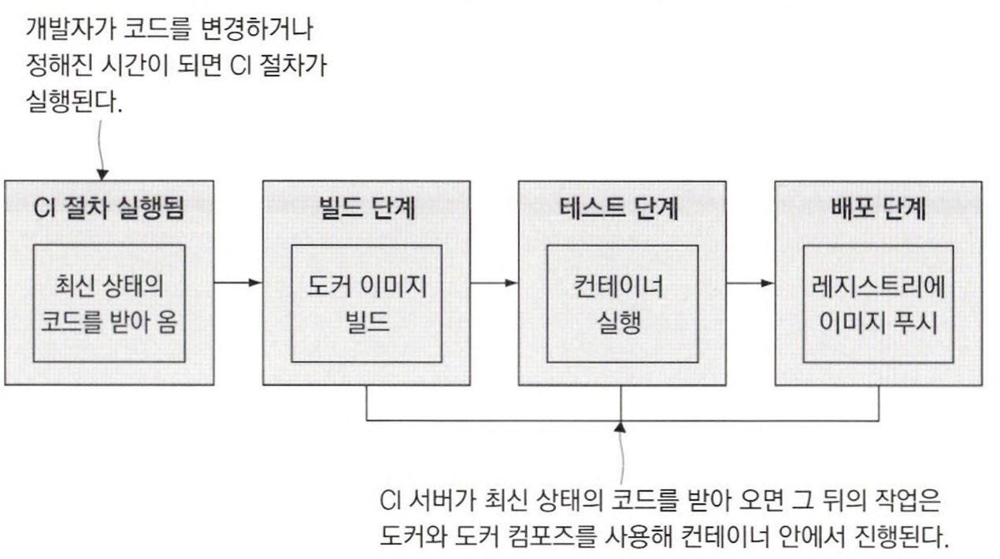
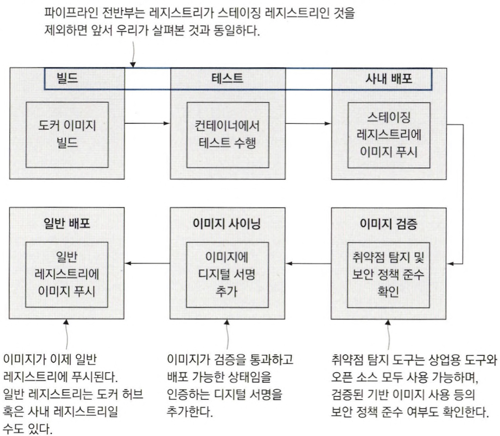

# 11장 도커와 도커 컴포즈를 이용한 애플리케이션 빌드 및 테스트

## 11.1 도커를 이용한 지속적 통합 절차

도커는 CI 절차의 일관성을 유지해 준다. 모든 도커 프로젝트는 똑같은 단계를 거쳐 똑같은 유형의 결과물을 생성하기 때문이다.

코드 변경이나 정해진 일정에 따라 CI 절차가 시작되면 도커 이미지를 빌드한다. 이 이미지는 빌드 및 테스트, 패키징, 배포를 위해 레지스트리에 푸시까지 마친 최신 코드를 반영한 이미지다.

📌 빌드, 테스트, 배포 과정을 담은 기본적인 CI 파이프라인. 이 절차는 모두 도커에 의해 실행된다.



</br>

CI 파이프라인의 각 단계는 도커 혹은 도커 컴포즈에 의해 실행되며 실제 과정은 컨테이너 내부에서 진행된다.

도커 컴포즈로 전체 애플리케이션을 실행하고 여기에 더해 사용자 역할을 맡아 트래픽을 일으킬 별도의 컨테이너를 실행함으로써 복잡한 엔드 투 엔드 테스트를 진행할 수도 있다.

## 11.2 도커를 이용한 빌드 인프라스트럭처 구축하기

형상 관리 기능을 제공하는 Gogs, 이미지 배포를 맡을 오픈 소스 도커 레지스트리, 자동화 서버로는 젠킨스를 설치한다.

```bash
# 리눅스 컨테이너 환경
$ docker-compose -f docker-compose.yml -f docker-compose-linux.yml up -d

# 레지스트리의 도메인을 hosts 파일에 추가
$ echo $'127.0.0.1 registry.local' | sudo tee -a /etc/hosts
```

❗️ diamol/gogs 이미지 정상 동작하지 않음. (→ gogs/gogs:latest로 변경함)

✅ gogs 설치 및 설정 하기

새로운 코드가 푸시되면 자동으로 CI 작업이 실행되는 코드 저장소를 만든다.

✅ 젠킨스 설치하기

젠킨스는 자바 애플리케이션으로, 컨테이너 실행 시 젠킨스를 실행하는 스크립트와 함께 도커 이미지 형태로 패키징할 수 있다. 

```bash
☁  exercises [main] ⚡  git remote add local http://localhost:3000/diamol/diamol.git

☁  exercises [main] ⚡  git push local                                            
오브젝트 나열하는 중: 1218, 완료.
오브젝트 개수 세는 중: 100% (1218/1218), 완료.
Delta compression using up to 8 threads
오브젝트 압축하는 중: 100% (725/725), 완료.
오브젝트 쓰는 중: 100% (1218/1218), 7.85 MiB | 546.00 KiB/s, 완료.
Total 1218 (delta 357), reused 1218 (delta 357), pack-reused 0
remote: Resolving deltas: 100% (357/357), done.
To http://localhost:3000/cwlee/cwlee.git
 * [new branch]      main -> main
```

전체 CI 파이프라인이 도커 컨테이너를 통해 실행되므로 다음과 같은 이점이 있다. 도커에서 실행된 컨테이너는 도커 API, 그리고 같은 도커 엔진에서 실행된 컨테이너와 연결된다. 젠킨스 이미지에는 도커 CLI와 젠킨스 컨테이너 설정을 위한 컴포즈 파일을 포함하고 있기 때문에 `도커 명령을 실행하면 호스트 컴퓨터에서 실행 중인 도커 엔진으로 전달`한다.

이러한 부분을 이용하면 컨테이너에서 실행된 애플리케이션이 도커를 통해 다른 컨테이너를 찾아 달라고 요청하거나 새로운 컨테이너를 시작하고 종료하는 등의 일이 가능하다.

📌 젠킨스에 포함된 도커 CLI를 도커 엔진과 연결하기

젠킨스 컨테이너가 도커 및 도커 컴포즈 명령을 실행할 수 있게 도커 엔진과 연결할 수 있도록 하고, 같은 도커 네트워크에서 동작하는 컨테이너인 Git서버와 도커 레지스트리에는 DNS를 통해 연결한다.

```docker
# docker-compose.yml
services:
	jenkins:
		image: diamol/jenkins
		ports:
			- "8080:8080"
		networks:
			- infrastructure

# docker-compose-linux.yml
jenkins:
	volumes:
		- type: bind
			source: /var/run/docker.sock
			target: /var/run/docker.sock
```


## 11.3 도커 컴포즈를 이용한 빌드 설정

📌 이미지 태그에 환경 변수가 사용된 코어 컴포즈 파일

```docker
service:
	numbers-api:
		image: ${REGISTRY:-docker.io}/diamol/ch11-numbers-api:v3-build-${BUILD_NUMBER:-local}
	networks:
		- app-net

	numbers-web:
		image: ${REGISTRY:-docker.io}/diamol/ch11-numbers-web:v3-build-${BUILD_NUMBER:-local}
	environmnet:
		- RngApi__Url=http://number-api/rng
	networks:
		- app-net
```

`${REGISTRY:-docker.io}` : REGISTRY 값으로 치환하되, 해당 환경 변수가 정의돼 있지 않다면 도커 허브의 도메인인 docker.io를 기본값으로 사용한다.

✅ 도커 리소스에 레이블을 부여할 수 있다.

- 레이블은 리소스에 대한 추가 데이터에 키-값 쌍 형태로 저장된다.
- 레이블을 이미지에 포함시킬 수 있다.

```docker
☁  numbers-api [main] ⚡  docker image inspect -f '{{.Config.Labels}}' diamol/ch11-numbers-web:v3-build-local
map[build_number:0 build_tag:local version:3.0]
```

📌 빌드 인자와 이미지 레이블이 지정된 Dockerfile 스크립트의 예

- LABEL : Dockerfile 스크립트에 정의된 키-값 쌍을 빌드되는 이미지에 적용한다.
- ARG : 환경 변수 값을 지정한다.
    - ENV와 달리 이미지를 빌드하는 시점에만 유효하다.

```docker
FROM diamol/dotnet-aspnet

ARG BUILD_NUMBER=0
ARG BUILD_TAG=local

LABEL version="3.0"
LABEL build_number=${BUILD_NUMBER}
LABEL build_tag=${BUILD_TAG}

ENTRYPOINT ["dotnet", "Numbers.Api.dll"]
```

📌 빌드 설정값과 재사용 가능한 인자가 적용된 컴포즈 파일

- context : 도커가 빌드 중에 사용한 작업 디렉터리에 대한 경로
- dockerfile : Dockerfile 스크립트의 경로
- args : 빌드 시에 전달할 인자

```docker
x-args: &args
  args:
    BUILD_NUMBER: ${BUILD_NUMBER:-0}
    BUILD_TAG: ${BUILD_TAG:-local}

services:
  numbers-api:
    build:
      context: numbers
      dockerfile: numbers-api/Dockerfile.v4
      <<: *args

  numbers-web:
    build:
      context: numbers
      dockerfile: numbers-web/Dockerfile.v4
      <<: *args
```

```docker
── docker-compose-build.yml
├── docker-compose.yml
└── numbers
    ├── numbers-api
    │   ├── Dockerfile.v4
    │   └── Jenkinsfile
    ├── numbers-web
        ├── Dockerfile.v4
        └── Jenkinsfile
```

## 11.4 도커 외의 의존 모듈이 불필요한 CI 작업 만들기

📌 Jenkinsfile에 정의된 CI 작업의 빌드 단계

```docker
# Jenkinsfile에 정의된 빌드 단계
stage ('Build') {
	steps {
		dir('ch11/exercise') {
			sh 'chmod +x ./ci/01-build.bat'
			sh './ci/01-build.bat'
    }
	}
}

# 01-build.bat 스크립트의 내용
docker-compose -f docker-compose.yml -f docker-compose-build.yml build --pull
```

- `--pull` : 빌드에 필요한 이미지를 가장 최신 버전으로 새로 내려받으라는 의미
    - CI 파이프라인에서는 Dockerfile에 지정된 이미지에 변경이 생겼을 때 애플리케이션에 미치는 영향을 최대한 빨리 알 수 있으므로 해당 옵션이 중요하다.

✅ 젠킨스의 모든 단계는 컨테이너에서 실행된다.

- 검증 단계
    - 도커 및 도커 컴포즈의 버전 출력
- 빌드 단계
    - 도커 컴포즈를 실행해 이미지 빌드
- 테스트 단계
    - 애플리케이션을 실행한 뒤 다른 컨테이너에서 E2E 테스트 진행
- 푸시 단계
    - 도커 컴포즈로 빌드된 이미지를 레지스트리에 푸시

## 11.5 CI 파이프라인에 관계된 컨테이너

도커를 사용하면 `애플리케이션 빌드 프로세스의 최상위 레이어` 가 항상 동일해진다. 이 점을 이용하면 CI 파이프라인에 다양하고 유용한 기능을 추가할 수 있다.

### 소프트웨어 공급 체인

운영환경에서 CI 파이프라인을 무사히 통과했을 때만 추가되는 디지털 서명이 있는 임지로만 컨테이너를 실행하게끔 설정할 수 있다.

