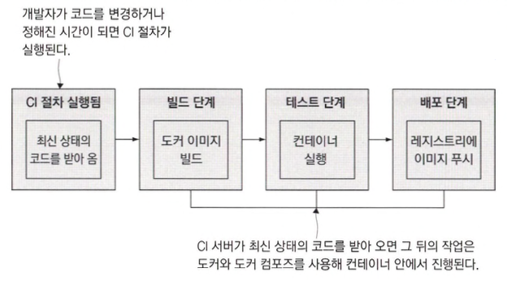
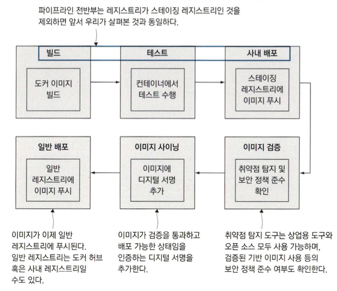

# 도커와 도커 컴포즈를 이용한 애플리케이션 빌드 및 테스트

## 도커를 이용한 지속적 통합 절차



## 도커를 이용한 빌드 인프라스트럭처 구축하기

```shell
docker-compose -f docker-compose.yml -f docker-compose-linux.yml up -d
echo $'\n127.0.0.1 registry.local' | sudo tee -a /etc/hosts
docker ps
```

- m1의 경우 레지스트리 포트 5000 -> 5001로 변경하거나 airPlay를 꺼야합니다.
- Gogs의 Git 서버가 포트 3000번 젠킨스가 포트 8080번, 레지스트리가 포트 5000번에서 각각 실행됩니다.(gogs는 `gogs/gogs`로 이미지 변경하고 실행하면 접속되긴함)

## 도커 컴포즈를 이용한 빌드 설정

- `${REGISTRY:- docker.io}` 여기서 `:-` 키워드는 REGISTRY값이 있으면 사용하고 없다면 docker.io를 사용합니다.

```shell
docker-compose -f docker-compose.yml -f docker-compose-build.yml build
docker image inspect -f '{{.Config.Labels}}' diamol/ch11-numbers-api:v3-build-local
```

- 예제 image 를 여러개 빌드할 수 있습니다.

```dockerfile
FROM diamol/dotnet-aspnet

ARG BUILD_NUMBER=Q
ARG BUILD_TAG=local

LABEL version="3.0"
LABEL build_number=${BUILD_NUMBER} LABEL build_tag=${BUILD_TAG}

ENTRYPOINT ["dotnet", "Numbers.Api.dll"]
```

- LABEL 인스트럭션은 키-값 쌍으로 빌드되는 이미지에 적용할 수 있습니다.
- ARG 인스트럭션은 ENV와 유사하지만 빌드 중에만 유효한 값을 사용합니다.

```shell
docker image build -f numbers-api/Dockerfile.v4 --build-arg BUILD_TAG=ch11 -t numbers-api .
docker image inspect -f '{{.Config.Labels}}' numbers-api
```

- `inspect`로 조회한 build_number는 Dockerfile 스크립트의 ARG 인스트럭션에 지정된 기본값 0이 나오고 build_tag는 ch11이 나오는걸 확인할 수 있습니다.

## 도커 외의 의존모듈이 불필요한 CI 작업 만들기

- 복잡한 일을 스크립트를 통해 도커에 맡기면 어떤 CI 서버를 사용하더라도 기존의 스크립트를 그대로 옮겨 파이프 라인을 정의할 수 있습니다.

## CI 파이프라인에 관계된 컨테이너



- 안전 소프트웨어 공급 체인
  - 취약점이 발견되면 빌드가 실패하므로 운영 환경에서는 모든 테스트를 통과한 소프트웨어만 실행될 것이고 보안 문제에서 자유로워질 수 있습니다.
