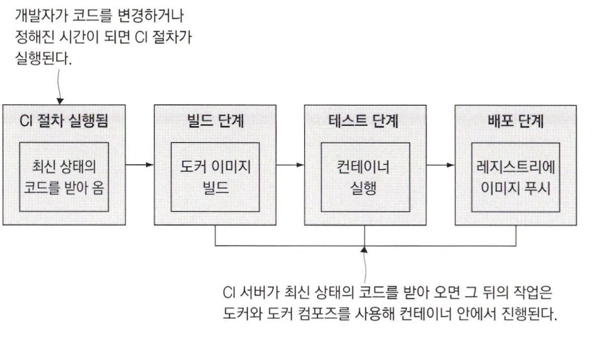
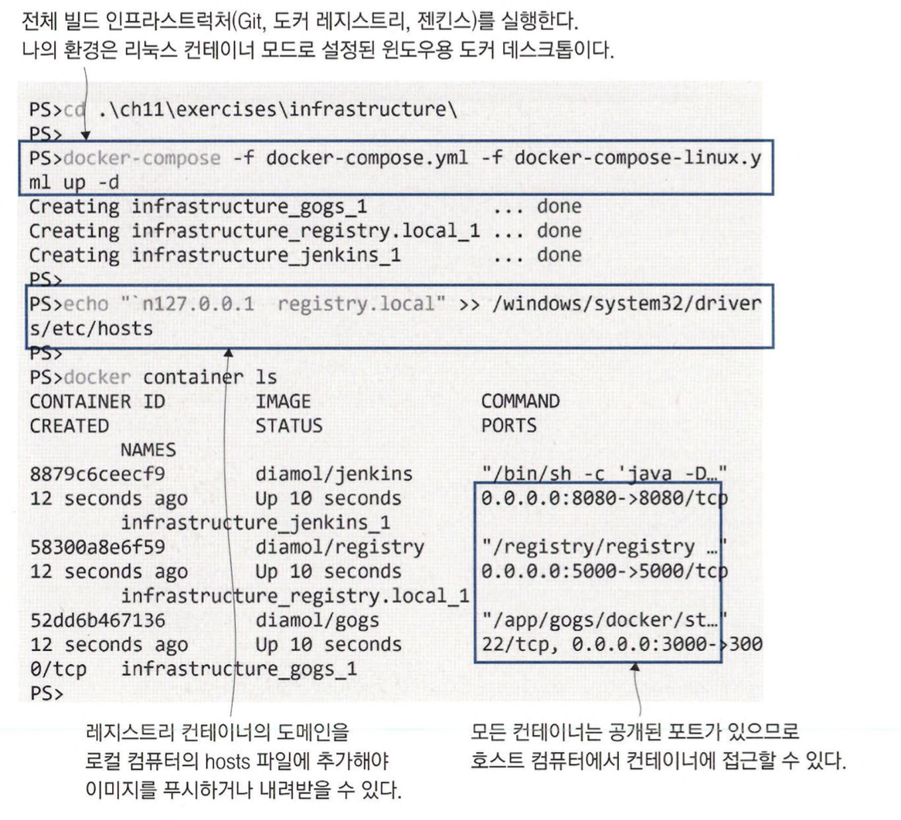
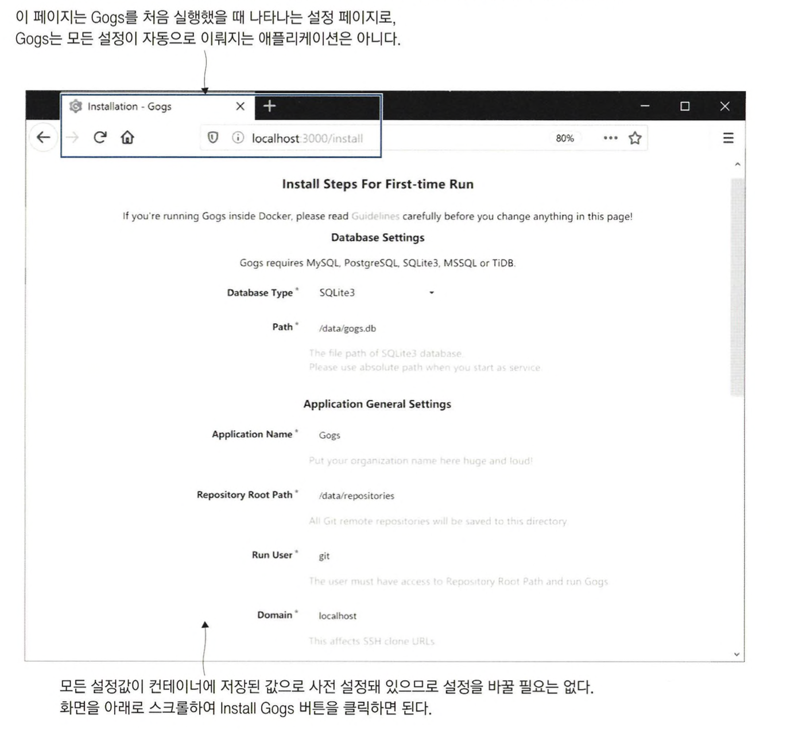
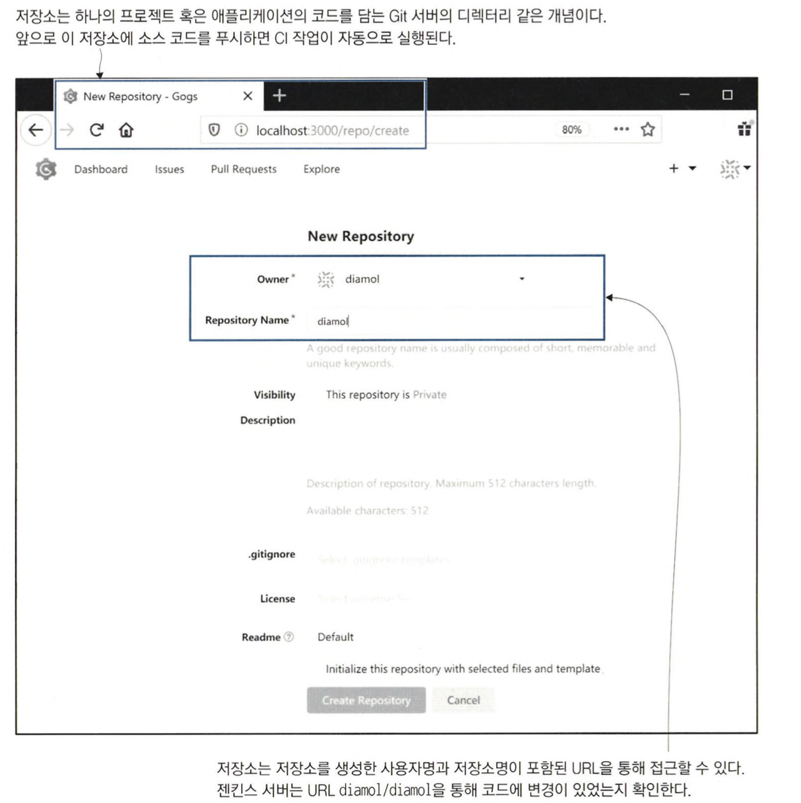
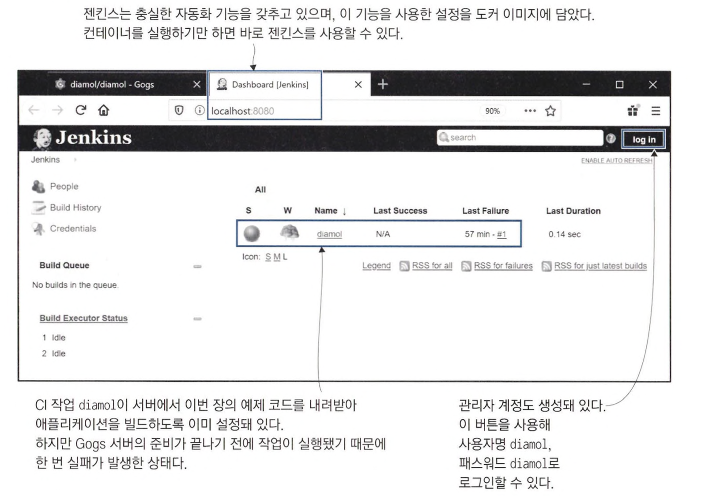
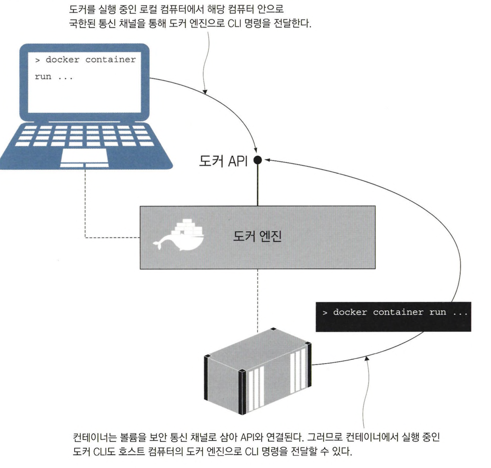
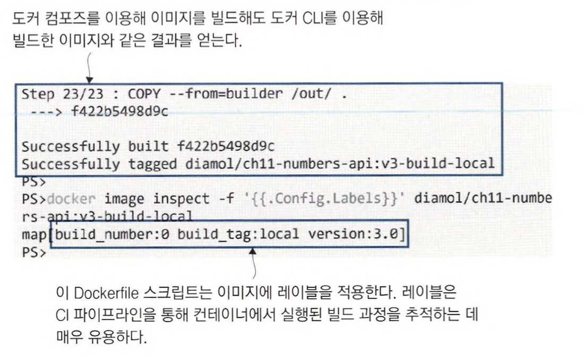
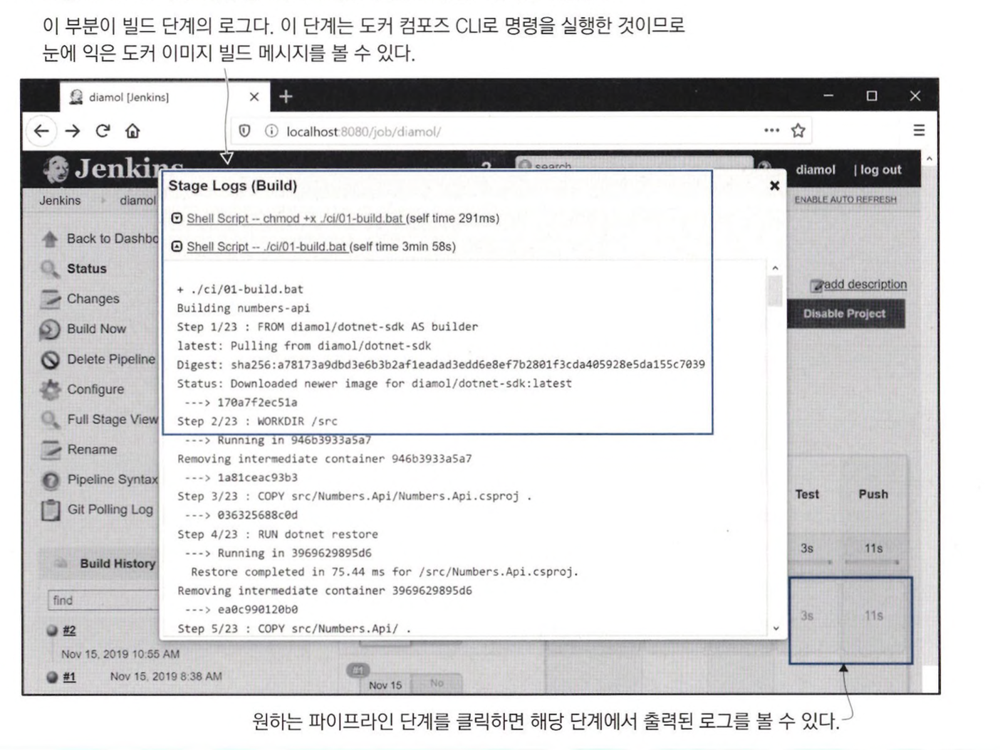
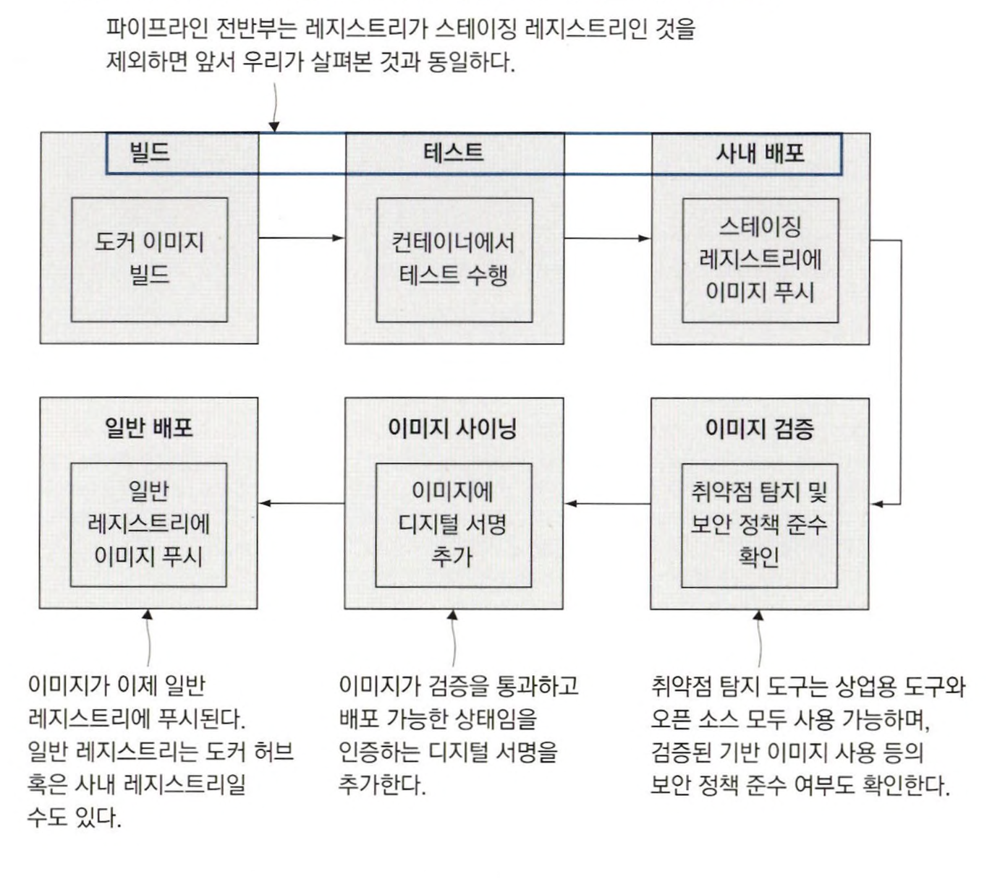

# 도커를 이용한 지속적 통합 절차

CI 절차는 코드로부터 시작하는 파이프라인이고, 일련의 단계를 밟아 테스트를 통과하고 즉시 배 포 가능한 결과물을 내놓는다. <br>
이 파이프라인이 프로젝트마다 달라지는데, 도커는 CI 절차의 일관성을 유지해 준다. <br>
CI 절차가 시작되면 도커 이미지를 빌드한다. <br>
이 이미지는 빌드 및 테스트, 패키징, 배포를 위해 레지스트리에 푸시까지 마친 최신 코드를 반영한 이미지다.



<br>
<hr>

# 도커를 이용한 빌드 인트라스트럭처 구축

형상 관리 기능을 제공하는 Gogs, 이미지 배포를 맡을 오픈 소스 도커 레지스트리, 자동화 서버로 젠킨스, 이들 모두 명령 한 번이면 설치할수 있다.


```
cd ./ch11/exercises/infrastructure

docker-compose -f docker-compose.yml -f docker-compose-linux.yml up -d

# 레지스트리의 도메인을 hoshs 파일에 추가
echo $'\n127.0.0.1 registry.local' | sudo tee -a /etc/hosts

docker ps
```



<br>




> localhost:3000으로 Gogs에 접근할 수 있다. <br>
> Register로 계정을 만들고, 새로운 코드가 푸시되면 자동으로 CI 작업이 실행되는 코드 저장소를 생성한다.

<br>



> localhost:8080으로 젠킨스에 접근할 수 있다. <br>

<br>

젠킨스 서버의 CI 작업이 실패한 상태인 이유는 코드를 가져오기로 설정된 Gogs의 Git 저장소에 아직 아무 코드도 없기 때문이다. <br>

```
git remote add local http://localhost:3000/diamol/diamol.git

git push local
```

Git 서버에 예제 코드를 업로드했다. <br>
젠킨스 서버는 1분에 한 번씩 이 코드에 변경이 있었는지 확인하다가 변경이 발견되면 CI 파이프라인을 실행한다.

<br>

> 전체 CI 파이프라인이 도커 컨테이너를 통해 실행되므로 도커 API, 그리고 같은 도커 엔진에서 실행된 컨테이너와 연결된다. <br>
> 젠킨스 이미지에는 도커 CLI와 젠킨스 컨테이너 설정을 위한 컴포즈 파일을 포함하고 있기 때문에 <br>
> 도커 명령을 실행하면 호스트 컴퓨터에서 실행 중인 도커 엔진으로 전달한다. <br>
> 도커 CLI는 도커 API를 호출하는 방식으로 동작하기 때문에 다른 곳에 위치한 CLI도 같은 도커 엔진에 접속할 수 있다.

<br>



> 도커 CLI는 기본적으로 로컬 컴퓨터에서 실행 중인 도커 API에 접속을 시도한다. <br>
> CLI가 컨테이너 안에서 실행됐다면 실제 통신은 호스트 컴퓨터의 소켓이나 명명된 파이프를 통해 이뤄진다. <br>
> 이를 이용하면 컨테이너에서 실행된 애플리케이션이 도커를 통해 다른 컨테이너를 찾아달라고 요청하거나 새로운 컨테이너를 시작하고 종료하는 등의 일이 가능해진다.


<br>

```yaml
# docker-compose.yml 
services:
  jenkins:
    image: diamol/jenkins 
    ports:
      - "8080:8080" 
    networks:
      - infrastructure
      - 
# docker-compose-linux.yml 
jenkins:
  volumes:
    - type: bind
      source: /var/run/docker.sock 
      target: /var/run/docker.sock
      
# docker—compose-windows.yml 
jenkins:
  volumes:
    - type: npipe
      source: \\.\pipe\docker_engine
      target: \\.\pipe\docker_engine
```

젠킨스 컨테이너가 도커 및 도커 컴포즈 명령을 실행 할 수 있게 도커 엔진과 연결할 수 있도록 하고, <br>
같은 도커 네트워크에서 동작하는 컨테이너인 Git 서버와 도커 레지스트리에는 DNS를 통해 연결한다.

<br>
<hr>


# 도커 컴포즈를 이용한 빌드 설정

```yaml
services: 
  numbers-api:
    image: ${REGISTRY:-docker.io}/diamol/ch11-numbers-api:v3-build-${BUILD_NUMBER:-local}
    networks:
      — app-net
    
  numbers—web:
    image: ${REGISTRY:-docker.io}/diamol/ch11-numbers-web:v3-b니ild-${BUILD_NUMBER:-local}
    environment:
      - RngApi__Url=http://numbers-api/rng
    networks:
      — app-net
```

여기 사용된 환경 변수에는 :- 문법이 사용됐다. <br>
${REGISTRY:-docker.io}는 이 부분을 환경 변수 REGISTRY 값으로 치환하고, 해당 환경 변수가 정의돼 있지 않다면 도커 허브의 도메인인 docker.io를 기본값으로 사용하라는 의미다. <br>

<br>

```
cd ./ch11/exercises

docker-compose -f docker-compose.yml -f docker-compose-build.yml build

docker image inspect -f '{{.Config.Labels}}' diamol/ch11-numbers-api:v3-build-local
```



<br>

> 컨테이너, 이미지, 네트워크 볼륨 등 대부분의 도커 리소스에는 레이블을 부여할 수 있다. <br>
> 이 레이블은 리소스에 대한 추가 데이터에 key-value 형태로 저장된다. <br>
> CI 파이프라인을 통한 애플리케이션 빌드에서는 빌드 과정을 진행 중인 시점에 추적하거나 사후에 추적하는 것이 중요한데, 이미지 레이블이 이 과정에 큰 도움이 된다.

```
# 빌드 인자와 이미지 레이블이 지정된 Dockerfile 스크립트의 예
FROM diamol/dotnet-aspnet

ARG BUILD_NUMBER=0
ARG BUILD_TAG=local

LABEL version="3.0"
LABEL build_number=${BUILD_NUMBER} 
LABEL build_tag=${BUILD_TAG}
ENTRYPOINT ["dotnet", "Numbers.Api.dll"]
```

이 파일에는 ARG, LABEL 인스트럭션이 쓰였다. <br>

**LABEL**은 Dockerfile 스크립트에 정의된 key-value를 빌드되는 이미지에 적용시켜준다. (환경 변수 값은 ARG 인스트럭션에서 온 것) <br>
**ARG**는 이미지를 빌드하는 시점에만 유효하다는 점을 제외하면 ENV 인스트럭션과 거의 같다.

<br>

````yaml
# 빌드 설정값과 재사용 가능한 인자가 적용된 컴포즈 파일
x-args: &args 
  args:
    BUILD_NUMBER: ${BUILD_NUMBER:-0} 
    BUILD_TAG: ${BUILD_TAG:-local}
    
services:
  numbers-api:
    build:
      context: numbers
      dockerfile: numbers-api/Dockerfile.v4 
      <<: *args
      
numbers-web:
  build:
    context: numbers
    dockerfile: numbers-web/Dockerfile.v4
    <<: *args
````

- **context**: 도커가 빌드 중에 사용할 작업 디렉터리에 대한 경로.
- **dockerfile**: Dockerfile 스크립트의 경로.
- **args**: 빌드 시에 전달할 인자. Dockerfile 스크립트에서 ARG 인스트럭션으로 정의된 키와 일치해야 한다.

> 어떤 방법으로 빌드를 실행하든 빌드가 항상 같은 방식으로 수행되려면 Dockerfile 스크립트를 하나의 파일로 유지해야 한다. <br>
> 컴포즈 파일에 기본값을 설정하면 CI 서버 외의 곳에서 빌드를 실행하더라도 빌드가 성공할 수 있으며 <br>
> Dockerfile 스크립트에 정의된 기본값은 빌드 실행에 컴포즈를 사용하지 않더라도 적용될 것이다.

<br>
<hr>

# 도커 외의 의존 모듈이 불필요한 CI 작업 만들기

의존 모듈이 별도로 필요하지 않다는 점은 컨테이너에서 수행하는 CI의 주된 장점이다. <br>
이 책에서는 CI 파이프라인을 실행하기 위해 젠킨스를 사용하는데, 젠킨스 CI 작업은 소스 코드 저장소에 포함된 간단한 텍스트 파일로 설정이 가능하다.

```
# Jenkinsfile에 정의된 CI 작업의 빌드 단계
# 작업 디렉터리를 변경하고 두 개의 셸 명령을 실행한다
# 첫 번째 명령은 스크립트 파일을 만들고 두 번째 명령에서 스크립트를 실행한다
stage('Build') {
  steps { 
    dir('ch11/exercises') {
      sh 'chmod +x ./ci/01-build.bat'
      sh './ci/01-build.bat' 
    }
  }
}

docker-compose -f docker-compose.yml -f docker-compose-build.yml build --pull
```

pull 옵션이 추가된 것만 빼면 로컬에서 docker-compose build 명령과 똑같다. <br>
**pull 옵션**은 빌드에 필요한 이미지를 무조건 최신 버전으로 새로 내려받으라는 의미다.  <br>
CI 파이프라인에서는 Dockerfile에 지정된 이미지에 변경이 생겼을 때 애플리케이션에 미치는 영향을 최대한 빨리 알 수 있으므로 이 옵션이 중요하다.

<br>

> localhost:8080/job/diamol으로 접속해 파이프라인 뷰에서 작업을 선택한 다음, Logs를 클릭해 빌드 출력을 볼 수 있다.



<br>

젠킨스 빌드의 모든 단계는 컨테이너에서 실행된다. <br>
각 단계는 순서대로 실행되고, 중간에 실패한 단계가 있으면 해당 작업은 종료된다.

- **검증 단계**: 00-verify.bat 스크립트를 실행. 이 스크립트는 도커 및 도커 컴포즈의 버전 을 출력하는 내용을 담고 있다.
- **빌드 단계**: 01-build.bat 스크립트를 실행. 도커 컴포즈를 실행해 이미지 를 빌드하는 역할을 한다.
- **테스트 단계**: 02-test.bat 스크립트를 실행. 도커 컴포즈로 빌드된 애플리케이션을 실행하고 컨테이너 목록을 출력한 다음 애플리케이션을 다시 종료. (실제 프로젝트라면 애플리케이션을 실행한 뒤 다른 컨테이너에서 E2E 테스트 진행)
- **푸시 단계**: 03-push.bat 스크립트를 실행. 도커 컴포즈를 실행해 빌드된 이미지를 레지스트리에 푸시하는 스크립트.

<br>
<hr>

# CI 파이프라인에 관계된 컨테이너

도커를 사용하면 애플리케이션 빌드 프로세스의 최상위 레이어가 항상 동일해진다. <br>
이 점을 이용해 CI 파이프라인에 다양하고 유용한 기능을 추가할 수 있다. <br>
아래는 취약점을 탐지하는 보안 검사 및 이미지에 디지털 서명을 넣는 컨테이너가 추가된 CI 파이프라인을 보여 준다.



<br>

도커에서는 이를 **안전 소프트웨어 공급 체인**이라고 하고, 배포할 소프트웨어의 안전성을 담보한다는 점에서 매우 중요하다. <br>
CI 파이프라인에서 취약점 탐색 도구를 실행하고 취약점이 발견되면 빌드가 실패한다. <br>
운영 환경에서 CI 파이프라인을 무사히 통과했을 때만 추가되는 디지털 서명이 있는 이미지로만 컨테이너를 실행하게끔 설정할 수도 있다.


