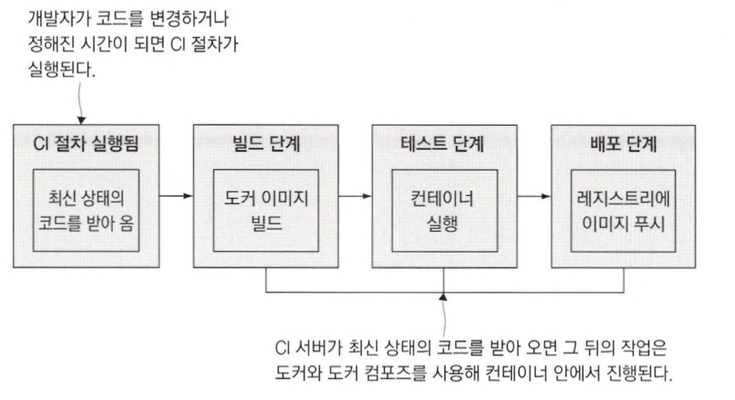
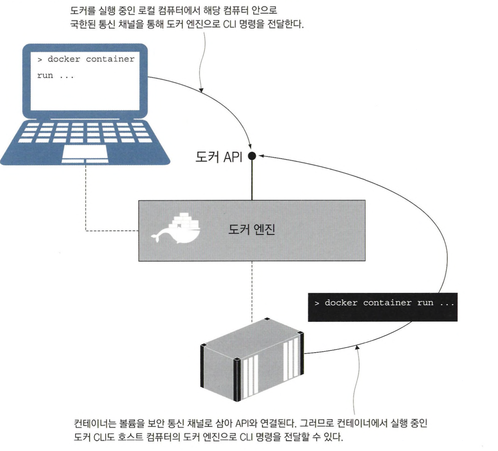
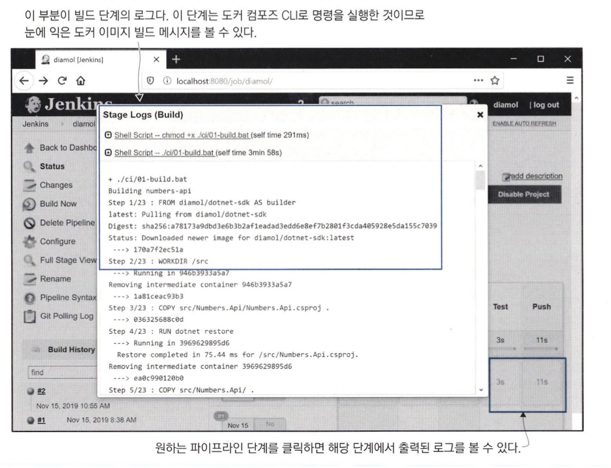
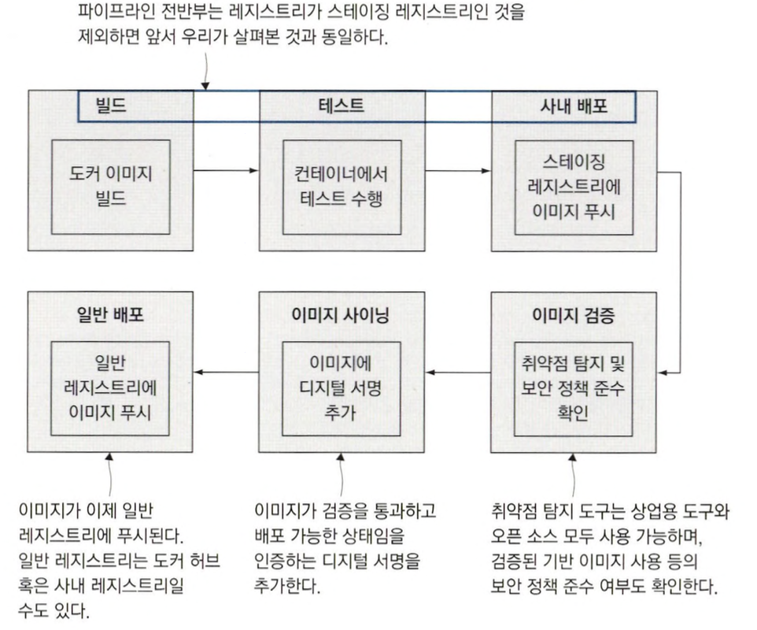

# 도커와 도커 컴포즈를 이용한 애플리케이션 빌드 및 테스트

## 도커를 이용한 지속적 통합 절차

### 도커는 CI 절차의 일관성을 유지해 준다.

CI를 통해 일련의 단계를 받아 테스트를 통과하고 즉시 배포 가능한 결과물을 얻을 수 있습니다.

CI의 어려운 점은 `파이프라인이 프로젝트마다 달라진다는 것`입니다.

예를 들어 기술 스택및 환경이 무엇이냐에 따라 밟아야 하는 단계, 결과물도 달라집니다.

이러한 특징때문에 `관리에 어려움`이 커지게 됩니다.

도커는 이러한 CI의 일관성을 유지해줍니다.

모든 도커 프로젝트는 똑같은 단계를 거쳐 똑같은 유형의 결과물을 생성하기 때문입니다.

다음은 도커 프로젝트의 전형적인 파이프라인을 나타냅니다.



CI 파이프라인의 각 단계는 도커, 도커 컴포즈를 통해 실행되며 실제 과정은 컨테이너 내부에서 실행됩니다.

이를 통해 다음과 같은 장점을 가질 수 있습니다.

- CI 서버에 컴파일러나 SDK 설치 필요 없이 도커만 설치하면 됩니다.
- 자동화된 단위 테스트는 이미지 빌드 단계에 포함되므로 빌드가 깨졌다면 CI 절차도 해당 시점에서 중단됩니다.
- 도커 컴포즈로 전체 애플리케이션을 실행하고 여기에 더해 사용자 역할을 맡아 트래픽을 일으킬 별도의 컨테이너를 실행시켜 복잡한 엔드 투 엔드 시스템 테스트를 진행할 수 있습니다.

도커화된 CI 절차에서는 모든 일이 컨테이너 안에서 실행됩니다.

물론, 전체 절차를 수행하려면 다음과 같은 요소들이 필요 합니다.

- 중앙 관리되는 형상 관리 시스템
- 이미지를 저장할 도커 레지스트리
- CI 작업을 수행할 자동화 서버

## 도커를 이용한 빌드 인프라스트럭쳐 구축하기

### 직접 인프라스트럭쳐 구축하기

도커 허브와 같은 신뢰성 있는 매니지드 서비스가 존재하지만 다음과 같은 상황으로 인해 직접 구축하는 상황이 있을 수 있습니다.

- 보안 강화
- 더 빠른 속도
- 특정 서비스(도커 허브, 깃허브 등)가 장애가 발생했을시 대체할 수단

이런 상황에서 직접 인프라 스트럭쳐를 구축하기 위해서 다음과 같은 도구들을 고려할 수 있습니다.

- 형상 관리 도구 : Gogs
- 이미지 배포 : 오픈 소스 도커 레지스트리
- 자동화 서버 : 젠킨스

이들 역시 컨테이너로 쉽게 실행할 수 있습니다.

다음은 컨테이너로 이들을 실행하는 방법입니다.

```bash
# 컨테이너 실행
docker-compose -f docker-compose.yml -f docker-compose-linux.yml up -d

# 레지스트리의 도메인을 hosts 파일에 추가
echo $'\n127.0.0.1 registry.local' | sudo tee -a /etc/hosts
```

<aside>
💡 MAC의 경우 AirPlay가 5000번 포트를 기본으로 사용하고 있어 5001번으로 변경하였습니다.

</aside>

### 젠킨스에 포함된 도커 CI를 도커 엔진과 연결하기

도커에서 실행된 컨테이너는 도커 API, 그리고 같은 도커 엔진에서 실행된 컨테이너와 연결됩니다.

젠킨스 이미지에는 도커 CLI와 젠킨스 컨테이너 설정을 위한 컴포즈 파일을 포함하고 있기 때문에 도커 명령을 실행하면 호스트 컴퓨터에서 실행 중인 도커 엔진으로 전달합니다.

도커 CLI는 `도커 API를 호출하는 방식으로 동작하기 때문에 다른 곳에 위치한 CLI도 같은 도커 엔진에 접속`할 수 있습니다.



도커 CLI는 기본적으로 로컬 컴퓨터에서 실행 중인 도커 API에 접속을 시도합니다.

이때 이 통신 과정은 호스트 컴퓨터 안으로 국한된 채널을 사용하는데, 리눅스 환경에서는 소켓을 사용하고 윈도 환경에서는 name pipe를 사용합니다.

이러한 상황을 이용하면 컨테이너 실행된 애플리케이션이 도커를 통해 다른 컨테이너를 찾아 달라고 요청하거나 새로운 컨테이너를 시작하고 종료하는 등의 일이 가능합니다.

하지만 컨테이너에서 실행 중인 애플리케이션이 호스트에서 동작 중인 도커의 모든 기능에 접근 가능하다는 점에서 보안 문제가 생길 수 있으므로 신뢰할 수 있는 도커 이미지에만 적용해야 합니다.

CI 인프라스트럭처를 실행하는데 사용된 도커 컴포즈 파일에서도 다음과 같이 소켓으로 연결된 것을 볼 수 있습니다.

```yaml
services:
  jenkins:
    volumes:
      - /var/run/docker.sock:/var/run/docker.sock
```

## 도커 컴포즈를 이용한 빌드 설정

### 이미지 태그에 환경 변수가 사용하기

```yaml
services:
  numbers-api:
    image: ${REGISTRY:-docker.io}/diamol/ch11-numbers-api:v3-build-${BUILD_NUMBER:-local}
    networks:
      - app-net

  numbers-web:
    image: ${REGISTRY:-docker.io}/diamol/ch11-numbers-web:v3-build-${BUILD_NUMBER:-local}
    environment:
      - RngApi__Url=http://numbers-api/rng
    depends_on:
     - numbers-api
    networks:
      - app-net
```

위의 코드를 보면 환경 변수에 `:-` 가 사용된 것을 볼 수 있습니다.

`:-` 는 해당 부분을 환경변수로 치환하되 정의되어 있지 않다면 기본 값으로 `:-` 이후에 정의된 값으로 치환하라는 의미입니다.

위의 코드를 기준으로는 환경변수 REGISTRY의 값을 기준으로 정의하고 정의되지 않았을 경우 docker.io를 기본값으로 사용하라는 의미로 사용됩니다.

이러한 패턴을 사용하면 같은 결과물로 `CI 파이프라인과 개발자 빌드를 매끄럽게 동시에 지원`할 수 있게 됩니다.

### 도커파일에서 빌드 인자와 이미지 레이블을 지정하기

컨테이너, 이미지, 네트워크 볼륨 등 대부분의 도커 리소스에는 레이블을 부여할 수 있습니다.

레이블은 리소스에 대한 추가 데이터에 키-값 형태로 저장됩니다.

레이블은 이미지에 포함시킬 수 있다는 점에서 이미지와 함께 사용할 때 유용합니다.

예를 들어 CI 파이프라인을 통한 애플리케이션 빌드에서는 빌드 과정을 진행 중인 시점에 추적하거나 사후에 추적하는 것이 중요한데 이때 이미지 레이블이 큰 도움이 됩니다.

다음은 도커파일에 빌드 인자와 이미지 레이블을 지정하는 예시입니다.

```docker
FROM diamol/dotnet-aspnet

ARG BUILD_NUMBER=0
ARG BUILD_TAG=local

LABEL version="3.0"
LABEL build_number=${BUILD_NUMBER}
LABEL build_tag=${BUILD_TAG}

ENTRYPOINT ["dotnet", "Numbers.Api.dll"]
HEALTHCHECK CMD ["dotnet", "Utilities.HttpCheck.dll", "-u", "http://localhost/health"]

WORKDIR /app
COPY --from=http-check-builder /out/ .
COPY --from=builder /out/ .
```

LABEL 인스트럭션은 Dockerfile 스크립트에 `정의된 키-값 쌍을 빌드되는 이미지에 적용`해 줍니다.

이 스크립트를 보면 version=3.0 이라고 저장된 것을 볼 수 있습니다.

ARG 인스트럭션은 이미지를 빌드하는 시점에만 유효하다는 점을 제외하다는 점을 제외하면 ENV 인스트럭션과 거의 같습니다.

두 인스트럭션 모두 `환경 변수 값을 설정하는 기능을 하지만, ARG 인스트럭션은 빌드 중에만 정의된 환경 변수가 유효`합니다.

### 빌드 설정값과 재사용 가능한 인자를 적용한 컴포즈 파일

확장 필드를 사용하면 빌드 설정값과 재사용 가능한 인자를 만들어 코드 중복을 줄일 수 있습니다.

다음은 이를 적용한 예시입니다.

```yaml
x-args: &args
  args:
    BUILD_NUMBER: ${BUILD_NUMBER:-0}
    BUILD_TAG: ${BUILD_TAG:-local}

services:
  numbers-api:
    build:
      context: numbers
      dockerfile: numbers-api/Dockerfile.v4
      <<: *args

  numbers-web:
    build:
      context: numbers
      dockerfile: numbers-web/Dockerfile.v4
      <<: *args
```

위의 컴포즈 파일의 build 블록은 세 부분으로 나뉩니다.

- context
    - 도커가 빌드 중에 사용할 작업 디렉터리에 대한 경로입니다.
    - 보통은 docker image build 명령에서 맨 끝에 .를 붙이므로 현재 디렉터리가 사용되지만, 이번에는 numbers 디렉터리를 사용합니다.
    - 상대 경로일 경우 컴포즈 파일의 경로를 기준으로 합니다.
- dockerfile
    - Dockerfile 스크립트의 경로
    - 상대 경로일 경우 context에서 지정된 경로를 기준으로 합니다.
- args
    - 빌드 시에 전달할 인자
    - Dockerfile 스크립트에서 ARG 인스트럭션으로 정의된 키와 일치해야 합니다.
    - 여기서는 컴포즈 확장 필드를 사용해 값을 정의하고 블록 두 곳에 확장 필드를 병합했습니다.

## 도커 외의 의존 모듈이 불필요한 CI 작업 만들기

### 컨테이너에서 수행하는 CI의 장점

컨테이너를 이용하여 CI를 할 경우 `의존 모듈이 별도로 필요하지 않다는 장점`이 있습니다.

그리고 `도커 허브, Github Actions, Azure DevOps 등 주요 매니지드 빌드 서비스`가 이를 지원합니다.

이러한 서비스를 사용하면 `여러 가지 도구를 설치해야 하는 빌드 서버도 필요 없어지고 모든 개발자가 개발 도구를 최신 버전으로 유지할 필요도 사라집니다.`

거기다 `빌드 스크립트도 간결하게 유지`할 수 있고 `개발자가 로컬 컴퓨터에서 사용하는 것과 같은 절차를 CI 파이프라인에서도 그대로 사용`할 수 있습니다.

### 젠킨스를 사용한 CI 예시

CI 파이프라인을 실행하기 위해 젠킨스를 사용하는 경우 jenkinsfile을 통해 간단하게 CI 파이프라인을 구성할 수 있습니다.

다음은 젠킨스 파일 예시입니다.

```yaml
stage('Build') {
	steps {
		dir('ch11/exercies') {
			sh 'chmod +x ./ci/01-build.bat'
			sh './ci/01-build.bat'
		}
	}
}

# 01-build.bat
docker-compose -f docker-compose.yml -f docker-compose-build.yml build --pull
```

다음은 젠킨스에서 빌드한 결과물입니다.



빌드 파이프라인의 각 단계는, 배치 스크립트를 실행하고 여기서 실행된 도커 컴포즈가 실질적인 작업을 담당합니다.

<aside>
💡 깃랩이나 깃허브 액션등의 빌드 서비스를 사용하더라도 비슷한 방식으로 구현합니다.

</aside>

젠킨스 빌드의 모든 단계는 컨테이너에서 실행되며 일반적으로 다음과 같은 동작을 합니다.

- 검증단계
    - 이 스크립트는 도커 및 도커 컴포즈의 버전을 출력하는 내용을 담고 있습니다.
    - 빌드에 필요한 의존 모듈인 도커의 버전 정보를 빌드 파이프라인 로그 맨 처음에 출력하면 유용할 때가 많습니다.
- 빌드 단계
    - 도커 컴포즈를 실행해 이미지를 빌드하는 역할을 합니다.
- 테스트 단계
    - 도커 컴포즈로 빌드된 애플리케이션을 실행하고 컨테이너 목록을 출력한 다음 애플리케이션을 다시 종료합니다.
    - 컨테이너가 이상없이 실행되는 것을 확인하고 E2E 같은 테스트를 진행하게 됩니다.
- 푸시 단계
    - 도커 컴포즈를 실행해 빌드된 이미지를 레지스트리에 푸시하는 스크립트입니다.
    - 이미지 태그는 로컬 레지스트리 도메인을 포함하므로 빌드 및 테스트 단계가 성공했다면 이미지가 레지스트리에 푸시합니다.

## CI 파이프라인에 관계된 컨테이너

### CI 파이프라인에 다양한 기능 추가하기

도커를 사용하면 애플리케이션 빌드 프로세스의 최상위 레이어가 항상 동일해지기 때문에 CI 파이프라인에 다양하고 유용한 기능을 넣을 수 있습니다.

다음은 알려진 취약점을 탐지하는 보안 검사 및 이미지에 디지털 서명을 넣는 컨테이너가 추가된 CI 파이프라인을 보여 줍니다.



도커에서는 이런 CI 파이프라인을 안전 소프트웨어 공급 체인 이라고 부르는데, 이는 기업 규모와 상관없이 배포할 소프트웨어의 안전성을 담보한다는 점에서 매우 중요 합니다.

CI 파이프라인에서 취약점 탐색 도구를 실행하고 취약점이 발견되면 빌드가 실패합니다.

이를 통해 도커 이미지가 보안 문제에서 자유로워지게 됩니다.